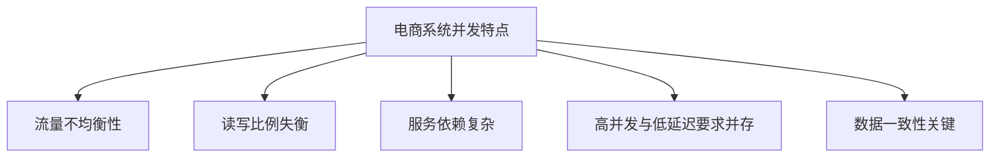
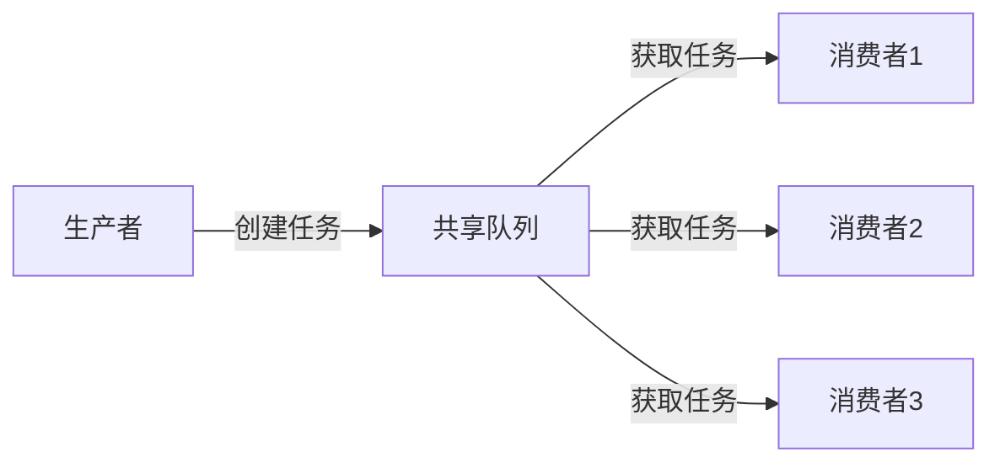
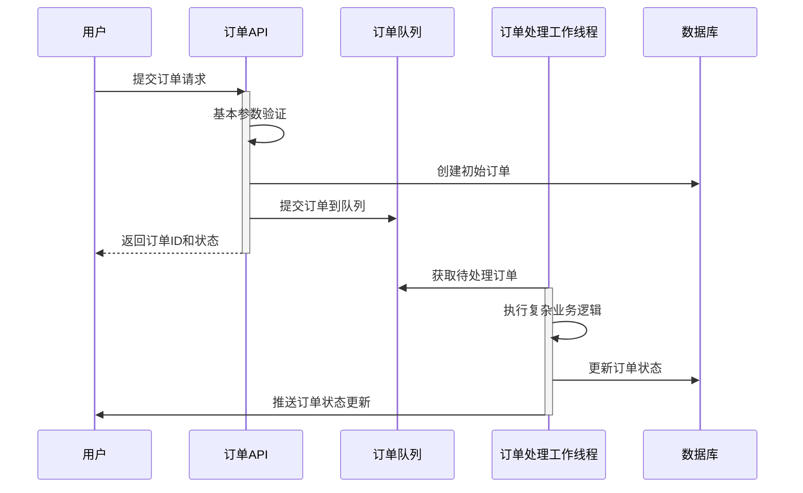
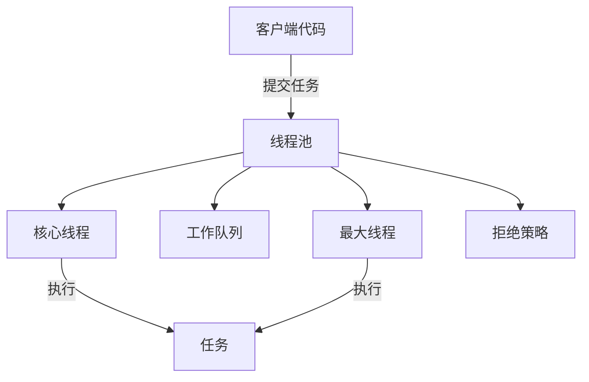
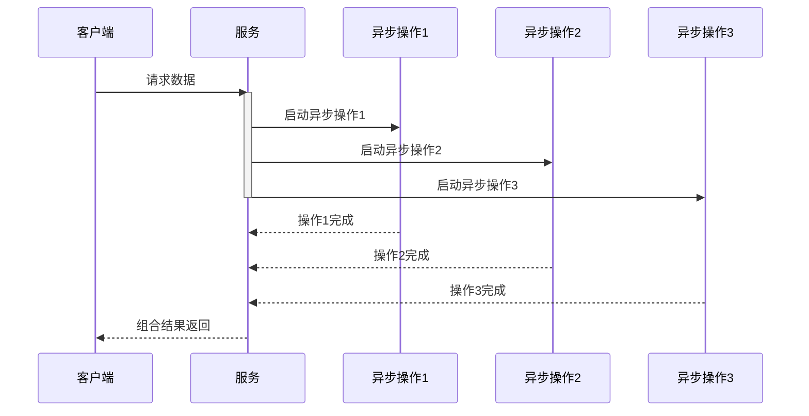
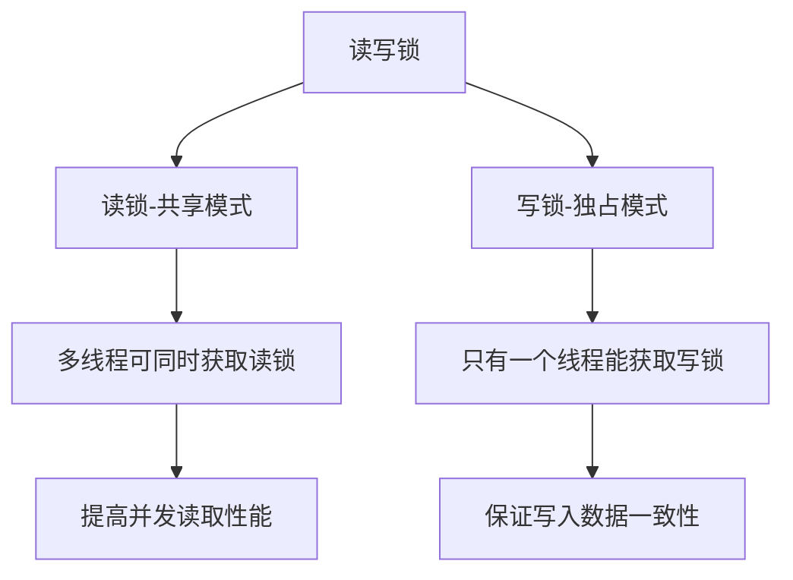
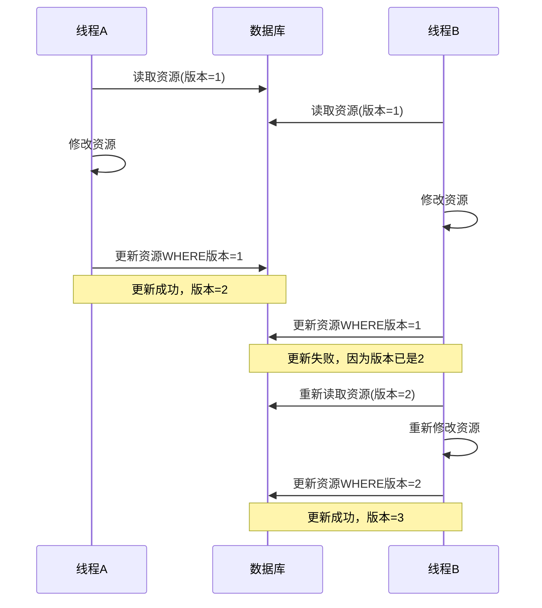
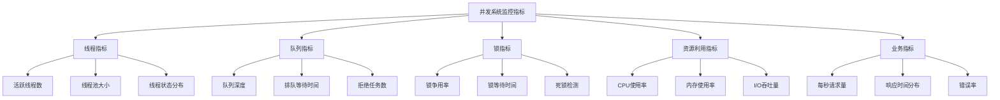

电商系统中的并发设计模式：原理与实践 教学篇

## 目录

1. 并发挑战与电商系统
2. 生产者-消费者模式：订单处理系统
3. 线程池模式：资源优化与任务分类
4. 异步编程模式：提升用户体验
5. 读写锁模式：高效缓存设计
6. 乐观锁模式：库存并发控制
7. 并发系统的监控与优化

---

### 1. 并发挑战与电商系统

#### 1.1 电商系统的并发特点

电商平台的并发场景有以下特点：



流量不均衡性：促销活动期间流量可能是平时的10-100倍，形成明显的"尖刺流量"模式。例如，某电商平台在618期间每秒订单量从平时的几百跃升至上万。

读写比例失衡：商品浏览、搜索等读操作远多于下单等写操作，通常读写比例在100:1左右。

服务依赖复杂：一个看似简单的商品详情页可能需要调用10+个微服务（基础信息、价格、库存、评价、推荐等）。

高并发与低延迟要求并存：系统既要处理高流量，又要保证毫秒级响应时间，特别是在移动端用户期望立即得到反馈。

数据一致性关键：商品库存、订单状态等核心数据必须准确，不容许出现超卖、漏单等问题。

#### 1.2 传统方案的局限性

面对电商系统的并发挑战，传统方案有这些不足：

硬件扩展的成本效益问题：单纯增加服务器，成本高昂且资源利用率低，难以应对峰值流量。

同步处理模型的响应延迟：传统同步处理方式导致用户等待时间长，特别是在多步骤操作中（如订单创建→库存检查→支付处理）。

简单加锁导致的性能瓶颈：数据库级锁或应用级全局锁严重限制系统吞吐量，尤其在热点数据（如爆款商品库存）上。

线程资源管理不当：线程配置不合理导致资源浪费或线程饥饿，在流量波动时尤为明显。

#### 1.3 并发设计模式的适用性

并发设计模式针对电商系统的不同场景提供对应方案：

生产者-消费者模式：适用于订单处理系统，解决流量削峰填谷和前端快速响应问题。

线程池模式：通过任务分类和资源隔离，优化系统资源利用，避免关键业务受阻。

异步编程模式：改善用户体验，特别是在需要聚合多服务数据的场景（如商品详情页）。

读写锁模式：优化缓存系统，平衡高并发读取和数据一致性需求。

乐观锁模式：解决库存等热点数据的并发更新问题，避免悲观锁的性能瓶颈。

在接下来的章节中，我们将结合实际案例，深入探讨每种模式在电商系统中的具体应用。

---

### 2. 生产者-消费者模式：订单处理系统

#### 2.1 模式介绍与适用场景

生产者-消费者模式 是一种将"任务的提交"与"任务的执行"分离的并发设计模式。在这种模式中，生产者负责创建任务并将其放入共享队列，而消费者则从队列中取出任务并执行。



电商系统适用场景：

1. 订单处理系统：分离订单接收与订单处理，允许系统快速响应用户请求
2. 库存更新通知：处理大批量的商品库存变更事件
3. 用户行为分析：异步处理用户点击、浏览等行为数据
4. 邮件/短信发送：处理大量通知任务而不阻塞主流程

#### 2.2 实际问题：订单峰值处理

某电商平台在双11活动中面临订单处理瓶颈：

- 业务现状：用户提交订单后，系统同步执行完整流程（校验→库存锁定→支付处理→物流预处理）
- 问题表现：高峰期响应时间从正常的200ms飙升至5000ms+，用户体验极差
- 根本原因：每个订单处理需要多个同步步骤，且依赖外部系统，导致请求积压

#### 2.3 模式实现：基于消息队列的订单异步处理



核心实现代码：

```java
/**
 * 订单提交服务 - 生产者角色
 */
@Service
@Slf4j
public class OrderSubmissionService {
    private final RabbitTemplate rabbitTemplate;
    private final OrderRepository orderRepository;

    // 构造注入
    public OrderSubmissionService(RabbitTemplate rabbitTemplate, OrderRepository orderRepository) {
        this.rabbitTemplate = rabbitTemplate;
        this.orderRepository = orderRepository;
    }

    /**
     * 提交订单 - 只做基本验证，快速响应
     */
    public OrderResponse submitOrder(OrderRequest request) {
        // 1. 基本参数验证
        validateOrderRequest(request);

        try {
            // 2. 创建初始订单记录
            Order order = createInitialOrder(request);
            orderRepository.save(order);

            // 3. 发送到消息队列，异步处理
            OrderProcessingMessage message = new OrderProcessingMessage(
                order.getId(), order.getUserId(), order.getItems());
            rabbitTemplate.convertAndSend("order-exchange", "order.created", message);

            log.info("Order {} submitted successfully and queued for processing", order.getId());

            // 4. 立即返回响应
            return new OrderResponse(order.getId(), "ORDER_RECEIVED",
                                     "订单已接收，正在处理中");
        } catch (Exception e) {
            log.error("Failed to submit order", e);
            throw new OrderSubmissionException("订单提交失败，请稍后重试", e);
        }
    }

    // 创建初始订单
    private Order createInitialOrder(OrderRequest request) {
        Order order = new Order();
        order.setUserId(request.getUserId());
        order.setItems(request.getItems());
        order.setStatus(OrderStatus.PENDING);
        order.setCreatedAt(LocalDateTime.now());
        order.setTotalAmount(calculateInitialAmount(request.getItems()));
        return order;
    }

    // 其他辅助方法...
}

/**
 * 订单处理服务 - 消费者角色
 */
@Component
@Slf4j
public class OrderProcessingConsumer {
    private final OrderRepository orderRepository;
    private final InventoryService inventoryService;
    private final PaymentService paymentService;
    private final NotificationService notificationService;

    // 构造注入
    public OrderProcessingConsumer(OrderRepository orderRepository,
                                  InventoryService inventoryService,
                                  PaymentService paymentService,
                                  NotificationService notificationService) {
        this.orderRepository = orderRepository;
        this.inventoryService = inventoryService;
        this.paymentService = paymentService;
        this.notificationService = notificationService;
    }

    /**
     * 处理订单消息 - 执行完整的订单处理流程
     */
    @RabbitListener(queues = "order-processing-queue")
    public void processOrder(OrderProcessingMessage message) {
        log.info("Processing order: {}", message.getOrderId());

        try {
            // 1. 获取订单详情
            Order order = orderRepository.findById(message.getOrderId())
                .orElseThrow(() -> new OrderNotFoundException("Order not found: " + message.getOrderId()));

            // 2. 检查并锁定库存
            try {
                inventoryService.checkAndLockInventory(order);
            } catch (InsufficientInventoryException e) {
                handleOrderFailure(order, "INVENTORY_ERROR", e.getMessage());
                return;
            }

            // 3. 更新订单状态
            order.setStatus(OrderStatus.INVENTORY_CONFIRMED);
            orderRepository.save(order);

            // 4. 通知用户订单状态更新
            notificationService.notifyUser(order.getUserId(),
                "订单 " + order.getId() + " 已确认，等待支付");

            // 订单处理完成
            log.info("Order {} processed successfully", message.getOrderId());
        } catch (Exception e) {
            log.error("Error processing order {}", message.getOrderId(), e);
            // 异常处理...
        }
    }

    private void handleOrderFailure(Order order, String errorCode, String errorMessage) {
        order.setStatus(OrderStatus.FAILED);
        order.setErrorCode(errorCode);
        order.setErrorMessage(errorMessage);
        orderRepository.save(order);

        notificationService.notifyUser(order.getUserId(),
            "订单 " + order.getId() + " 处理失败: " + errorMessage);
    }
}

```

#### 2.4 实现要点与最佳实践

1. 队列选择与配置

选择合适的消息队列技术（如RabbitMQ、Kafka）并正确配置：

```java
@Configuration
public class RabbitMQConfig {
    @Bean
    public Queue orderProcessingQueue() {
        // 持久化队列确保消息不丢失
        return new Queue("order-processing-queue", true);
    }

    @Bean
    public DirectExchange orderExchange() {
        return new DirectExchange("order-exchange");
    }

    @Bean
    public Binding binding(Queue orderProcessingQueue, DirectExchange orderExchange) {
        return BindingBuilder.bind(orderProcessingQueue)
            .to(orderExchange)
            .with("order.created");
    }

    // 配置消费者并发数
    @Bean
    public SimpleRabbitListenerContainerFactory rabbitListenerContainerFactory(
            ConnectionFactory connectionFactory) {
        SimpleRabbitListenerContainerFactory factory = new SimpleRabbitListenerContainerFactory();
        factory.setConnectionFactory(connectionFactory);
        // 设置并发消费者数量
        factory.setConcurrentConsumers(5);
        factory.setMaxConcurrentConsumers(20);
        return factory;
    }
}

```

2. 动态消费者扩缩容

根据队列长度动态调整消费者数量：

```java
@Component
@Slf4j
public class OrderQueueMonitor {
    private final RabbitAdmin rabbitAdmin;
    private final TaskExecutor taskExecutor;

    @Scheduled(fixedRate = 30000) // 每30秒检查一次
    public void monitorQueueSize() {
        Properties properties = rabbitAdmin.getQueueProperties("order-processing-queue");
        if (properties != null) {
            // 获取队列中的消息数量
            Integer messageCount = (Integer) properties.get("QUEUE_MESSAGE_COUNT");

            if (messageCount != null) {
                log.info("Current order queue size: {}", messageCount);

                // 根据队列长度调整消费者数量
                if (messageCount > 1000) {
                    // 队列积压严重，增加消费者
                    incrementConsumers();
                } else if (messageCount < 100) {
                    // 队列几乎为空，减少消费者
                    decrementConsumers();
                }
            }
        }
    }

    // 消费者管理方法...
}

```

3. 消息可靠性保证

确保订单消息不丢失并正确处理：

```java
// 生产者确认机制
@Bean
public RabbitTemplate rabbitTemplate(ConnectionFactory connectionFactory) {
    RabbitTemplate template = new RabbitTemplate(connectionFactory);
    template.setConfirmCallback((correlationData, ack, cause) -> {
        if (!ack) {
            log.error("Message not confirmed by broker: {}", cause);
            // 重新发送逻辑...
        }
    });
    return template;
}

// 消费者手动确认
@RabbitListener(queues = "order-processing-queue", ackMode = "MANUAL")
public void processOrder(OrderProcessingMessage message, Channel channel,
                         @Header(AmqpHeaders.DELIVERY_TAG) long tag) {
    try {
        // 处理订单...

        // 成功处理后确认消息
        channel.basicAck(tag, false);
    } catch (Exception e) {
        try {
            // 处理失败，拒绝消息并重新入队
            channel.basicNack(tag, false, true);
        } catch (IOException ioException) {
            log.error("Error during message rejection", ioException);
        }
    }
}

```

4. 幂等性处理

确保重复消息不会导致重复处理：

```java
@Component
public class OrderIdempotencyService {
    private final RedisTemplate<String, Boolean> redisTemplate;

    // 检查并标记订单是否已处理
    public boolean markOrderAsProcessing(String orderId) {
        String key = "order:processing:" + orderId;

        // 使用Redis的setIfAbsent实现分布式锁
        Boolean isFirstProcess = redisTemplate.opsForValue()
            .setIfAbsent(key, true, 30, TimeUnit.MINUTES);

        return Boolean.TRUE.equals(isFirstProcess);
    }
}

// 在消费者中使用
@RabbitListener(queues = "order-processing-queue")
public void processOrder(OrderProcessingMessage message) {
    // 幂等性检查
    if (!orderIdempotencyService.markOrderAsProcessing(message.getOrderId())) {
        log.info("Order {} is already being processed, skipping", message.getOrderId());
        return;
    }

    // 继续正常处理...
}

```

### 2.5 实施效果

某电商平台应用生产者-消费者模式重构订单系统后：

性能提升：

- 订单提交响应时间从平均800ms降至50ms（提升94%）
- 系统峰值处理能力从每秒300订单提升至每秒3000+订单

用户体验改善：

- 下单到收到确认的感知延迟大幅降低
- 页面加载更流畅，无等待卡顿现象

系统稳定性增强：

- 成功应对双11流量峰值，系统零宕机
- 峰值CPU使用率从95%降至65%

业务灵活性提高：

- 订单处理流程可以独立演进而不影响前端体验
- 支持新增订单处理步骤，无需修改前端逻辑

生产者-消费者模式解耦了订单接收和处理流程。

---

### 3. 线程池模式：资源优化与任务分类

#### 3.1 模式介绍与适用场景

线程池模式 是一种通过预先创建和管理一组线程来执行任务的并发设计模式。它避免了频繁创建和销毁线程的开销，提供了对线程资源的统一管理。



电商系统适用场景：

1. 商品服务：处理不同类型的商品查询、搜索和分析任务
2. 订单处理：管理不同阶段的订单处理操作
3. 用户服务：处理用户认证、授权和个性化推荐
4. 报表系统：执行不同优先级的数据分析和报表生成

#### 3.2 实际问题：多类型任务资源争抢

某电商平台在实现订单处理系统时，遇到了以下问题：

问题表现：

- 长时间运行的分析任务阻塞关键的支付处理
- 高峰期线程资源耗尽，导致简单查询也需排队
- CPU与I/O任务混合导致资源利用率低

#### 3.3 模式实现：专用线程池与任务分类

根据任务特性，将线程池分为三类：

```java
/**
 * 线程池配置 - 根据任务特性配置专用线程池
 */
@Configuration
public class ThreadPoolConfig {

    /**
     * CPU密集型任务线程池 - 适用于计算密集型操作
     * 线程数接近CPU核心数，避免频繁上下文切换
     */
    @Bean
    public ExecutorService cpuIntensiveExecutor() {
        int coreCount = Runtime.getRuntime().availableProcessors();
        return new ThreadPoolExecutor(
            coreCount,                   // 核心线程数
            coreCount,                   // 最大线程数
            0L, TimeUnit.MILLISECONDS,   // 空闲线程保留时间
            new LinkedBlockingQueue<>(500),  // 工作队列
            new ThreadFactoryBuilder()
                .setNameFormat("cpu-task-%d")
                .setDaemon(false)
                .build(),
            new ThreadPoolExecutor.CallerRunsPolicy()  // 拒绝策略：调用者运行
        );
    }

    /**
     * I/O密集型任务线程池 - 适用于网络IO、数据库操作等
     * 线程数可以超过CPU核心数，因为大部分时间在等待
     */
    @Bean
    public ExecutorService ioIntensiveExecutor() {
        int coreCount = Runtime.getRuntime().availableProcessors();
        return new ThreadPoolExecutor(
            coreCount * 2,              // 核心线程数
            coreCount * 4,              // 最大线程数
            60L, TimeUnit.SECONDS,      // 空闲线程保留时间
            new LinkedBlockingQueue<>(1000),  // 工作队列
            new ThreadFactoryBuilder()
                .setNameFormat("io-task-%d")
                .build(),
            new ThreadPoolExecutor.AbortPolicy()  // 拒绝策略：抛出异常
        );
    }

    /**
     * 长时间运行任务线程池 - 适用于报表生成、数据分析等耗时操作
     * 线程数较少，避免占用过多资源
     */
    @Bean
    public ExecutorService longRunningExecutor() {
        return new ThreadPoolExecutor(
            5,                          // 核心线程数
            10,                         // 最大线程数
            300L, TimeUnit.SECONDS,     // 空闲线程保留时间
            new LinkedBlockingQueue<>(100),  // 工作队列
            new ThreadFactoryBuilder()
                .setNameFormat("long-task-%d")
                .build(),
            new ThreadPoolExecutor.AbortPolicy()  // 拒绝策略：抛出异常
        );
    }

    /**
     * 定时任务调度器 - 用于周期性任务执行
     */
    @Bean
    public ScheduledExecutorService scheduledExecutor() {
        return Executors.newScheduledThreadPool(
            3,  // 线程数
            new ThreadFactoryBuilder()
                .setNameFormat("scheduler-%d")
                .build()
        );
    }
}

```

在订单服务中应用不同线程池：

```java
/**
 * 订单处理服务 - 基于任务特性使用不同线程池
 */
@Service
@Slf4j
public class OrderProcessingService {
    private final ExecutorService cpuIntensiveExecutor;
    private final ExecutorService ioIntensiveExecutor;
    private final ExecutorService longRunningExecutor;

    // 其他服务依赖...
    private final InventoryService inventoryService;
    private final PaymentService paymentService;
    private final LogisticsService logisticsService;
    private final AnalyticsService analyticsService;

    // 构造注入...

    /**
     * 处理订单 - 使用适当的线程池处理不同步骤
     */
    public CompletableFuture<OrderResult> processOrder(Order order) {
        log.info("Starting processing for order: {}", order.getId());

        // 1. 库存检查和锁定 (CPU密集型)
        CompletableFuture<InventoryResult> inventoryFuture = CompletableFuture
            .supplyAsync(() -> {
                log.info("Checking inventory for order: {}", order.getId());
                return inventoryService.checkAndLockInventory(order.getItems());
            }, cpuIntensiveExecutor);

        // 2. 支付处理 (I/O密集型，涉及外部支付网关)
        CompletableFuture<PaymentResult> paymentFuture = inventoryFuture
            .thenComposeAsync(inventoryResult -> {
                if (!inventoryResult.isSuccess()) {
                    log.warn("Inventory check failed for order: {}", order.getId());
                    throw new OrderProcessingException("Insufficient inventory");
                }

                log.info("Processing payment for order: {}", order.getId());
                return CompletableFuture.supplyAsync(
                    () -> paymentService.processPayment(order),
                    ioIntensiveExecutor
                );
            }, ioIntensiveExecutor);

        // 3. 物流安排 (I/O密集型)
        CompletableFuture<LogisticsResult> logisticsFuture = paymentFuture
            .thenComposeAsync(paymentResult -> {
                if (!paymentResult.isSuccess()) {
                    log.warn("Payment failed for order: {}", order.getId());
                    throw new OrderProcessingException("Payment processing failed");
                }

                log.info("Arranging logistics for order: {}", order.getId());
                return CompletableFuture.supplyAsync(
                    () -> logisticsService.arrangeShipment(order),
                    ioIntensiveExecutor
                );
            }, ioIntensiveExecutor);

        // 4. 最终结果处理
        CompletableFuture<OrderResult> resultFuture = logisticsFuture
            .thenApplyAsync(logisticsResult -> {
                // 更新订单状态
                OrderResult result = new OrderResult(
                    order.getId(),
                    logisticsResult.isSuccess(),
                    logisticsResult.getTrackingCode(),
                    LocalDateTime.now()
                );

                log.info("Order processing completed for order: {}", order.getId());

                // 5. 触发长时间运行的分析任务 (不阻塞主流程)
                longRunningExecutor.submit(() -> {
                    log.info("Starting analytics for order: {}", order.getId());
                    analyticsService.updateUserPurchaseHistory(order);
                    analyticsService.refreshRecommendations(order.getUserId());
                    analyticsService.updateSalesReport(order);
                    log.info("Analytics completed for order: {}", order.getId());
                });

                return result;
            }, cpuIntensiveExecutor);

        return resultFuture;
    }
}

```

#### 3.4 实现要点与最佳实践

1. 线程池参数调优

线程池关键参数及其调优原则：

```java
// 线程池监控服务
@Service
@Slf4j
public class ThreadPoolMonitorService {
    private final Map<String, ThreadPoolExecutor> threadPools;

    // 通过构造注入收集所有线程池
    public ThreadPoolMonitorService(
            @Qualifier("cpuIntensiveExecutor") ExecutorService cpuExecutor,
            @Qualifier("ioIntensiveExecutor") ExecutorService ioExecutor,
            @Qualifier("longRunningExecutor") ExecutorService longRunningExecutor) {

        this.threadPools = new HashMap<>();
        threadPools.put("cpu", (ThreadPoolExecutor) cpuExecutor);
        threadPools.put("io", (ThreadPoolExecutor) ioExecutor);
        threadPools.put("longRunning", (ThreadPoolExecutor) longRunningExecutor);
    }

    // 定期收集线程池指标
    @Scheduled(fixedRate = 60000) // 每分钟执行一次
    public void monitorThreadPools() {
        threadPools.forEach((name, executor) -> {
            int poolSize = executor.getPoolSize();
            int activeThreads = executor.getActiveCount();
            int queueSize = executor.getQueue().size();
            long taskCount = executor.getTaskCount();
            long completedTaskCount = executor.getCompletedTaskCount();

            log.info("Thread Pool '{}' stats: size={}, active={}, queue={}, tasks={}, completed={}",
                    name, poolSize, activeThreads, queueSize, taskCount, completedTaskCount);

            // 计算线程池利用率
            double utilization = poolSize > 0 ? (double) activeThreads / poolSize : 0;
            log.info("Thread Pool '{}' utilization: {:.2f}%", name, utilization * 100);

            // 根据监控数据动态调整线程池参数
            adjustThreadPoolIfNeeded(name, executor, utilization, queueSize);
        });
    }

    // 根据监控结果动态调整线程池
    private void adjustThreadPoolIfNeeded(String name, ThreadPoolExecutor executor,
                                         double utilization, int queueSize) {
        // 高负载调整策略
        if (utilization > 0.75 && queueSize > 100) {
            int currentMaxThreads = executor.getMaximumPoolSize();
            int newMaxThreads = Math.min(currentMaxThreads * 2, 100); // 上限100线程

            log.info("Increasing max threads for pool '{}' from {} to {}",
                    name, currentMaxThreads, newMaxThreads);
            executor.setMaximumPoolSize(newMaxThreads);
        }

        // 低负载调整策略
        else if (utilization < 0.25 && executor.getPoolSize() > executor.getCorePoolSize()) {
            log.info("Thread pool '{}' is underutilized, allowing threads to time out", name);
            // 让超过核心线程数的线程自然超时终止
        }
    }
}

```

2. 合理的任务分类

将不同类型的任务分配到适当的线程池：

```java
@Slf4j
@Component
public class TaskClassifier {
    private final ExecutorService cpuIntensiveExecutor;
    private final ExecutorService ioIntensiveExecutor;
    private final ExecutorService longRunningExecutor;

    // 构造注入...

    /**
     * 根据任务特性选择合适的执行器
     */
    public <T> CompletableFuture<T> executeTask(Supplier<T> task, TaskType taskType) {
        switch (taskType) {
            case CPU_INTENSIVE:
                return CompletableFuture.supplyAsync(task, cpuIntensiveExecutor);

            case IO_INTENSIVE:
                return CompletableFuture.supplyAsync(task, ioIntensiveExecutor);

            case LONG_RUNNING:
                return CompletableFuture.supplyAsync(task, longRunningExecutor);

            default:
                log.warn("Unknown task type: {}, using default executor", taskType);
                return CompletableFuture.supplyAsync(task, ioIntensiveExecutor);
        }
    }

    // 任务类型枚举
    public enum TaskType {
        CPU_INTENSIVE,
        IO_INTENSIVE,
        LONG_RUNNING
    }
}

```

3. 线程池隔离与优先级

实现任务优先级以保证重要业务优先执行：

```java
/**
 * 自定义优先级任务队列
 */
public class PriorityTaskQueue extends PriorityBlockingQueue<Runnable> {
    public PriorityTaskQueue(int initialCapacity) {
        super(initialCapacity, (r1, r2) -> {
            // 比较两个任务的优先级
            int p1 = getPriority(r1);
            int p2 = getPriority(r2);
            return p1 - p2; // 数字越小优先级越高
        });
    }

    private static int getPriority(Runnable task) {
        if (task instanceof PriorityTask) {
            return ((PriorityTask) task).getPriority();
        }
        return 5; // 默认中等优先级
    }
}

/**
 * 优先级任务接口
 */
public interface PriorityTask extends Runnable {
    int getPriority(); // 1-10，1为最高优先级
}

/**
 * 带优先级的任务包装
 */
public class PriorityTaskWrapper<V> implements Callable<V>, PriorityTask {
    private final Callable<V> task;
    private final int priority;

    public PriorityTaskWrapper(Callable<V> task, int priority) {
        this.task = task;
        this.priority = priority;
    }

    @Override
    public V call() throws Exception {
        return task.call();
    }

    @Override
    public void run() {
        try {
            call();
        } catch (Exception e) {
            throw new RuntimeException(e);
        }
    }

    @Override
    public int getPriority() {
        return priority;
    }
}

/**
 * 创建支持优先级的线程池
 */
@Bean
public ExecutorService priorityExecutor() {
    return new ThreadPoolExecutor(
        10,
        20,
        60, TimeUnit.SECONDS,
        new PriorityTaskQueue(500),
        new ThreadFactoryBuilder().setNameFormat("priority-pool-%d").build()
    );
}

```

4. 主线程池保护

避免主要线程池被长时间任务阻塞的保护机制：

```java
/**
 * 带超时控制的任务执行器
 */
@Component
public class TimeoutExecutor {
    private final ExecutorService executor;

    // 构造注入...

    /**
     * 执行带超时的任务
     * @param task 要执行的任务
     * @param timeout 超时时间
     * @param unit 时间单位
     * @param defaultValue 超时后的默认返回值
     * @return 任务结果或默认值
     */
    public <T> T executeWithTimeout(Supplier<T> task, long timeout, TimeUnit unit, T defaultValue) {
        CompletableFuture<T> future = CompletableFuture.supplyAsync(task, executor);

        try {
            return future.get(timeout, unit);
        } catch (TimeoutException e) {
            // 任务超时，尝试取消
            future.cancel(true);
            return defaultValue;
        } catch (Exception e) {
            throw new RuntimeException("Task execution failed", e);
        }
    }
}

```

### 3.5 实施效果

某电商平台通过线程池模式重构内部架构后：

性能提升：

- 根本原因：不同特性的任务共享同一资源池，缺乏合理的资源隔离与分配
- 平均订单处理时间减少45%（从800ms到440ms）
- CPU利用率提高28%，处理相同负载的服务器数量减少

系统稳定性增强：

- 关键业务线程池隔离，重要任务不再被阻塞
- 系统资源使用更加均衡，减少了频繁的GC暂停

业务响应性改善：

- VIP用户请求优先级处理，体验更佳
- 后台分析任务不再影响前台交易操作

运维监控能力加强：

- 可精确定位线程池瓶颈
- 支持动态调整线程池参数，无需重启服务

线程池模式在提升性能的同时，也增强了系统的弹性和可运维性。

---

### 4. 异步编程模式：提升用户体验

#### 4.1 模式介绍与适用场景

异步编程模式 允许程序在执行长时间操作时不阻塞主执行线程，而是在操作完成后通过回调、Future或响应式流等机制处理结果。在Java中，CompletableFuture是实现异步编程的主要工具之一。



电商系统适用场景：

1. 商品详情页：并行获取商品基本信息、库存、价格、评论和推荐
2. 用户中心：同时加载订单历史、收货地址、优惠券和账户余额
3. 结账流程：并行处理地址验证、库存检查、优惠券应用和运费计算
4. 搜索结果：异步加载搜索结果、筛选选项和相关推荐

#### 4.2 实际问题：商品详情页性能瓶颈

某电商平台的商品详情页面临严重的性能问题：

问题表现：

- 页面平均加载时间超过2秒，移动端甚至达到3.5秒
- 其中任一服务响应慢都会拖慢整个页面加载
- 某些服务偶尔超时，导致整个页面加载失败

#### 4.3 模式实现：并行数据加载与结果聚合

使用CompletableFuture实现商品详情页的并行数据加载：

```java
/**
 * 商品详情服务 - 使用CompletableFuture并行加载多个数据源
 */
@Service
@Slf4j
public class ProductDetailService {
    // 各种服务依赖
    private final ProductBaseInfoService baseInfoService;
    private final InventoryService inventoryService;
    private final PricingService pricingService;
    private final ReviewService reviewService;
    private final RecommendationService recommendationService;
    private final PromotionService promotionService;

    // 用于执行异步任务的线程池
    private final ExecutorService executor;

    // 构造注入...

    /**
     * 获取商品完整详情 - 并行加载各组件数据
     */
    public ProductDetailDTO getProductDetails(Long productId, String userId) {
        long startTime = System.currentTimeMillis();
        log.info("Loading product details for product: {}, user: {}", productId, userId);

        // 创建结果对象
        ProductDetailDTO result = new ProductDetailDTO();
        result.setProductId(productId);

        try {
            // 1. 并行获取所有数据
            // 基本信息 - 这个是必须的，其他都可以降级
            CompletableFuture<ProductBaseInfo> baseInfoFuture = CompletableFuture
                .supplyAsync(() -> baseInfoService.getProductInfo(productId), executor);

            // 库存信息
            CompletableFuture<InventoryInfo> inventoryFuture = CompletableFuture
                .supplyAsync(() -> {
                    try {
                        return inventoryService.getInventory(productId);
                    } catch (Exception e) {
                        log.warn("Error fetching inventory for product {}: {}",
                                productId, e.getMessage());
                        // 返回默认值，实现优雅降级
                        return new InventoryInfo(productId, 0, false);
                    }
                }, executor);

            // 价格信息
            CompletableFuture<PriceInfo> priceFuture = CompletableFuture
                .supplyAsync(() -> {
                    try {
                        return pricingService.getPrice(productId, userId);
                    } catch (Exception e) {
                        log.warn("Error fetching price for product {}: {}",
                                productId, e.getMessage());
                        // 返回默认价格信息
                        return new PriceInfo(productId, BigDecimal.ZERO, null);
                    }
                }, executor);

            // 评价信息
            CompletableFuture<ReviewSummary> reviewFuture = CompletableFuture
                .supplyAsync(() -> {
                    try {
                        return reviewService.getReviewSummary(productId);
                    } catch (Exception e) {
                        log.warn("Error fetching reviews for product {}: {}",
                                productId, e.getMessage());
                        // 返回空评价
                        return new ReviewSummary(productId, 0, 0.0, Collections.emptyList());
                    }
                }, executor);

            // 相关推荐
            CompletableFuture<List<ProductSummary>> recommendationFuture = CompletableFuture
                .supplyAsync(() -> {
                    try {
                        return recommendationService.getRecommendations(productId, userId);
                    } catch (Exception e) {
                        log.warn("Error fetching recommendations for product {}: {}",
                                productId, e.getMessage());
                        // 返回空推荐
                        return Collections.emptyList();
                    }
                }, executor);

            // 促销信息
            CompletableFuture<List<Promotion>> promotionFuture = CompletableFuture
                .supplyAsync(() -> {
                    try {
                        return promotionService.getProductPromotions(productId);
                    } catch (Exception e) {
                        log.warn("Error fetching promotions for product {}: {}",
                                productId, e.getMessage());
                        // 返回空促销列表
                        return Collections.emptyList();
                    }
                }, executor);

            // 2. 等待基本信息完成 (这是必须的)
            ProductBaseInfo baseInfo = baseInfoFuture.join();
            result.setBaseInfo(baseInfo);

            // 3. 使用超时等待其他非关键数据，避免单个服务拖慢整体
            try {
                result.setInventory(inventoryFuture.get(500, TimeUnit.MILLISECONDS));
            } catch (Exception e) {
                log.warn("Timeout getting inventory data for product {}", productId);
                result.setInventory(new InventoryInfo(productId, 0, false));
            }

            try {
                result.setPriceInfo(priceFuture.get(500, TimeUnit.MILLISECONDS));
            } catch (Exception e) {
                log.warn("Timeout getting price data for product {}", productId);
                result.setPriceInfo(new PriceInfo(productId, baseInfo.getBasePrice(), null));
            }

            try {
                result.setReviewSummary(reviewFuture.get(500, TimeUnit.MILLISECONDS));
            } catch (Exception e) {
                log.warn("Timeout getting review data for product {}", productId);
                result.setReviewSummary(new ReviewSummary(productId, 0, 0.0, Collections.emptyList()));
            }

            try {
                result.setRecommendations(recommendationFuture.get(500, TimeUnit.MILLISECONDS));
            } catch (Exception e) {
                log.warn("Timeout getting recommendation data for product {}", productId);
                result.setRecommendations(Collections.emptyList());
            }

            try {
                result.setPromotions(promotionFuture.get(500, TimeUnit.MILLISECONDS));
            } catch (Exception e) {
                log.warn("Timeout getting promotion data for product {}", productId);
                result.setPromotions(Collections.emptyList());
            }

            long totalTime = System.currentTimeMillis() - startTime;
            log.info("Product detail assembly completed in {}ms", totalTime);

            return result;
        } catch (Exception e) {
            log.error("Error assembling product details for {}: {}",
                     productId, e.getMessage(), e);
            throw new ProductDetailException("Failed to load product details", e);
        }
    }
}

```

REST控制器实现：

```java
@RestController
@RequestMapping("/api/products")
@Slf4j
public class ProductController {
    private final ProductDetailService productDetailService;

    // 构造注入...

    /**
     * 获取商品详情
     */
    @GetMapping("/{productId}")
    public ResponseEntity<ProductDetailDTO> getProductDetails(
            @PathVariable Long productId,
            @RequestParam(required = false) String userId) {

        try {
            // 获取匿名用户ID
            if (userId == null || userId.isEmpty()) {
                userId = "anonymous";
            }

            ProductDetailDTO details = productDetailService.getProductDetails(productId, userId);
            return ResponseEntity.ok(details);
        } catch (ProductNotFoundException e) {
            log.warn("Product not found: {}", productId);
            return ResponseEntity.notFound().build();
        } catch (Exception e) {
            log.error("Error retrieving product details: {}", e.getMessage(), e);
            return ResponseEntity.status(HttpStatus.INTERNAL_SERVER_ERROR).build();
        }
    }
}

```

#### 4.4 实现要点与最佳实践

1. 异步任务编排与组合

利用CompletableFuture的组合功能实现复杂逻辑：

```text
/**
 * 异步任务组合示例
 */
public CompletableFuture<CheckoutResult> processCheckout(Checkout checkout) {
    // 1. 地址验证和库存检查可以并行
    CompletableFuture<AddressValidationResult> addressFuture = CompletableFuture
        .supplyAsync(() -> addressService.validateAddress(checkout.getShippingAddress()));

    CompletableFuture<InventoryResult> inventoryFuture = CompletableFuture
        .supplyAsync(() -> inventoryService.checkInventory(checkout.getItems()));

    // 2. 两者都完成后才能计算运费
    CompletableFuture<ShippingInfo> shippingFuture = addressFuture
        .thenCombine(inventoryFuture, (addressResult, inventoryResult) -> {
            // 确保两个前置检查都成功
            if (!addressResult.isValid()) {
                throw new CheckoutException("Invalid shipping address");
            }

            if (!inventoryResult.isAvailable()) {
                throw new CheckoutException("Some items are out of stock");
            }

            // 计算运费
            return shippingService.calculateShipping(
                addressResult.getNormalizedAddress(),
                checkout.getItems()
            );
        });

    // 3. 促销代码验证可以独立进行
    CompletableFuture<PromotionResult> promotionFuture = CompletableFuture
        .supplyAsync(() -> {
            if (checkout.getPromoCode() != null && !checkout.getPromoCode().isEmpty()) {
                return promotionService.validatePromoCode(
                    checkout.getPromoCode(),
                    checkout.getUserId(),
                    checkout.getItems()
                );
            }
            return new PromotionResult(false, BigDecimal.ZERO);
        });

    // 4. 最终计算订单总额并创建结果
    return shippingFuture.thenCombine(promotionFuture, (shippingInfo, promotionResult) -> {
        // 计算最终订单金额
        BigDecimal subtotal = calculateSubtotal(checkout.getItems());
        BigDecimal discount = promotionResult.isValid() ?
            promotionResult.getDiscountAmount() : BigDecimal.ZERO;
        BigDecimal shipping = shippingInfo.getCost();
        BigDecimal total = subtotal.subtract(discount).add(shipping);

        // 创建最终结果
        return new CheckoutResult(
            true,
            shippingInfo.getEstimatedDeliveryDate(),
            subtotal,
            discount,
            shipping,
            total
        );
    });
}

```

2. 异常处理与降级策略

实现有效的异常处理和服务降级：

```text
/**
 * 使用exceptionally处理异常并降级
 */
public CompletableFuture<ProductRecommendations> getRecommendationsWithFallback(Long productId) {
    return CompletableFuture
        .supplyAsync(() -> recommendationService.getRecommendations(productId))
        .exceptionally(ex -> {
            log.warn("Recommendation service failed: {}", ex.getMessage());

            // 确定异常类型并执行适当降级
            if (ex.getCause() instanceof TimeoutException) {
                // 超时错误 - 使用本地缓存
                return recommendationCache.getFromCache(productId);
            } else if (ex.getCause() instanceof ServiceUnavailableException) {
                // 服务不可用 - 使用默认推荐
                return getDefaultRecommendations(productId);
            } else {
                // 其他错误 - 返回空结果
                return new ProductRecommendations(productId, Collections.emptyList());
            }
        });
}

/**
 * 多级降级策略
 */
public <T> CompletableFuture<T> executeWithFallbackChain(
        Supplier<T> primaryTask,
        Supplier<T> secondaryTask,
        Supplier<T> tertiaryTask,
        T defaultValue) {

    return CompletableFuture
        .supplyAsync(primaryTask)
        .exceptionally(ex -> {
            log.warn("Primary task failed, trying secondary: {}", ex.getMessage());
            try {
                return secondaryTask.get();
            } catch (Exception e) {
                log.warn("Secondary task failed, trying tertiary: {}", e.getMessage());
                try {
                    return tertiaryTask.get();
                } catch (Exception e2) {
                    log.error("All fallbacks failed: {}", e2.getMessage());
                    return defaultValue;
                }
            }
        });
}

```

3. 超时控制

实现有效的超时管理，避免慢服务拖慢整体响应：

```java
/**
 * 带超时控制的异步任务执行器
 */
@Component
public class TimeoutHandler {
    /**
     * 执行带超时的异步操作
     * @param task 要执行的任务
     * @param timeout 超时时间
     * @param timeUnit 时间单位
     * @param defaultValue 超时后的默认值
     * @return 任务结果或默认值
     */
    public <T> CompletableFuture<T> withTimeout(
            CompletableFuture<T> future,
            long timeout,
            TimeUnit timeUnit,
            T defaultValue) {

        CompletableFuture<T> timeoutFuture = new CompletableFuture<>();

        // 安排一个延迟任务来完成超时
        ScheduledExecutorService scheduler = Executors.newScheduledThreadPool(1);
        scheduler.schedule(() -> {
            timeoutFuture.complete(defaultValue);
            scheduler.shutdown();
        }, timeout, timeUnit);

        // 任一future完成时完成结果
        return CompletableFuture.anyOf(future, timeoutFuture)
            .thenApply(result -> {
                if (future.isDone()) {
                    try {
                        return future.get();
                    } catch (Exception e) {
                        return defaultValue;
                    }
                } else {
                    future.cancel(true); // 取消原始任务
                    return defaultValue;
                }
            });
    }

    /**
     * 更简洁的超时处理方法
     */
    public <T> CompletableFuture<T> withTimeout(
            Supplier<T> task,
            Executor executor,
            long timeout,
            TimeUnit timeUnit,
            T defaultValue) {

        CompletableFuture<T> future = CompletableFuture.supplyAsync(task, executor);

        return future.completeOnTimeout(defaultValue, timeout, timeUnit);
    }
}

```

4. 资源管理与线程控制

避免使用公共ForkJoinPool，使用自定义线程池：

```java
@Configuration
public class AsyncConfig {
    @Bean
    public Executor asyncExecutor() {
        ThreadPoolTaskExecutor executor = new ThreadPoolTaskExecutor();

        // 核心线程数
        executor.setCorePoolSize(10);
        // 最大线程数
        executor.setMaxPoolSize(50);
        // 队列容量
        executor.setQueueCapacity(100);
        // 线程前缀
        executor.setThreadNamePrefix("Async-");
        // 拒绝策略
        executor.setRejectedExecutionHandler(new ThreadPoolExecutor.CallerRunsPolicy());
        // 等待所有任务完成再关闭线程池
        executor.setWaitForTasksToCompleteOnShutdown(true);
        // 等待时间
        executor.setAwaitTerminationSeconds(60);

        executor.initialize();
        return executor;
    }

    // 配置Spring的@Async注解使用的线程池
    @Bean
    public AsyncUncaughtExceptionHandler getAsyncUncaughtExceptionHandler() {
        return new SimpleAsyncUncaughtExceptionHandler();
    }
}

```

### 4.5 实施效果

某电商平台通过异步编程模式重构商品详情页后：

性能提升：

- 根本原因：服务调用采用串行方式，总加载时间是所有服务响应时间之和
- 页面平均加载时间从2.1秒降至0.8秒（提升62%）
- 移动端加载时间从3.5秒降至1.2秒（提升66%）

用户体验改善：

- 关键信息（商品基本信息、图片）优先加载
- 页面可用性大幅提升，非关键组件延迟加载不影响主体交互

系统弹性增强：

- 单一服务故障或缓慢不再影响整体页面功能
- 服务降级策略保证了页面在各种错误情况下的可用性

业务指标改善：

- 页面退出率下降24%
- 商品加入购物车转化率提升15%
- 移动端用户平均停留时间增加18%

通过异步编程模式，该平台既解决了技术性能问题，也提升了核心业务指标。

---

### 5. 读写锁模式：高效缓存设计

#### 5.1 模式介绍与适用场景

读写锁模式 是一种并发控制机制，它允许多个线程同时读取共享资源，但在写入时需要独占访问。这种机制特别适合读多写少的场景，能够提高资源利用率和并发性能。



电商系统适用场景：

1. 商品信息缓存：商品基础数据读取频繁，但更新较少
2. 用户会话管理：用户会话信息频繁读取，偶尔更新
3. 系统配置缓存：配置参数频繁被访问，但修改不频繁
4. 热门商品排行榜：高频率读取，定期更新

#### 5.2 实际问题：商品缓存性能与一致性

某电商平台的商品缓存系统面临严峻挑战：

业务现状：

- 平台有数百万种商品，每个商品页面平均每秒有50-200次访问
- 商品信息需要从数据库读取，包含20+字段，查询复杂且耗时
- 商品信息变更较少，大部分字段1天内不变，但价格、库存等可能频繁变化

问题表现：

- 简单实现的内存缓存在更新时导致线程阻塞
- 使用普通锁保护缓存时，读操作也被锁住，导致并发读取性能下降
- 不加锁时又可能读取到部分更新的数据，造成数据不一致

根本原因：

- 没有区分读取和写入操作的并发控制策略
- 缺乏适合"读多写少"场景的缓存设计

#### 5.3 模式实现：读写锁保护的多级缓存

实现基于读写锁的高效商品缓存系统：

```java
/**
 * 商品缓存服务 - 使用读写锁实现高并发缓存
 */
@Service
@Slf4j
public class ProductCacheService {
    private final ProductRepository productRepository;
    private final RedisTemplate<String, Product> redisTemplate;

    // 内存缓存 - 第一级缓存
    private final Map<Long, Product> localCache = new ConcurrentHashMap<>();

    // 用于保护本地缓存的读写锁
    private final ReadWriteLock cacheLock = new ReentrantReadWriteLock();
    private final Lock readLock = cacheLock.readLock();
    private final Lock writeLock = cacheLock.writeLock();

    // 缓存统计
    private final AtomicLong localHits = new AtomicLong(0);
    private final AtomicLong redisHits = new AtomicLong(0);
    private final AtomicLong databaseHits = new AtomicLong(0);

    // 构造注入...

    /**
     * 获取商品信息，按照多级缓存策略查找
     */
    public Product getProduct(Long productId) {
        // 1. 首先尝试从本地缓存获取 (使用读锁)
        readLock.lock();
        try {
            Product product = localCache.get(productId);
            if (product != null) {
                localHits.incrementAndGet();
                log.debug("Local cache hit for product: {}", productId);
                return product;
            }
        } finally {
            readLock.unlock();
        }

        // 2. 本地缓存未命中，从Redis获取
        String redisKey = "product:" + productId;
        Product product = redisTemplate.opsForValue().get(redisKey);

        if (product != null) {
            redisHits.incrementAndGet();
            log.debug("Redis cache hit for product: {}", productId);

            // 更新本地缓存 (使用写锁)
            writeLock.lock();
            try {
                localCache.put(productId, product);
            } finally {
                writeLock.unlock();
            }

            return product;
        }

        // 3. Redis也未命中，从数据库加载
        databaseHits.incrementAndGet();
        log.info("Cache miss for product: {}, loading from database", productId);

        product = productRepository.findById(productId)
            .orElseThrow(() -> new ProductNotFoundException("Product not found: " + productId));

        // 更新Redis缓存
        redisTemplate.opsForValue().set(redisKey, product);
        // 设置过期时间
        redisTemplate.expire(redisKey, 1, TimeUnit.HOURS);

        // 更新本地缓存 (使用写锁)
        writeLock.lock();
        try {
            localCache.put(productId, product);
        } finally {
            writeLock.unlock();
        }

        return product;
    }

    /**
     * 更新商品信息 - 同时更新所有缓存级别
     */
    public void updateProduct(Product product) {
        log.info("Updating product in all cache levels: {}", product.getId());

        // 1. 首先更新数据库
        productRepository.save(product);

        // 2. 更新Redis缓存
        String redisKey = "product:" + product.getId();
        redisTemplate.opsForValue().set(redisKey, product);

        // 3. 更新本地缓存 (使用写锁)
        writeLock.lock();
        try {
            localCache.put(product.getId(), product);
        } finally {
            writeLock.unlock();
        }
    }

    /**
     * 批量预热本地缓存 - 加载热门商品
     */
    @Scheduled(fixedRate = 300000) // 每5分钟执行一次
    public void preloadPopularProducts() {
        log.info("Preloading popular products into local cache");

        // 获取热门商品ID
        List<Long> popularProductIds = productRepository.findTopViewedProductIds(200);

        // 批量从Redis加载
        List<String> redisKeys = popularProductIds.stream()
            .map(id -> "product:" + id)
            .collect(Collectors.toList());

        List<Product> products = redisTemplate.opsForValue().multiGet(redisKeys).stream()
            .filter(Objects::nonNull)
            .collect(Collectors.toList());

        // 批量更新本地缓存 (使用写锁保护批量操作)
        writeLock.lock();
        try {
            products.forEach(product -> localCache.put(product.getId(), product));
        } finally {
            writeLock.unlock();
        }

        log.info("Preloaded {} products into local cache", products.size());
    }

    /**
     * 缓存失效 - 商品信息变更时调用
     */
    public void invalidateCache(Long productId) {
        log.info("Invalidating cache for product: {}", productId);

        // 删除Redis缓存
        redisTemplate.delete("product:" + productId);

        // 删除本地缓存 (使用写锁)
        writeLock.lock();
        try {
            localCache.remove(productId);
        } finally {
            writeLock.unlock();
        }
    }

    /**
     * 获取缓存命中统计
     */
    public Map<String, Long> getCacheStats() {
        Map<String, Long> stats = new HashMap<>();
        stats.put("localHits", localHits.get());
        stats.put("redisHits", redisHits.get());
        stats.put("databaseHits", databaseHits.get());
        stats.put("localCacheSize", (long) localCache.size());

        long totalHits = localHits.get() + redisHits.get() + databaseHits.get();
        if (totalHits > 0) {
            stats.put("localHitRate", Math.round(localHits.get() * 100.0 / totalHits));
            stats.put("redisHitRate", Math.round(redisHits.get() * 100.0 / totalHits));
            stats.put("databaseHitRate", Math.round(databaseHits.get() * 100.0 / totalHits));
        }

        return stats;
    }

    /**
     * 清空本地缓存
     */
    public void clearLocalCache() {
        writeLock.lock();
        try {
            localCache.clear();
            log.info("Local cache cleared");
        } finally {
            writeLock.unlock();
        }
    }
}

```

控制器实现：

```java
@RestController
@RequestMapping("/api/products")
@Slf4j
public class ProductCacheController {
    private final ProductCacheService productCacheService;

    // 构造注入...

    /**
     * 获取商品信息 - 从缓存读取
     */
    @GetMapping("/{productId}")
    public ResponseEntity<Product> getProduct(@PathVariable Long productId) {
        try {
            Product product = productCacheService.getProduct(productId);
            return ResponseEntity.ok(product);
        } catch (ProductNotFoundException e) {
            return ResponseEntity.notFound().build();
        } catch (Exception e) {
            log.error("Error retrieving product: {}", e.getMessage(), e);
            return ResponseEntity.status(HttpStatus.INTERNAL_SERVER_ERROR).build();
        }
    }

    /**
     * 更新商品信息 - 同时更新缓存
     */
    @PutMapping("/{productId}")
    public ResponseEntity<Product> updateProduct(
            @PathVariable Long productId,
            @RequestBody Product product) {

        if (!productId.equals(product.getId())) {
            return ResponseEntity.badRequest().build();
        }

        try {
            productCacheService.updateProduct(product);
            return ResponseEntity.ok(product);
        } catch (Exception e) {
            log.error("Error updating product: {}", e.getMessage(), e);
            return ResponseEntity.status(HttpStatus.INTERNAL_SERVER_ERROR).build();
        }
    }

    /**
     * 清除商品缓存
     */
    @DeleteMapping("/{productId}/cache")
    public ResponseEntity<Void> invalidateCache(@PathVariable Long productId) {
        try {
            productCacheService.invalidateCache(productId);
            return ResponseEntity.noContent().build();
        } catch (Exception e) {
            log.error("Error invalidating cache: {}", e.getMessage(), e);
            return ResponseEntity.status(HttpStatus.INTERNAL_SERVER_ERROR).build();
        }
    }

    /**
     * 获取缓存统计信息
     */
    @GetMapping("/cache/stats")
    public ResponseEntity<Map<String, Long>> getCacheStats() {
        return ResponseEntity.ok(productCacheService.getCacheStats());
    }
}

```

#### 5.4 实现要点与最佳实践

1. 多级缓存策略

合理设计缓存层次结构和失效策略：

```text
/**
 * 缓存层级定义与访问策略
 */
public enum CacheLevel {
    // 应用内存缓存 - 最快但容量有限
    LOCAL(1, Duration.ofMinutes(10)),

    // Redis缓存 - 较快，支持分布式
    REDIS(2, Duration.ofHours(1)),

    // 数据库 - 最慢但最权威
    DATABASE(3, null);

    private final int level;
    private final Duration defaultTtl;

    CacheLevel(int level, Duration defaultTtl) {
        this.level = level;
        this.defaultTtl = defaultTtl;
    }

    public int getLevel() {
        return level;
    }

    public Duration getDefaultTtl() {
        return defaultTtl;
    }
}

/**
 * 缓存一致性策略
 */
public enum CacheConsistencyStrategy {
    // 更新时直接删除缓存，读取时重建
    CACHE_ASIDE,

    // 更新数据库后同步更新缓存
    WRITE_THROUGH,

    // 更新数据库后异步更新缓存
    WRITE_BEHIND
}

```

2. 细粒度锁控制

使用分段锁减少并发冲突：

```java
/**
 * 分段锁商品缓存 - 减少锁竞争
 */
@Component
public class SegmentedProductCache {
    // 锁分段数量
    private static final int SEGMENTS = 16;

    // 每个分段一个读写锁
    private final ReadWriteLock[] locks;

    // 缓存数据
    private final Map<Long, Product> cache;

    public SegmentedProductCache() {
        this.locks = new ReadWriteLock[SEGMENTS];
        for (int i = 0; i < SEGMENTS; i++) {
            locks[i] = new ReentrantReadWriteLock();
        }

        cache = new ConcurrentHashMap<>();
    }

    /**
     * 获取商品对应的分段锁索引
     */
    private int getSegment(Long productId) {
        return Math.abs(productId.hashCode() % SEGMENTS);
    }

    /**
     * 获取商品的读锁
     */
    public Lock getReadLock(Long productId) {
        return locks[getSegment(productId)].readLock();
    }

    /**
     * 获取商品的写锁
     */
    public Lock getWriteLock(Long productId) {
        return locks[getSegment(productId)].writeLock();
    }

    /**
     * 获取商品
     */
    public Product get(Long productId) {
        Lock lock = getReadLock(productId);
        lock.lock();
        try {
            return cache.get(productId);
        } finally {
            lock.unlock();
        }
    }

    /**
     * 添加或更新商品
     */
    public void put(Long productId, Product product) {
        Lock lock = getWriteLock(productId);
        lock.lock();
        try {
            cache.put(productId, product);
        } finally {
            lock.unlock();
        }
    }

    /**
     * 删除商品
     */
    public void remove(Long productId) {
        Lock lock = getWriteLock(productId);
        lock.lock();
        try {
            cache.remove(productId);
        } finally {
            lock.unlock();
        }
    }
}

```

3. 缓存预热与更新策略

实现智能缓存预热，确保热门商品始终在缓存：

```java
/**
 * 智能缓存预热器
 */
@Component
@Slf4j
public class CacheWarmer {
    private final ProductRepository productRepository;
    private final ProductCacheService cacheService;
    private final RedisTemplate<String, Object> redisTemplate;

    // 构造注入...

    /**
     * 基于实时热度数据预热缓存
     */
    @Scheduled(fixedRate = 300000) // 每5分钟执行一次
    public void warmCacheBasedOnHotness() {
        try {
            log.info("Starting cache warming based on product hotness");

            // 1. 从Redis获取产品热度排行
            Set<ZSetOperations.TypedTuple<String>> hotnessRanking =
                redisTemplate.opsForZSet().reverseRangeWithScores("product:hotness", 0, 199);

            if (hotnessRanking == null || hotnessRanking.isEmpty()) {
                log.info("No hotness data available, skipping cache warming");
                return;
            }

            // 2. 提取产品ID
            List<Long> productIds = hotnessRanking.stream()
                .map(tuple -> Long.parseLong(tuple.getValue().replace("product:", "")))
                .collect(Collectors.toList());

            log.info("Warming cache for {} hot products", productIds.size());

            // 3. 并行预热缓存
            productIds.parallelStream().forEach(productId -> {
                try {
                    cacheService.getProduct(productId);
                } catch (Exception e) {
                    log.warn("Failed to warm cache for product {}: {}",
                            productId, e.getMessage());
                }
            });

            log.info("Cache warming completed");
        } catch (Exception e) {
            log.error("Error during cache warming: {}", e.getMessage(), e);
        }
    }

    /**
     * 基于历史销量预热季节性热门商品
     */
    @Scheduled(cron = "0 0 3 * * *") // 每天凌晨3点执行
    public void warmSeasonalProducts() {
        // 获取当前日期信息
        LocalDate today = LocalDate.now();
        int month = today.getMonthValue();
        int day = today.getDayOfMonth();

        // 获取历史上这个时间段热卖的商品
        List<Long> seasonalProductIds =
            productRepository.findHistoricalHotProducts(month, day, 100);

        log.info("Warming cache for {} seasonal hot products", seasonalProductIds.size());

        // 预热这些商品的缓存
        for (Long productId : seasonalProductIds) {
            try {
                cacheService.getProduct(productId);
            } catch (Exception e) {
                log.warn("Failed to warm cache for seasonal product {}: {}",
                        productId, e.getMessage());
            }
        }
    }
}

```

4. 缓存一致性保证

实现缓存一致性监听器，确保数据库变更时缓存同步更新：

```java
/**
 * 数据库变更监听器 - 确保缓存一致性
 */
@Component
@Slf4j
public class ProductCacheConsistencyListener {
    private final ProductCacheService cacheService;
    private final JdbcTemplate jdbcTemplate;
    private final ExecutorService executor;

    // 构造注入...

    /**
     * 启动数据库变更监听
     */
    @PostConstruct
    public void startDatabaseChangeListener() {
        // 实际项目中可能使用Debezium, Maxwell, Canal等CDC工具
        // 这里使用简化版polling机制作为示例
        executor.submit(this::pollDatabaseChanges);
    }

    /**
     * 轮询数据库变更
     */
    private void pollDatabaseChanges() {
        try {
            String lastCheckpoint = loadLastCheckpoint();

            while (!Thread.currentThread().isInterrupted()) {
                try {
                    // 查询自上次检查点以来的产品变更
                    List<Long> changedProductIds = queryChangedProducts(lastCheckpoint);

                    if (!changedProductIds.isEmpty()) {
                        log.info("Detected {} product changes in database", changedProductIds.size());

                        // 更新缓存
                        for (Long productId : changedProductIds) {
                            cacheService.invalidateCache(productId);
                        }

                        // 更新检查点
                        lastCheckpoint = updateCheckpoint();
                    }

                    // 暂停一段时间再检查
                    Thread.sleep(5000);
                } catch (Exception e) {
                    log.error("Error polling database changes: {}", e.getMessage(), e);
                    Thread.sleep(30000); // 出错后暂停更长时间
                }
            }
        } catch (InterruptedException e) {
            Thread.currentThread().interrupt();
            log.info("Database change listener interrupted");
        }
    }

    private String loadLastCheckpoint() {
        // 从持久化存储加载上次检查点
        return "2023-01-01 00:00:00";
    }

    private List<Long> queryChangedProducts(String lastCheckpoint) {
        return jdbcTemplate.queryForList(
            "SELECT product_id FROM product_changes WHERE change_time > ?",
            Long.class,
            lastCheckpoint
        );
    }

    private String updateCheckpoint() {
        String newCheckpoint = LocalDateTime.now().format(
            DateTimeFormatter.ofPattern("yyyy-MM-dd HH:mm:ss"));
        // 持久化新检查点
        return newCheckpoint;
    }

    @PreDestroy
    public void shutdown() {
        executor.shutdownNow();
    }
}

```

### 5.5 实施效果

某电商平台通过读写锁模式优化商品缓存后：

性能提升：

- 商品详情页平均加载时间从320ms降至45ms（提升86%）
- 系统支持的并发查询量从每秒5,000提升至每秒30,000+

资源利用优化：

- 数据库查询量减少95%，释放数据库资源
- 缓存命中率从65%提升至99.5%

系统稳定性增强：

- 高峰期系统响应时间波动减小90%
- 缓存更新时不再影响读取操作，消除了更新时的性能抖动

业务影响：

- 商品页面加载速度提升直接带来转化率提升3.2%
- 系统支持的商品数量能够从100万扩展至1,000万，无需增加硬件

读写锁模式在保证一致性的同时提高了缓存读取性能。

---

### 6. 乐观锁模式：库存并发控制

#### 6.1 模式介绍与适用场景

乐观锁模式 是一种并发控制技术，它假设多个事务并发修改同一资源的概率较低，因此不会在读取时加锁，而是在更新前检查资源是否被修改过。如果资源已被修改，则更新失败并可选择重试。



电商系统适用场景：

1. 商品库存管理：多用户同时购买同一商品时的库存更新
2. 优惠券使用：防止优惠券重复使用或超额使用
3. 用户账户操作：余额变更、积分修改等敏感操作
4. 购物车更新：同一购物车被多个终端同时修改

#### 6.2 实际问题：库存超卖与性能瓶颈

某电商平台的库存管理系统面临严峻挑战：

业务现状：

- 热门商品销售期间，同一商品可能有数百甚至上千用户同时下单
- 库存管理需要保证不出现超卖，同时支持高并发处理
- 系统使用了数据库行锁（悲观锁）控制库存更新

问题表现：

- 热门商品下单时响应极慢，用户体验差
- 数据库连接池频繁耗尽，影响其他业务操作
- 促销活动中系统吞吐量严重受限

根本原因：

- 悲观锁导致库存更新串行化处理
- 长事务占用资源时间过长
- 缺乏高效的并发控制机制

#### 6.3 模式实现：基于版本控制的库存管理

使用乐观锁实现高并发库存管理系统：

```java
/**
 * 库存服务 - 使用乐观锁控制并发库存更新
 */
@Service
@Slf4j
public class InventoryService {
    private final JdbcTemplate jdbcTemplate;
    private final RedisTemplate<String, Integer> redisTemplate;

    // 统计信息
    private final AtomicLong successCount = new AtomicLong(0);
    private final AtomicLong conflictCount = new AtomicLong(0);
    private final AtomicLong totalAttempts = new AtomicLong(0);

    // 构造注入...

    /**
     * 减少库存 - 使用乐观锁和重试机制
     *
     * @param productId 商品ID
     * @param quantity 减少数量
     * @param orderId 订单ID (用于幂等性控制)
     * @return 是否成功扣减库存
     */
    @Transactional
    public boolean decreaseStock(Long productId, int quantity, String orderId) {
        totalAttempts.incrementAndGet();

        // 幂等性检查 - 避免重复处理
        if (isProcessedOrder(orderId)) {
            log.info("Order {} already processed, skipping inventory update", orderId);
            return true;
        }

        // 最大重试次数
        int maxRetries = 3;
        int retries = 0;

        while (retries < maxRetries) {
            try {
                // 1. 获取当前库存和版本号
                InventoryRecord inventory = getInventory(productId);

                // 2. 检查库存是否足够
                if (inventory.getAvailableStock() < quantity) {
                    log.warn("Insufficient stock for product {}. Required: {}, Available: {}",
                            productId, quantity, inventory.getAvailableStock());
                    return false;
                }

                // 3. 使用乐观锁尝试更新库存
                int updatedRows = jdbcTemplate.update(
                    "UPDATE product_inventory SET " +
                    "available_stock = available_stock - ?, " +
                    "version = version + 1, " +
                    "last_updated = NOW() " +
                    "WHERE product_id = ? AND version = ?",
                    quantity, productId, inventory.getVersion()
                );

                // 4. 检查更新是否成功
                if (updatedRows == 1) {
                    // 更新成功，记录订单已处理
                    markOrderAsProcessed(orderId);

                    // 更新Redis缓存
                    updateRedisStock(productId, inventory.getAvailableStock() - quantity);

                    // 记录库存变更
                    logInventoryChange(productId, inventory.getAvailableStock(),
                                      inventory.getAvailableStock() - quantity,
                                      orderId);

                    successCount.incrementAndGet();
                    log.debug("Successfully decreased stock for product {}, new stock: {}",
                             productId, inventory.getAvailableStock() - quantity);
                    return true;
                } else {
                    // 乐观锁冲突，需要重试
                    conflictCount.incrementAndGet();
                    retries++;

                    log.debug("Optimistic lock conflict for product {}, retry {}/{}",
                             productId, retries, maxRetries);

                    // 使用指数退避算法，减少冲突
                    Thread.sleep(10 * (1 << retries));
                }
            } catch (Exception e) {
                log.error("Error decreasing stock for product {}: {}",
                         productId, e.getMessage(), e);
                return false;
            }
        }

        // 超过最大重试次数
        log.warn("Max retry attempts reached for product {}", productId);
        return false;
    }

    /**
     * 增加库存 - 用于订单取消、退货等场景
     */
    @Transactional
    public boolean increaseStock(Long productId, int quantity, String orderId) {
        // 幂等性检查
        String idempotencyKey = "stock:increase:" + orderId;
        Boolean isFirstProcess = redisTemplate.opsForValue()
            .setIfAbsent(idempotencyKey, 1, 24, TimeUnit.HOURS);

        if (Boolean.FALSE.equals(isFirstProcess)) {
            log.info("Stock increase for order {} already processed", orderId);
            return true;
        }

        try {
            // 更新库存 - 这里可以直接更新，不需要乐观锁，因为增加库存不存在资源竞争
            int updated = jdbcTemplate.update(
                "UPDATE product_inventory SET " +
                "available_stock = available_stock + ?, " +
                "version = version + 1, " +
                "last_updated = NOW() " +
                "WHERE product_id = ?",
                quantity, productId
            );

            if (updated == 1) {
                // 获取最新库存
                InventoryRecord inventory = getInventory(productId);

                // 更新Redis缓存
                updateRedisStock(productId, inventory.getAvailableStock());

                // 记录库存变更
                logInventoryChange(productId, inventory.getAvailableStock() - quantity,
                                  inventory.getAvailableStock(), orderId);

                log.debug("Successfully increased stock for product {}, new stock: {}",
                         productId, inventory.getAvailableStock());
                return true;
            } else {
                log.warn("Failed to increase stock for product {}", productId);
                return false;
            }
        } catch (Exception e) {
            log.error("Error increasing stock for product {}: {}",
                     productId, e.getMessage(), e);
            // 删除幂等键，允许重试
            redisTemplate.delete(idempotencyKey);
            return false;
        }
    }

    /**
     * 获取当前库存记录
     */
    private InventoryRecord getInventory(Long productId) {
        // 先尝试从Redis获取
        String redisKey = "inventory:" + productId;
        Integer redisStock = redisTemplate.opsForValue().get(redisKey);

        if (redisStock != null) {
            // 从数据库获取版本号和其他信息
            return jdbcTemplate.queryForObject(
                "SELECT product_id, available_stock, version, last_updated " +
                "FROM product_inventory WHERE product_id = ?",
                (rs, rowNum) -> new InventoryRecord(
                    rs.getLong("product_id"),
                    redisStock, // 使用Redis中的库存值
                    rs.getInt("version"),
                    rs.getTimestamp("last_updated")
                ),
                productId
            );
        }

        // Redis不存在，从数据库获取完整信息
        InventoryRecord inventory = jdbcTemplate.queryForObject(
            "SELECT product_id, available_stock, version, last_updated " +
            "FROM product_inventory WHERE product_id = ?",
            (rs, rowNum) -> new InventoryRecord(
                rs.getLong("product_id"),
                rs.getInt("available_stock"),
                rs.getInt("version"),
                rs.getTimestamp("last_updated")
            ),
            productId
        );

        // 更新Redis缓存
        updateRedisStock(productId, inventory.getAvailableStock());

        return inventory;
    }

    /**
     * 更新Redis库存缓存
     */
    private void updateRedisStock(Long productId, int newStock) {
        String redisKey = "inventory:" + productId;
        redisTemplate.opsForValue().set(redisKey, newStock, 1, TimeUnit.HOURS);
    }

    /**
     * 标记订单已处理（幂等性控制）
     */
    private void markOrderAsProcessed(String orderId) {
        String key = "stock:order:" + orderId;
        redisTemplate.opsForValue().set(key, 1, 24, TimeUnit.HOURS);
    }

    /**
     * 检查订单是否已处理（幂等性检查）
     */
    private boolean isProcessedOrder(String orderId) {
        String key = "stock:order:" + orderId;
        return Boolean.TRUE.equals(redisTemplate.hasKey(key));
    }

    /**
     * 记录库存变更日志
     */
    private void logInventoryChange(Long productId, int oldStock, int newStock, String orderId) {
        // 实际实现可能记录到数据库或发送事件
        log.info("Inventory change: product={}, old={}, new={}, order={}",
                productId, oldStock, newStock, orderId);
    }

    /**
     * 获取库存服务统计信息
     */
    public Map<String, Object> getStatistics() {
        Map<String, Object> stats = new HashMap<>();
        stats.put("successCount", successCount.get());
        stats.put("conflictCount", conflictCount.get());
        stats.put("totalAttempts", totalAttempts.get());

        long total = totalAttempts.get();
        if (total > 0) {
            stats.put("successRate", (double) successCount.get() / total);
            stats.put("conflictRate", (double) conflictCount.get() / total);
        }

        return stats;
    }

    /**
     * 库存记录类
     */
    @Data
    @AllArgsConstructor
    public static class InventoryRecord {
        private Long productId;
        private int availableStock;
        private int version;
        private Date lastUpdated;
    }
}

```

库存管理控制器：

```java
@RestController
@RequestMapping("/api/inventory")
@Slf4j
public class InventoryController {
    private final InventoryService inventoryService;

    // 构造注入...

    /**
     * 扣减库存 - 用于下单
     */
    @PostMapping("/decrease")
    public ResponseEntity<Map<String, Object>> decreaseStock(
            @RequestBody StockUpdateRequest request) {

        log.info("Received stock decrease request: {}", request);

        boolean success = inventoryService.decreaseStock(
            request.getProductId(),
            request.getQuantity(),
            request.getOrderId()
        );

        Map<String, Object> response = new HashMap<>();
        response.put("success", success);

        if (success) {
            return ResponseEntity.ok(response);
        } else {
            response.put("message", "Failed to decrease stock");
            return ResponseEntity.status(HttpStatus.CONFLICT).body(response);
        }
    }

    /**
     * 增加库存 - 用于订单取消
     */
    @PostMapping("/increase")
    public ResponseEntity<Map<String, Object>> increaseStock(
            @RequestBody StockUpdateRequest request) {

        log.info("Received stock increase request: {}", request);

        boolean success = inventoryService.increaseStock(
            request.getProductId(),
            request.getQuantity(),
            request.getOrderId()
        );

        Map<String, Object> response = new HashMap<>();
        response.put("success", success);

        if (success) {
            return ResponseEntity.ok(response);
        } else {
            response.put("message", "Failed to increase stock");
            return ResponseEntity.status(HttpStatus.INTERNAL_SERVER_ERROR).body(response);
        }
    }

    /**
     * 获取库存服务统计信息
     */
    @GetMapping("/stats")
    public ResponseEntity<Map<String, Object>> getStatistics() {
        return ResponseEntity.ok(inventoryService.getStatistics());
    }

    /**
     * 库存更新请求
     */
    @Data
    public static class StockUpdateRequest {
        private Long productId;
        private int quantity;
        private String orderId;
    }
}

```

#### 6.4 实现要点与最佳实践

1. 乐观锁实现方式

不同的乐观锁实现策略及其优缺点：

```text
/**
 * 基于版本号的乐观锁
 */
public boolean decreaseStockWithVersion(Long productId, int quantity, int version) {
    int updated = jdbcTemplate.update(
        "UPDATE product_inventory SET " +
        "available_stock = available_stock - ?, " +
        "version = version + 1 " +
        "WHERE product_id = ? AND version = ?",
        quantity, productId, version
    );

    return updated == 1;
}

/**
 * 基于最后更新时间的乐观锁
 */
public boolean decreaseStockWithTimestamp(Long productId, int quantity, Timestamp lastUpdated) {
    int updated = jdbcTemplate.update(
        "UPDATE product_inventory SET " +
        "available_stock = available_stock - ?, " +
        "last_updated = NOW() " +
        "WHERE product_id = ? AND last_updated = ?",
        quantity, productId, lastUpdated
    );

    return updated == 1;
}

/**
 * 基于比较当前值的乐观锁
 */
public boolean decreaseStockWithValueCheck(Long productId, int quantity, int expectedStock) {
    int updated = jdbcTemplate.update(
        "UPDATE product_inventory SET " +
        "available_stock = available_stock - ? " +
        "WHERE product_id = ? AND available_stock = ?",
        quantity, productId, expectedStock
    );

    return updated == 1;
}

```

2. 重试策略与退避算法

实现智能重试策略，减少冲突概率：

```java
/**
 * 智能重试策略
 */
@Component
public class RetryStrategy {
    /**
     * 执行带重试的操作
     * @param operation 要执行的操作
     * @param maxRetries 最大重试次数
     * @return 操作结果
     */
    public <T> T executeWithRetry(Supplier<T> operation, int maxRetries) {
        int retries = 0;
        Exception lastException = null;

        while (retries < maxRetries) {
            try {
                return operation.get();
            } catch (Exception e) {
                lastException = e;
                retries++;

                if (retries >= maxRetries) {
                    break;
                }

                // 指数退避算法，随机化启动时间以减少冲突
                long delay = calculateBackoffDelay(retries);
                try {
                    Thread.sleep(delay);
                } catch (InterruptedException ie) {
                    Thread.currentThread().interrupt();
                    throw new RuntimeException("Retry interrupted", ie);
                }
            }
        }

        throw new RuntimeException("Operation failed after " + retries + " retries", lastException);
    }

    /**
     * 计算退避延迟
     * 使用指数退避算法加随机因子
     */
    private long calculateBackoffDelay(int retryCount) {
        // 基础延迟 10ms
        long baseDelay = 10;

        // 指数增长，重试次数越多，等待越长
        long exponentialDelay = baseDelay * (1L << retryCount);

        // 添加随机因子(0.5-1.5之间的随机乘数)，避免多线程同时重试
        double randomFactor = 0.5 + Math.random();

        // 计算最终延迟，上限为5秒
        return Math.min((long)(exponentialDelay * randomFactor), 5000);
    }
}

```

3. 事务隔离级别优化

选择合适的事务隔离级别以平衡一致性和性能：

```text
/**
 * 优化的库存更新 - 使用读已提交隔离级别
 */
@Transactional(isolation = Isolation.READ_COMMITTED)
public boolean decreaseStock(Long productId, int quantity, String orderId) {
    // 实现与之前类似...
}

```

4. 高危操作幂等性控制

确保库存操作的幂等性，防止重复处理：

```java
/**
 * 分布式幂等性控制服务
 */
@Component
public class IdempotencyService {
    private final RedisTemplate<String, Object> redisTemplate;

    // 构造注入...

    /**
     * 检查并标记操作为已处理
     * @param key 幂等键
     * @param ttl 键的生存时间
     * @param timeUnit 时间单位
     * @return 如果是首次处理返回true，否则返回false
     */
    public boolean checkAndMark(String key, long ttl, TimeUnit timeUnit) {
        String redisKey = "idempotency:" + key;
        Boolean result = redisTemplate.opsForValue().setIfAbsent(redisKey, 1, ttl, timeUnit);
        return Boolean.TRUE.equals(result);
    }

    /**
     * 删除幂等标记（用于回滚操作）
     */
    public void removeMark(String key) {
        redisTemplate.delete("idempotency:" + key);
    }

    /**
     * 批量检查操作是否已处理
     */
    public Map<String, Boolean> batchCheckAndMark(List<String> keys, long ttl, TimeUnit timeUnit) {
        Map<String, Boolean> results = new HashMap<>();

        for (String key : keys) {
            results.put(key, checkAndMark(key, ttl, timeUnit));
        }

        return results;
    }
}

```

### 6.5 实施效果

某电商平台通过乐观锁模式重构库存系统后：

性能提升：

- 库存扣减平均响应时间从250ms降至35ms（提升86%）
- 库存操作吞吐量从每秒400提升至每秒3,000+
- 秒杀活动中系统承载能力提升了7倍

数据库资源优化：

- 数据库连接池使用率降低65%
- 锁等待时间减少97%
- 数据库CPU使用率降低50%

业务可靠性增强：

- 库存确保100%准确，彻底解决超卖问题
- 幂等设计确保操作不会重复执行
- 冲突率稳定在可接受范围（<5%）

整体系统弹性提升：

- 库存服务不再是系统瓶颈
- 促销活动不再导致其他业务受影响
- 支持更高规模的秒杀活动，无需额外增加硬件资源

乐观锁模式让库存系统可以支持更高并发的促销活动。

---

### 7. 并发系统的监控与优化

#### 7.1 关键性能指标

有效监控并发系统需要关注以下关键指标：



线程指标：

- 活跃线程数：当前正在执行任务的线程数量
- 线程池使用率：活跃线程数 / 线程池大小
- 线程状态分布：RUNNABLE, BLOCKED, WAITING, TIMED_WAITING

队列指标：

- 队列深度：队列中等待处理的任务数
- 排队等待时间：任务在队列中的平均等待时间
- 拒绝任务数：因队列已满被拒绝的任务数量

锁指标：

- 锁争用率：锁被请求但已被其他线程持有的频率
- 锁等待时间：线程获取锁的平均等待时间
- 锁持有时间：线程获取锁后持有的平均时间

资源利用指标：

- CPU使用率：系统和JVM的CPU占用情况
- 内存使用率：堆内存使用情况和GC活动
- 数据库连接池使用率：活跃连接数 / 连接池大小

业务指标：

- 请求吞吐量：系统每秒处理的请求数
- 响应时间分布：P50, P95, P99百分位响应时间
- 业务成功率：成功完成的业务操作百分比

#### 7.2 监控实现：集成Micrometer和Prometheus

使用Micrometer和Prometheus监控并发组件：

```java
/**
 * 线程池监控配置
 */
@Configuration
public class ThreadPoolMonitorConfig {
    @Bean
    public MeterBinder threadPoolMetrics(
            @Qualifier("cpuIntensiveExecutor") ThreadPoolExecutor cpuPool,
            @Qualifier("ioIntensiveExecutor") ThreadPoolExecutor ioPool) {

        return registry -> {
            // CPU密集型线程池指标
            registerThreadPoolMetrics(registry, "cpu_pool", cpuPool);

            // IO密集型线程池指标
            registerThreadPoolMetrics(registry, "io_pool", ioPool);
        };
    }

    private void registerThreadPoolMetrics(MeterRegistry registry, String name, ThreadPoolExecutor pool) {
        // 活跃线程数
        Gauge.builder("threadpool." + name + ".active_threads", pool, ThreadPoolExecutor::getActiveCount)
            .description("Number of active threads")
            .register(registry);

        // 线程池大小
        Gauge.builder("threadpool." + name + ".pool_size", pool, ThreadPoolExecutor::getPoolSize)
            .description("Current pool size")
            .register(registry);

        // 核心线程数
        Gauge.builder("threadpool." + name + ".core_pool_size", pool, ThreadPoolExecutor::getCorePoolSize)
            .description("Core pool size")
            .register(registry);

        // 最大线程数
        Gauge.builder("threadpool." + name + ".max_pool_size", pool, ThreadPoolExecutor::getMaximumPoolSize)
            .description("Maximum pool size")
            .register(registry);

        // 队列大小
        Gauge.builder("threadpool." + name + ".queue_size", pool, e -> e.getQueue().size())
            .description("Current queue size")
            .register(registry);

        // 队列剩余容量
        Gauge.builder("threadpool." + name + ".queue_remaining_capacity",
                     pool, e -> e.getQueue().remainingCapacity())
            .description("Remaining queue capacity")
            .register(registry);

        // 完成任务数
        Gauge.builder("threadpool." + name + ".completed_tasks", pool, ThreadPoolExecutor::getCompletedTaskCount)
            .description("Completed task count")
            .register(registry);

        // 总任务数
        Gauge.builder("threadpool." + name + ".task_count", pool, ThreadPoolExecutor::getTaskCount)
            .description("Task count")
            .register(registry);
    }
}

/**
 * 缓存监控配置
 */
@Configuration
public class CacheMonitorConfig {
    @Bean
    public MeterBinder cacheMetrics(ProductCacheService cacheService) {
        return registry -> {
            // 缓存大小
            Gauge.builder("cache.product.size", cacheService, service -> service.getCacheSize())
                .description("Number of items in product cache")
                .register(registry);

            // 缓存命中率
            Gauge.builder("cache.product.hit_rate", cacheService, service -> service.getHitRate())
                .description("Product cache hit rate")
                .register(registry);

            // 缓存命中次数
            Gauge.builder("cache.product.hits", cacheService, service -> service.getHits())
                .description("Product cache hits")
                .register(registry);

            // 缓存未命中次数
            Gauge.builder("cache.product.misses", cacheService, service -> service.getMisses())
                .description("Product cache misses")
                .register(registry);

            // 缓存更新次数
            Gauge.builder("cache.product.updates", cacheService, service -> service.getUpdates())
                .description("Product cache updates")
                .register(registry);
        };
    }
}

/**
 * 库存服务监控
 */
@Configuration
public class InventoryMonitorConfig {
    @Bean
    public MeterBinder inventoryMetrics(InventoryService inventoryService) {
        return registry -> {
            // 成功操作计数器
            Counter.builder("inventory.operations.success")
                .description("Number of successful inventory operations")
                .register(registry);

            // 失败操作计数器
            Counter.builder("inventory.operations.failure")
                .description("Number of failed inventory operations")
                .register(registry);

            // 乐观锁冲突计数器
            Counter.builder("inventory.operations.conflicts")
                .description("Number of optimistic lock conflicts")
                .register(registry);

            // 操作耗时计时器
            Timer.builder("inventory.operations.duration")
                .description("Time taken for inventory operations")
                .publishPercentileHistogram()
                .register(registry);

            // 当前库存水平
            inventoryService.getAllProductIds().forEach(productId -> {
                Gauge.builder("inventory.stock.level", inventoryService,
                            service -> service.getAvailableStock(productId))
                    .tag("productId", productId.toString())
                    .description("Current stock level")
                    .register(registry);
            });
        };
    }
}

```

#### 7.3 关键性能分析: 识别瓶颈

识别和解决并发系统中的常见瓶颈：

1. 线程池配置不当：

优化：

```text
// 优化前: 固定参数
ThreadPoolExecutor executor = new ThreadPoolExecutor(10, 10, 0, TimeUnit.SECONDS,
                                                    new ArrayBlockingQueue<>(100));

// 优化后: 基于系统资源动态配置
int corePoolSize = Runtime.getRuntime().availableProcessors() * 2;
int maxPoolSize = corePoolSize * 2;
int queueCapacity = corePoolSize * 25;

ThreadPoolExecutor executor = new ThreadPoolExecutor(
    corePoolSize,
    maxPoolSize,
    60, TimeUnit.SECONDS,
    new LinkedBlockingQueue<>(queueCapacity),
    new ThreadFactoryBuilder().setNameFormat("optimized-pool-%d").build(),
    new ThreadPoolExecutor.CallerRunsPolicy()
);

```

- 症状：队列积压、任务被拒绝、响应时间长
- 分析：监控线程池的活跃线程数、队列大小和拒绝任务数

2. 锁争用问题：

优化：

```java
// 优化前: 粗粒度锁
private final Object globalLock = new Object();

public void processRecord(Record record) {
    synchronized (globalLock) {
        // 处理记录...
    }
}

// 优化后: 分段锁
private final Map<Integer, ReadWriteLock> lockMap = new ConcurrentHashMap<>();

public void processRecord(Record record) {
    int shardId = record.getId().hashCode() % 16;
    ReadWriteLock lock = lockMap.computeIfAbsent(shardId, k -> new ReentrantReadWriteLock());

    Lock writeLock = lock.writeLock();
    writeLock.lock();
    try {
        // 处理记录...
    } finally {
        writeLock.unlock();
    }
}

```

- 症状：线程频繁阻塞，高争用指标，响应时间不稳定
- 分析：通过JStack分析线程状态，识别阻塞热点

3. 数据库连接资源耗尽：

优化：

```java
// 优化前: 默认连接池配置
@Bean
public DataSource dataSource() {
    return new HikariDataSource();
}

// 优化后: 精细调整并监控
@Bean
public DataSource dataSource() {
    HikariConfig config = new HikariConfig();
    config.setMaximumPoolSize(50);
    config.setMinimumIdle(10);
    config.setConnectionTimeout(30000);
    config.setIdleTimeout(600000);
    config.setMaxLifetime(1800000);

    // 添加连接池指标监控
    config.setMetricRegistry(metricRegistry);

    return new HikariDataSource(config);
}

```

- 症状：数据库连接等待时间长，连接池耗尽异常
- 分析：监控连接池使用率和请求等待时间

4. 串行化处理瓶颈：

优化：

```java
// 优化前: 串行处理
public List<ProductInfo> getProductDetails(List<Long> productIds) {
    List<ProductInfo> results = new ArrayList<>();
    for (Long id : productIds) {
        results.add(loadProductDetails(id));
    }
    return results;
}

// 优化后: 并行处理
public List<ProductInfo> getProductDetails(List<Long> productIds) {
    return productIds.parallelStream()
        .map(this::loadProductDetails)
        .collect(Collectors.toList());
}

// 或使用CompletableFuture
public List<ProductInfo> getProductDetails(List<Long> productIds) {
    List<CompletableFuture<ProductInfo>> futures = productIds.stream()
        .map(id -> CompletableFuture.supplyAsync(() -> loadProductDetails(id), executor))
        .collect(Collectors.toList());

    return futures.stream()
        .map(CompletableFuture::join)
        .collect(Collectors.toList());
}

```

- 症状：CPU利用率低但响应时间长，线程耗在I/O等待
- 分析：线程转储分析发现线程大量WAITING状态

#### 7.4 性能优化最佳实践

在电商系统中应用并发模式的性能优化最佳实践：

1. 数据分区与局部性：

- 使用consistent hashing或分片策略将相关数据分组
- 利用线程局部性提高缓存命中率

```java
/**
 * 商品ID分片策略
 */
public class ProductShardingStrategy {
    private final int shardCount;

    public ProductShardingStrategy(int shardCount) {
        this.shardCount = shardCount;
    }

    /**
     * 获取商品分片ID
     */
    public int getShardId(Long productId) {
        return Math.abs(productId.hashCode() % shardCount);
    }

    /**
     * 获取同一分片的所有商品
     */
    public List<Long> getProductsInSameShard(Long productId, List<Long> allProducts) {
        int targetShard = getShardId(productId);

        return allProducts.stream()
            .filter(id -> getShardId(id) == targetShard)
            .collect(Collectors.toList());
    }
}

```

2. 批处理优化：

- 将多个小请求合并为批量操作，减少系统开销
- 特别适用于数据库操作和外部API调用

```java
/**
 * 批量操作优化器
 */
@Component
public class BatchProcessor<T, R> {
    private final int batchSize;
    private final int maxWaitTime;
    private final BiFunction<List<T>, Integer, List<R>> batchFunction;

    private final BlockingQueue<BatchItem<T, R>> queue;
    private final ExecutorService executor;

    // 构造方法...

    /**
     * 提交单个项目，自动批处理
     */
    public CompletableFuture<R> submitItem(T item) {
        CompletableFuture<R> future = new CompletableFuture<>();
        BatchItem<T, R> batchItem = new BatchItem<>(item, future);

        try {
            queue.put(batchItem);
            // 如果队列达到批次大小，触发处理
            if (queue.size() >= batchSize) {
                processBatch();
            }
        } catch (InterruptedException e) {
            Thread.currentThread().interrupt();
            future.completeExceptionally(e);
        }

        return future;
    }

    /**
     * 处理批次
     */
    private void processBatch() {
        List<BatchItem<T, R>> batch = new ArrayList<>(batchSize);
        int drained = queue.drainTo(batch, batchSize);

        if (drained > 0) {
            List<T> items = batch.stream()
                .map(BatchItem::getItem)
                .collect(Collectors.toList());

            try {
                // 调用批处理函数
                List<R> results = batchFunction.apply(items, drained);

                // 完成所有future
                for (int i = 0; i < drained; i++) {
                    batch.get(i).getFuture().complete(results.get(i));
                }
            } catch (Exception e) {
                // 所有future都标记为异常
                batch.forEach(item -> item.getFuture().completeExceptionally(e));
            }
        }
    }

    /**
     * 批处理项包装类
     */
    @Data
    private static class BatchItem<T, R> {
        private final T item;
        private final CompletableFuture<R> future;
    }
}

```

3. 缓存预热与策略：

- 主动加载热门数据到缓存，避免冷启动问题
- 为不同类型数据设置合适的TTL和失效策略

```java
/**
 * 智能缓存预热器
 */
@Component
@Slf4j
public class IntelligentCacheWarmer {
    private final ProductRepository productRepository;
    private final ProductCacheService cacheService;
    private final CacheWarmerStats stats;

    /**
     * 基于历史访问模式预热
     */
    @Scheduled(cron = "0 0 3 * * *") // 每天凌晨3点
    public void warmCacheBasedOnHistoricalPatterns() {
        log.info("Starting cache warming based on historical access patterns");

        // 分析最近24小时的访问日志
        Map<Long, Integer> accessFrequency = analyzeAccessLogs();

        // 选择Top 500热门商品
        List<Long> topProducts = accessFrequency.entrySet().stream()
            .sorted(Map.Entry.<Long, Integer>comparingByValue().reversed())
            .limit(500)
            .map(Map.Entry::getKey)
            .collect(Collectors.toList());

        // 多线程预热缓存
        StopWatch watch = new StopWatch();
        watch.start();

        AtomicInteger successCounter = new AtomicInteger(0);

        topProducts.parallelStream().forEach(productId -> {
            try {
                cacheService.getProduct(productId);
                successCounter.incrementAndGet();
            } catch (Exception e) {
                log.warn("Failed to warm cache for product {}: {}", productId, e.getMessage());
            }
        });

        watch.stop();
        log.info("Cache warming completed. Loaded {}/{} products in {}ms",
                successCounter.get(), topProducts.size(), watch.getTotalTimeMillis());

        // 更新统计信息
        stats.recordWarming(topProducts.size(), successCounter.get(), watch.getTotalTimeMillis());
    }

    /**
     * 分析访问日志，返回商品访问频率
     */
    private Map<Long, Integer> analyzeAccessLogs() {
        // 实际实现可能从数据库或日志分析系统获取数据
        return new HashMap<>();
    }
}

```

4. GC优化：

- 选择合适的GC算法和参数，减少停顿时间
- 优化对象生命周期，减少临时对象创建

```java
/**
 * JVM参数推荐
 *
 * 对于低延迟高吞吐量的服务，建议使用G1 GC:
 * -XX:+UseG1GC
 * -XX:MaxGCPauseMillis=200
 * -XX:InitiatingHeapOccupancyPercent=70
 * -XX:G1HeapRegionSize=8m
 * -XX:+ParallelRefProcEnabled
 * -XX:+AlwaysPreTouch
 */

/**
 * 对象池示例 - 减少对象创建和GC压力
 */
@Component
public class ProductDTOPool extends ObjectPool<ProductDTO> {
    @Override
    protected ProductDTO createObject() {
        return new ProductDTO();
    }

    @Override
    protected void resetObject(ProductDTO obj) {
        obj.setId(null);
        obj.setName(null);
        obj.setPrice(null);
        obj.setDescription(null);
        obj.setAttributes(null);
    }

    public ProductDTO borrowProductDTO() {
        return borrow();
    }

    public void returnProductDTO(ProductDTO dto) {
        release(dto);
    }
}

/**
 * 使用对象池减少GC压力
 */
public List<ProductDTO> getProductsWithPool(List<Long> productIds) {
    List<ProductDTO> results = new ArrayList<>(productIds.size());

    try {
        for (Long id : productIds) {
            ProductDTO dto = productDTOPool.borrowProductDTO();
            populateDTO(dto, id);
            results.add(dto);
        }

        // 处理结果...

        return results;
    } finally {
        // 使用完后归还所有对象到池
        results.forEach(productDTOPool::returnProductDTO);
    }
}

```

5. 异步化与背压控制：

- 将非关键操作异步化，提高响应时间
- 实现背压控制，防止系统过载

```java
/**
 * 异步文件记录器 - 带背压控制
 */
@Component
@Slf4j
public class AsyncFileLogger {
    private final BlockingQueue<LogEntry> queue;
    private final ExecutorService executor;
    private final AtomicBoolean running = new AtomicBoolean(true);

    public AsyncFileLogger() {
        // 有界队列提供背压
        this.queue = new LinkedBlockingQueue<>(10_000);
        this.executor = Executors.newSingleThreadExecutor();

        // 启动消费者线程
        executor.submit(this::processLogEntries);
    }

    /**
     * 异步记录日志
     * @return 队列是否接收了日志条目
     */
    public boolean log(String message, String level) {
        LogEntry entry = new LogEntry(message, level, System.currentTimeMillis());

        // 使用offer而不是add，实现背压 - 队列满时不阻塞
        return queue.offer(entry);
    }

    /**
     * 处理日志条目
     */
    private void processLogEntries() {
        try {
            while (running.get() || !queue.isEmpty()) {
                LogEntry entry = queue.poll(100, TimeUnit.MILLISECONDS);
                if (entry != null) {
                    // 写入文件
                    writeToFile(entry);
                }
            }
        } catch (InterruptedException e) {
            Thread.currentThread().interrupt();
            log.warn("Log processor interrupted");
        }
    }

    private void writeToFile(LogEntry entry) {
        // 实际的文件写入实现...
    }

    @PreDestroy
    public void shutdown() {
        running.set(false);
        executor.shutdown();
        try {
            if (!executor.awaitTermination(10, TimeUnit.SECONDS)) {
                executor.shutdownNow();
            }
        } catch (InterruptedException e) {
            Thread.currentThread().interrupt();
            executor.shutdownNow();
        }
    }

    @Data
    @AllArgsConstructor
    private static class LogEntry {
        private String message;
        private String level;
        private long timestamp;
    }
}

```

通过应用这些性能优化最佳实践，电商系统可以在保持代码质量和可维护性的同时，实现更高的并发处理能力和更好的用户体验。

---

### 结论与总结

本文介绍了电商系统中几种核心并发设计模式的实际应用：

1. 生产者-消费者模式通过解耦订单接收和处理的流程，提高系统吞吐量。
2. 线程池模式通过资源隔离和任务分类，优化系统资源利用。
3. 异步编程模式通过并行数据加载，提升页面加载速度。
4. 读写锁模式平衡高并发读取与数据一致性需求。
5. 乐观锁模式解决库存更新的高并发问题。

在实施过程中，针对具体业务场景选择合适的模式，从简单方案入手，建立监控体系，基于真实数据逐步优化。
