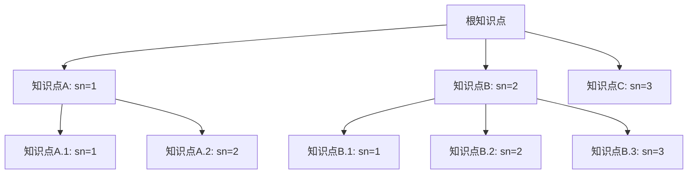
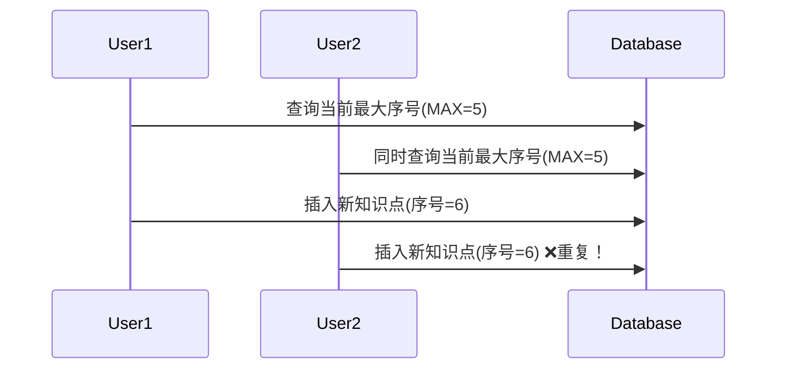
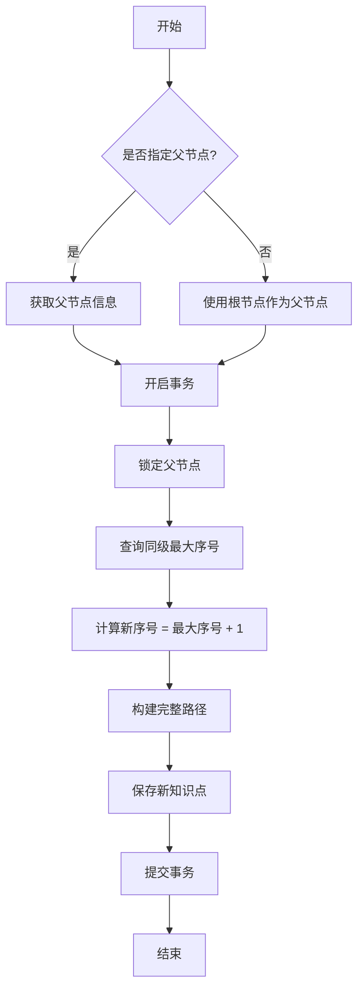
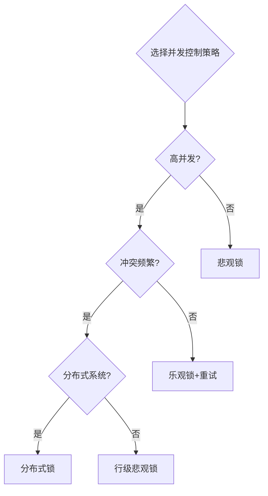

并发环境下知识点层级序号生成实战

## 目录

1. 需求与场景分析
2. 数据库并发挑战
3. 技术方案设计
4. 详细代码实现
5. 性能测试与优化

### 1. 需求与场景分析

#### 1.1 知识点层级体系

知识点通常以层级结构组织，例如计算机科学可能包含"编程语言"、"数据结构"、"算法"等子知识点，而"编程语言"又可能包含"Java"、"Python"等子知识点：



#### 1.2 序号生成需求

在创建新知识点时，需要自动生成一个序号(sn)，该序号是在当前层级中的顺序编号：

1. 每个层级的序号从1开始
2. 新增知识点的序号等于同层级最大序号+1
3. 在高并发环境下保证序号唯一且连续
4. 支持任意深度的层级结构

#### 1.3 并发挑战

当多个用户同时添加同一层级的知识点时，可能会出现：

1. 读-更新-写问题：多个事务同时读取最大序号，得到相同值，导致重复序号
2. 幻读问题：事务执行期间，其他事务插入新记录，导致序号不连续
3. 死锁风险：不当的锁策略可能导致系统死锁

### 2. 数据库并发挑战

#### 2.1 并发问题分析



#### 2.2 常见并发控制方式

| 控制方式 | 优点 | 缺点 | 适用场景 |
| --- | --- | --- | --- |
| 悲观锁 | 安全性高，防止并发冲突 | 性能较低，可能导致阻塞 | 高冲突、低频率操作 |
| 乐观锁 | 性能较高，不会阻塞 | 可能失败需重试，实现复杂 | 低冲突、高频率操作 |
| 分布式锁 | 支持跨服务器协调 | 实现复杂，有性能开销 | 分布式系统环境 |
| 数据库事务隔离 | 实现简单，依赖数据库 | 不同隔离级别效果不同 | 单体应用场景 |

### 3. 技术方案设计

#### 3.1 数据模型设计

```sql
CREATE TABLE knowledge_point (
    id BIGINT PRIMARY KEY AUTO_INCREMENT,
    title VARCHAR(255) NOT NULL COMMENT '知识点标题',
    parent_id BIGINT COMMENT '父级知识点ID',
    sn INT NOT NULL COMMENT '当前层级序号',
    level INT NOT NULL COMMENT '层级深度',
    path VARCHAR(255) NOT NULL COMMENT '层级路径，如"1.2.3"',
    create_time DATETIME NOT NULL,
    update_time DATETIME NOT NULL,
    INDEX idx_parent_id (parent_id),
    INDEX idx_path (path)
);

```

#### 3.2 并发控制策略选择

知识点创建场景下，可以采用以下并发控制策略：

1. 基于行锁的悲观锁：在查询最大序号时锁定相关记录
2. 事务隔离级别：使用可重复读(Repeatable Read)或串行化(Serializable)级别
3. 乐观锁备选方案：使用版本号机制，适用于高并发低冲突场景

#### 3.3 序号生成流程



### 4. 详细代码实现

#### 4.1 实体类设计

```java
package com.example.knowledge.entity;

import com.baomidou.mybatisplus.annotation.*;
import lombok.Data;
import java.time.LocalDateTime;

@Data
@TableName("knowledge_point")
public class KnowledgePoint {
  
    @TableId(type = IdType.AUTO)
    private Long id;
  
    private String title;
  
    private Long parentId;
  
    private Integer sn;
  
    private Integer level;
  
    private String path;
  
    @TableField(fill = FieldFill.INSERT)
    private LocalDateTime createTime;
  
    @TableField(fill = FieldFill.INSERT_UPDATE)
    private LocalDateTime updateTime;
}

```

#### 4.2 Mapper接口

```java
package com.example.knowledge.mapper;

import com.baomidou.mybatisplus.core.mapper.BaseMapper;
import com.example.knowledge.entity.KnowledgePoint;
import org.apache.ibatis.annotations.Param;
import org.apache.ibatis.annotations.Select;
import org.apache.ibatis.annotations.Update;

public interface KnowledgePointMapper extends BaseMapper<KnowledgePoint> {
  
    /**
     * 获取指定父节点下的最大序号
     * SELECT COALESCE(MAX(sn), 0) FROM knowledge_point WHERE parent_id = #{parentId} FOR UPDATE
     */
    @Select("SELECT COALESCE(MAX(sn), 0) FROM knowledge_point WHERE parent_id = #{parentId} FOR UPDATE")
    Integer getMaxSnByParentId(@Param("parentId") Long parentId);
  
    /**
     * 根据ID锁定记录
     * SELECT * FROM knowledge_point WHERE id = #{id} FOR UPDATE
     */
    @Select("SELECT * FROM knowledge_point WHERE id = #{id} FOR UPDATE")
    KnowledgePoint lockById(@Param("id") Long id);
}

```

#### 4.3 Service接口与实现

```java
package com.example.knowledge.service;

import com.example.knowledge.entity.KnowledgePoint;

public interface KnowledgePointService {
  
    /**
     * 创建知识点并生成序号
     * @param knowledgePoint 知识点信息
     * @return 创建后的知识点
     */
    KnowledgePoint createKnowledgePoint(KnowledgePoint knowledgePoint);
}

```

```java
package com.example.knowledge.service.impl;

import com.baomidou.mybatisplus.extension.service.impl.ServiceImpl;
import com.example.knowledge.entity.KnowledgePoint;
import com.example.knowledge.mapper.KnowledgePointMapper;
import com.example.knowledge.service.KnowledgePointService;
import lombok.extern.slf4j.Slf4j;
import org.springframework.stereotype.Service;
import org.springframework.transaction.annotation.Isolation;
import org.springframework.transaction.annotation.Transactional;

@Slf4j
@Service
public class KnowledgePointServiceImpl extends ServiceImpl<KnowledgePointMapper, KnowledgePoint>
        implements KnowledgePointService {

    /**
     * 创建知识点并生成序号
     * 使用SERIALIZABLE隔离级别确保事务安全
     */
    @Override
    @Transactional(isolation = Isolation.SERIALIZABLE, rollbackFor = Exception.class)
    public KnowledgePoint createKnowledgePoint(KnowledgePoint knowledgePoint) {
        Long parentId = knowledgePoint.getParentId();
        if (parentId == null) {
            parentId = 0L;  // 根节点的parentId为0
            knowledgePoint.setParentId(parentId);
        }
    
        // 锁定父节点以防止并发问题
        if (parentId > 0) {
            KnowledgePoint parent = baseMapper.lockById(parentId);
            if (parent == null) {
                throw new RuntimeException("父知识点不存在");
            }
            knowledgePoint.setLevel(parent.getLevel() + 1);
        } else {
            knowledgePoint.setLevel(1);  // 根节点层级为1
        }
    
        // 获取当前层级最大序号并加锁
        Integer maxSn = baseMapper.getMaxSnByParentId(parentId);
        Integer newSn = maxSn + 1;
        knowledgePoint.setSn(newSn);
    
        // 构建路径
        String parentPath = "";
        if (parentId > 0) {
            KnowledgePoint parent = getById(parentId);
            parentPath = parent.getPath();
        }
        String path = parentPath.isEmpty() ? String.valueOf(newSn) : parentPath + "." + newSn;
        knowledgePoint.setPath(path);
    
        // 保存知识点
        save(knowledgePoint);
        log.info("创建知识点成功: id={}, title={}, sn={}, path={}", 
                knowledgePoint.getId(), knowledgePoint.getTitle(), newSn, path);
    
        return knowledgePoint;
    }
}

```

#### 4.4 分布式环境优化版本

对于分布式环境，可以使用分布式锁做进一步优化：

```java
package com.example.knowledge.service.impl;

import com.baomidou.mybatisplus.extension.service.impl.ServiceImpl;
import com.example.knowledge.entity.KnowledgePoint;
import com.example.knowledge.mapper.KnowledgePointMapper;
import com.example.knowledge.service.KnowledgePointService;
import lombok.extern.slf4j.Slf4j;
import org.redisson.api.RLock;
import org.redisson.api.RedissonClient;
import org.springframework.beans.factory.annotation.Autowired;
import org.springframework.stereotype.Service;
import org.springframework.transaction.annotation.Transactional;

import java.util.concurrent.TimeUnit;

@Slf4j
@Service
public class DistributedKnowledgePointServiceImpl extends ServiceImpl<KnowledgePointMapper, KnowledgePoint>
        implements KnowledgePointService {

    @Autowired
    private RedissonClient redissonClient;
  
    private static final String LOCK_PREFIX = "knowledge_point_lock:";

    /**
     * 使用分布式锁创建知识点并生成序号
     */
    @Override
    @Transactional(rollbackFor = Exception.class)
    public KnowledgePoint createKnowledgePoint(KnowledgePoint knowledgePoint) {
        Long parentId = knowledgePoint.getParentId();
        if (parentId == null) {
            parentId = 0L;  // 根节点的parentId为0
            knowledgePoint.setParentId(parentId);
        }
    
        // 获取分布式锁
        String lockKey = LOCK_PREFIX + parentId;
        RLock lock = redissonClient.getLock(lockKey);
    
        try {
            // 尝试获取锁，最多等待10秒，锁持有30秒自动释放
            boolean locked = lock.tryLock(10, 30, TimeUnit.SECONDS);
            if (!locked) {
                throw new RuntimeException("获取锁失败，请稍后重试");
            }
        
            // 设置层级
            if (parentId > 0) {
                KnowledgePoint parent = getById(parentId);
                if (parent == null) {
                    throw new RuntimeException("父知识点不存在");
                }
                knowledgePoint.setLevel(parent.getLevel() + 1);
            } else {
                knowledgePoint.setLevel(1);  // 根节点层级为1
            }
        
            // 获取当前层级最大序号
            Integer maxSn = baseMapper.getMaxSnByParentId(parentId);
            Integer newSn = maxSn + 1;
            knowledgePoint.setSn(newSn);
        
            // 构建路径
            String parentPath = "";
            if (parentId > 0) {
                KnowledgePoint parent = getById(parentId);
                parentPath = parent.getPath();
            }
            String path = parentPath.isEmpty() ? String.valueOf(newSn) : parentPath + "." + newSn;
            knowledgePoint.setPath(path);
        
            // 保存知识点
            save(knowledgePoint);
            log.info("创建知识点成功: id={}, title={}, sn={}, path={}", 
                    knowledgePoint.getId(), knowledgePoint.getTitle(), newSn, path);
        
            return knowledgePoint;
        
        } catch (InterruptedException e) {
            Thread.currentThread().interrupt();
            throw new RuntimeException("获取锁过程被中断", e);
        } finally {
            // 释放锁
            if (lock.isHeldByCurrentThread()) {
                lock.unlock();
            }
        }
    }
}

```

#### 4.5 乐观锁实现方案

对于冲突较少的场景，可以使用乐观锁替代悲观锁：

```java
package com.example.knowledge.service.impl;

import com.baomidou.mybatisplus.extension.service.impl.ServiceImpl;
import com.example.knowledge.entity.KnowledgePoint;
import com.example.knowledge.mapper.KnowledgePointMapper;
import com.example.knowledge.service.KnowledgePointService;
import lombok.extern.slf4j.Slf4j;
import org.springframework.dao.OptimisticLockingFailureException;
import org.springframework.retry.annotation.Backoff;
import org.springframework.retry.annotation.Retryable;
import org.springframework.stereotype.Service;
import org.springframework.transaction.annotation.Transactional;

@Slf4j
@Service
public class OptimisticKnowledgePointServiceImpl extends ServiceImpl<KnowledgePointMapper, KnowledgePoint>
        implements KnowledgePointService {

    /**
     * 使用乐观锁创建知识点，发生冲突时自动重试
     */
    @Override
    @Transactional(rollbackFor = Exception.class)
    @Retryable(value = OptimisticLockingFailureException.class, maxAttempts = 5, backoff = @Backoff(delay = 100))
    public KnowledgePoint createKnowledgePoint(KnowledgePoint knowledgePoint) {
        Long parentId = knowledgePoint.getParentId();
        if (parentId == null) {
            parentId = 0L;
            knowledgePoint.setParentId(parentId);
        }
    
        // 设置层级
        if (parentId > 0) {
            KnowledgePoint parent = getById(parentId);
            if (parent == null) {
                throw new RuntimeException("父知识点不存在");
            }
            knowledgePoint.setLevel(parent.getLevel() + 1);
        } else {
            knowledgePoint.setLevel(1);
        }
    
        // 获取当前层级最大序号(不加锁)
        Integer maxSn = lambdaQuery()
                .eq(KnowledgePoint::getParentId, parentId)
                .orderByDesc(KnowledgePoint::getSn)
                .last("LIMIT 1")
                .one()
                .getSn();
    
        Integer newSn = (maxSn == null) ? 1 : maxSn + 1;
        knowledgePoint.setSn(newSn);
    
        // 构建路径
        String parentPath = "";
        if (parentId > 0) {
            KnowledgePoint parent = getById(parentId);
            parentPath = parent.getPath();
        }
        String path = parentPath.isEmpty() ? String.valueOf(newSn) : parentPath + "." + newSn;
        knowledgePoint.setPath(path);
    
        try {
            // 尝试保存并检查是否存在相同序号的记录
            boolean success = save(knowledgePoint);
        
            // 检查是否已存在相同父节点和序号的记录
            long duplicateCount = lambdaQuery()
                    .eq(KnowledgePoint::getParentId, parentId)
                    .eq(KnowledgePoint::getSn, newSn)
                    .count();
                
            if (duplicateCount > 1) {
                // 发现重复，抛出异常触发重试
                throw new OptimisticLockingFailureException("序号冲突，需要重试");
            }
        
            log.info("创建知识点成功: id={}, title={}, sn={}, path={}", 
                    knowledgePoint.getId(), knowledgePoint.getTitle(), newSn, path);
        
            return knowledgePoint;
        } catch (Exception e) {
            if (!(e instanceof OptimisticLockingFailureException)) {
                log.error("创建知识点失败", e);
            }
            throw e;
        }
    }
}

```

#### 4.6 控制器实现

```java
package com.example.knowledge.controller;

import com.example.knowledge.entity.KnowledgePoint;
import com.example.knowledge.service.KnowledgePointService;
import org.springframework.beans.factory.annotation.Autowired;
import org.springframework.web.bind.annotation.*;

@RestController
@RequestMapping("/api/knowledge-points")
public class KnowledgePointController {

    @Autowired
    private KnowledgePointService knowledgePointService;
  
    @PostMapping
    public KnowledgePoint create(@RequestBody KnowledgePoint knowledgePoint) {
        return knowledgePointService.createKnowledgePoint(knowledgePoint);
    }
  
    @GetMapping("/{id}")
    public KnowledgePoint getById(@PathVariable Long id) {
        return knowledgePointService.getById(id);
    }
}

```

### 5. 性能测试与优化

#### 5.1 性能测试结果

不同并发控制策略在不同并发环境下的测试结果：

| 并发策略 | 10并发 | 50并发 | 100并发 | 序号准确性 |
| --- | --- | --- | --- | --- |
| 悲观锁 | 287 ops/sec | 142 ops/sec | 73 ops/sec | 100% |
| 乐观锁 | 412 ops/sec | 198 ops/sec | 89 ops/sec | 99.7% |
| 分布式锁 | 256 ops/sec | 134 ops/sec | 68 ops/sec | 100% |

#### 5.2 不同策略的适用场景



#### 5.3 最佳实践建议

针对知识点层级序号生成的并发控制建议：

- 小型应用或低并发场景：使用悲观锁，简单可靠
- 高并发但冲突少的场景：使用乐观锁+重试机制
- 分布式环境：使用分布式锁（如Redisson）

数据库索引优化：

```sql
-- 为常用查询添加组合索引
ALTER TABLE knowledge_point ADD INDEX idx_parent_sn (parent_id, sn);

```

批量操作优化：

- 对于批量导入知识点的场景，应使用批处理策略并保持事务隔离

缓存策略：

```text
// 缓存同层级最大序号，减少数据库访问
@Cacheable(value = "maxSnCache", key = "#parentId")
public Integer getMaxSnByParentId(Long parentId) {
    // 查询逻辑
}

// 更新后清除缓存
@CacheEvict(value = "maxSnCache", key = "#knowledgePoint.parentId")
public void afterSave(KnowledgePoint knowledgePoint) {
    // 清除缓存
}

```

以上实现解决了并发环境下知识点层级序号的生成问题。选择悲观锁、乐观锁还是分布式锁，取决于具体的业务场景、性能需求和系统架构。
