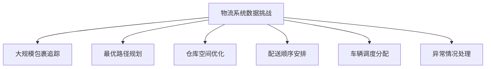
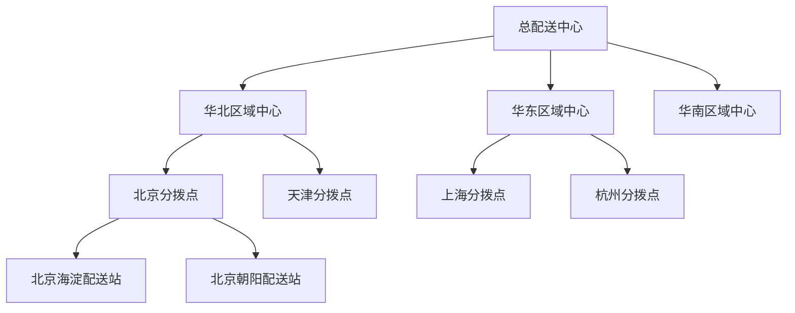
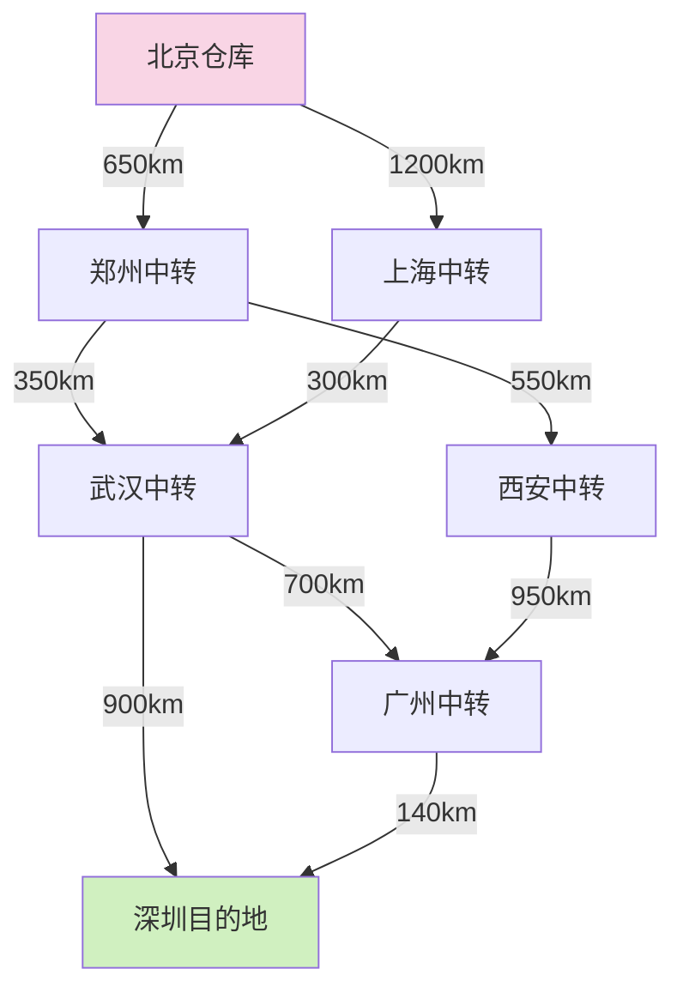
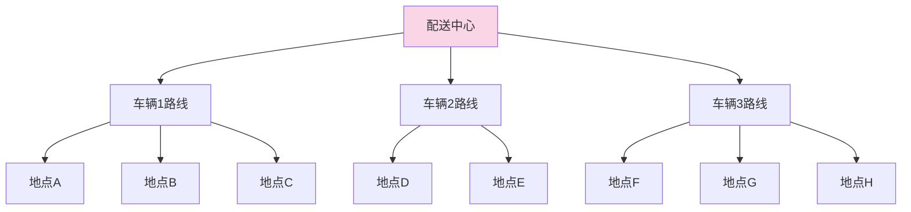
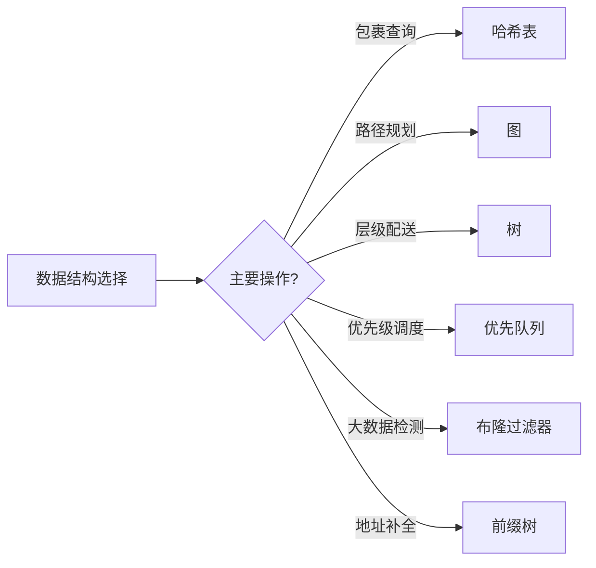

物流系统中的数据结构应用指南-教学

### 引言

物流系统涉及复杂的网络、路径规划、仓储管理和配送调度。从A点到B点的配送过程中，会用到多种数据结构。本文通过实际代码示例，展示不同数据结构在物流系统中的应用方式。

### 物流系统的数据挑战

现代物流面临的主要挑战包括：



这些挑战需要通过选择合适的数据结构来高效解决。

### 1. 基础数据结构在物流中的应用

#### 1.1 数组和列表：包裹与订单管理

物流系统的基本工作单位是包裹和订单。使用数组或列表可以有效地管理这些基本单元。

```java
public class Package {
    private String trackingNumber;
    private Address senderAddress;
    private Address receiverAddress;
    private double weight;
    private Dimensions dimensions;
    private PackageStatus status;
  
    // 其他属性和方法...
}

// 使用ArrayList管理一批待处理包裹
public class PackageProcessingQueue {
    private List<Package> packages = new ArrayList<>();
  
    // 添加新包裹到处理队列
    public void addPackage(Package pkg) {
        packages.add(pkg);
    }
  
    // 按重量排序包裹，优化装载
    public void sortByWeight() {
        packages.sort(Comparator.comparing(Package::getWeight));
    }
  
    // 按目的地邮编分组，便于规划配送路线
    public Map<String, List<Package>> groupByZipCode() {
        return packages.stream()
            .collect(Collectors.groupingBy(
                pkg -> pkg.getReceiverAddress().getZipCode()));
    }
}

```

这个简单的结构可以帮助分拣中心高效地组织包裹，为后续配送做准备。

#### 1.2 哈希表：快速查询包裹信息

物流系统需要能够迅速查询任何包裹的状态信息，哈希表能提供接近O(1)的查询性能。

```java
public class PackageTrackingSystem {
    // 使用HashMap存储包裹信息，Key为运单号，Value为包裹对象
    private Map<String, Package> packageDatabase = new HashMap<>();
  
    // 录入新包裹信息
    public void registerPackage(Package pkg) {
        packageDatabase.put(pkg.getTrackingNumber(), pkg);
    }
  
    // 根据运单号查询包裹
    public Package trackPackage(String trackingNumber) {
        return packageDatabase.get(trackingNumber);
    }
  
    // 更新包裹状态
    public void updateStatus(String trackingNumber, PackageStatus newStatus) {
        Package pkg = packageDatabase.get(trackingNumber);
        if (pkg != null) {
            pkg.setStatus(newStatus);
        }
    }
}

```

顾客在手机APP输入运单号查包裹状态，背后就是哈希表在查询对应信息。

#### 1.3 队列与栈：物流处理流程

在仓库管理中，遵循"先进先出"(FIFO)或"后进先出"(LIFO)原则非常重要。


```java
public class WarehouseProcessor {
    // 使用队列存储待处理包裹，实现先到先处理
    private Queue<Package> processingQueue = new LinkedList<>();
  
    // 当天需优先处理的特急件
    private Stack<Package> priorityStack = new Stack<>();
  
    // 将包裹加入处理队列
    public void receivePackage(Package pkg) {
        if (pkg.isPriority()) {
            priorityStack.push(pkg); // 特急件放入栈顶，优先处理
        } else {
            processingQueue.offer(pkg); // 普通件排队等待
        }
    }
  
    // 处理下一个包裹
    public Package processNextPackage() {
        // 优先处理特急件
        if (!priorityStack.isEmpty()) {
            return priorityStack.pop();
        }
      
        // 然后处理普通包裹
        return processingQueue.poll();
    }
}

```

这种结构确保了物流中心能够合理安排包裹处理顺序，兼顾效率和优先级。

### 2. 树形结构在物流中的应用

#### 2.1 区域配送树：层级分区配送

物流配送通常采用层级分区策略，这非常适合用树结构表示。



```java
public class DistributionNode {
    private String name;
    private NodeType type; // 中心、分拨点、配送站
    private DistributionNode parent;
    private List<DistributionNode> children = new ArrayList<>();
  
    // 添加子节点
    public void addChild(DistributionNode child) {
        children.add(child);
        child.setParent(this);
    }
  
    // 获取配送层级路径
    public List<DistributionNode> getDistributionPath() {
        List<DistributionNode> path = new ArrayList<>();
        DistributionNode current = this;
      
        // 从叶节点(配送站)回溯到根节点(总中心)
        while (current != null) {
            path.add(0, current);
            current = current.getParent();
        }
      
        return path;
    }
}

```

这种树结构可以确定任何包裹的完整配送路径，并在每一层级进行管理。

#### 2.2 前缀树：地址智能匹配与自动补全

物流系统中，快速准确地输入和匹配地址非常重要。前缀树(Trie)能够提供高效的地址自动补全功能。

```java
public class AddressTrieNode {
    private Map<Character, AddressTrieNode> children = new HashMap<>();
    private boolean isEndOfAddress;
    private String fullAddress;
    private int frequency; // 记录地址使用频率
  
    // 获取所有子节点
    public Map<Character, AddressTrieNode> getChildren() {
        return children;
    }
  
    // 其他方法...
}

public class AddressAutoComplete {
    private AddressTrieNode root = new AddressTrieNode();
  
    // 添加地址到前缀树
    public void addAddress(String address) {
        AddressTrieNode current = root;
      
        for (char c : address.toCharArray()) {
            current.getChildren().putIfAbsent(c, new AddressTrieNode());
            current = current.getChildren().get(c);
        }
      
        current.setEndOfAddress(true);
        current.setFullAddress(address);
        current.increaseFrequency(); // 增加使用次数
    }
  
    // 根据前缀查找地址建议
    public List<String> suggestAddresses(String prefix, int limit) {
        AddressTrieNode current = root;
      
        // 查找到前缀的最后一个字符
        for (char c : prefix.toCharArray()) {
            if (!current.getChildren().containsKey(c)) {
                return Collections.emptyList(); // 前缀不存在
            }
            current = current.getChildren().get(c);
        }
      
        // 收集以该前缀开头的所有地址
        List<AddressTrieNode> matches = new ArrayList<>();
        collectMatches(current, matches);
      
        // 根据频率排序，返回常用地址
        return matches.stream()
            .sorted(Comparator.comparing(AddressTrieNode::getFrequency).reversed())
            .limit(limit)
            .map(AddressTrieNode::getFullAddress)
            .collect(Collectors.toList());
    }
  
    private void collectMatches(AddressTrieNode node, List<AddressTrieNode> matches) {
        if (node.isEndOfAddress()) {
            matches.add(node);
        }
      
        for (AddressTrieNode child : node.getChildren().values()) {
            collectMatches(child, matches);
        }
    }
}

```

快递员或客服输入地址前几个字时，系统会提供最可能的完整地址列表，减少手动输入。

### 3. 图结构在物流中的应用

#### 3.1 物流网络路径规划

物流配送的核心问题是路径规划，这本质上是图的最短路径问题。



```java
public class LogisticsNetwork {
    // 表示物流网络中的节点(仓库、中转站、目的地)
    private static class Node {
        private String id;
        private String name;
        private double latitude;
        private double longitude;
      
        // 构造函数和方法...
    }
  
    // 表示两节点间的连接(运输路线)
    private static class Edge {
        private String sourceId;
        private String targetId;
        private double distance; // 距离(公里)
        private double time;     // 运输时间(小时)
        private double cost;     // 运输成本
        private String transportType; // 运输方式(公路/铁路/航空)
      
        // 构造函数和方法...
    }
  
    // 存储物流网络
    private Map<String, Node> nodes = new HashMap<>();
    private Map<String, Map<String, Edge>> adjacencyMap = new HashMap<>();
  
    // 添加物流节点
    public void addNode(Node node) {
        nodes.put(node.getId(), node);
        adjacencyMap.put(node.getId(), new HashMap<>());
    }
  
    // 添加运输路线
    public void addEdge(Edge edge) {
        adjacencyMap.get(edge.getSourceId()).put(edge.getTargetId(), edge);
    }
  
    // 使用Dijkstra算法查找最佳配送路径
    public DeliveryRoute findOptimalRoute(String sourceId, String targetId, 
                                         RouteOptimizationCriteria criteria) {
        // 优先队列，按照优化标准(时间/成本/距离)排序
        PriorityQueue<RouteNode> queue = new PriorityQueue<>(
            Comparator.comparingDouble(RouteNode::getCost));
      
        // 记录到每个节点的最优成本
        Map<String, Double> costs = new HashMap<>();
        // 记录到每个节点的前驱节点
        Map<String, String> predecessors = new HashMap<>();
        // 已访问的节点
        Set<String> visited = new HashSet<>();
      
        // 初始化
        for (String nodeId : nodes.keySet()) {
            costs.put(nodeId, nodeId.equals(sourceId) ? 0.0 : Double.POSITIVE_INFINITY);
        }
      
        queue.offer(new RouteNode(sourceId, 0.0));
      
        while (!queue.isEmpty()) {
            RouteNode current = queue.poll();
            String currentId = current.getNodeId();
          
            if (currentId.equals(targetId)) {
                break; // 到达目的地
            }
          
            if (visited.contains(currentId)) {
                continue;
            }
          
            visited.add(currentId);
          
            // 检查所有相邻节点
            for (Edge edge : adjacencyMap.get(currentId).values()) {
                String neighborId = edge.getTargetId();
              
                if (visited.contains(neighborId)) {
                    continue;
                }
              
                // 根据优化标准计算成本
                double newCost = costs.get(currentId) + getEdgeCost(edge, criteria);
              
                if (newCost < costs.get(neighborId)) {
                    costs.put(neighborId, newCost);
                    predecessors.put(neighborId, currentId);
                    queue.offer(new RouteNode(neighborId, newCost));
                }
            }
        }
      
        // 构建路径
        return buildRoute(sourceId, targetId, predecessors);
    }
  
    // 根据优化标准获取边的成本
    private double getEdgeCost(Edge edge, RouteOptimizationCriteria criteria) {
        switch (criteria) {
            case DISTANCE: return edge.getDistance();
            case TIME: return edge.getTime();
            case COST: return edge.getCost();
            case BALANCED: 
                // 综合考虑距离、时间和成本
                return edge.getDistance() * 0.3 + edge.getTime() * 0.4 + edge.getCost() * 0.3;
            default: return edge.getDistance();
        }
    }
  
    // 根据前驱节点构建路径
    private DeliveryRoute buildRoute(String sourceId, String targetId, Map<String, String> predecessors) {
        // 实现代码...
    }
  
    // 路径节点（用于Dijkstra算法）
    private static class RouteNode {
        private String nodeId;
        private double cost;
      
        // 构造函数和getter...
    }
  
    // 路径优化标准
    public enum RouteOptimizationCriteria {
        DISTANCE, TIME, COST, BALANCED
    }
  
    // 配送路线结果
    public static class DeliveryRoute {
        private List<String> path;
        private double totalDistance;
        private double totalTime;
        private double totalCost;
      
        // 构造函数和方法...
    }
}

```

这个图结构让物流系统能够根据不同需求（最短距离、最快时间、最低成本）计算最优配送路线。

#### 3.2 车辆路径问题(VRP)解决方案

配送车辆如何安排才能覆盖所有配送点，同时最小化总行程距离？这是著名的车辆路径问题。



```java
public class VehicleRoutingProblemSolver {
    // 使用贪心算法解决VRP问题
    public List<VehicleRoute> solveVRP(DeliveryCenter depot, 
                                     List<DeliveryPoint> deliveryPoints,
                                     int availableVehicles,
                                     int maxCapacityPerVehicle) {
        // 按距离排序配送点
        List<DeliveryPoint> sortedPoints = new ArrayList<>(deliveryPoints);
        sortedPoints.sort(Comparator.comparingDouble(p -> 
            calculateDistance(depot.getLocation(), p.getLocation())));
      
        List<VehicleRoute> routes = new ArrayList<>();
      
        // 初始化车辆路线
        for (int i = 0; i < availableVehicles; i++) {
            routes.add(new VehicleRoute(depot));
        }
      
        // 为每个配送点分配车辆
        for (DeliveryPoint point : sortedPoints) {
            // 找到最适合的车辆
            VehicleRoute bestRoute = null;
            double minDetour = Double.POSITIVE_INFINITY;
          
            for (VehicleRoute route : routes) {
                // 检查车辆容量约束
                if (route.getCurrentCapacity() + point.getPackageSize() > maxCapacityPerVehicle) {
                    continue;
                }
              
                // 计算绕道成本
                double detourCost = calculateDetourCost(route, point);
                if (detourCost < minDetour) {
                    minDetour = detourCost;
                    bestRoute = route;
                }
            }
          
            // 如果找到合适车辆，添加配送点
            if (bestRoute != null) {
                bestRoute.addDeliveryPoint(point);
            } else {
                // 无法分配，可能需要增加车辆或调整策略
                System.out.println("无法为配送点分配车辆: " + point.getId());
            }
        }
      
        return routes;
    }
  
    // 计算将配送点添加到路线中的绕道成本
    private double calculateDetourCost(VehicleRoute route, DeliveryPoint newPoint) {
        // 如果路线为空，直接计算往返距离
        if (route.getPoints().isEmpty()) {
            return 2 * calculateDistance(route.getDepot().getLocation(), newPoint.getLocation());
        }
      
        // 否则，计算添加这个点后的路线长度增量
        // 实际实现可能会复杂得多，这里简化处理
        DeliveryPoint lastPoint = route.getPoints().get(route.getPoints().size() - 1);
      
        double currentDistance = calculateDistance(lastPoint.getLocation(), route.getDepot().getLocation());
        double newDistance = calculateDistance(lastPoint.getLocation(), newPoint.getLocation()) + 
                            calculateDistance(newPoint.getLocation(), route.getDepot().getLocation());
      
        return newDistance - currentDistance;
    }
  
    // 计算两点间距离
    private double calculateDistance(Location a, Location b) {
        // 使用直线距离或实际道路距离
        return Math.sqrt(Math.pow(a.getLatitude() - b.getLatitude(), 2) + 
                        Math.pow(a.getLongitude() - b.getLongitude(), 2));
    }
  
    // 配送路线
    public static class VehicleRoute {
        private DeliveryCenter depot;
        private List<DeliveryPoint> points = new ArrayList<>();
        private double currentCapacity = 0;
      
        // 构造函数和方法...
      
        public void addDeliveryPoint(DeliveryPoint point) {
            points.add(point);
            currentCapacity += point.getPackageSize();
        }
      
        public double getCurrentCapacity() {
            return currentCapacity;
        }
      
        public List<DeliveryPoint> getPoints() {
            return points;
        }
      
        public DeliveryCenter getDepot() {
            return depot;
        }
    }
}

```

这种图算法可以降低空驶里程和运营成本。

### 4. 高级数据结构在物流中的应用

#### 4.1 优先队列：动态调度与任务分配

在物流运营中，不同包裹有不同的优先级，优先队列可以确保高优先级包裹得到优先处理。

```java
public class PackageDispatcher {
    // 使用优先队列，按包裹优先级排序
    private PriorityQueue<DeliveryTask> deliveryQueue = new PriorityQueue<>(
        Comparator.comparingInt(DeliveryTask::getPriority).reversed()
    );
  
    // 添加配送任务
    public void addDeliveryTask(DeliveryTask task) {
        deliveryQueue.offer(task);
    }
  
    // 获取下一个要处理的任务
    public DeliveryTask getNextTask() {
        return deliveryQueue.poll();
    }
  
    // 动态调整任务优先级
    public void updateTaskPriority(String taskId, int newPriority) {
        // 在实际应用中，这需要更复杂的实现
        // 这里为简化，我们重建队列
        List<DeliveryTask> tasks = new ArrayList<>();
        while (!deliveryQueue.isEmpty()) {
            DeliveryTask task = deliveryQueue.poll();
            if (task.getId().equals(taskId)) {
                task.setPriority(newPriority);
            }
            tasks.add(task);
        }
      
        deliveryQueue.addAll(tasks);
    }
  
    // 配送任务
    public static class DeliveryTask {
        private String id;
        private Package pkg;
        private int priority; // 优先级：1=标准，2=加急，3=特急
      
        // 构造函数和方法...
      
        public int getPriority() {
            return priority;
        }
      
        public void setPriority(int priority) {
            this.priority = priority;
        }
      
        public String getId() {
            return id;
        }
      
        public Package getPackage() {
            return pkg;
        }
    }
}

```

#### 4.2 布隆过滤器：快速验证包裹状态

在大型物流系统中，需要快速检查包裹是否被处理，布隆过滤器提供了空间高效的解决方案。

```java
public class PackageProcessingFilter {
    private BitSet bitSet;
    private int bitSetSize;
    private int hashFunctionCount;
  
    public PackageProcessingFilter(int expectedPackages, double falsePositiveProbability) {
        // 计算所需的位数和哈希函数数量
        this.bitSetSize = calculateBitSetSize(expectedPackages, falsePositiveProbability);
        this.hashFunctionCount = calculateHashFunctionCount(bitSetSize, expectedPackages);
        this.bitSet = new BitSet(bitSetSize);
    }
  
    // 标记包裹为已处理
    public void markAsProcessed(String trackingNumber) {
        int[] hashes = createHashes(trackingNumber);
      
        for (int hash : hashes) {
            bitSet.set(Math.abs(hash % bitSetSize), true);
        }
    }
  
    // 检查包裹是否可能已处理
    public boolean mightBeProcessed(String trackingNumber) {
        int[] hashes = createHashes(trackingNumber);
      
        for (int hash : hashes) {
            if (!bitSet.get(Math.abs(hash % bitSetSize))) {
                return false; // 肯定未处理
            }
        }
      
        return true; // 可能已处理
    }
  
    // 创建哈希值数组
    private int[] createHashes(String trackingNumber) {
        int[] result = new int[hashFunctionCount];
        int hash1 = trackingNumber.hashCode();
        int hash2 = hash1 >>> 16;
      
        for (int i = 0; i < hashFunctionCount; i++) {
            result[i] = hash1 + i * hash2;
        }
      
        return result;
    }
  
    // 计算布隆过滤器所需位数
    private int calculateBitSetSize(int expectedPackages, double falsePositiveProbability) {
        return (int) Math.ceil(-(expectedPackages * Math.log(falsePositiveProbability)) / 
                               (Math.log(2) * Math.log(2)));
    }
  
    // 计算所需哈希函数数量
    private int calculateHashFunctionCount(int bitSetSize, int expectedPackages) {
        return (int) Math.round((bitSetSize / expectedPackages) * Math.log(2));
    }
}

```

布隆过滤器可以快速判断包裹是否已扫描或处理，适合处理海量包裹的场景。

### 5. 综合实例：智能物流调度系统

下面通过一个综合案例，展示如何将多种数据结构结合起来，构建一个智能物流调度系统：

```java
public class SmartLogisticsSystem {
    private PackageTrackingSystem trackingSystem;          // 哈希表
    private AddressAutoComplete addressAutoComplete;       // 前缀树
    private LogisticsNetwork logisticsNetwork;             // 图
    private VehicleRoutingProblemSolver vrpSolver;         // 图算法
    private PackageDispatcher dispatcher;                  // 优先队列
    private PackageProcessingFilter processingFilter;      // 布隆过滤器
  
    public SmartLogisticsSystem() {
        this.trackingSystem = new PackageTrackingSystem();
        this.addressAutoComplete = new AddressAutoComplete();
        this.logisticsNetwork = buildLogisticsNetwork();
        this.vrpSolver = new VehicleRoutingProblemSolver();
        this.dispatcher = new PackageDispatcher();
        this.processingFilter = new PackageProcessingFilter(1_000_000, 0.001);
      
        // 初始化系统...
    }
  
    // 构建物流网络
    private LogisticsNetwork buildLogisticsNetwork() {
        LogisticsNetwork network = new LogisticsNetwork();
        // 添加物流节点和路线...
        return network;
    }
  
    // 处理新包裹
    public void processNewPackage(Package pkg) {
        // 1. 验证并自动补全地址
        String suggestedAddress = validateAndCompleteAddress(pkg.getReceiverAddress().toString());
        if (suggestedAddress != null) {
            // 更新为规范化地址
            pkg.getReceiverAddress().updateFromString(suggestedAddress);
        }
      
        // 2. 注册包裹到跟踪系统
        trackingSystem.registerPackage(pkg);
      
        // 3. 计算最优配送路线
        DeliveryRoute route = calculateDeliveryRoute(pkg);
        pkg.setPlannedRoute(route);
      
        // 4. 创建配送任务并加入调度队列
        DeliveryTask task = createDeliveryTask(pkg);
        dispatcher.addDeliveryTask(task);
      
        // 5. 标记包裹为已处理
        processingFilter.markAsProcessed(pkg.getTrackingNumber());
    }
  
    // 验证并自动补全地址
    private String validateAndCompleteAddress(String address) {
        // 使用前缀树查找最匹配的标准地址
        List<String> suggestions = addressAutoComplete.suggestAddresses(address, 1);
        return suggestions.isEmpty() ? null : suggestions.get(0);
    }
  
    // 计算配送路线
    private DeliveryRoute calculateDeliveryRoute(Package pkg) {
        // 找到最近的物流中心
        String nearestDepot = findNearestDepot(pkg.getReceiverAddress());
      
        // 计算从该中心到目的地的最优路线
        return logisticsNetwork.findOptimalRoute(
            nearestDepot,
            pkg.getReceiverAddress().getZipCode(),
            LogisticsNetwork.RouteOptimizationCriteria.BALANCED
        );
    }
  
    // 找到最近的物流中心
    private String findNearestDepot(Address address) {
        // 根据地址查找最近的物流中心
        // 简化实现...
        return "DEPOT_001";
    }
  
    // 创建配送任务
    private DeliveryTask createDeliveryTask(Package pkg) {
        int priority = calculatePriority(pkg);
        DeliveryTask task = new DeliveryTask(
            generateTaskId(),
            pkg,
            priority
        );
        return task;
    }
  
    // 计算包裹优先级
    private int calculatePriority(Package pkg) {
        // 根据包裹类型、客户等级、时效要求等计算优先级
        if (pkg.isExpress()) return 3;
        if (pkg.isVIP()) return 2;
        return 1;
    }
  
    // 生成任务ID
    private String generateTaskId() {
        return "TASK_" + System.currentTimeMillis();
    }
  
    // 根据运单号查询包裹状态
    public PackageStatus trackPackage(String trackingNumber) {
        // 首先用布隆过滤器快速检查
        if (!processingFilter.mightBeProcessed(trackingNumber)) {
            return PackageStatus.NOT_FOUND;
        }
      
        // 然后查询详细信息
        Package pkg = trackingSystem.trackPackage(trackingNumber);
        return pkg != null ? pkg.getStatus() : PackageStatus.NOT_FOUND;
    }
  
    // 规划当天配送路线
    public List<VehicleRoute> planDailyDeliveries(DeliveryCenter depot, int availableVehicles) {
        // 获取当天需要配送的所有包裹
        List<DeliveryTask> todaysTasks = getTodaysDeliveryTasks();
      
        // 提取配送点
        List<DeliveryPoint> deliveryPoints = todaysTasks.stream()
            .map(task -> new DeliveryPoint(
                task.getPackage().getTrackingNumber(),
                task.getPackage().getReceiverAddress().getLocation(),
                estimatePackageSize(task.getPackage())))
            .collect(Collectors.toList());
      
        // 使用VRP求解器规划路线
        return vrpSolver.solveVRP(depot, deliveryPoints, availableVehicles, 1000);
    }
  
    // 获取当天配送任务
    private List<DeliveryTask> getTodaysDeliveryTasks() {
        List<DeliveryTask> tasks = new ArrayList<>();
        while (!dispatcher.deliveryQueue.isEmpty()) {
            tasks.add(dispatcher.getNextTask());
        }
        return tasks;
    }
  
    // 估算包裹大小（用于车辆容量规划）
    private double estimatePackageSize(Package pkg) {
        return pkg.getWeight() * pkg.getDimensions().getVolume() / 5000.0; // 简化估算
    }
}

```

### 6. 最佳实践总结

#### 6.1 合适的数据结构选择考量



在物流系统设计中，应根据具体业务场景选择最合适的数据结构：

1. 数组/列表：适用于连续存储和简单管理包裹信息
2. 哈希表：适用于包裹快速查询和状态更新
3. 队列/栈：适用于包裹处理流程和任务管理
4. 树结构：适用于层级分区配送和地址管理
5. 图结构：适用于物流网络路径规划和车辆调度
6. 优先队列：适用于基于优先级的任务调度
7. 布隆过滤器：适用于大规模包裹状态快速检查

#### 6.2 实战建议

1. 考虑数据规模：小型物流公司可能不需要复杂的布隆过滤器，而大型企业处理海量包裹时则必不可少
2. 平衡时间和空间复杂度：在移动终端设备上，可能需要优先考虑空间效率；在中心服务器上，可能更关注时间效率
3. 组合使用多种数据结构：复杂问题通常需要多种数据结构配合解决
4. 考虑并发访问：物流系统通常是高并发的，选择线程安全的数据结构实现或添加适当的同步机制
5. 数据持久化：考虑如何将内存中的数据结构与数据库存储结合起来

### 7. 结语

从包裹入库、路径规划到最终配送，每个环节都会用到不同的数据结构。理解这些结构的特点和适用场景，才能在实际系统中做出合理选择。
