# DDD与微服务：一个被面试官问懵的真实案例

昨天有个学DDD的同学面试被问懵了，面试官问："DDD和微服务有什么关系？这些微服务之间如何建立联系？"

他回答说每个DDD领域可以扩展成一个微服务，然后就卡壳了。

这个问题很典型，很多人都搞混了。直接说答案：微服务是微服务，DDD是DDD，没有强关联。

## 先说微服务是怎么来的

拿电商系统举例子。

最开始用户少的时候，所有功能都在一个系统里：商品库、下单、支付、发货、客服、优惠券、积分、签到、清分结算...全部塞在一个war包里。

### 单体架构时期

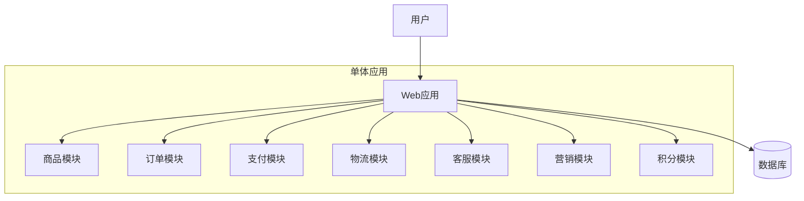

后来用户多了，系统扛不住了，就开始拆：

- 商品系统：管商品信息、库存
- 物流系统：发货、配送
- 交易系统：下单、支付
- 营销系统：优惠券、活动
- 客户系统：用户信息、客服
- 结算系统：财务、对账

这就是微服务。

### 微服务架构

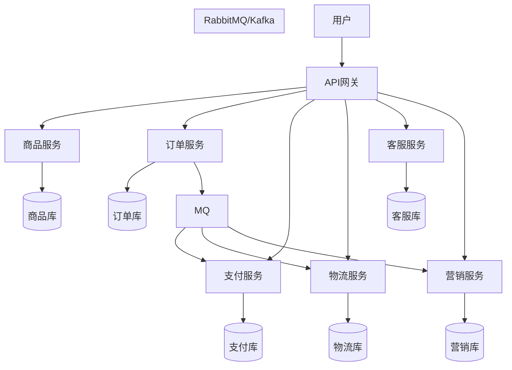

## 具体看个下单流程

用户在手机上下单买个手机，看看这个请求怎么在微服务之间跑的：

### 下单流程图

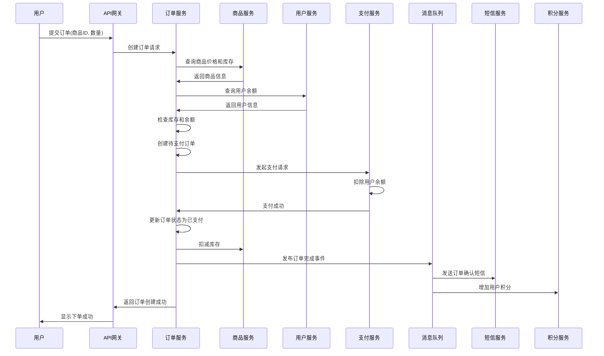

## 微服务带来的问题

### 通信问题

以前在一个系统里，调个方法就行了。现在分开了，系统A要调系统B，走HTTP接口，性能不行。

所以开始用RPC框架，像Dubbo、gRPC这些，调用更快。

### 数据一致性问题

最麻烦的来了。用户下单，要扣库存、扣余额、生成订单、发短信，这些操作分在不同系统里。

如果扣了库存，但是余额不够，怎么办？库存要回滚。如果库存扣了，余额也扣了，但是短信发送失败，订单要不要成功？

#### 分布式事务解决方案

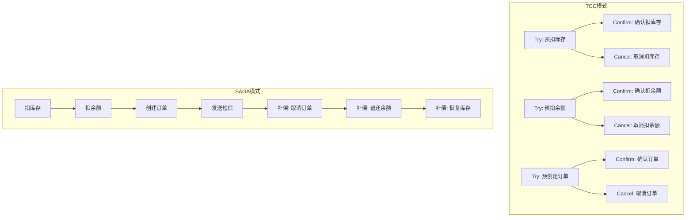

开始用分布式事务，保证要么全成功，要么全失败。但是分布式事务太重了，性能差，还容易死锁。

后来改成最终一致性。先把订单状态设为"待确认"，异步去扣库存、扣余额，都成功了再把订单改成"已确认"。用MQ、定时任务来保证最终一致。

#### 最终一致性方案

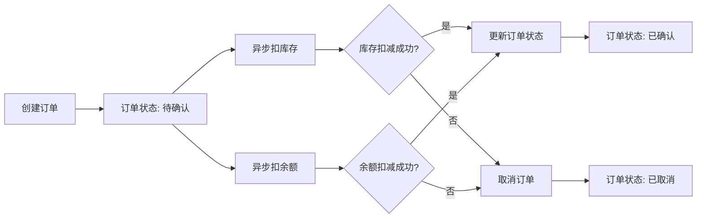

### 链路追踪问题

用户投诉说下单失败了。你要查日志，发现用户请求从网关进来，先到了订单系统A1机器，然后调用库存系统B2机器，再调用支付系统C4机器...

这个链路太复杂了，出了问题根本不知道在哪。

#### 分布式链路追踪

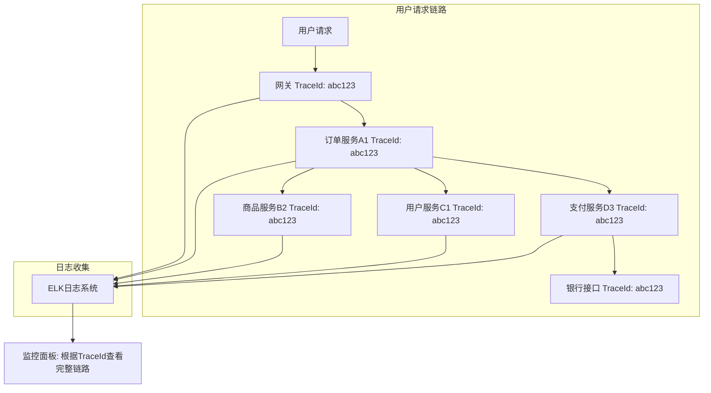

所以要上全链路监控，给每个请求打个唯一标识，所有系统都记录这个标识，这样就能串起来整个调用链路。

### 扩容缩容问题

抖音每天晚上7-8点用户最多，白天用户少。总不能24小时都按高峰期配置服务器，太浪费了。

#### 弹性伸缩架构

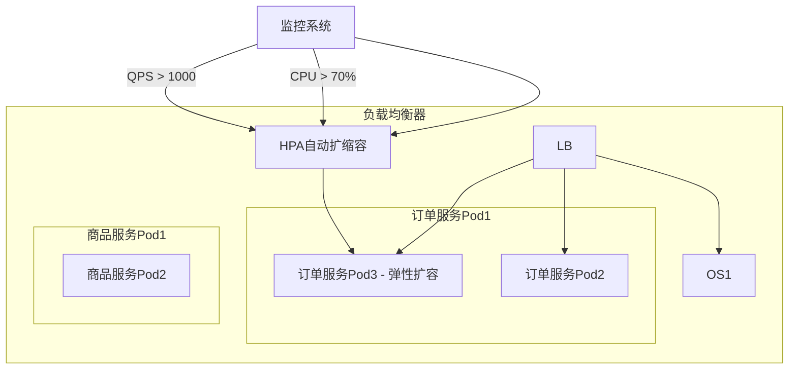

所以要能动态扩缩容。用Docker把服务打成镜像，用K8s来调度，高峰期多起几个实例，低峰期少起几个。

## DDD解决的是另一个问题

上面说的都是微服务的事，和DDD没关系。

DDD解决的问题和MVC一样的本质问题：代码写乱了，不同的人有不同的写法，维护不了。

举个例子，电商系统的下单功能：

老式MVC写法：

```java
@Controller
public class OrderController {
    @Autowired
    private OrderService orderService;

    public String createOrder(OrderRequest request) {
        return orderService.createOrder(request);
    }
}

@Service
public class OrderService {
    @Autowired
    private OrderDao orderDao;
    @Autowired
    private ProductDao productDao;
    @Autowired
    private UserDao userDao;

    public String createOrder(OrderRequest request) {
        // 一大堆业务逻辑
        User user = userDao.getUser(request.getUserId());
        if(user.getBalance() < request.getAmount()) {
            throw new Exception("余额不足");
        }
        Product product = productDao.getProduct(request.getProductId());
        if(product.getStock() < request.getQuantity()) {
            throw new Exception("库存不足");
        }
        // ... 更多逻辑
        Order order = new Order();
        // ... 设置属性
        orderDao.save(order);
        return "success";
    }
}

```

这样写有什么问题？业务逻辑全在Service里，Service又直接操作数据库，代码职责不清楚。不同的人写出来的代码风格完全不一样，新人看不懂，老人走了就没人维护了。

DDD写法：

### DDD分层架构

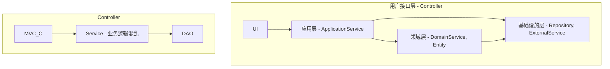

```java
// 应用层：编排业务流程，不写具体业务逻辑
@Service
public class OrderApplicationService {
    @Autowired
    private OrderDomainService orderDomainService;
    @Autowired
    private OrderRepository orderRepository;

    public void createOrder(CreateOrderCommand command) {
        // 应用层只做编排，具体业务逻辑交给领域层
        Order order = orderDomainService.createOrder(
            command.getUserId(),
            command.getProductId(),
            command.getQuantity()
        );
        orderRepository.save(order);
    }
}

// 领域层：核心业务逻辑都在这里
@Component
public class OrderDomainService {
    @Autowired
    private UserRepository userRepository;
    @Autowired
    private ProductRepository productRepository;

    public Order createOrder(Long userId, Long productId, int quantity) {
        User user = userRepository.findById(userId);
        Product product = productRepository.findById(productId);

        // 业务规则检查
        if (!user.hasEnoughBalance(product.getPrice() * quantity)) {
            throw new InsufficientBalanceException("用户余额不足");
        }

        if (!product.hasEnoughStock(quantity)) {
            throw new InsufficientStockException("商品库存不足");
        }

        // 创建订单
        Order order = new Order();
        order.setUserId(userId);
        order.setProductId(productId);
        order.setQuantity(quantity);
        order.setAmount(product.getPrice() * quantity);
        order.setStatus(OrderStatus.CREATED);

        return order;
    }
}

// 基础设施层：数据访问
@Repository
public class OrderRepositoryImpl implements OrderRepository {
    @Autowired
    private OrderMapper orderMapper;

    public void save(Order order) {
        orderMapper.insert(order);
    }
}

```

看区别了吗？DDD把代码分了层，每层职责清楚：

- 应用层：编排业务流程，像个指挥家
- 领域层：核心业务逻辑，业务规则都在这
- 基础设施层：数据库操作、外部接口调用

所有人都按这个分层写，代码风格就统一了。新人来了，看到DomainService就知道业务逻辑在这里。

## DDD和微服务的真实关系

DDD可以用在单体应用里，也可以用在微服务里。

微服务可以用DDD来设计，也可以用传统的MVC来设计。

它们是两个维度的事情：

- DDD解决的是单个系统内部怎么组织代码的问题
- 微服务解决的是多个系统之间怎么部署和通信的问题

### DDD + 微服务的完整架构

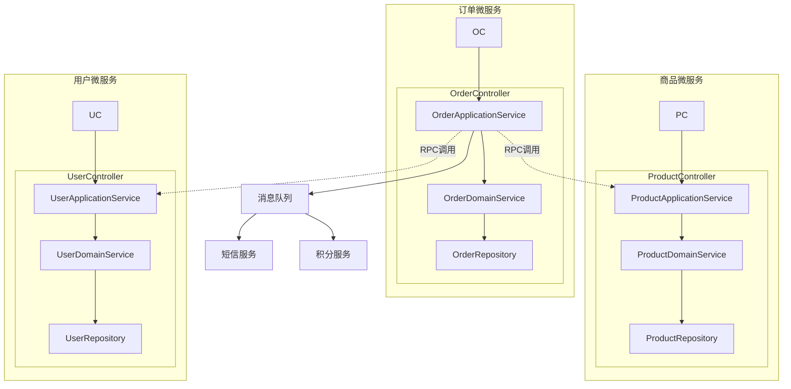

但是，微服务确实更喜欢用DDD设计的系统，为什么？

因为DDD有清晰的边界。比如订单域、商品域、用户域，这些域的边界很清楚，天然适合拆成不同的微服务。

## 微服务之间怎么建立联系

这是面试官问的第二个问题。

主要有几种方式：

### 1. 同步调用

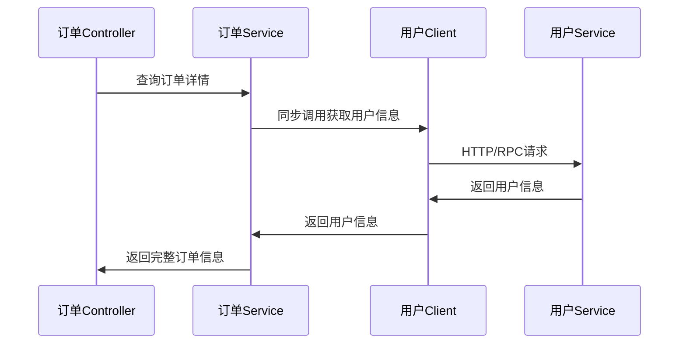

订单服务要查用户信息，直接调用用户服务的接口：

```java
@RestController
public class OrderController {
    @Autowired
    private UserServiceClient userServiceClient;

    public OrderDTO getOrder(Long orderId) {
        Order order = orderRepository.findById(orderId);
        UserDTO user = userServiceClient.getUser(order.getUserId()); // 同步调用
        return buildOrderDTO(order, user);
    }
}

```

### 2. 异步消息

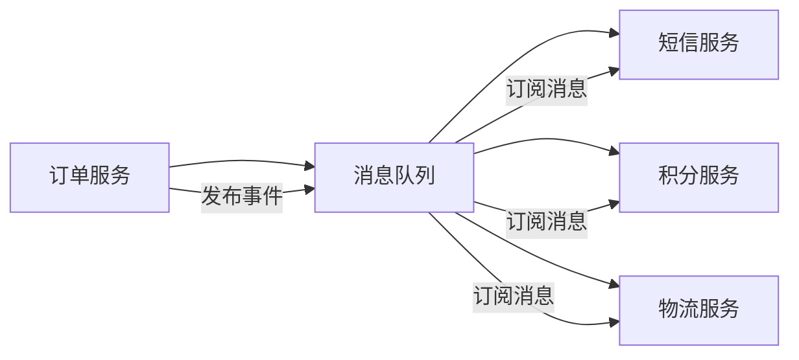

用户下单成功后，要发短信、推送消息、更新积分。这些操作不需要实时，可以异步处理：

```java
// 订单服务发消息
public void createOrder(CreateOrderCommand command) {
    Order order = new Order(...);
    orderRepository.save(order);

    // 发送消息
    messageProducer.send("order.created", new OrderCreatedEvent(order.getId()));
}

// 短信服务订阅消息
@RabbitListener(queues = "order.created")
public void handleOrderCreated(OrderCreatedEvent event) {
    Order order = orderService.getOrder(event.getOrderId());
    smsService.sendOrderConfirmSms(order);
}

```

### 3. 事件驱动架构

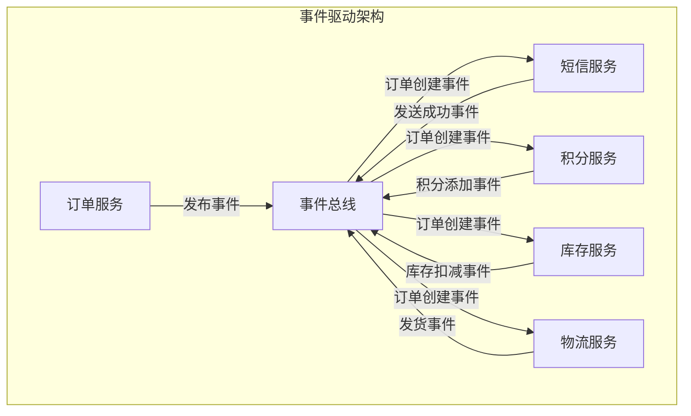

基于领域事件来解耦：

```java
// 订单服务
public class Order {
    public void confirm() {
        this.status = OrderStatus.CONFIRMED;
        // 发布领域事件
        DomainEvents.publish(new OrderConfirmedEvent(this.id, this.userId, this.amount));
    }
}

// 积分服务监听事件
@EventHandler
public void handle(OrderConfirmedEvent event) {
    pointsService.addPoints(event.getUserId(), event.getAmount() * 0.01);
}

// 库存服务监听事件
@EventHandler
public void handle(OrderConfirmedEvent event) {
    inventoryService.reduceStock(event.getProductId(), event.getQuantity());
}

```

### 4. API网关模式

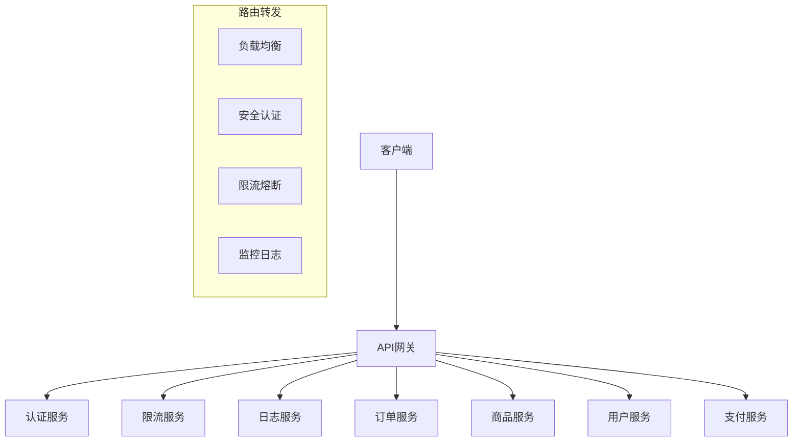

## 实际工作中的选择

如果你是新人，建议：

1. 先学会在单体应用里用DDD，理解领域建模、分层架构
2. 再学微服务技术，理解RPC、消息队列、分布式事务
3. 最后考虑怎么把DDD和微服务结合

不要一上来就想着微服务+DDD，容易把自己绕晕。

### 技术演进路径

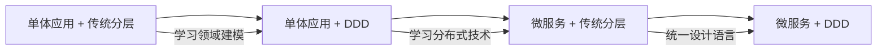

## 关于offer选择

美的金融vs华为通用软件开发，我推荐美的金融。

为什么？

1. 业务复杂度高：金融业务涉及风控、征信、清算，技术挑战大
2. 技术栈新：金融科技公司技术更新快，能学到新东西
3. 成长空间大：金融科技是朝阳行业，机会多

华为虽然名气大，但是通用软件开发可能就是做做CRUD，技术含量不高。当然，如果你看中华为的平台和品牌，那另当别论。

## 总结

DDD和微服务经常被放在一起讨论，但它们解决的是不同的问题：

- DDD让代码更好维护
- 微服务让系统更好扩展

理解了这个本质区别，就不会被面试官的问题难住了。

DDD是为了统一团队的代码写法，微服务是为了系统能独立部署扩展。
