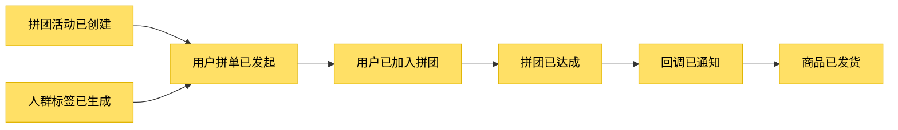
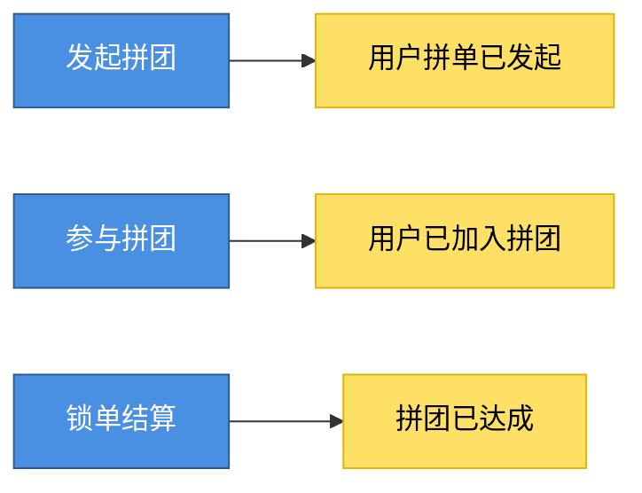
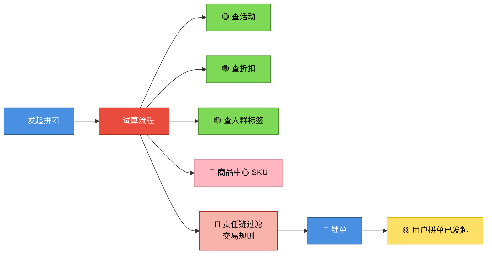
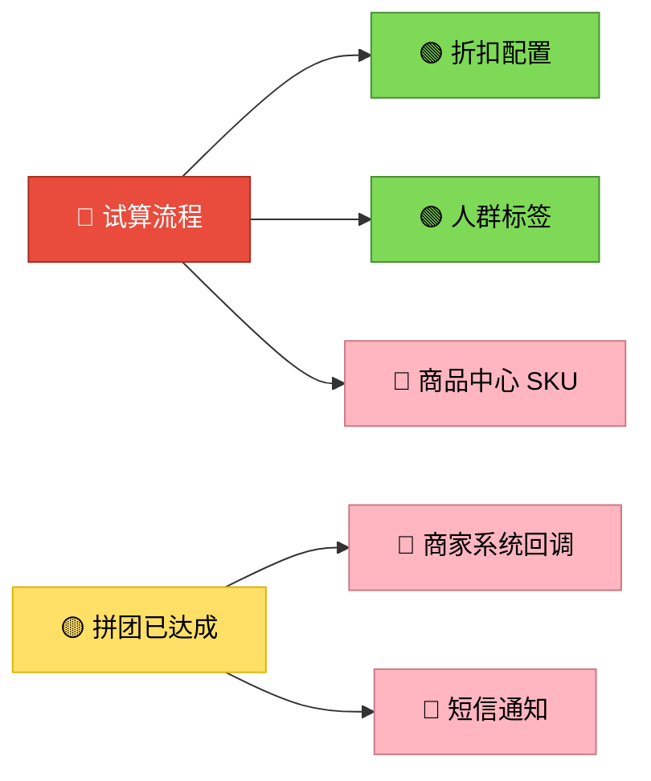

> 本文是《拼团交易平台系统》第 1-3 节「研发系统设计」的扩展笔记，结合本项目 `group-buy-market` 的工程结构，把四色建模这个概念落到代码上。

## Table of contents

---

## 一、先把术语说清楚

国内 DDD 课程里的「四色建模」，**并不是** Peter Coad 1999 年在《Java Modeling in Color with UML》里提出的"四原型建模"（Party-Place-Thing / Role / Description / Moment-Interval）。它实际上是 Alberto Brandolini「事件风暴 (Event Storming)」的简化版本，国内课程沿用了"四色"这个旧名而已。

事件风暴的标准版本有 7+ 种颜色，本文为方便落地，**统一用 6 种颜色**讲解，但仍按惯例称为"四色建模"。读者只要记得：**它的本质是事件风暴**，不要被名字绊住。

---

## 二、它要解决什么问题？

### MVC 时代的痛点

```
需求来了 → 直接写 Controller → Service 一锅端 → DAO
```

下面用拼团场景的真实案例，感受下 MVC 的"窒息时刻"：

#### 痛点 1：业务流程被复制粘贴 N 遍

新人接手一个 `OrderService`，里面三个方法做的事情看起来差不多，但又不完全一样：

```java
public class OrderService {

    public void createGroupBuyOrder(...) {
        // 校验活动 → 校验人群 → 算折扣 → 锁库存 → 写单
    }

    public void joinGroupBuyOrder(...) {
        // 校验活动 → 校验人群（多校了一次时间窗）→ 算折扣 → 锁库存 → 写单
    }

    public void retryGroupBuyOrder(...) {
        // 校验活动 → 校验人群 → 算折扣 → 跳过锁库存（依赖前一次锁的）→ 写单
    }
}
```

业务方说"折扣规则要从直减改为满减"，研发要在 3 个方法里都改一遍，**漏掉一个就是线上 bug**。
更糟的是：这些方法看起来像但又不全像，新人不敢直接抽公共方法 —— 万一漏掉了 `joinGroupBuyOrder` 才有的时间窗校验呢？真实场景里这种"几乎一样"的代码可能散布在 5-8 个 Service 中，没人敢动。

#### 痛点 2：一个 Service 长到 2000 行

`MarketService` 同时干了：

- 查活动、查折扣、查人群（应该是 activity 域）
- 创建拼单、参与拼单、计算成团（应该是 trade 域）
- 调用商城回调、发短信、推 MQ（应该是基础设施 / 外部系统）
- 跑批生成人群标签（应该是 tag 域）

**问题**：

- `Ctrl + F` 找 "lock" 出来 12 个方法，分别属于 4 个不同业务，新人完全无从下手
- 改一个折扣计算的 bug，不小心动了人群跑批的代码，触发线上故障
- `@Transactional` 直接挂在 Service 类上，任何方法报错都回滚整个数据库操作，连 MQ 发送都被拖累

#### 痛点 3：业务规则散落，没人能说清完整流程

产品问："用户参与拼团一共要校验哪些规则？"

研发只能打开 IDE 翻代码：

```
MarketController.join()
  → MarketService.joinGroupBuy()
    → ActivityChecker.check()         // 这里有 3 条规则
    → CrowdTagsChecker.check()        // 这里有 1 条
    → DiscountCalculator.calc()       // 这里偷偷又校了一次时间
    → OrderRepository.lock()          // 这里抛了一个隐式异常做兜底
    → NotifyHelper.send()             // 这里居然还判了一次成团人数
```

**6 个文件、5 层调用、还有隐藏在 Helper 里的业务规则**。一个新需求"VIP 用户免拼"提上来，根本没人敢说"改 X 处就够了"。

#### 痛点 4：同一个名词，每个人理解都不一样

拼团项目里随手抓三个高频词，看看不同角色怎么"翻译"：

| 词       | 产品的理解                    | 研发的理解                 | 测试的理解                    | 运营的理解             |
| -------- | ----------------------------- | -------------------------- | ----------------------------- | ---------------------- |
| **订单** | 用户在 App 看到的「我的拼单」 | `group_buy_order` 一行记录 | 支付单 + 拼单 + 退单全链路    | 后台流水里的成交记录   |
| **成团** | 凑齐人数那一刻                | `status=2` 的状态变更      | 触发回调成功才算成团          | 当天能结算分账的拼团数 |
| **通知** | App push 消息                 | 写一条 MQ                  | 商城回调 + 短信 + push 三件套 | 运营后台的红点提醒     |

**这种偏差在评审时几乎暴露不出来**，因为每个人嘴里说的都是同一个词。等代码写完才发现问题：

> 例：PRD 写「**成团后通知用户**」。
> 研发实现：`status=2` 后发 MQ。
> 测试：MQ 发了，但商城那边没收到回调，算不算"通知"？
> 产品：用户的 App 没弹出消息，怎么能叫"通知用户"？
>
> 三个人都觉得自己没错，因为**评审时没人定义过"通知"到底覆盖到哪一步**。

四色建模在这一步做的事，就是把"成团"明确为一个**黄色领域事件**（`拼团已达成`），把"通知用户"拆成蓝色命令（`触发回调`）→ 黄色事件（`回调已通知`）→ 粉色外部系统（`商城 / 短信 / push`），让讨论的颗粒度统一到事件 + 命令上，**不再用模糊的中文名词**。

#### 痛点 5：Controller 也开始膨胀

为了"快速对接前端"，Controller 里逐渐塞进了业务逻辑：

```java
@PostMapping("/lockOrder")
public Response lockOrder(@RequestBody Request req) {
    // 参数校验 ✅ 合理
    // 查活动 ❌ 应该在 domain
    // 算折扣 ❌ 应该在 domain
    // 调 RPC ❌ 应该在 infrastructure
    // 拼装返回值 ✅ 合理
}
```

结果：**业务逻辑跟 HTTP 协议绑死**，想换成 RPC 接口或 MQ 消费触发？整段代码重写。

### 痛点 → 四色建模的回应

把上面 5 个痛点对应到四色建模的"颜色"，是这样一张映射表（具体颜色定义在下一章）：

| MVC 痛点           | 四色建模的回应                     |
| ------------------ | ---------------------------------- |
| 业务流程被复制粘贴 | 红色策略复用 + 蓝色命令显式化      |
| Service 类爆炸     | 棕色聚合 + 领域划分                |
| 业务规则散落       | 黄色事件链顺藤摸瓜可追溯           |
| 同一名词不同理解   | 蓝 / 黄 / 粉强制精确表达           |
| Controller 膨胀    | 蓝色命令独立于 HTTP / RPC / MQ协议 |

> 让产品、研发、测试、运营在**同一套图形语言**下，把业务讲明白，再划分领域边界。

四色建模（事件风暴）是 DDD 落地的第一步，它**先于库表设计、先于代码**，让所有人对齐对业务的认知。

---

## 三、六种颜色完整定义

| 颜色        | 名称                       | 时态   | 谁来产生       | 拼团场景例子                 |
| ----------- | -------------------------- | ------ | -------------- | ---------------------------- |
| 🔵 **蓝色** | 决策命令 (Command)         | 现在时 | 用户/角色发起  | 发起拼团、参与拼团、查询活动 |
| 🟡 **黄色** | 领域事件 (Domain Event)    | 过去时 | 命令执行的结果 | 拼团已完成、回调已通知       |
| 🌸 **粉色** | 外部系统 (External System) | -      | 集成方         | 微信支付、商品中心、短信网关 |
| 🔴 **红色** | 业务策略 (Policy)          | -      | 复杂规则       | 折扣计算策略、人群过滤规则   |
| 🟢 **绿色** | 只读模型 (Read Model)      | -      | 查询接口       | 查活动详情、查用户拼单列表   |
| 🟤 **棕色** | 聚合 (Aggregate)           | -      | 名词聚合       | 拼团活动、用户拼单、折扣     |

> 📖 **与标准事件风暴的色差**：Brandolini 标准事件风暴里，**紫色 (lilac) 才是 Policy**，红色用作 Hot Spot（待讨论的痛点 / 分歧）。本文沿用国内课程惯例，把红色当作 Policy 使用，不引入紫色和 Hot Spot。读经典书时记得对照换色。

**记忆口诀**：

> 蓝命令、黄事件，红策略居中转，
> 棕聚合载数据，粉外部、绿只读，划清边界两端。

---

## 四、四色建模 4 步法（实战拼团）

### Step 1：发现领域事件（黄色，结果驱动）

**问自己：业务终态有哪些？什么"完成了"、"发生了"？**

✅ 拼团场景的领域事件：

- 拼团活动**已创建**
- 人群标签**已生成**
- 用户拼单**已发起**
- 用户**已加入**拼团
- 拼团**已达成**（成团）
- 回调**已通知**对接平台
- 商品**已发货**
- 拼团**已退款**

> 💡 黄色事件的典型句式：「**X 已 Y**」、「**X 完成**」、「**X 发生**」（**过去时表达终态**）



> ⚠️ 严格的事件风暴范式里，事件之间不直接相连 —— 两个事件之间需要一个蓝色命令做串联。上图是**教学简化**，先让读者看清事件链；从 Step 2 起会把命令补回去。

---

### Step 2：找决策命令（蓝色，谁触发的）

**每个黄色事件的左边，必有一个蓝色命令**

| 决策命令（🔵） | 领域事件（🟡） |
| -------------- | -------------- |
| 配置活动       | 拼团活动已创建 |
| 跑批人群       | 人群标签已生成 |
| 发起拼团       | 用户拼单已发起 |
| 参与拼团       | 用户已加入拼团 |
| 锁单结算       | 拼团已达成     |
| 触发回调       | 回调已通知     |

> 💡 蓝色命令的典型句式：「**动词 + 名词**」，主动语气



---

### Step 3：识别业务策略（红色，复杂规则）

**当蓝→黄不是直来直去，中间需要规则编排时，加一个红色业务策略**

例：发起拼团 → 拼单已发起，**中间不是一步到位的，要做这几件事**：

1. 查活动、查折扣、查人群标签（🟢 绿色只读）
2. 调商品中心拿 SKU（🌸 粉色外部系统）
3. 责任链过滤交易规则 / 校验门槛（🔴 红色策略的子组件）
4. 全部通过后才能 🔵 锁单 → 触发 🟡 拼单已发起

这一段编排就是「试算流程」，它本身是红色策略，内部又调度了绿色、粉色和子策略。落到代码里，对应 `domain/trade/service/logic/MarketTradeRuleFilter` 这一类责任链。



> 💡 红色 = 设计模式发挥的地方：**责任链 / 策略模式 / 模板方法 / 组合模式**。本项目中的「试算流程」「结算责任链」就是典型的红色策略。
>
> 注：「责任链过滤交易规则」用浅红表示**红色策略的子组件**，与主策略「试算流程」做层级区分；它仍归属红色策略，不是粉色外部系统。

---

### Step 4：补齐外部系统（粉色）和只读模型（绿色）



---

## 五、领域划分（结合本项目）

把所有蓝 / 黄 / 棕色的元素按**业务相关性**圈起来，就是**领域 (Domain)**。


**对应代码模块（本 repo 实际目录）：**

```
group-buy-market-domain/
├── activity/    # 活动域
├── trade/       # 交易域（核心）
└── tag/         # 标签域
```

---

## 六、四色建模完整事件流（拼团端到端）


---

## 七、四色建模 → 代码落地映射表

| 四色元素    | DDD 落地位置                              | 拼团项目实例                                         |
| ----------- | ----------------------------------------- | ---------------------------------------------------- |
| 🔵 蓝色命令 | `domain/xxx/service/IXxxService` 方法     | `lockMarketPayOrder()`、`settlementMarketPayOrder()` |
| 🟡 黄色事件 | 方法返回值 / MQ 消息 / 状态码             | 发 MQ topic `team_success`                           |
| 🌸 粉色外部 | `infrastructure/gateway/` 或 `port/`      | `GroupBuyMarketPort`（对接商城系统）                 |
| 🔴 红色策略 | `domain/xxx/service/logic/` 责任链/策略类 | `MarketTradeRuleFilter`、`SettlementChain`           |
| 🟢 绿色只读 | `xxxQueryService` / Repository 查询方法   | `queryGroupBuyActivity()`                            |
| 🟤 棕色聚合 | `domain/xxx/model/entity/` 聚合根         | `GroupBuyOrderEntity`、`MarketPayOrderEntity`        |

> 📌 上述命名是本系列后续节次会逐步落地的目标，可作为读代码时的索引：看到具体类时，回头对照本表确认它属于哪种"颜色"。

---

## 八、新人常见误区

### 误区 1：把"数据库表"当领域对象

❌ 看到 `group_buy_order` 表，就直接造一个 `GroupBuyOrder` 实体
✅ 应该先问：「这个对象在业务里是谁的命令产物？什么事件让它存在？」

### 误区 2：把所有方法都当蓝色命令

❌ `getById()` 也算决策命令
✅ 纯查询是**绿色只读**，不参与建模主线

### 误区 3：黄色事件用现在时

❌ "发起拼团"
✅ "拼团已发起" / "拼团完成"（**过去时表达终态**）

### 误区 4：领域划分照抄表结构

❌ 一张表一个领域
✅ 按**业务高内聚**划分（trade 域可能涉及多张表，如 `group_buy_order` + `group_buy_order_list` + `notify_task` 都属于交易域）

### 误区 5：错用颜色标签

❌ 把红色当作"待讨论的痛点"（那是事件风暴标准版里的 Hot Spot，不是本文红色）
❌ 把粉色画到内部责任链或策略上
✅ **红色 = 内部业务策略**；**粉色 = 跨进程的外部系统**

---

## 九、小结

四色建模（事件风暴）不是银弹，它做的事其实就两件：

1. **统一图形语言** —— 让产品、研发、测试、运营对着同一张图讨论，避免「通知 / 成团 / 订单」之类的语义偏差；
2. **倒推领域边界** —— 把蓝 / 黄 / 棕按业务相关性聚起来，变成 activity / trade / tag 三个领域，再映射到 Maven 模块。

回到开头的 5 个痛点：复制粘贴靠红色策略复用，Service 爆炸靠领域划分，规则散落靠黄色事件链，名词偏差靠精确化的颜色术语，Controller 膨胀靠把蓝色命令独立于协议层。**没有任何一个颜色能单独搞定一个痛点，但 6 色一起用，就有了讨论与拆分的统一锚点。**

---

## 附录：扩展阅读

**经典书籍**

- Eric Evans, _Domain-Driven Design_（DDD 蓝皮书）
- Vaughn Vernon, _Implementing Domain-Driven Design_（DDD 红皮书）
- Alberto Brandolini, _Introducing EventStorming_（**事件风暴的官方读本，直接对应本文方法论**）

**国内课程参考**

- [DDD 概念理论](https://bugstack.cn/md/road-map/ddd-guide-01.html)
- [DDD 建模方法](https://bugstack.cn/md/road-map/ddd-guide-02.html)
- [DDD 工程模型](https://bugstack.cn/md/road-map/ddd-guide-03.html)
- [DDD 架构设计](https://bugstack.cn/md/road-map/ddd.html)
- [DDD 建模案例](https://bugstack.cn/md/road-map/ddd-model.html)
