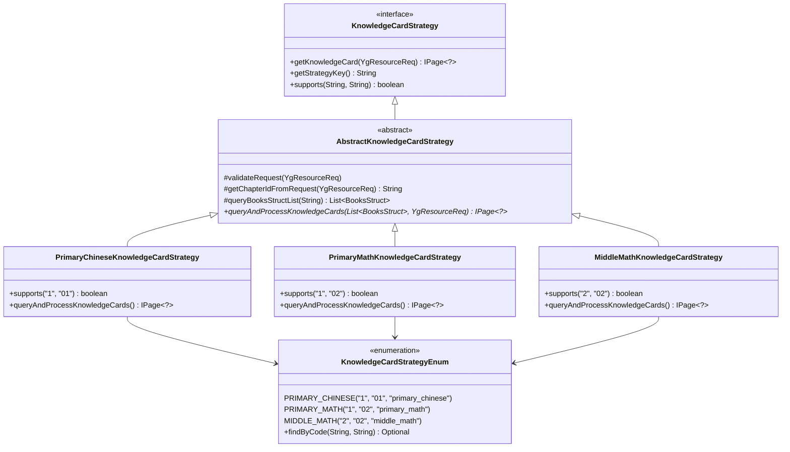

## 背景

最近接手了教育资源平台的知识点卡片查询模块，刚开始看到代码的时候头都大了 - 各种学段学科的查询逻辑都写在一起，一个方法几百行，充斥着各种 if-else 判断。每次要新增一个学科支持，都得小心翼翼地在原有代码里插入逻辑，生怕改坏了其他功能。

决定重构这块，刚开始想的是用策略模式，后来发现单纯的策略模式还不够，最终组合使用了策略模式 + 工厂模式 + 模板方法模式。

## 涉及的设计模式分析

这个实现其实用到了三种设计模式的组合：

### 1. 策略模式（Strategy Pattern）

不同学段学科有不同的查询和处理逻辑，但都实现相同的接口。每个具体策略类负责一种学段学科组合的处理逻辑。

### 2. 模板方法模式（Template Method Pattern）

`AbstractKnowledgeCardStrategy`抽象类定义了查询的骨架流程：参数验证 → 教材定位 → 数据查询 → 结果处理。通用步骤在抽象类中实现，差异化步骤留给子类。

### 3. 工厂模式（Factory Pattern）

`KnowledgeCardService`根据学段学科参数自动选择对应的策略实例，充当了简单工厂的角色。Spring 容器的依赖注入也起到了工厂的作用。

## 业务背景

我们的教育资源平台需要支持多个学段和学科的知识点卡片查询：

- 学段：小学（1）、初中（2）、高中（3）
- 学科：语文（01）、数学（02）、英语（03）等
- 数据来源：MySQL关系型数据库 + MongoDB文档数据库
- 查询流程：参数验证 → 定位教材 → 查询章节树 → 获取结构化数据 → 处理和返回

每个学段学科组合都有其独特的数据处理逻辑，但整体查询流程基本一致，适合用多种设计模式组合来处理。

## 系统架构设计

### 核心组件关系图



### 核心接口定义

```java
public interface KnowledgeCardStrategy {
    /**
     * 查询知识点卡片数据
     */
    IPage<?> getKnowledgeCard(YgResourceReq req);

    /**
     * 获取策略标识
     */
    String getStrategyKey();

    /**
     * 检查是否支持指定的学段学科组合
     */
    boolean supports(String period, String subject);
}

```

## 抽象模板类的设计（模板方法模式）

`AbstractKnowledgeCardStrategy`是整个体系的核心，它体现了模板方法模式的思想：定义算法骨架，将可变部分延迟到子类实现。

### 核心流程设计

```java
public abstract class AbstractKnowledgeCardStrategy implements KnowledgeCardStrategy {

    @Override
    public final IPage<?> getKnowledgeCard(YgResourceReq req) {
        // 1. 参数验证
        validateRequest(req);

        // 2. 获取章节子树信息（通过复杂的多表关联查询）
        String chapterId = getChapterIdFromRequest(req);

        // 3. 子树节点获取 BooksStruct list 通用步骤
        List<BooksStruct> booksStructList = queryBooksStructList(chapterId);

        // 4. 查询并处理知识点卡片数据（完全由子类实现）
        return queryAndProcessKnowledgeCards(booksStructList, req);
    }
}

```

### 通用步骤的实现

#### 1. 教材定位逻辑

```java
protected String getChapterIdFromRequest(YgResourceReq req) {
    // req.chapterId 是母树ID，需要找到它绑定的子树ID

    try {
        // 步骤1：通过请求参数定位具体教材
        BooksSubParam bookParam = buildBooksSubParam(req);
        BooksSub booksSub = booksSubService.getFirstBooksSub(bookParam);

        if (booksSub != null) {
            // 步骤2：查询该教材对应的章节树
            LambdaQueryWrapper<ChapterTreeSub> wrapper = new LambdaQueryWrapper<>();
            wrapper.eq(ChapterTreeSub::getDelFlag, "0")
                    .like(ChapterTreeSub::getAppModId, booksSub.getAppModuleId())
                    .eq(ChapterTreeSub::getGrade, booksSub.getGrade())
                    .eq(ChapterTreeSub::getSubject, booksSub.getSubject())
                    .eq(ChapterTreeSub::getPress, booksSub.getPress())
                    .eq(ChapterTreeSub::getVolume, booksSub.getVolume())
                    .orderByAsc(ChapterTreeSub::getSort);

            List<ChapterTreeSub> chapterTrees = chapterTreeSubService.list(wrapper);

            // 步骤3：通过 bc_res_chapter 表查找母树与子树的绑定关系
            for (ChapterTreeSub chapterTree : chapterTrees) {
                LambdaQueryWrapper<BcResChapter> resChapterWrapper = new LambdaQueryWrapper<>();
                resChapterWrapper.eq(BcResChapter::getResourceType, 3) // 3-子树章节
                                .eq(BcResChapter::getResourceId, chapterTree.getId())
                                .eq(BcResChapter::getChapterId, req.getChapterId());

                if (bcResChapterMapper.selectCount(resChapterWrapper) > 0) {
                    return chapterTree.getId();
                }
            }
        }
    } catch (Exception e) {
        // 异常处理逻辑
    }
    return null;
}

```

#### 2. BooksStruct 查询通用逻辑

```java
protected List<BooksStruct> queryBooksStructList(String chapterId) {
    if (StrUtil.isBlank(chapterId)) {
        return new ArrayList<>();
    }

    // 通过章节ID查询关联的 BooksStruct 列表
    return booksStructService.lambdaQuery()
            .eq(BooksStruct::getChapterParentId, chapterId)
            .eq(BooksStruct::getDelFlag, "0")
            .orderByAsc(BooksStruct::getSort)
            .list();
}

```

## 策略枚举的设计

为了更好地管理学段学科组合及其对应的策略实现，我们设计了一个枚举类来统一管理：

```java
@Getter
@AllArgsConstructor
public enum KnowledgeCardStrategyEnum {
    // 小学学科策略
    PRIMARY_CHINESE("1", "01", "小学语文", "primary_chinese"),
    PRIMARY_MATH("1", "02", "小学数学", "primary_math"),
    PRIMARY_ENGLISH("1", "03", "小学英语", "primary_english"),
    PRIMARY_MORAL("1", "04", "小学道德与法治", "primary_moral"),
    PRIMARY_SCIENCE("1", "10", "小学科学", "primary_science"),

    // 初中学科策略
    MIDDLE_CHINESE("2", "01", "初中语文", "middle_chinese"),
    MIDDLE_MATH("2", "02", "初中数学", "middle_math"),
    MIDDLE_ENGLISH("2", "03", "初中英语", "middle_english"),
    MIDDLE_PHYSICS("2", "06", "初中物理", "middle_physics"),
    MIDDLE_CHEMISTRY("2", "08", "初中化学", "middle_chemistry"),

    // 高中学科策略
    HIGH_CHINESE("3", "01", "高中语文", "high_chinese"),
    HIGH_MATH("3", "02", "高中数学", "high_math"),
    HIGH_PHYSICS("3", "06", "高中物理", "high_physics");

    /**
     * 学段编码 (1=小学, 2=初中, 3=高中)
     */
    private final String periodCode;

    /**
     * 学科编码 (01=语文, 02=数学, 03=英语等)
     */
    private final String subjectCode;

    /**
     * 学段学科描述
     */
    private final String description;

    /**
     * Spring组件名称 (用于@Component注解)
     */
    private final String componentName;

    /**
     * 根据学段和学科编码查找对应的策略
     */
    public static Optional<KnowledgeCardStrategyEnum> findByCode(String periodCode, String subjectCode) {
        return Arrays.stream(values())
                .filter(strategy -> strategy.periodCode.equals(periodCode)
                                 && strategy.subjectCode.equals(subjectCode))
                .findFirst();
    }

    /**
     * 获取策略标识（格式: period_subject）
     */
    public String getStrategyKey() {
        return periodCode + "_" + subjectCode;
    }

    /**
     * 检查是否支持指定的学段学科组合
     */
    public boolean supports(String periodCode, String subjectCode) {
        return this.periodCode.equals(periodCode) && this.subjectCode.equals(subjectCode);
    }
}

```

## 具体策略的实现

### 小学语文策略示例

```java
@Component("primary_chinese")
public class PrimaryChineseKnowledgeCardStrategy extends AbstractKnowledgeCardStrategy {

    private static final KnowledgeCardStrategyEnum STRATEGY_CONFIG =
        KnowledgeCardStrategyEnum.PRIMARY_CHINESE;

    @Override
    public String getStrategyKey() {
        return STRATEGY_CONFIG.getStrategyKey();
    }

    @Override
    public boolean supports(String period, String subject) {
        return STRATEGY_CONFIG.supports(period, subject);
    }

    @Override
    protected IPage<?> queryAndProcessKnowledgeCards(List<BooksStruct> booksStructList,
                                                     YgResourceReq req) {
        // 从 BooksStruct 列表中提取 structId
        List<String> structIds = booksStructList.stream()
                .map(BooksStruct::getId)
                .collect(Collectors.toList());

        if (CollUtil.isEmpty(structIds)) {
            return new Page<>();
        }

        // 基于 structId 查询 MongoDB 中的小学语文结构化数据
        Criteria criteria = new Criteria();
        criteria.where("structId").in(structIds);
        Query query = new Query(criteria);

        List<MongoBooksStructChinesePri> mongoData =
            mongoTemplate.find(query, MongoBooksStructChinesePri.class);

        // 处理和转换数据为小学语文特定的格式
        List<GetStructKnowledgeCardPriChineseVo> result = processChineseData(mongoData);

        IPage<Object> pageResult = new Page<>(1, 10000);
        pageResult.setRecords((List<Object>) (Object) result);
        return pageResult;
    }

    private List<GetStructKnowledgeCardPriChineseVo> processChineseData(
            List<MongoBooksStructChinesePri> mongoData) {
        // 具体的数据处理逻辑...
        return new ArrayList<>();
    }
}

```

### 中学数学策略示例

```java
@Component("middle_math")
public class MiddleMathKnowledgeCardStrategy extends AbstractKnowledgeCardStrategy {

    private static final KnowledgeCardStrategyEnum STRATEGY_CONFIG =
        KnowledgeCardStrategyEnum.MIDDLE_MATH;

    @Override
    public String getStrategyKey() {
        return STRATEGY_CONFIG.getStrategyKey();
    }

    @Override
    public boolean supports(String period, String subject) {
        return STRATEGY_CONFIG.supports(period, subject);
    }

    @Override
    protected String getChapterIdFromRequest(YgResourceReq req) {
        // 中学数学有特殊的章节ID处理逻辑
        return "1";
    }

    @Override
    protected IPage<?> queryAndProcessKnowledgeCards(List<BooksStruct> booksStructList,
                                                     YgResourceReq req) {
        // 中学数学有知识点和题型两种业务类型
        List<Object> result = new ArrayList<>();

        // 从 BooksStruct 中提取 structId
        List<String> structIds = booksStructList.stream()
                .map(BooksStruct::getId)
                .collect(Collectors.toList());

        if (CollUtil.isNotEmpty(structIds)) {
            // 处理知识点类型（businessType = "1"）
            result.addAll(processKnowledgeType(structIds));

            // 处理题型/考点类型（businessType = "4"）
            result.addAll(processMethodType(structIds));
        }

        // 返回组合结果
        IPage<Object> pageResult = new Page<>(1, 10000);
        pageResult.setRecords(result);
        return pageResult;
    }

    private List<GetStructKnowledgeCardMidMathKnowVo> processKnowledgeType(List<String> structIds) {
        // 查询 MongoBooksStructMathMid 中的知识点数据
        Criteria criteria = new Criteria();
        criteria.where("structId").in(structIds)
                .and("knowledge").exists(true);
        Query query = new Query(criteria);

        List<MongoBooksStructMathMid> mongoData =
            mongoTemplate.find(query, MongoBooksStructMathMid.class);

        // 转换为 GetStructKnowledgeCardMidMathKnowVo 格式
        return mongoData.stream()
                .flatMap(data -> data.getKnowledge().stream())
                .map(this::convertToKnowledgeVo)
                .collect(Collectors.toList());
    }

    private List<GetStructKnowledgeCardMidMathMethodVo> processMethodType(List<String> structIds) {
        // 查询 MongoBooksStructMathMid 中的方法数据
        Criteria criteria = new Criteria();
        criteria.where("structId").in(structIds)
                .and("method").exists(true);
        Query query = new Query(criteria);

        List<MongoBooksStructMathMid> mongoData =
            mongoTemplate.find(query, MongoBooksStructMathMid.class);

        // 转换为 GetStructKnowledgeCardMidMathMethodVo 格式
        return mongoData.stream()
                .flatMap(data -> data.getMethod().stream())
                .map(this::convertToMethodVo)
                .collect(Collectors.toList());
    }
}

```

## 工厂模式的体现

### Spring Bean 管理（工厂模式）

这里用到了工厂模式的思想。`KnowledgeCardService`相当于一个简单工厂，根据输入参数选择合适的策略：

```java
@Service
public class KnowledgeCardService {

    private final Map<String, KnowledgeCardStrategy> strategies;

    // Spring 自动注入所有策略实现（IoC容器充当工厂角色）
    public KnowledgeCardService(List<KnowledgeCardStrategy> strategyList) {
        this.strategies = strategyList.stream()
                .collect(Collectors.toMap(
                    KnowledgeCardStrategy::getStrategyKey,
                    Function.identity()
                ));
    }

    // 简单工厂方法：根据参数选择策略
    public IPage<?> getKnowledgeCard(YgResourceReq req) {
        String strategyKey = req.getPeriod() + "_" + req.getSubject();
        KnowledgeCardStrategy strategy = strategies.get(strategyKey);

        if (strategy == null) {
            throw new BusinessException("不支持的学段学科组合: " + strategyKey);
        }

        return strategy.getKnowledgeCard(req);
    }

    /**
     * 获取所有支持的学段学科组合
     */
    public List<String> getSupportedCombinations() {
        return new ArrayList<>(strategies.keySet());
    }
}

```

### 控制器层调用

```java
@RestController
@RequestMapping("/api/knowledge-card")
@Api(tags = "知识点卡片查询接口")
public class KnowledgeCardController {

    @Autowired
    private KnowledgeCardService knowledgeCardService;

    @PostMapping("/query")
    @ApiOperation("查询知识点卡片")
    public Result<IPage<?>> queryKnowledgeCard(@RequestBody @Valid YgResourceReq req) {
        try {
            IPage<?> result = knowledgeCardService.getKnowledgeCard(req);
            return Result.success(result);
        } catch (BusinessException e) {
            return Result.error(e.getMessage());
        }
    }

    @GetMapping("/supported-combinations")
    @ApiOperation("获取支持的学段学科组合")
    public Result<List<String>> getSupportedCombinations() {
        List<String> combinations = knowledgeCardService.getSupportedCombinations();
        return Result.success(combinations);
    }
}

```

## 三种模式的协作关系

这三种设计模式在系统中是这样协作的：

1. 工厂模式：`KnowledgeCardService`根据请求参数（学段+学科）选择对应的策略实例
2. 策略模式：每个学段学科组合都有独立的策略实现，满足相同接口
3. 模板方法模式：`AbstractKnowledgeCardStrategy`定义通用流程，子类实现差异化逻辑

```text
Client Request
    ↓
KnowledgeCardService (Factory)  ←── 选择策略
    ↓
ConcreteStrategy (Strategy)     ←── 执行策略
    ↓
AbstractStrategy (Template)     ←── 模板流程

```

## 设计优势

### 1. 扩展容易了很多

之前新增一个学科支持，得在好几个地方改代码，还容易漏掉。现在就简单多了：

第一步：枚举里加个配置

```text
// 比如要加高中物理
HIGH_PHYSICS("3", "06", "高中物理", "high_physics"),

```

第二步：写个实现类

```java
@Component("high_physics")
public class HighPhysicsKnowledgeCardStrategy extends AbstractKnowledgeCardStrategy {

    private static final KnowledgeCardStrategyEnum STRATEGY_CONFIG =
        KnowledgeCardStrategyEnum.HIGH_PHYSICS;

    @Override
    protected IPage<?> queryAndProcessKnowledgeCards(List<BooksStruct> booksStructList,
                                                     YgResourceReq req) {
        // 高中物理的具体逻辑
        return processPhysicsData(booksStructList, req);
    }
}

```

就这两步，其他代码完全不用动。Spring 会自动扫描到新策略并注册，工厂会自动识别，模板流程也不用改。

### 2. 三种模式各司其职

- 模板方法模式：通用逻辑在抽象类里写一遍，大家都能用（参数验证、教材定位、基础数据获取）
- 策略模式：每个学科只关心自己的差异化逻辑，互不干扰
- 工厂模式：根据参数自动选择策略，调用方不用关心具体用哪个实现

这样分工明确，出问题知道去哪找，改需求也知道动哪个文件。

### 3. 测试和维护轻松了

每个策略都是独立的，单元测试好写多了：

```text
@ExtendWith(SpringExtension.class)
@MockitoExtension
class PrimaryChineseKnowledgeCardStrategyTest {

    @InjectMocks
    private PrimaryChineseKnowledgeCardStrategy strategy;

    @Mock
    private MongoTemplate mongoTemplate;

    @Test
    void should_support_primary_chinese() {
        // 测试策略支持逻辑
        assertTrue(strategy.supports("1", "01"));
        assertFalse(strategy.supports("2", "01"));
        assertFalse(strategy.supports("1", "02"));
    }

    @Test
    void should_return_correct_strategy_key() {
        // 测试策略键生成
        assertEquals("1_01", strategy.getStrategyKey());
    }

    @Test
    void should_process_knowledge_cards_correctly() {
        // 准备测试数据
        List<BooksStruct> booksStructList = Arrays.asList(
            createMockBooksStruct("struct1"),
            createMockBooksStruct("struct2")
        );
        YgResourceReq req = createMockRequest();

        // 模拟MongoDB查询结果
        when(mongoTemplate.find(any(Query.class), eq(MongoBooksStructChinesePri.class)))
                .thenReturn(createMockMongoData());

        // 执行测试
        IPage<?> result = strategy.queryAndProcessKnowledgeCards(booksStructList, req);

        // 验证结果
        assertNotNull(result);
        assertFalse(result.getRecords().isEmpty());
        verify(mongoTemplate).find(any(Query.class), eq(MongoBooksStructChinesePri.class));
    }

    @Test
    void should_handle_empty_books_struct_list() {
        // 测试空列表处理
        YgResourceReq req = createMockRequest();
        IPage<?> result = strategy.queryAndProcessKnowledgeCards(new ArrayList<>(), req);

        assertNotNull(result);
        assertTrue(result.getRecords().isEmpty());
    }
}

```

## 性能优化考虑

### 1. 策略缓存优化

```java
@Component
public class KnowledgeCardStrategyCache {

    private final Map<String, KnowledgeCardStrategy> strategyCache = new ConcurrentHashMap<>();
    private final ApplicationContext applicationContext;

    public KnowledgeCardStrategyCache(ApplicationContext applicationContext) {
        this.applicationContext = applicationContext;
    }

    @PostConstruct
    public void initCache() {
        // 应用启动时预热缓存
        Arrays.stream(KnowledgeCardStrategyEnum.values())
              .parallel()
              .forEach(config -> {
                  try {
                      KnowledgeCardStrategy strategy =
                          applicationContext.getBean(config.getComponentName(), KnowledgeCardStrategy.class);
                      strategyCache.put(config.getStrategyKey(), strategy);
                  } catch (Exception e) {
                      log.warn("Failed to load strategy: {}", config.getComponentName(), e);
                  }
              });

        log.info("Loaded {} knowledge card strategies", strategyCache.size());
    }

    public KnowledgeCardStrategy getStrategy(String strategyKey) {
        return strategyCache.get(strategyKey);
    }
}

```

### 2. 数据库查询优化

```java
// 批量查询 BooksStruct，减少数据库交互
protected List<BooksStruct> queryBooksStructList(List<String> chapterIds) {
    if (CollUtil.isEmpty(chapterIds)) {
        return new ArrayList<>();
    }

    // 使用IN查询替代多次单独查询
    return booksStructService.lambdaQuery()
            .in(BooksStruct::getChapterParentId, chapterIds)
            .eq(BooksStruct::getDelFlag, "0")
            .orderByAsc(BooksStruct::getSort)
            .list();
}

// MongoDB查询优化
protected List<MongoBooksStructMath> queryMongoData(List<String> structIds,
                                                   List<String> businessIds) {
    // 构建复合索引查询
    Criteria criteria = new Criteria();
    criteria.andOperator(
        Criteria.where("structId").in(structIds),
        Criteria.where("example._id").in(businessIds)
    );

    Query query = new Query(criteria);
    // 只查询需要的字段，减少网络传输
    query.fields()
         .include("structId")
         .include("example")
         .exclude("_id");

    return mongoTemplate.find(query, MongoBooksStructMath.class);
}

```

### 3. 结果缓存策略

```java
@Service
public class CachedKnowledgeCardService {

    private final KnowledgeCardService knowledgeCardService;
    private final RedisTemplate<String, Object> redisTemplate;

    @Cacheable(value = "knowledge-card", key = "#req.hashCode()", unless = "#result.records.isEmpty()")
    public IPage<?> getKnowledgeCard(YgResourceReq req) {
        return knowledgeCardService.getKnowledgeCard(req);
    }

    @CacheEvict(value = "knowledge-card", allEntries = true)
    public void clearCache() {
        // 清除所有缓存
    }
}

```

## 监控和日志

### 1. 策略执行监控

```java
@Aspect
@Component
public class KnowledgeCardStrategyMonitor {

    private final MeterRegistry meterRegistry;

    @Around("execution(* com.bcbook.modules.yg.strategy.impl.*.*(..))")
    public Object monitorStrategyExecution(ProceedingJoinPoint joinPoint) throws Throwable {
        String strategyName = joinPoint.getTarget().getClass().getSimpleName();
        String methodName = joinPoint.getSignature().getName();

        Timer.Sample sample = Timer.start(meterRegistry);
        try {
            Object result = joinPoint.proceed();

            // 记录成功执行
            meterRegistry.counter("knowledge.card.strategy.success",
                               "strategy", strategyName,
                               "method", methodName)
                        .increment();

            return result;
        } catch (Exception e) {
            // 记录失败执行
            meterRegistry.counter("knowledge.card.strategy.error",
                               "strategy", strategyName,
                               "method", methodName,
                               "error", e.getClass().getSimpleName())
                        .increment();
            throw e;
        } finally {
            // 记录执行时间
            sample.stop(Timer.builder("knowledge.card.strategy.duration")
                           .tag("strategy", strategyName)
                           .tag("method", methodName)
                           .register(meterRegistry));
        }
    }
}

```

### 2. 结构化日志

```java
@Component
public class KnowledgeCardStrategyLogger {

    private static final Logger log = LoggerFactory.getLogger(KnowledgeCardStrategyLogger.class);

    public void logStrategyExecution(String strategyKey, YgResourceReq req,
                                   long executionTime, int resultCount) {
        log.info("Strategy execution completed. " +
                "strategy={}, period={}, subject={}, chapterId={}, " +
                "executionTime={}ms, resultCount={}",
                strategyKey, req.getPeriod(), req.getSubject(),
                req.getChapterId(), executionTime, resultCount);
    }

    public void logStrategyError(String strategyKey, YgResourceReq req, Exception e) {
        log.error("Strategy execution failed. " +
                 "strategy={}, period={}, subject={}, chapterId={}, error={}",
                 strategyKey, req.getPeriod(), req.getSubject(),
                 req.getChapterId(), e.getMessage(), e);
    }
}

```

## 未来扩展方向

### 1. 动态策略加载

```java
@Service
public class DynamicStrategyLoader {

    public void loadStrategy(String jarPath, String strategyClassName) {
        // 动态加载外部JAR包中的策略实现
        URLClassLoader classLoader = new URLClassLoader(new URL[]{new File(jarPath).toURI().toURL()});
        Class<?> strategyClass = classLoader.loadClass(strategyClassName);

        // 注册到Spring容器
        registerStrategy(strategyClass);
    }

    private void registerStrategy(Class<?> strategyClass) {
        // 动态注册Bean到Spring容器
        DefaultListableBeanFactory beanFactory =
            (DefaultListableBeanFactory) applicationContext.getAutowireCapableBeanFactory();

        beanFactory.registerBeanDefinition(
            strategyClass.getSimpleName(),
            BeanDefinitionBuilder.rootBeanDefinition(strategyClass).getBeanDefinition()
        );
    }
}

```

### 2. 策略组合模式

```java
@Component("combined_strategy")
public class CombinedKnowledgeCardStrategy extends AbstractKnowledgeCardStrategy {

    private final List<KnowledgeCardStrategy> subStrategies;

    @Override
    protected IPage<?> queryAndProcessKnowledgeCards(List<BooksStruct> booksStructList,
                                                     YgResourceReq req) {
        // 并行执行多个子策略
        List<CompletableFuture<IPage<?>>> futures = subStrategies.stream()
                .map(strategy -> CompletableFuture.supplyAsync(
                    () -> strategy.queryAndProcessKnowledgeCards(booksStructList, req)))
                .collect(Collectors.toList());

        // 合并所有子策略的结果
        return mergeResults(futures);
    }
}

```

## 总结

整个重构下来，感觉还是很值得的。不是单纯的策略模式，而是策略 + 工厂 + 模板方法三种模式的组合应用，确实适合我们这种"流程相同，细节不同"的场景。

### 主要收获

1. 架构更清晰了：三种设计模式各司其职，工厂选策略、模板定流程、策略做实现
2. 扩展性好了很多：新增学科支持真的快，基本半天就能搞定
3. 维护成本降低：出问题知道去哪个文件找，改需求也不用担心影响其他学科
4. 团队协作顺畅：不同人可以同时开发不同学科的策略，不会冲突

### 适合用的场景

这种多模式组合比较适合：

- 业务规则经常变化：不同场景有不同处理方式，但流程类似
- 需要经常扩展：比如支付方式、促销规则这种
- if-else 分支太多：代码看起来很乱的时候
- 团队协作开发：不同人负责不同策略

当然也不是万能的，如果业务逻辑本身就很简单，用这么多设计模式反而会过度设计。
