设计模式与软件设计原则：构建可维护的 SpringBoot 电商系统-教学篇

## 目录

1. 最佳实践总结
2. 综合单元测试
3. 设计原则应用分析
4. 核心设计模式实战
5. 设计模式分类与原则概述

---

### 1. 设计模式分类与原则概述

#### 1.1 设计模式完整分类

设计模式根据用途可分为三大类：

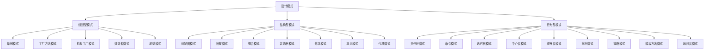

##### 创建型模式

- 原型模式 (Prototype) - 通过复制现有实例创建新对象
- 建造者模式 (Builder) - 分离复杂对象的构建和表示
- 抽象工厂模式 (Abstract Factory) - 提供创建相关对象家族的接口
- 工厂方法模式 (Factory Method) - 定义创建对象的接口，但让子类决定实例化的类
- 单例模式 (Singleton) - 确保一个类只有一个实例，并提供全局访问点

##### 结构型模式

- 代理模式 (Proxy) - 为其他对象提供一个替身或占位符
- 享元模式 (Flyweight) - 通过共享减少大量细粒度对象的开销
- 外观模式 (Facade) - 为子系统提供统一接口
- 装饰器模式 (Decorator) - 动态添加职责到对象
- 组合模式 (Composite) - 将对象组合成树形结构表示部分-整体层次
- 桥接模式 (Bridge) - 将抽象与实现分离，两者可独立变化
- 适配器模式 (Adapter) - 使不兼容接口能一起工作

##### 行为型模式

- 访问者模式 (Visitor) - 在不改变类结构的情况下定义新操作
- 模板方法模式 (Template Method) - 定义算法骨架，具体步骤延迟到子类
- 策略模式 (Strategy) - 定义一系列算法，使它们可互换
- 状态模式 (State) - 对象在内部状态变化时改变其行为
- 观察者模式 (Observer) - 定义对象间一对多依赖，状态变化时自动通知
- 中介者模式 (Mediator) - 减少对象间直接引用，优化通信
- 迭代器模式 (Iterator) - 提供顺序访问集合元素的方法，无需暴露内部表示
- 命令模式 (Command) - 将请求封装为对象，支持撤销等操作
- 责任链模式 (Chain of Responsibility) - A让多个对象处理请求，避免请求发送者和接收者耦合

#### 1.2 设计原则完整列表

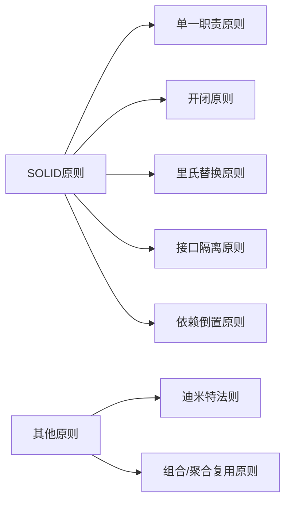

- 组合/聚合复用原则 (CARP) - 优先使用组合而非继承
- 迪米特法则 (LoD) - 一个对象应当对其他对象有尽可能少的了解
- 依赖倒置原则 (DIP) - 依赖抽象而不是具体实现
- 接口隔离原则 (ISP) - 多个特定接口优于一个宽泛接口
- 里氏替换原则 (LSP) - 子类应当可以替换其父类使用
- 开闭原则 (OCP) - 对扩展开放，对修改关闭
- 单一职责原则 (SRP) - 一个类应该只有一个引起它变化的原因

---

### 2. 核心设计模式实战

#### 2.1 策略模式：基于Spring的折扣计算

策略模式定义了一系列算法，并将每个算法封装起来，使它们可以互换。下面是在电商系统中实现不同折扣策略的例子：

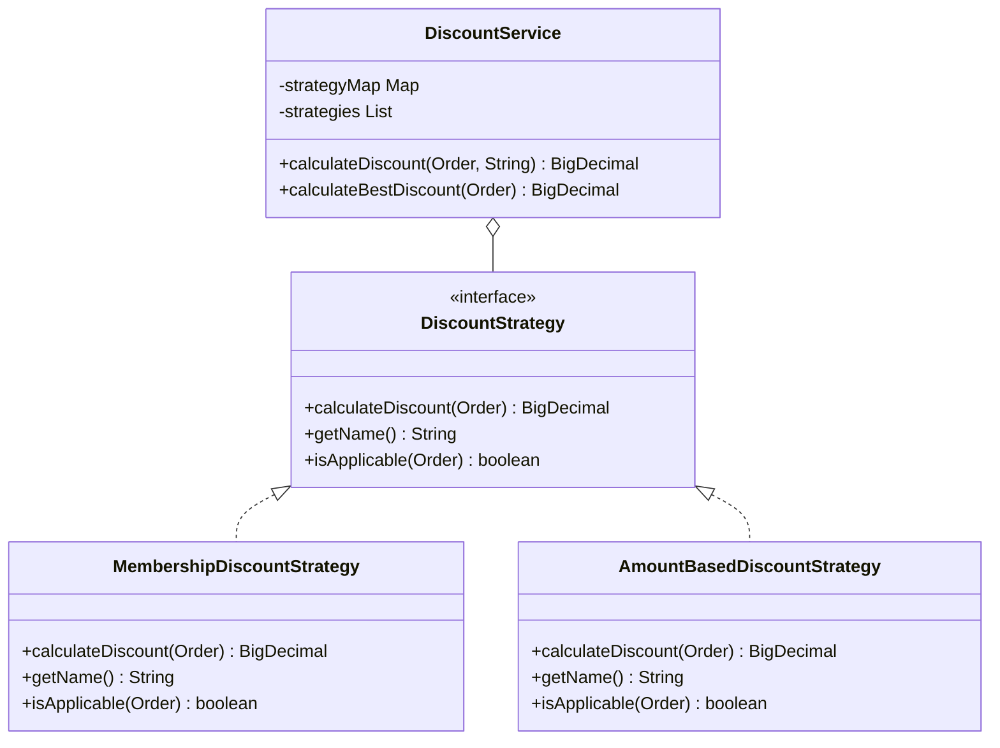

##### 核心代码

```java
// 折扣策略接口
public interface DiscountStrategy {
    /**
     * 计算订单折扣金额
     */
    BigDecimal calculateDiscount(Order order);
    /**
     * 策略名称，用于识别
     */
    String getName();
    /**
     * 判断策略是否适用于给定订单
     */
    boolean isApplicable(Order order);
}

// 会员折扣策略
@Component
public class MembershipDiscountStrategy implements DiscountStrategy {
    @Override
    public BigDecimal calculateDiscount(Order order) {
        // 根据会员等级计算折扣
        switch (order.getCustomer().getMemberLevel()) {
            case PLATINUM:
                return order.getTotalAmount().multiply(new BigDecimal("0.15"));
            case GOLD:
                return order.getTotalAmount().multiply(new BigDecimal("0.10"));
            default:
                return BigDecimal.ZERO;
        }
    }
    @Override
    public String getName() {
        return "MEMBERSHIP";
    }
    @Override
    public boolean isApplicable(Order order) {
        return order.getCustomer() != null &&
               order.getCustomer().getMemberLevel() != null;
    }
}

// 满减策略
@Component
public class AmountBasedDiscountStrategy implements DiscountStrategy {
    @Override
    public BigDecimal calculateDiscount(Order order) {
        // 满1000减100
        if (order.getTotalAmount().compareTo(new BigDecimal("1000")) >= 0) {
            return new BigDecimal("100");
        }
        return BigDecimal.ZERO;
    }
    @Override
    public String getName() {
        return "AMOUNT_BASED";
    }
    @Override
    public boolean isApplicable(Order order) {
        return order.getTotalAmount().compareTo(new BigDecimal("1000")) >= 0;
    }
}

// 折扣服务 - 使用自动注入策略列表
@Service
public class DiscountService {
    private final Map<String, DiscountStrategy> strategyMap;
    private final List<DiscountStrategy> strategies;

    // Spring会自动注入所有实现DiscountStrategy接口的Bean
    @Autowired
    public DiscountService(List<DiscountStrategy> strategies) {
        this.strategies = strategies;
        // 构建策略映射，便于通过名称查找
        this.strategyMap = strategies.stream()
                .collect(Collectors.toMap(DiscountStrategy::getName, strategy -> strategy));
    }

    /**
     * 根据策略名称计算折扣
     */
    public BigDecimal calculateDiscount(Order order, String strategyName) {
        DiscountStrategy strategy = strategyMap.get(strategyName);
        if (strategy == null) {
            throw new IllegalArgumentException("Unknown discount strategy: " + strategyName);
        }
        return strategy.calculateDiscount(order);
    }

    /**
     * 自动选择最优折扣策略
     */
    public BigDecimal calculateBestDiscount(Order order) {
        return strategies.stream()
                .filter(strategy -> strategy.isApplicable(order))
                .map(strategy -> strategy.calculateDiscount(order))
                .max(BigDecimal::compareTo)
                .orElse(BigDecimal.ZERO);
    }
}

```

##### 关键点分析

1. 运行时策略选择：可以根据需求动态选择策略或自动选择最优策略
2. 策略可扩展：添加新策略只需创建新类并实现接口，无需修改现有代码
3. 依赖注入策略集合：Spring自动注入所有DiscountStrategy实现类

#### 2.2 工厂方法模式：支付处理器注册与查找

工厂方法模式定义了一个用于创建对象的接口，让子类决定实例化哪个类。在支付系统中，我们可以用它来处理不同的支付方式：

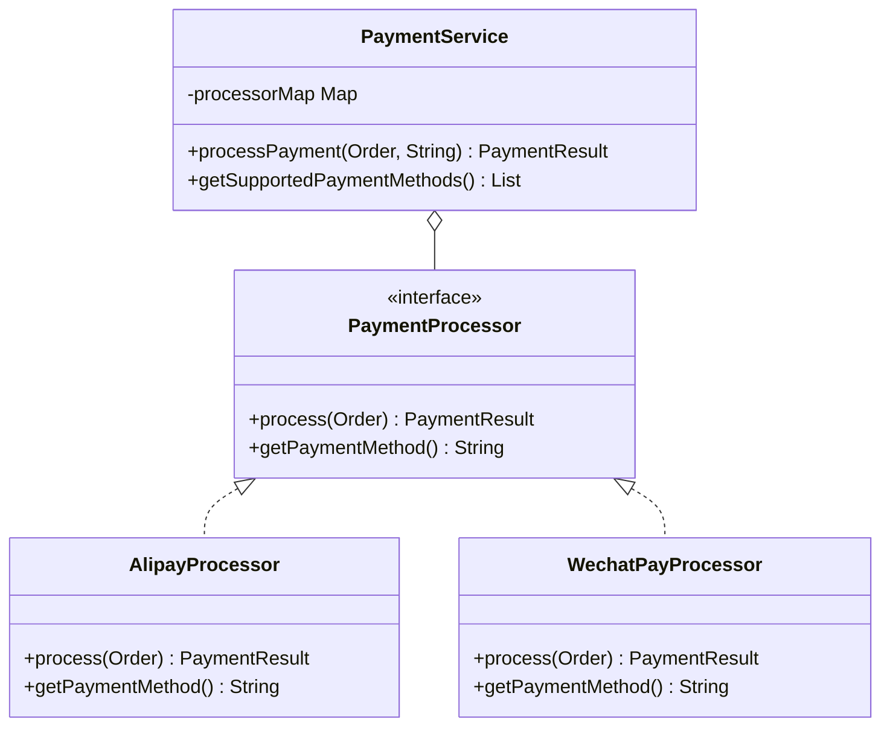

##### 核心代码

```java
// 支付处理器接口
public interface PaymentProcessor {
    /**
     * 处理支付
     */
    PaymentResult process(Order order);
    /**
     * 支持的支付方式
     */
    String getPaymentMethod();
}

// 支付宝处理器
@Component
public class AlipayProcessor implements PaymentProcessor {
    @Override
    public PaymentResult process(Order order) {
        // 实现支付宝支付逻辑
        System.out.println("Processing Alipay payment for order: " + order.getId());
        return new PaymentResult(true, "ALI" + System.currentTimeMillis(), null);
    }
    @Override
    public String getPaymentMethod() {
        return "ALIPAY";
    }
}

// 微信支付处理器
@Component
public class WechatPayProcessor implements PaymentProcessor {
    @Override
    public PaymentResult process(Order order) {
        // 实现微信支付逻辑
        System.out.println("Processing WeChat payment for order: " + order.getId());
        return new PaymentResult(true, "WX" + System.currentTimeMillis(), null);
    }
    @Override
    public String getPaymentMethod() {
        return "WECHAT";
    }
}

// 支付结果类
@Data
@AllArgsConstructor
public class PaymentResult {
    private boolean success;
    private String transactionId;
    private String errorMessage;
}

// 支付服务 - 工厂角色
@Service
public class PaymentService {
    private final Map<String, PaymentProcessor> processorMap;

    // 自动注入所有支付处理器并构建查找映射
    @Autowired
    public PaymentService(List<PaymentProcessor> processors) {
        processorMap = processors.stream()
                .collect(Collectors.toMap(
                    PaymentProcessor::getPaymentMethod,
                    processor -> processor
                ));
    }

    /**
     * 处理订单支付
     */
    public PaymentResult processPayment(Order order, String paymentMethod) {
        // 查找对应的支付处理器
        PaymentProcessor processor = processorMap.get(paymentMethod);
        if (processor == null) {
            throw new IllegalArgumentException("Unsupported payment method: " + paymentMethod);
        }
        // 调用处理器处理支付
        return processor.process(order);
    }

    /**
     * 获取所有支持的支付方式
     */
    public List<String> getSupportedPaymentMethods() {
        return new ArrayList<>(processorMap.keySet());
    }
}

```

##### 关键点分析

1. 工厂方法与IoC结合：结合Spring的依赖注入，实现更优雅的工厂模式
2. 查找映射：使用Map实现高效查找，避免条件判断
3. 自动注册处理器：所有实现PaymentProcessor接口的组件会被自动发现并注册

#### 2.3 观察者模式：订单状态变更事件处理

观察者模式定义了对象之间的一对多依赖关系，当一个对象状态改变时，所有依赖它的对象都会收到通知：

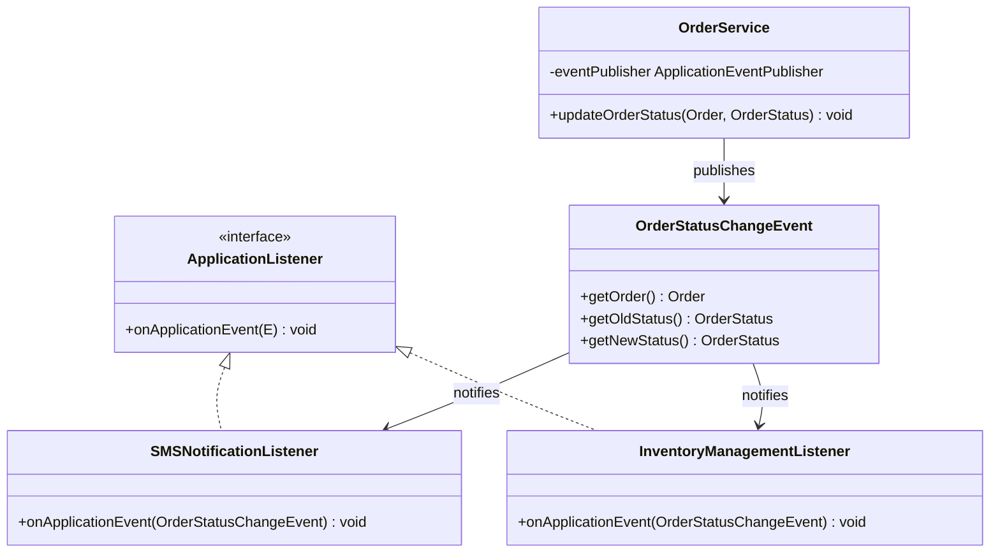

##### 核心代码

```java
// 订单状态变更事件
public class OrderStatusChangeEvent extends ApplicationEvent {
    private final OrderStatus oldStatus;
    private final OrderStatus newStatus;

    public OrderStatusChangeEvent(Order order, OrderStatus oldStatus, OrderStatus newStatus) {
        super(order);
        this.oldStatus = oldStatus;
        this.newStatus = newStatus;
    }

    public Order getOrder() {
        return (Order) getSource();
    }

    public OrderStatus getOldStatus() {
        return oldStatus;
    }

    public OrderStatus getNewStatus() {
        return newStatus;
    }
}

// 订单服务 - 事件发布者
@Service
public class OrderService {
    private final ApplicationEventPublisher eventPublisher;

    @Autowired
    public OrderService(ApplicationEventPublisher eventPublisher) {
        this.eventPublisher = eventPublisher;
    }

    /**
     * 更新订单状态并发布事件
     */
    public void updateOrderStatus(Order order, OrderStatus newStatus) {
        // 保存旧状态用于事件通知
        OrderStatus oldStatus = order.getStatus();
        // 更新订单状态
        order.setStatus(newStatus);
        // 发布订单状态变更事件
        eventPublisher.publishEvent(new OrderStatusChangeEvent(order, oldStatus, newStatus));
    }
}

// 短信通知监听器
@Component
public class SMSNotificationListener implements ApplicationListener<OrderStatusChangeEvent> {
    @Override
    public void onApplicationEvent(OrderStatusChangeEvent event) {
        // 仅在订单发货时发送短信
        if (event.getNewStatus() == OrderStatus.SHIPPED) {
            Order order = event.getOrder();
            // 发送短信通知逻辑
            System.out.println("Sending SMS notification for order: " + order.getId() +
                               " - Your order has been shipped!");
        }
    }
}

// 库存管理监听器
@Component
public class InventoryManagementListener implements ApplicationListener<OrderStatusChangeEvent> {
    @Override
    public void onApplicationEvent(OrderStatusChangeEvent event) {
        Order order = event.getOrder();
        // 订单支付成功时减库存
        if (event.getOldStatus() == OrderStatus.PENDING_PAYMENT &&
            event.getNewStatus() == OrderStatus.PAID) {
            System.out.println("Order paid, reducing inventory for items in order: " + order.getId());
            // 实际库存减少逻辑...
        }
        // 订单取消时恢复库存
        if (event.getNewStatus() == OrderStatus.CANCELLED) {
            System.out.println("Order cancelled, restoring inventory for items in order: " + order.getId());
            // 实际库存恢复逻辑...
        }
    }
}

```

##### 关键点分析

1. Spring事件机制：利用Spring内置的事件机制实现观察者模式
2. 基于功能的订阅：每个监听器只关注自己需要的状态变化
3. 松耦合架构：事件发布者不需要知道有哪些监听器

#### 2.4 适配器模式：统一物流追踪接口

适配器模式允许接口不兼容的类一起工作，将一个类的接口转换成客户期望的另一个接口：

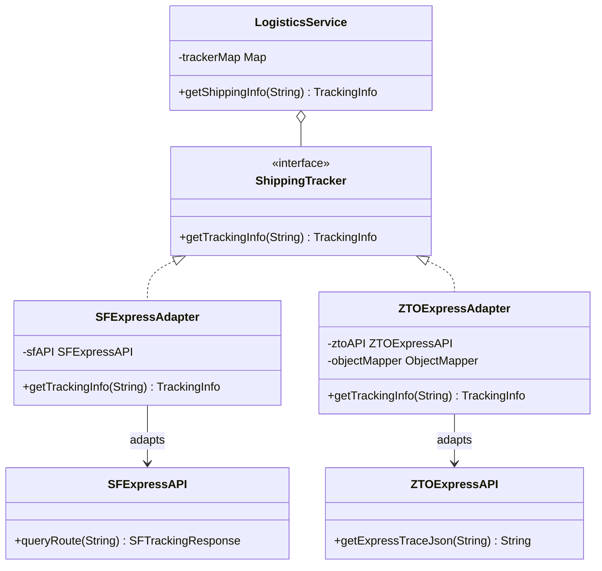

##### 核心代码

```java
// 统一物流跟踪接口
public interface ShippingTracker {
    /**
     * 获取物流跟踪信息
     */
    TrackingInfo getTrackingInfo(String trackingNumber);
}

// 物流信息
@Data
@AllArgsConstructor
public class TrackingInfo {
    private String trackingNumber;
    private String currentLocation;
    private String status;
    private Date updateTime;
}

// 顺丰API (第三方)
public class SFExpressAPI {
    /**
     * 顺丰原生查询接口
     */
    public SFTrackingResponse queryRoute(String waybillNo) {
        // 模拟顺丰API调用
        System.out.println("Calling SF Express API for waybill: " + waybillNo);
        SFTrackingResponse response = new SFTrackingResponse();
        response.setMailNo(waybillNo);
        response.setRouteInfo("Package arrived at SF Beijing Hub");
        response.setAcceptTime(new Date());
        return response;
    }
}

@Data
public class SFTrackingResponse {
    private String mailNo;
    private String routeInfo;
    private Date acceptTime;
}

// 中通API (第三方)
public class ZTOExpressAPI {
    /**
     * 中通原生查询接口 - 与顺丰完全不同
     */
    public String getExpressTraceJson(String expressNo) {
        // 模拟中通API调用，返回JSON格式数据
        System.out.println("Calling ZTO Express API for express number: " + expressNo);
        // 构建简单的JSON响应
        return "{ \"expressNo\": \"" + expressNo + "\"," +
               "  \"location\": \"ZTO Shanghai Sorting Center\"," +
               "  \"status\": \"In Transit\"," +
               "  \"time\": \"" + new Date() + "\" }";
    }
}

// 顺丰适配器
@Component
public class SFExpressAdapter implements ShippingTracker {
    private final SFExpressAPI sfAPI;

    public SFExpressAdapter() {
        this.sfAPI = new SFExpressAPI();
    }

    @Override
    public TrackingInfo getTrackingInfo(String trackingNumber) {
        // 调用顺丰API
        SFTrackingResponse response = sfAPI.queryRoute(trackingNumber);
        // 转换为统一格式
        return new TrackingInfo(
            response.getMailNo(),
            extractLocation(response.getRouteInfo()),
            convertStatus(response.getRouteInfo()),
            response.getAcceptTime()
        );
    }

    // 从顺丰路由信息中提取位置
    private String extractLocation(String routeInfo) {
        // 简化处理...
        return routeInfo;
    }

    // 解析顺丰状态描述
    private String convertStatus(String routeInfo) {
        if (routeInfo.contains("arrived")) return "In Transit";
        if (routeInfo.contains("delivered")) return "Delivered";
        return "Processing";
    }
}

// 中通适配器
@Component
public class ZTOExpressAdapter implements ShippingTracker {
    private final ZTOExpressAPI ztoAPI;
    private final ObjectMapper objectMapper;

    public ZTOExpressAdapter() {
        this.ztoAPI = new ZTOExpressAPI();
        this.objectMapper = new ObjectMapper();
    }

    @Override
    public TrackingInfo getTrackingInfo(String trackingNumber) {
        // 调用中通API，返回JSON字符串
        String jsonResponse = ztoAPI.getExpressTraceJson(trackingNumber);
        try {
            // 解析JSON响应
            JsonNode root = objectMapper.readTree(jsonResponse);
            return new TrackingInfo(
                root.get("expressNo").asText(),
                root.get("location").asText(),
                root.get("status").asText(),
                new Date()  // 简化处理
            );
        } catch (Exception e) {
            throw new RuntimeException("Failed to parse ZTO tracking info", e);
        }
    }
}

// 物流服务
@Service
public class LogisticsService {
    private final Map<String, ShippingTracker> trackerMap = new HashMap<>();

    // 注册物流追踪适配器
    public LogisticsService(SFExpressAdapter sfAdapter, ZTOExpressAdapter ztoAdapter) {
        trackerMap.put("SF", sfAdapter);
        trackerMap.put("ZTO", ztoAdapter);
    }

    /**
     * 获取物流信息
     */
    public TrackingInfo getShippingInfo(String trackingNumber) {
        // 从物流单号解析快递公司代码
        String courierCode = extractCourierCode(trackingNumber);
        // 获取对应物流追踪器
        ShippingTracker tracker = trackerMap.get(courierCode);
        if (tracker == null) {
            throw new IllegalArgumentException("Unsupported courier: " + courierCode);
        }
        // 使用追踪器获取物流信息
        return tracker.getTrackingInfo(trackingNumber);
    }

    private String extractCourierCode(String trackingNumber) {
        // 简单解析物流单号前缀
        if (trackingNumber.startsWith("SF")) return "SF";
        if (trackingNumber.startsWith("ZTO")) return "ZTO";
        throw new IllegalArgumentException("Unknown tracking number format: " + trackingNumber);
    }
}

```

##### 关键点分析

1. 易于扩展：支持新物流公司只需添加新适配器
2. 实现解耦：逻辑代码不需要关心底层API的差异
3. 接口统一：通过适配器将不同API转换为一致的接口

---

### 3. 设计原则应用分析

#### 3.1 单一职责原则 (SRP)

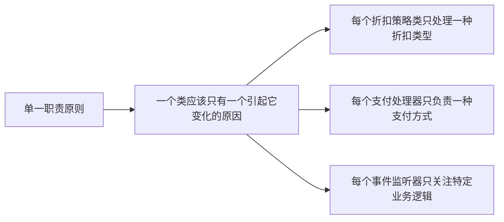

一个类应该只有一个引起它变化的原因。在本文的代码中，每个事件监听器只关注特定业务逻辑，每个支付处理器只负责一种支付方式，每个折扣策略类只处理一种折扣类型。这样调试和测试都更容易。

#### 3.2 开闭原则 (OCP)

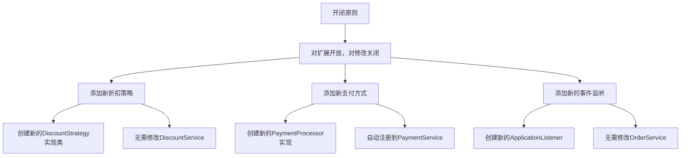

软件实体应该对扩展开放，对修改关闭。比如增加新的订单状态变更监听器无需修改OrderService，新增支付方式只需创建新的PaymentProcessor实现，添加新的折扣策略不需要修改DiscountService。功能扩展不影响现有功能。

#### 3.3 依赖倒置原则 (DIP)

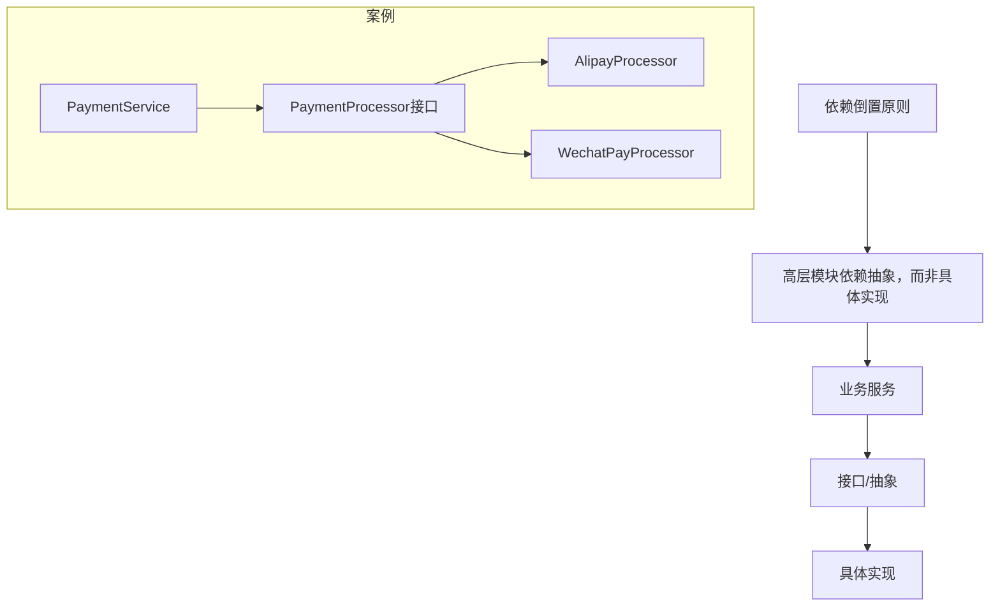

高层模块不应该依赖于低层模块，两者都应该依赖于抽象。OrderService发布事件而非直接调用具体服务，LogisticsService依赖ShippingTracker接口而非具体物流API。这样组件可以独立演化，系统也更灵活、更可测试。

#### 3.4 里氏替换原则 (LSP)

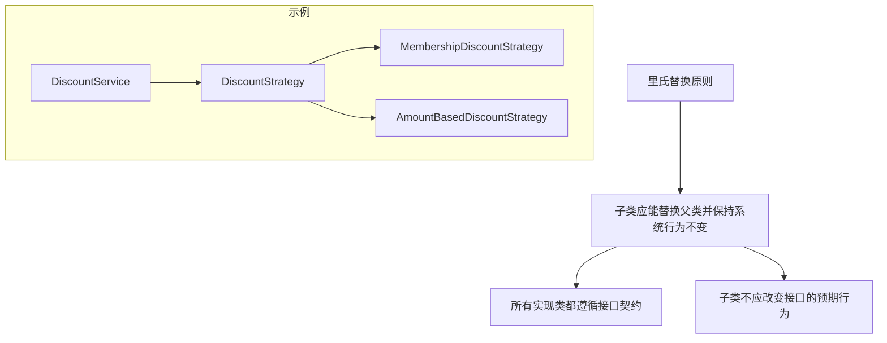

子类应该可以替换其父类并保持系统行为不变。所有适配器都正确实现ShippingTracker接口，所有PaymentProcessor实现都能处理支付请求，所有DiscountStrategy实现都通过相同接口提供折扣计算。这样代码才可重用。

---

### 4. 综合单元测试

#### 4.1 策略模式测试

```java
@RunWith(SpringRunner.class)
@SpringBootTest
public class DiscountStrategyTest {
    @Autowired
    private DiscountService discountService;

    @Autowired
    private List<DiscountStrategy> strategies;

    @Test
    public void testAllStrategiesRegistered() {
        // 验证所有策略都被正确注册
        assertEquals(2, strategies.size());
        Set<String> strategyNames = strategies.stream()
                .map(DiscountStrategy::getName)
                .collect(Collectors.toSet());
        assertTrue(strategyNames.contains("MEMBERSHIP"));
        assertTrue(strategyNames.contains("AMOUNT_BASED"));
    }

    @Test
    public void testMembershipDiscount() {
        // 创建具有黄金会员的订单
        Customer customer = new Customer();
        customer.setMemberLevel(MemberLevel.GOLD);
        Order order = new Order();
        order.setCustomer(customer);
        order.setTotalAmount(new BigDecimal("1000"));

        // 计算会员折扣
        BigDecimal discount = discountService.calculateDiscount(order, "MEMBERSHIP");

        // 验证折扣金额 (1000 * 10%)
        assertEquals(new BigDecimal("100.00"), discount.setScale(2));
    }

    @Test
    public void testBestDiscountStrategy() {
        // 创建白金会员的大额订单
        Customer customer = new Customer();
        customer.setMemberLevel(MemberLevel.PLATINUM);
        Order order = new Order();
        order.setCustomer(customer);
        order.setTotalAmount(new BigDecimal("2000"));

        // 计算最优折扣
        BigDecimal bestDiscount = discountService.calculateBestDiscount(order);

        // 最优应为白金会员折扣 (2000 * 15% = 300) 而非满减折扣 (100)
        assertEquals(new BigDecimal("300.00"), bestDiscount.setScale(2));
    }
}

```

#### 4.2 工厂方法模式测试

```java
@RunWith(SpringRunner.class)
@SpringBootTest
public class PaymentProcessorFactoryTest {
    @Autowired
    private PaymentService paymentService;

    @Test
    public void testProcessorRegistration() {
        List<String> supportedMethods = paymentService.getSupportedPaymentMethods();

        // 验证所有支付处理器都被正确注册
        assertEquals(2, supportedMethods.size());
        assertTrue(supportedMethods.contains("ALIPAY"));
        assertTrue(supportedMethods.contains("WECHAT"));
    }

    @Test
    public void testProcessPaymentWithAlipay() {
        Order order = new Order();
        order.setId(1L);
        order.setTotalAmount(new BigDecimal("999.99"));

        // 处理支付宝支付
        PaymentResult result = paymentService.processPayment(order, "ALIPAY");

        assertTrue(result.isSuccess());
        assertNotNull(result.getTransactionId());
        assertTrue(result.getTransactionId().startsWith("ALI"));
    }

    @Test(expected = IllegalArgumentException.class)
    public void testUnsupportedPaymentMethod() {
        Order order = new Order();

        // 尝试使用不支持的支付方式应抛出异常
        paymentService.processPayment(order, "BITCOIN");
    }
}

```

#### 4.3 观察者模式测试

```java
@RunWith(SpringRunner.class)
@SpringBootTest
public class OrderStatusEventTest {
    @Autowired
    private OrderService orderService;

    @Autowired
    private ApplicationContext applicationContext;

    @MockBean
    private SMSNotificationListener smsListener;

    @MockBean
    private InventoryManagementListener inventoryListener;

    @Test
    public void testOrderPaidEventHandling() {
        // 创建测试订单
        Order order = new Order();
        order.setId(1L);
        order.setStatus(OrderStatus.PENDING_PAYMENT);

        // 更新订单状态到已支付
        orderService.updateOrderStatus(order, OrderStatus.PAID);

        // 验证库存监听器被调用，参数是正确的事件
        ArgumentCaptor<OrderStatusChangeEvent> eventCaptor = ArgumentCaptor.forClass(OrderStatusChangeEvent.class);
        verify(inventoryListener).onApplicationEvent(eventCaptor.capture());

        OrderStatusChangeEvent capturedEvent = eventCaptor.getValue();
        assertEquals(OrderStatus.PENDING_PAYMENT, capturedEvent.getOldStatus());
        assertEquals(OrderStatus.PAID, capturedEvent.getNewStatus());
        assertEquals(order, capturedEvent.getOrder());

        // 验证短信监听器未被触发（因为不是发货状态）
        verify(smsListener, never()).onApplicationEvent(any());
    }

    @Test
    public void testOrderShippedEventHandling() {
        // 创建测试订单
        Order order = new Order();
        order.setId(2L);
        order.setStatus(OrderStatus.PROCESSING);

        // 更新订单状态到已发货
        orderService.updateOrderStatus(order, OrderStatus.SHIPPED);

        // 验证短信通知监听器被调用
        ArgumentCaptor<OrderStatusChangeEvent> eventCaptor = ArgumentCaptor.forClass(OrderStatusChangeEvent.class);
        verify(smsListener).onApplicationEvent(eventCaptor.capture());

        OrderStatusChangeEvent capturedEvent = eventCaptor.getValue();
        assertEquals(OrderStatus.PROCESSING, capturedEvent.getOldStatus());
        assertEquals(OrderStatus.SHIPPED, capturedEvent.getNewStatus());
    }
}

```

#### 4.4 适配器模式测试

```java
@RunWith(SpringRunner.class)
@SpringBootTest
public class ShippingAdapterTest {
    @Autowired
    private LogisticsService logisticsService;

    @Test
    public void testSFExpressTracking() {
        // 获取顺丰物流信息
        TrackingInfo trackingInfo = logisticsService.getShippingInfo("SF1234567890");

        // 验证返回的信息格式正确
        assertEquals("SF1234567890", trackingInfo.getTrackingNumber());
        assertNotNull(trackingInfo.getCurrentLocation());
        assertNotNull(trackingInfo.getStatus());
    }

    @Test
    public void testZTOExpressTracking() {
        // 获取中通物流信息
        TrackingInfo trackingInfo = logisticsService.getShippingInfo("ZTO9876543210");

        // 验证返回的信息格式正确
        assertEquals("ZTO9876543210", trackingInfo.getTrackingNumber());
        assertEquals("ZTO Shanghai Sorting Center", trackingInfo.getCurrentLocation());
        assertEquals("In Transit", trackingInfo.getStatus());
    }

    @Test(expected = IllegalArgumentException.class)
    public void testUnknownCourier() {
        // 未知物流公司应抛出异常
        logisticsService.getShippingInfo("UNKNOWN123456");
    }
}

```

#### 4.5 集成测试：订单处理流程

```java
@RunWith(SpringRunner.class)
@SpringBootTest
public class OrderProcessingIntegrationTest {
    @Autowired
    private OrderService orderService;

    @Autowired
    private PaymentService paymentService;

    @Autowired
    private DiscountService discountService;

    @Autowired
    private ApplicationEventPublisher eventPublisher;

    @MockBean
    private SMSNotificationListener smsListener;

    @MockBean
    private InventoryManagementListener inventoryListener;

    @Test
    public void testCompleteOrderProcess() {
        // 1. 创建订单
        Customer customer = new Customer();
        customer.setId(1L);
        customer.setName("John Doe");
        customer.setMemberLevel(MemberLevel.GOLD);

        Order order = new Order();
        order.setId(1L);
        order.setCustomer(customer);
        order.setTotalAmount(new BigDecimal("1500.00"));
        order.setStatus(OrderStatus.CREATED);

        // 2. 应用折扣
        BigDecimal discount = discountService.calculateBestDiscount(order);
        order.setDiscountAmount(discount);
        order.setFinalAmount(order.getTotalAmount().subtract(discount));

        // 验证折扣计算正确
        assertEquals(new BigDecimal("150.00"), discount.setScale(2));

        // 3. 处理支付
        PaymentResult paymentResult = paymentService.processPayment(order, "ALIPAY");
        assertTrue(paymentResult.isSuccess());

        // 4. 更新订单状态
        orderService.updateOrderStatus(order, OrderStatus.PAID);

        // 5. 验证状态更新和事件发布
        assertEquals(OrderStatus.PAID, order.getStatus());

        // 验证库存监听器被触发
        verify(inventoryListener).onApplicationEvent(any(OrderStatusChangeEvent.class));

        // 6. 更新订单状态到已发货
        orderService.updateOrderStatus(order, OrderStatus.SHIPPED);

        // 7. 验证短信通知被触发
        verify(smsListener).onApplicationEvent(any(OrderStatusChangeEvent.class));

        // 完整流程验证成功
    }
}

```

---

### 5. 最佳实践总结

#### 5.1 Spring与设计模式的协同优势

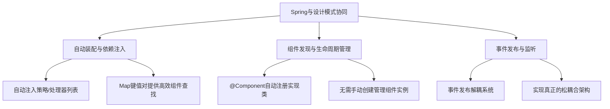

自动装配与依赖注入：

- Map的键值对形式提供更高效的组件查找
- 使用`@Autowired`与`List `实现策略、处理器的自动注册

组件发现与生命周期管理：

- 无需手动创建和管理组件实例
- 用`@Component`标记实现类，Spring自动发现并管理实例

事件发布与监听：

- 实现真正的松耦合架构
- @EventListener简化事件监听实现
- ApplicationEventPublisher提供事件发布能力

#### 5.2 设计模式选择指南

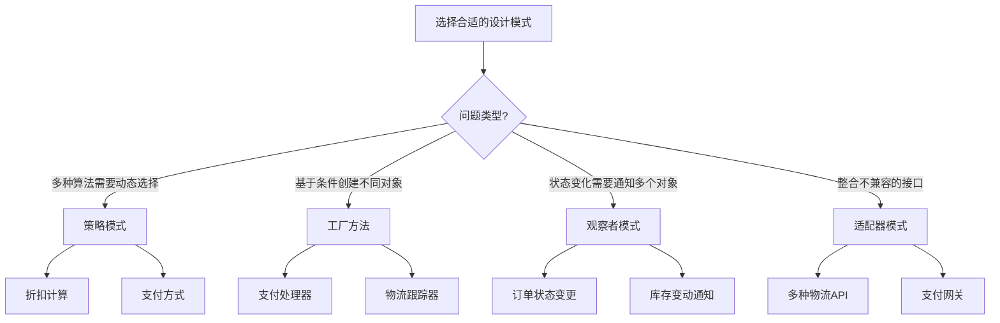

策略模式：当存在多种算法且需要在运行时动态选择时

- 实例：折扣计算、支付方式、短信渠道选择

工厂方法：需要基于条件创建不同对象而避免大量if-else时

- 实例：支付处理器、物流跟踪器、通知发送器

观察者模式：当对象状态变化需要触发一系列相关但独立的操作时

- 实例：订单状态变更、用户注册完成、库存变动通知

适配器模式：整合不兼容第三方接口时

- 实例：多种物流API、支付网关、外部认证服务

#### 5.3 避免常见陷阱

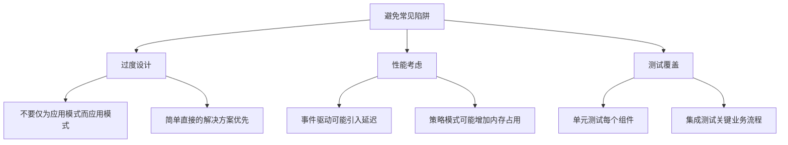

过度设计：

- 简单直接的解决方案优先
- 不要仅为应用设计模式而应用设计模式

性能考虑：

- 在关键路径上进行适当优化
- 策略模式可能增加内存占用
- 事件驱动架构可能引入延迟

测试覆盖：

- 关键业务流程需要端到端集成测试
- 每个组件需要有充分的单元测试

#### 5.4 最终建议

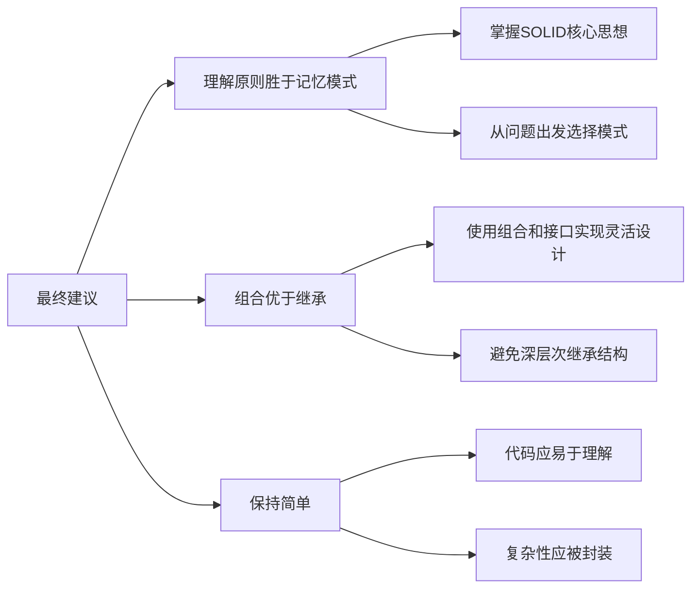

理解原则比背模式有用，从问题出发选择模式。组合优于继承，避免深层的继承结构。保持简单，代码要易于理解。

设计模式是在特定上下文中解决特定问题的经验总结。理解问题本质和设计原则，才能做出好的架构设计。

---

---

- Search
- 业务研发手册
- 开发项目推荐
- 关于
- 首页
