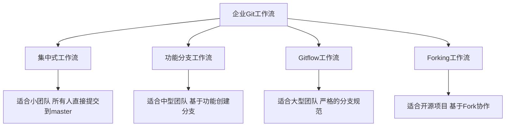
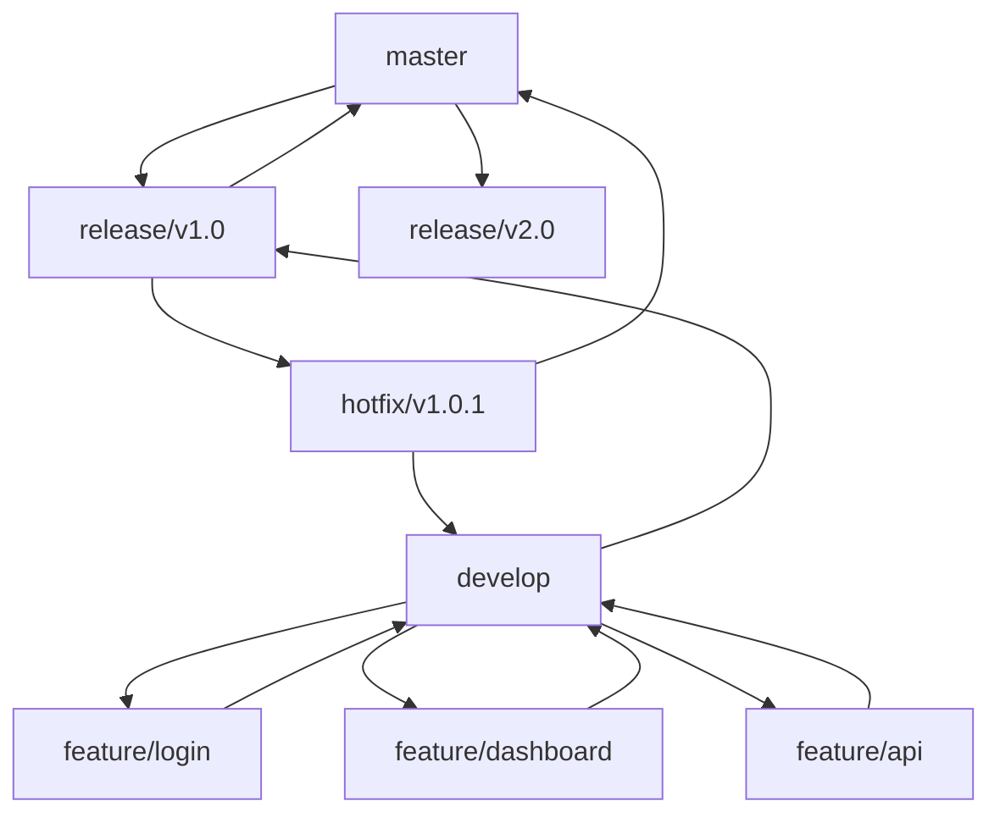
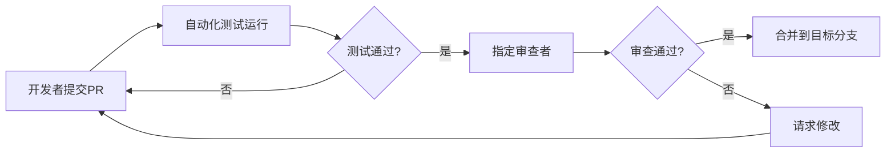
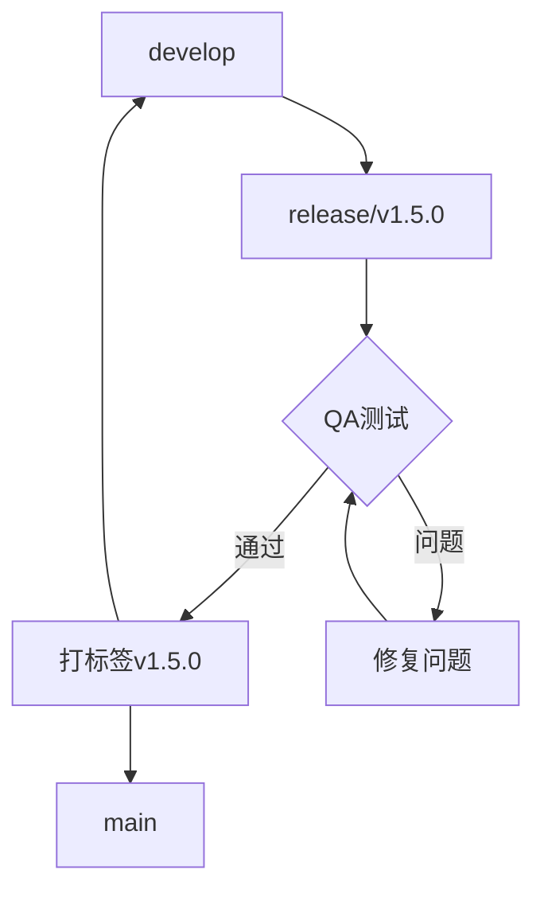
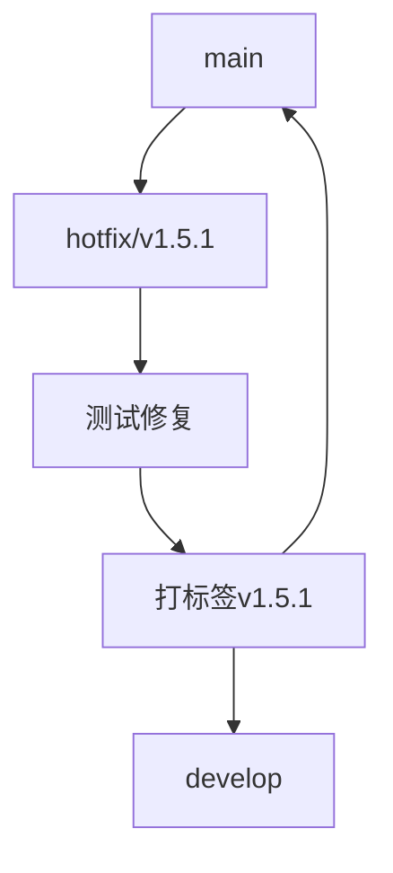

### 目录

1. 企业级Git工作流
2. 分支策略与版本管理
3. 分支合并与冲突解决
4. 代码审查与质量控制
5. 发布与部署流程
6. Git高级应用与最佳实践

### 1. 企业级Git工作流

#### 1.1 团队协作模型

不同规模和类型的团队需要不同的Git协作模式：



业务场景：电商平台开发团队

```bash
# 功能分支工作流示例 - 新增支付功能

# 开发者从主分支创建功能分支
git checkout main
git pull
git checkout -b feature/payment-gateway

# 开发并提交代码
git add .
git commit -m "Add PayPal integration API"
git commit -m "Add payment form UI components"

# 与远程仓库同步，让团队成员查看进度
git push -u origin feature/payment-gateway

# 开发完成后，创建合并请求（在GitHub/GitLab平台上）
# 代码审查后合并到主分支

```

适用团队：

- 集中式：5人以下小团队，内部项目
- 功能分支：5-15人中等团队，产品开发
- Gitflow：大型团队，需要管理多个版本的复杂产品
- Forking：开源项目或多团队协作

#### 1.2 Gitflow详解

Gitflow是企业中最常用的Git工作流之一，特别适合有计划发布周期的产品：



业务场景：CRM系统开发

```bash
# 初始化Gitflow
git flow init

# 开发新功能
git flow feature start customer-dashboard
# 开发工作...
git add .
git commit -m "Add customer activity timeline"
git flow feature finish customer-dashboard

# 准备发布
git flow release start 2.3.0
# 发布准备工作，如版本号修改等
git add .
git commit -m "Bump version to 2.3.0"
git flow release finish 2.3.0

# 处理生产环境紧急问题
git flow hotfix start 2.3.1
# 修复工作...
git add .
git commit -m "Fix customer data migration issue"
git flow hotfix finish 2.3.1

```

关键分支：

- master/main：生产就绪代码，只接受合并
- develop：下一版本的开发集成分支
- feature/*：新功能开发
- release/*：发布准备
- hotfix/*：生产环境紧急修复

#### 1.3 权限管理与安全实践

企业环境的代码需要权限控制：

```bash
# 在Git平台上设置保护分支规则
# GitHub示例：
# Settings > Branches > Branch protection rules

# 设置提交签名验证
git config --global user.signingkey <GPG-KEY-ID>
git config --global commit.gpgsign true

# 签名提交
git commit -S -m "Implement secure authentication flow"

# 验证提交签名
git verify-commit HEAD

# 使用SSH密钥进行认证（设置）
ssh-keygen -t ed25519 -C "[email protected]"
# 然后将公钥添加到Git平台

# 敏感信息管理（错误的方式）
git add credentials.json  # 不要这样做!

# 正确方式：使用.gitignore排除敏感文件
echo "credentials.json" >> .gitignore
echo ".env" >> .gitignore

```

业务场景：金融科技应用开发

金融科技公司需要确保：

- 只有授权人员可以合并到主分支
- 所有提交必须经过代码审查
- 确保合规性，维护变更记录
- 敏感配置不会进入代码仓库

### 2. 分支策略与版本管理

#### 2.1 有效的分支命名约定

一致的分支命名有助于团队协作和自动化：

```text
# 常用分支命名格式
feature/[票号]-short-description  # 新功能
bugfix/[票号]-short-description   # 缺陷修复
hotfix/[票号]-short-description   # 紧急生产修复
release/v1.2.3                    # 版本发布准备
chore/update-dependencies         # 维护工作

```

业务场景：敏捷开发团队与JIRA集成

```bash
# 对应JIRA票号PRJ-123的功能开发
git checkout -b feature/PRJ-123-user-profile-redesign

# 开发完成后创建合并请求
# 标题: "[PRJ-123] Implement user profile redesign"

# 持续集成系统自动从分支名和提交信息提取票号
# 并更新JIRA工单状态

```

#### 2.2 语义化版本管理

遵循语义化版本规范有助于清晰地传达变更的性质：

```text
MAJOR.MINOR.PATCH 例如 2.4.1
- MAJOR: 不兼容的API变更
- MINOR: 向后兼容的功能性新增
- PATCH: 向后兼容的问题修正

```

业务场景：API服务开发

```bash
# 当前版本v1.2.3

# 修复错误（补丁版本升级）
git checkout -b bugfix/api-response-format
# 修复后，发布v1.2.4

# 添加新功能（次要版本升级）
git checkout -b feature/new-endpoint
# 实现后，发布v1.3.0

# 重构架构，破坏向后兼容性（主要版本升级）
git checkout -b feature/api-v2
# 完成后，发布v2.0.0

# 打标签记录版本
git tag -a v2.0.0 -m "Release version 2.0.0"
git push origin v2.0.0

```

#### 2.3 长期分支与短期分支管理

不同生命周期的分支需要不同的管理策略：

长期分支：

- main/master
- develop
- staging

短期分支：

- feature/*
- bugfix/*
- hotfix/*
- release/*

业务场景：多版本并行开发

```bash
# 当前有多个版本线并行开发
# - v1.x: 生产维护版本
# - v2.x: 当前活跃开发版本
# - v3.x: 下一代架构探索

# 为v1.x维护版本创建分支
git checkout -b support/v1.x master
git push -u origin support/v1.x

# 在v1.x上修复问题
git checkout support/v1.x
git checkout -b hotfix/v1.2.5-data-corruption
# 修复问题...
git add .
git commit -m "Fix data corruption in CSV export"

# 合并到v1.x支持分支并发布
git checkout support/v1.x
git merge hotfix/v1.2.5-data-corruption
git tag -a v1.2.5 -m "Hotfix: repair CSV data export"
git push origin support/v1.x --tags

# 同时在main分支上进行v2.x开发
git checkout main
git checkout -b feature/new-dashboard
# 开发新功能...

```

### 3. 分支合并与冲突解决

#### 3.1 基本合并策略

Git提供多种合并策略，适用于不同场景：

```bash
# 1. 快进合并 (Fast-forward) - 没有分叉的简单合并
git checkout main
git merge feature/simple-change
# 结果：线性历史，没有合并提交

# 2. 递归合并 (Recursive) - 标准合并方式
git checkout main
git merge --no-ff feature/complex-feature
# 结果：保留分支历史，创建合并提交

# 3. 压缩合并 (Squash) - 将分支所有更改压缩为一个提交
git checkout main
git merge --squash feature/multiple-commits
git commit -m "Add user authentication feature"
# 结果：清晰的功能提交，失去详细历史

# 4. 挑选合并 (Cherry-pick) - 选择性地合并特定提交
git cherry-pick a72f21e
# 结果：只合并选定的提交，不合并整个分支

```

业务场景：功能整合到主干

```bash
# 团队在feature/user-auth分支完成开发，包含15个提交
# 现在需要合并到develop分支

# 方案1：保留完整历史
git checkout develop
git merge --no-ff feature/user-auth
git push origin develop

# 方案2：维护清晰的主干历史
git checkout develop
git merge --squash feature/user-auth
git commit -m "feat: add user authentication system

- Email/password authentication
- Social login integration
- Two-factor authentication
- Password reset flow

Closes #123"
git push origin develop

```

#### 3.2 合并冲突解决

合并冲突是团队协作中的常见挑战：

```bash
# 尝试合并产生冲突
git checkout main
git merge feature/billing-update
# 冲突提示: "Automatic merge failed; fix conflicts and then commit the result"

# 查看冲突文件
git status
# 查看详细冲突
git diff

# 解决冲突的方法：

# 1. 手动编辑冲突文件
# 文件中会有标记:
# <<<<<<< HEAD
# 当前分支代码
# =======
# 合并分支代码
# >>>>>>> feature/billing-update

# 2. 使用合并工具
git mergetool

# 3. 接受某一方的更改
git checkout --ours path/to/file.js  # 保留当前分支版本
git checkout --theirs path/to/file.js  # 采用合并分支版本
git add path/to/file.js

# 完成冲突解决
git add .
git commit  # 使用默认提交信息或修改

```

业务场景：并行开发冲突

```bash
# 两个团队同时修改了相同文件的相同部分
# 团队A: 更新产品定价逻辑 (feature/pricing-update)
# 团队B: 添加季节性折扣 (feature/seasonal-discounts)

# 团队B将分支合并到develop时发生冲突
git checkout develop
git pull
git merge feature/seasonal-discounts
# 冲突: pricing-service.js

# 解决策略:
# 1. 召集双方团队开发者讨论冲突
# 2. 确保保留双方功能的完整性
# 3. 手动整合代码并测试

# 编辑冲突文件，整合双方更改
# 标记解决冲突
git add pricing-service.js
git commit -m "Merge feature/seasonal-discounts, integrate with pricing updates"

# 确保运行测试验证合并结果
npm test

```

#### 3.3 高级合并技巧

复杂项目和团队可能需要更高级的合并策略：

```bash
# 1. 使用rebase替代合并，创建更线性的历史
git checkout feature/user-management
git rebase develop
# 解决可能的冲突...
git push --force-with-lease origin feature/user-management

# 2. 交互式rebase，整理提交历史后再合并
git checkout feature/reporting
git rebase -i HEAD~5  # 整理最近5个提交
# 编辑、压缩或重排提交...
git checkout develop
git merge feature/reporting

# 3. 中止有问题的合并
git merge --abort

# 4. 选择性合并部分文件/更改
git checkout feature/partial-updates
git checkout main
git checkout feature/partial-updates -- src/specific-file.js
git commit -m "Cherry-pick specific file from feature branch"

# 5. 设置合并策略偏好
git config --global merge.ff only  # 只允许快进合并
git config --global pull.rebase true  # 默认使用rebase而非合并

```

业务场景：功能依赖与部分发布

```bash
# 公司计划实现新的报表功能，包含多个子功能
# feature/reports 包含5个关联但独立的功能
# 但现在需要优先发布其中两个功能

# 选择性合并关键特性
git checkout release/v2.4
git cherry-pick 4f5e6a7  # 合并导出为CSV功能
git cherry-pick 8g9h0i1  # 合并图表生成功能

# 验证功能正常工作
# 测试...

# 创建发布
git tag -a v2.4.0 -m "Release v2.4.0 with report export features"
git push origin release/v2.4 --tags

```

#### 3.4 团队合并规范

有效的团队合并规范有助于减少冲突和提高代码质量：

```bash
# 合并前的准备工作
# 1. 更新分支与最新主分支同步
git checkout feature/my-feature
git fetch origin
git rebase origin/develop

# 2. 确保所有测试通过
npm test

# 3. 代码格式化和静态检查
npm run lint
npm run format

# 合并请求最佳实践
# - 提交描述性PR标题和详细描述
# - 添加测试覆盖证明
# - 链接相关工单/需求
# - 指派适当的审查者

# 设置Git钩子强制合并前检查
# .git/hooks/pre-push 示例:
#!/bin/sh
npm test
if [ $? -ne 0 ]; then
  echo "Tests must pass before push!"
  exit 1
fi

```

业务场景：跨团队协作

```text
# 前端团队和后端团队在不同分支开发相关功能
# frontend/user-dashboard
# backend/user-api

# 集成前的协调流程
# 1. 两个团队共同制定集成计划和API契约
# 2. 后端先完成API开发并部署到测试环境
# 3. 前端基于测试API完成开发
# 4. 协调合并顺序和步骤

# 后端合并流程
git checkout develop
git merge --no-ff backend/user-api
git push origin develop

# 部署到测试环境并验证API
# ...

# 前端合并流程
git checkout frontend/user-dashboard
git rebase develop  # 获取最新后端更改
# 解决可能的冲突...
# 确保前端可以使用新API
npm test

git checkout develop
git merge --no-ff frontend/user-dashboard
git push origin develop

```

### 4. 代码审查与质量控制

#### 4.1 拉取请求与代码审查流程

代码审查流程是保障代码质量的有效手段：



业务场景：企业Web应用更新

```bash
# 创建功能分支
git checkout -b feature/analytics-dashboard

# 开发完成后提交
git add .
git commit -m "Implement analytics dashboard"
git push origin feature/analytics-dashboard

# 在GitHub/GitLab创建PR/MR
# 标题: "Add analytics dashboard for enterprise customers"
# 描述:
# - 实现了企业客户的分析仪表板
# - 添加了按时间筛选数据的功能
# - 包含单元测试和集成测试
# - 解决了 PROJ-456 工单
# 
# 请查看新添加的图表组件以及数据处理逻辑

# 代码审查后进行修改
git add .
git commit -m "Address PR feedback: improve error handling"
git push origin feature/analytics-dashboard

# 最终合并（使用平台UI或命令行）

```

#### 4.2 有效的提交信息规范

良好的提交信息便于理解变更历史和自动化版本管理：

```ts
# 提交信息格式
<类型>(<范围>): <简短描述>

<详细描述>

<关联工单>

```

类型:

- feat: 新功能
- fix: 缺陷修复
- docs: 文档更新
- style: 代码格式（不影响功能）
- refactor: 重构
- perf: 性能优化
- test: 测试相关
- chore: 构建过程或辅助工具变动

业务场景：常规开发工作

```bash
# 添加新功能
git commit -m "feat(user): add password reset functionality

Implement secure password reset flow with email verification and
rate limiting to prevent abuse.

Resolves: PROJECT-123"

# 修复问题
git commit -m "fix(checkout): correct tax calculation for international orders

Tax was incorrectly calculated for orders shipping to multiple countries.
This fix ensures we apply the correct regional tax rates.

Fixes: PROJECT-456"

```

#### 4.3 代码质量工具集成

将代码质量工具与Git工作流集成可自动化质量控制：

```yaml
# .github/workflows/quality.yml 示例
name: Code Quality

on: [push, pull_request]

jobs:
  quality:
    runs-on: ubuntu-latest
    steps:
      - uses: actions/checkout@v2
      - name: Setup Node.js
        uses: actions/setup-node@v2
        with:
          node-version: '16'
      - name: Install dependencies
        run: npm ci
      - name: Run linter
        run: npm run lint
      - name: Run tests
        run: npm test
      - name: Run security scan
        run: npm run security-scan

```

业务场景：持续集成实践

```bash
# 本地运行前提交检查
npm run pre-commit

# 提交前静态分析
git commit -m "feat(api): add user preferences endpoint"
# 自动运行提交钩子:
# - 代码格式检查
# - 静态分析
# - 单元测试

# 推送时触发CI流程
git push origin feature/user-preferences
# CI服务自动运行:
# - 全面测试套件
# - 集成测试
# - 安全扫描

```

### 5. 发布与部署流程

#### 5.1 发布分支管理

制定可靠的发布流程是稳定交付的前提：



业务场景：企业软件发布

```bash
# 从开发分支创建发布分支
git checkout develop
git checkout -b release/v1.5.0

# 进行最终调整
git commit -m "chore: update version to 1.5.0"
git commit -m "docs: update changelog for v1.5.0"

# QA测试后发现问题
git commit -m "fix: address QA feedback on user import"

# 测试通过后，完成发布
git checkout main
git merge --no-ff release/v1.5.0
git tag -a v1.5.0 -m "Release version 1.5.0"

# 同步回develop分支
git checkout develop
git merge --no-ff release/v1.5.0

# 清理发布分支
git branch -d release/v1.5.0

# 推送变更
git push origin main develop --tags

```

#### 5.2 持续集成/持续部署

将Git与CI/CD流程集成可实现自动化测试和部署：

```yaml
# .gitlab-ci.yml 示例
stages:
  - test
  - build
  - deploy

test:
  stage: test
  script:
    - npm install
    - npm test

build:
  stage: build
  script:
    - npm run build
  artifacts:
    paths:
      - dist/
  only:
    - main
    - develop
    - /^release\/.*$/

deploy_staging:
  stage: deploy
  script:
    - deploy_to_staging.sh
  environment:
    name: staging
  only:
    - develop

deploy_production:
  stage: deploy
  script:
    - deploy_to_production.sh
  environment:
    name: production
  only:
    - main
  when: manual

```

业务场景：SaaS产品部署

```bash
# 开发分支自动部署到测试环境
git push origin develop
# CI自动运行测试并部署到staging

# 发布版本部署到生产环境
git checkout main
git merge --no-ff release/v2.1.0
git tag -a v2.1.0 -m "Release version 2.1.0"
git push origin main --tags
# CI触发生产部署流程（手动确认）

```

#### 5.3 紧急修复流程

生产环境问题需要特殊的处理流程：



业务场景：生产环境数据错误

```bash
# 从主分支创建热修复分支
git checkout main
git checkout -b hotfix/v1.5.1

# 实现修复
git add .
git commit -m "fix: correct critical data calculation error"

# 测试修复
# ...

# 合并回主分支
git checkout main
git merge --no-ff hotfix/v1.5.1
git tag -a v1.5.1 -m "Hotfix: critical data calculation error"

# 同步到开发分支
git checkout develop
git merge --no-ff hotfix/v1.5.1

# 推送变更
git push origin main develop --tags

```

### 6. Git高级应用与最佳实践

#### 6.1 重写历史与代码整理

在某些情况下，需要重写分支历史以保持清晰：

```bash
# 合并最近的提交
git rebase -i HEAD~3

# 提交信息示例
# 修改为:
# pick abc1234 feat(user): add profile picture upload
# squash def5678 fix styling issues
# squash ghi9012 address PR feedback

# 修改最近提交信息
git commit --amend -m "feat(user): complete profile upload functionality"

# 重置实验性更改
git reset --hard origin/main

# 暂存部分文件的更改
git add -p

# 变基到另一分支
git fetch
git rebase origin/main

# 处理变基冲突
# 解决冲突后...
git add .
git rebase --continue

```

注意事项：

- 永远不要重写已推送的公共历史！
- 仅在个人分支或未合并的功能分支中使用

业务场景：功能开发整理

```bash
# 开发过程中多次提交
git commit -m "Start implementing payment gateway"
git commit -m "Add form validation"
git commit -m "Fix typo"
git commit -m "Complete payment flow"

# 在PR前整理提交
git rebase -i HEAD~4
# 合并为一个或几个逻辑提交
# 例如:
# - feat(payment): implement PayPal gateway
# - test(payment): add integration tests

```

#### 6.2 大型项目与子模块管理

管理包含多个子项目的复杂代码库：

```bash
# 添加子模块
git submodule add https://github.com/company/shared-lib libs/shared

# 克隆包含子模块的项目
git clone --recursive https://github.com/company/main-project

# 更新所有子模块
git submodule update --init --recursive

# 更新子模块到最新版本
cd libs/shared
git checkout main
git pull
cd ../..
git add libs/shared
git commit -m "chore: update shared library to latest version"

```

业务场景：多团队微服务架构

```text
# 主项目包含多个微服务作为子模块
project-main/
  ├── frontend/ (子模块)
  ├── api-gateway/ (子模块)
  ├── user-service/ (子模块)
  ├── payment-service/ (子模块)
  └── deployment/

# 更新特定服务
cd user-service
git checkout develop
git pull
cd ..
git add user-service
git commit -m "chore: update user service to latest develop"

```

#### 6.3 Git备份与迁移

确保代码库安全与迁移策略：

```bash
# 创建仓库完整镜像（包括所有分支和标签）
git clone --mirror https://github.com/company/project

# 添加新的远程地址
cd project.git
git remote add new-origin https://gitlab.com/company/project.git

# 推送所有内容到新位置
git push --mirror new-origin

# 定期备份（可自动化）
git fetch --all
git push --mirror backup-location

# 导出补丁文件（无Git访问时的协作）
git format-patch master..feature-branch

# 导入补丁
git am < patch-file.patch

```

业务场景：代码库迁移

```bash
# 从GitHub迁移到GitLab的流程
# 1. 创建镜像克隆
git clone --mirror https://github.com/oldcompany/project.git

# 2. 进入镜像目录
cd project.git

# 3. 添加新仓库作为远程
git remote add gitlab https://gitlab.com/newcompany/project.git

# 4. 推送所有内容
git push gitlab --mirror

# 5. 更新本地工作副本
cd ~/workspace
git clone https://gitlab.com/newcompany/project.git
cd project
git remote remove origin
git remote add origin https://gitlab.com/newcompany/project.git

```

#### 6.4 Git性能优化

大型项目中保持Git高效运行的技巧：

```bash
# 检查仓库大小
git count-objects -v

# 清理不必要的文件
git gc --aggressive

# 修剪远程跟踪分支
git fetch --prune

# 压缩本地仓库
git repack -a -d -f --depth=250 --window=250

# 使用浅克隆加快大型仓库克隆（仅最近历史）
git clone --depth=1 https://github.com/company/large-project

# 仅克隆单个分支
git clone --single-branch --branch main https://github.com/company/large-project

# 使用稀疏检出（仅特定目录）
git clone https://github.com/company/monorepo
cd monorepo
git sparse-checkout init
git sparse-checkout set frontend/react-app

```

业务场景：单体仓库（Monorepo）效率优化

```text
# 大型单体仓库包含多个项目
monorepo/
  ├── frontend/
  ├── backend/
  ├── mobile-app/
  ├── desktop-app/
  └── shared/

# 前端开发者只关心前端代码
git clone https://github.com/company/monorepo
cd monorepo
git sparse-checkout init
git sparse-checkout set frontend shared

# 优化LFS使用
git lfs install
git lfs track "*.psd" "*.ai" "*.zip"
git add .gitattributes

```

以上是 Git 在企业级使用中的主要场景和实用方案。
