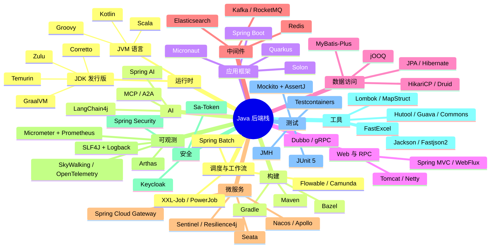

写 Java 这些年，最常被新人问的两个问题是："Java 生态到底有哪些东西？" 和 "这一层我该选什么？"。前一个问题在网上能搜到一堆 awesome-list，但读完仍然不知道该选哪个；后一个问题答案散落在各种"为什么我们从 X 迁到 Y"的博客里，难以系统化。

这篇文章把整个 Java 后端栈拆成十五层，从 JDK 一直到 AI 集成，每一层只回答三件事：**有哪些主流选项 / 现在还活着吗 / 我该选哪个**。每章节末尾给一张决策表，按场景对照即可。

## 目录

## 一、全景速览

先用一张图建立整体印象，下面每一节会展开。



下面进入每一层。

## 二、运行时：你的代码跑在什么上面

### JDK 发行版的选择

2026 年最关键的一条信息：**Oracle JDK 21 的 NFTC 免费授权将在 2026 年 9 月到期**，意味着如果你还在用 Oracle 官方的 JDK 21，且没有付费订阅，到期后只能升级到 JDK 25 或者切到其它发行版。Azul 的报告显示 88% 的 Oracle Java 用户在考虑换发行版，这不是危言耸听。

主流发行版对比：

| 发行版 | 适合场景 | 备注 |
|---|---|---|
| **Eclipse Temurin** (Adoptium) | 默认首选 | Adoptium 工作组维护，社区背书强 |
| **Amazon Corretto** | AWS 环境、长期支持 | Corretto 25 支持到 2032 年 10 月 |
| **Azul Zulu** | 通用场景，多平台 | 商用版本 Zing 提供低延迟 GC |
| **Oracle OpenJDK** | 短期项目 | 只有 6 个月免费窗口 |
| **GraalVM** | Native Image、Serverless | 启动毫秒级，但反射/动态代理需配置 |

JDK 版本选择上，2026 年的现实是：

- **新项目直接上 JDK 25 LTS**（2025 年 9 月发布）。JDK 21 的虚拟线程 pinning 问题在 25 中通过 JEP 491 修复，Stream Gatherers 让数据处理代码更干净，Compact Object Headers 减少内存占用。
- **存量项目从 8 / 11 升级**，优先目标是 JDK 21，原因是大量框架（Spring Boot 4、未来的 Spring Boot 5）已经把最低版本拉到 17 甚至 21，再不升就是技术债。
- **Java 8 仍然有 23% 的存量**（Azul 2025 报告），但比 2023 年的 40% 已经腰斩，趋势很清楚。

### GraalVM Native Image：值不值得

Native Image 启动时间能压到 50ms 以下（Spring Boot Native 大概 104ms），内存占用比传统 JVM 模式小 50% 以上。但代价不小：

- **反射/动态代理需要显式配置**（reachability metadata），框架不支持就要自己写
- **构建时间显著变长**，CI 流水线要重新设计
- **调试体验差**，热部署基本不可用

适用场景很明确：**Serverless、CLI 工具、Function 函数、需要 scale-to-zero 的微服务**。普通的 Web 应用上 Native Image 收益不大，反而增加复杂度。

### JVM 多语言

不是只能写 Java：

- **Kotlin**：后端语言里的事实第二选择，Spring Boot 官方一等支持，语法糖让代码量减少 30%-40%
- **Scala**：Spark / Flink 生态的母语，业务后端用得少
- **Groovy**：Gradle DSL 的载体，业务代码基本不用了
- **Clojure**：函数式爱好者的乐园，国内几乎没见过商用

**选型决策**：

| 场景 | 推荐 | 替代 |
|---|---|---|
| 新业务后端 | JDK 25 + Temurin | Corretto / Zulu |
| 存量升级 | JDK 21 LTS | — |
| Serverless / CLI | GraalVM Native | — |
| 与 AWS 深度绑定 | Corretto | Temurin |
| 想用更现代语法 | Kotlin | Java + Lombok |

## 三、构建工具：Maven 还是 Gradle

这个问题问了十几年，2026 年答案仍然没有标准。

### Maven

**约定优于配置**带来的是几乎为零的学习曲线。`mvn clean install` 在任何 Maven 项目都能跑起来，团队成员换项目无需重新学习构建脚本。POM 是声明式 XML，可读性好，IDE 支持完美。

代价是**灵活性低**。想做一点点非标准的事情就要写插件，写插件意味着 Java 代码 + 一堆 Mojo 注解。但对绝大多数业务项目来说，根本不需要那种灵活性。

### Gradle

构建脚本本身就是 Groovy 或 Kotlin 代码，能干 Maven 干不了的几乎所有事情。增量构建、构建缓存让大型项目的构建时间显著下降。

代价是**构建脚本会变成代码债**。我见过 Gradle 脚本里写正则、写文件读写、写 HTTP 调用的，最终演化成"只有写脚本的那个人能看懂的黑盒"。新人接手要先学半天 Gradle DSL。

### Bazel 与其他

Bazel 是 Google 系大型 monorepo 的选择，单仓代码量过百万行、需要严格的可重现构建时才值得引入。普通团队用 Bazel 是杀鸡用牛刀。

### 私服与仓库

- **Nexus / Artifactory**：私服首选，前者社区版够用，后者企业功能更全
- **JitPack**：把 GitHub 仓库直接当成 Maven 仓库，写 demo 很方便，生产环境不建议依赖
- **阿里云 / 华为云 Maven 镜像**：国内必备，否则下载速度感人

**选型决策**：

| 场景 | 推荐 | 替代 |
|---|---|---|
| 单体后端 / 中小项目 | Maven | Gradle |
| 多模块大仓 / Android | Gradle (Kotlin DSL) | Maven |
| 超大 monorepo | Bazel | Gradle |
| 私服 | Nexus 社区版 | Artifactory |

## 四、应用框架：Spring Boot 的统治与挑战者

### Spring Boot 仍然是绝对主流

2026 年 4 月发布的 Spring Boot 4.0.6 是当前稳定版，基于 Spring Framework 7，最低要求 JDK 17，对 JDK 25 一等支持，并把过去单一的 `spring-boot-autoconfigure` 巨型 jar 拆成了 70+ 个细粒度模块。这不仅是工程洁癖——更小的 classpath 直接带来更快的 AOT 编译、更小的 Native Image 体积、更快的启动。

值得注意的是 Spring Boot **不存在 LTS 概念**，每个 minor 都是 12 个月支持周期，每 6 个月发一个新 minor。Spring Boot 3.5 是 3.x 最后一个版本，社区支持到 2026 年 6 月 30 日，之后不再有安全更新。**还在 3.x 的项目应该开始规划升级到 4.x**。

### Quarkus 与 Micronaut：云原生的两条路线

如果你的业务对**启动时间和内存占用**敏感（Serverless、scale-to-zero、边缘计算），Spring Boot 不是唯一选择。

**Quarkus 3**（Red Hat 支持）：

- 容器优先、Kubernetes 原生
- Dev Services 自动启容器（如自动起一个 PostgreSQL/Kafka），实时重载快
- 原生模式下 RSS 内存 70.5MB（Spring Boot Native 是 149.4MB），启动约 50ms
- 适合 OpenShift / Kubernetes / Knative 部署

**Micronaut 4**（Object Computing 支持）：

- **编译时依赖注入**，运行时几乎不用反射
- 冷启动最快，最低内存占用
- Micronaut 4.9 加入实验性的 Loom carrier 模式
- 文档质量比 Quarkus 更好

**何时选非 Spring**：

- 函数计算 / FaaS：Quarkus / Micronaut Native
- 高并发 IO 密集（WebSocket、长连接）：Vert.x
- 重视开发效率、生态广度：仍然 Spring Boot

### 国产轻量框架

- **Solon**：号称启动比 Spring 快 5-10 倍，国内中小团队有一定使用量
- **JFinal**：MVC + ActiveRecord 风格，老牌但仍有用户

这两者主要价值在**轻量**，但生态深度跟 Spring 没法比。除非你非常清楚自己为什么不要 Spring，否则默认仍然选 Spring Boot。

**选型决策**：

| 场景 | 推荐 | 替代 |
|---|---|---|
| 通用业务后端 | Spring Boot 4 | Spring Boot 3.5（过渡期） |
| FaaS / 边缘计算 | Quarkus 或 Micronaut | Spring Boot Native |
| 高并发反应式 | Vert.x | Spring WebFlux |
| 极简单体 | Solon | Spring Boot |

## 五、Web 与 API 层

### Servlet 容器

| 容器 | 定位 |
|---|---|
| Tomcat | Spring Boot 默认，最稳 |
| Jetty | 轻量、嵌入式友好 |
| Undertow | 性能略优、内存占用低 |
| Netty | 不是 Servlet 容器，是网络底座，WebFlux/gRPC/Dubbo 都建立在它之上 |

Spring Boot 切换容器只要换一个 starter，但实测**性能差距 5% 以内**，多数项目用默认 Tomcat 就够。

### HTTP 客户端

| 客户端 | 何时用 |
|---|---|
| **OkHttp** | Android 出身，通用、稳定，连接池好 |
| **Apache HttpClient 5** | 老牌，与遗留代码配合好 |
| **Spring 6 RestClient** | Spring 6 引入的同步客户端，替代 RestTemplate |
| **WebClient** | 响应式场景 |
| **Feign / OpenFeign** | 微服务内部声明式调用 |
| **Retrofit** | 注解风格、类型安全 |

> RestTemplate 没有正式废弃，但 Spring 官方推荐新项目用 RestClient（同步）或 WebClient（响应式）。

### 内部服务通信：REST / gRPC / Dubbo

- **REST + JSON**：跨语言、调试方便，性能不是瓶颈时的默认
- **gRPC**：强类型 Protobuf、流式支持、跨语言，对低延迟敏感的内部服务
- **Dubbo**：国内主流 RPC，Spring Cloud Alibaba 生态原生集成，性能优秀
- **Sofa-RPC**：蚂蚁开源，金融级稳定性

**选型决策**：

| 场景 | 推荐 | 替代 |
|---|---|---|
| 对外 API | REST + Spring MVC | GraphQL |
| 内部服务（同语言） | Dubbo | gRPC |
| 内部服务（跨语言） | gRPC | REST |
| 移动端通信 | OkHttp / Retrofit | — |

## 六、数据访问：ORM 江湖

### MyBatis-Plus：国内项目的事实标准

国内 80% 以上的业务项目都用 MyBatis-Plus，原因很简单：

- **保留了 MyBatis 的 SQL 可控性**（不像 JPA，复杂 SQL 还得反向工程）
- **通用 CRUD 不用写**（继承 `BaseMapper` 即可）
- **条件构造器**让动态 SQL 优雅了一大截
- **生态完整**：分页、租户、加密、数据权限都有现成方案

2026 年 MyBatis-Plus 已经提供 `mybatis-plus-spring-boot4-starter`，跟上 Spring Boot 4 节奏。配套的 `Dynamic-Datasource`（多数据源）、`Lock4j`（分布式锁）、`Mybatis-Mate`（企业版分表/加密/审计）形成完整的 Baomidou 生态。

### JPA / Hibernate

抽象层次最高，对**领域建模驱动**的项目（DDD 风格）很合适。但对国内常见的"以 SQL 为中心"的业务习惯，JPA 反而显得别扭，复杂查询要写 Specification 或者 JPQL，调试起来不直观。

适合场景：

- 出海项目（海外开发者更熟悉 JPA）
- 业务模型相对稳定、查询不复杂的中后台系统
- 跨多种数据库需要切换的场景

### jOOQ：类型安全 SQL

把 SQL 当作一等公民，通过代码生成器生成强类型的 DSL。**SQL 写错编译期就报错**，重构数据库表能立刻看到所有受影响的查询。

代价：

- 商业数据库（Oracle、SQL Server）要付费授权
- 学习曲线陡，团队接受度低

适合场景：金融、报表、对 SQL 正确性要求极高的系统。

### Spring Data

不是独立 ORM，而是**抽象层**，下面接 JPA、JDBC、R2DBC、MongoDB、Redis、Elasticsearch 等。最大的价值是**方法名即查询**（`findByUserNameAndStatus`），快速搭原型很爽，但复杂查询还是要回到底层。

### 连接池

- **HikariCP**：Spring Boot 默认，性能最好，配置极简，**默认就用它**
- **Druid**：阿里出品，自带监控页面（SQL 慢查询、连接池状态），国内运维友好
- **DBCP2 / c3p0**：老古董，新项目别选

### 数据库迁移

- **Flyway**：简单直观，SQL 文件按版本号顺序执行，**默认选它**
- **Liquibase**：用 XML/YAML/JSON 描述变更，跨数据库能力更强，企业项目用得多

**选型决策**：

| 场景 | 推荐 | 替代 |
|---|---|---|
| 国内业务后端 | MyBatis-Plus | MyBatis |
| 出海 / DDD 重业务 | Spring Data JPA | Hibernate |
| SQL 强类型 | jOOQ | — |
| 连接池 | HikariCP | Druid（需监控时） |
| 数据库迁移 | Flyway | Liquibase |

## 七、缓存与 NoSQL

### Redis 客户端三兄弟

- **Jedis**：老牌，同步 API 简单，但不支持响应式
- **Lettuce**：Spring Boot 2.x 后的默认，**基于 Netty、支持响应式**，连接复用更高效
- **Redisson**：把 Redis 包装成"分布式 Java 数据结构"——`RMap`、`RLock`、`RBucket` 直接当 Java 对象用，分布式锁、限流、延迟队列开箱即用

**选型规则**：

- 只是简单 KV 操作：用 Spring Boot 默认的 Lettuce
- 需要分布式锁、布隆过滤器、限流器等高级特性：Redisson
- Jedis 已无理由作为新项目首选

### 本地缓存

- **Caffeine**：现代默认，W-TinyLFU 算法命中率显著优于 LRU，**已经事实替代 Guava Cache 和 Ehcache**
- **Spring Cache 抽象**：注解驱动（`@Cacheable`），下层接 Caffeine / Redis 都可以

### 多级缓存

实战中常见的组合是 **Caffeine（本地）+ Redis（分布式）+ DB**，Spring 提供 `CompositeCacheManager` 抽象，但更多项目直接自己写两级查询逻辑。注意一致性：本地缓存的失效需要通过 Redis Pub/Sub 或消息广播。

### MongoDB / Elasticsearch / 图数据库

- **MongoDB Java Driver / Spring Data MongoDB**：官方推荐
- **Elasticsearch Java Client**：8.x 之后官方推荐 `co.elastic.clients:elasticsearch-java`，老的 `RestHighLevelClient` 已废弃
- **Easy-ES**：国产，仿照 MyBatis-Plus 风格的 ES 操作库，国内有一定使用量
- **Neo4j**：图数据库，关系深度查询的场景

**选型决策**：

| 场景 | 推荐 | 替代 |
|---|---|---|
| Redis 简单读写 | Lettuce | Jedis |
| 分布式锁 / 限流 | Redisson | 自己用 Lua 脚本 |
| 本地缓存 | Caffeine | — |
| ES 客户端 | Elasticsearch Java Client 8.x | Easy-ES |

## 八、消息中间件

四种主流方案的真实差异：

| 中间件 | 强项 | 弱项 | 典型场景 |
|---|---|---|---|
| **Kafka** | 超高吞吐、日志/流处理事实标准 | 顺序消费需单分区，事务弱 | 日志收集、大数据流、事件溯源 |
| **RocketMQ** | 顺序消息、事务消息、定时消息 | 海外生态不如 Kafka | 电商交易、金融业务、国内业务 |
| **RabbitMQ** | 路由灵活、协议丰富（AMQP/MQTT/STOMP） | 吞吐相对低 | 业务消息、任务分发 |
| **Pulsar** | 计算与存储分离、多租户 | 运维复杂 | 多租户 SaaS、超大规模 |

国内业务 RocketMQ 占比明显高于海外，原因是顺序/事务消息这两个特性在电商和金融场景刚需，Kafka 实现起来都比较绕。

### Spring 集成

- **Spring Kafka**：成熟、文档全，几乎是 Kafka 在 Spring 里的标准用法
- **RocketMQ Spring Starter**：官方维护，已经支持 Spring Boot 4
- **Spring AMQP**：RabbitMQ 集成
- **Spring Cloud Stream**：统一抽象，用同一套代码切换底层 Binder（不推荐，抽象层泄漏严重）

### 流处理

- **Flink**：流批一体的事实标准，国内使用量最大
- **Spark Structured Streaming**：偏批，延迟较高
- **Kafka Streams**：嵌入式流处理，轻量但能力有限

**选型决策**：

| 场景 | 推荐 | 替代 |
|---|---|---|
| 电商 / 金融业务消息 | RocketMQ | RabbitMQ |
| 日志 / 大数据流 | Kafka | Pulsar |
| 复杂路由 / 任务分发 | RabbitMQ | RocketMQ |
| 实时流处理 | Flink | Kafka Streams |

## 九、微服务全套：注册、配置、网关、限流、追踪

国内微服务架构事实上分两派：**Spring Cloud Alibaba 全家桶** 和 **Spring Cloud 原生**。前者占比远超后者。

### 注册中心

| 方案 | 特点 |
|---|---|
| **Nacos** | 国内主流，注册+配置一体，2026 年支持 MCP/A2A AI 注册场景 |
| **Eureka** | 2.x 闭源后基本退场，1.x 仍可用但建议迁移 |
| **Consul** | HashiCorp 生态，海外多 |
| **Zookeeper** | 强一致性，但运维重，Kafka/Dubbo 老版本依赖 |

**默认选 Nacos**。它最近的更新已经在向 AI 时代靠拢——支持 MCP Service Management Center，兼容官方 MCP 协议，可作为 AI 模型调用的服务注册。

### 配置中心

| 方案 | 特点 |
|---|---|
| **Nacos** | 与注册中心一体化，国内默认 |
| **Apollo** | 携程开源，权限管理细致，灰度发布强 |
| **Spring Cloud Config** | 基于 Git，简单但功能弱 |

Apollo 在大公司用得多，权限模型和发布审计做得比 Nacos 细。中小团队 Nacos 一把梭即可。

### 网关

| 方案 | 特点 |
|---|---|
| **Spring Cloud Gateway** | Spring 全家桶默认，基于 WebFlux |
| **APISIX** | OpenResty 内核，性能强、插件丰富 |
| **Higress** | 阿里开源，AI 网关方向，支持 LLM 流量管理 |
| **Kong** | 海外主流，企业版强 |
| **Zuul** | 已退场 |

Spring Cloud Gateway 仍是 Java 团队默认。但如果对**性能和插件生态**有要求，APISIX 是更好的选择，特别是 AI 网关场景（限流、模型路由、Token 计费），Higress 值得关注。

### 熔断限流

**Hystrix 已正式 EOL**：Netflix 2018 年 11 月就停止开发，Spring Cloud 3.1 在 2019 年 10 月移除 Hystrix Dashboard。**新项目用 Hystrix 没有任何理由**，存量项目应规划迁移。

替代方案：

- **Resilience4j**：现代标准，函数式风格，包含 Circuit Breaker / Retry / Rate Limiter / Bulkhead / Time Limiter / Cache 六大模块，Spring Cloud Circuit Breaker 默认实现
- **Sentinel**：阿里出品，Spring Cloud Alibaba 默认，国内使用广泛，控制台可视化好

实战推荐：

- Spring Cloud Alibaba 栈：直接 Sentinel
- Spring Cloud 原生栈：Resilience4j

### 服务通信

国内微服务内部通信主流是 **Dubbo 3**，HTTP 透明、Triple 协议（gRPC over HTTP/2）、原生集成 Spring Cloud Alibaba。海外则更多用 gRPC-Java。

### 链路追踪

- **SkyWalking**：国内主流 APM，Java Agent 字节码增强，无侵入
- **OpenTelemetry**：CNCF 标准、厂商中立，2026 年事实标准化方向
- **Zipkin / Jaeger**：早期方案，仍有存量
- **Pinpoint**：韩国 Naver 开源，UI 漂亮但社区不如 SkyWalking

**关键提醒**：SkyWalking Java Agent 和 OpenTelemetry Java Agent **不要同时启用**——两者都通过 `java.lang.instrument` 修改字节码，会产生 `ClassCastException`、重复 Span、启动崩溃等不可预测问题。要迁移就服务一个个迁，并通过 W3C TraceContext 共享上下文。

### 分布式事务

- **Seata**：阿里开源，AT 模式（自动补偿）/ TCC / SAGA / XA，国内主流
- **本地消息表 / 事务消息**：在 RocketMQ 场景下，事务消息是更轻量的选择

**选型决策**：

| 场景 | 推荐 | 替代 |
|---|---|---|
| 注册 + 配置 | Nacos | Apollo（仅配置） |
| 网关 | Spring Cloud Gateway | APISIX / Higress |
| 熔断限流（SCA 栈） | Sentinel | Resilience4j |
| 熔断限流（原生栈） | Resilience4j | Sentinel |
| 内部 RPC | Dubbo 3 | gRPC |
| 链路追踪 | SkyWalking | OpenTelemetry |
| 分布式事务 | Seata | 事务消息 |

## 十、可观测性：日志、指标、追踪

可观测的三大支柱是 **Logs / Metrics / Traces**。

### 日志

- **SLF4J + Logback**：Spring Boot 默认，多数项目用这套
- **Log4j2**：2021 年 Log4Shell 漏洞之后被反复审视，但官方修复及时，性能比 Logback 略好（异步日志），高吞吐场景仍是首选
- **Tinylog**：轻量替代，使用极少

日志格式建议**结构化 JSON**，方便 ELK/Loki 采集解析。

### 日志采集

- **ELK / EFK**：Elasticsearch + Logstash/Fluentd + Kibana，海量日志的事实标准
- **Grafana Loki**：轻量、跟 Prometheus 同一套标签体系，资源占用低
- **Graylog**：开源企业级方案，UI 友好

### 指标

**事实标准**：`Micrometer + Prometheus + Grafana`。

- Spring Boot Actuator 默认集成 Micrometer
- Micrometer 是"指标领域的 SLF4J"，下层可切到 Prometheus / Datadog / New Relic
- Grafana 做可视化

### APM

| 方案 | 特点 |
|---|---|
| **SkyWalking** | 国内主流，免费开源，Java Agent 强 |
| **Pinpoint** | UI 漂亮，但生态偏弱 |
| **Elastic APM** | 跟 ELK 一体 |
| **Datadog / New Relic** | 海外商业，体验最好但贵 |

### 线上诊断神器：Arthas

国产之光，阿里开源的 Java 在线诊断工具。线上不重启进程，就能：

- 查看方法调用、参数、返回值
- 动态修改日志级别
- 监控方法执行耗时分布
- 反编译已加载的类
- 时光机：回放历史调用

**写 Java 的没用过 Arthas 是损失**。

**选型决策**：

| 场景 | 推荐 | 替代 |
|---|---|---|
| 日志门面 | SLF4J | — |
| 日志实现 | Logback | Log4j2（高吞吐时） |
| 日志采集 | ELK | Loki |
| 指标 | Micrometer + Prometheus | — |
| APM | SkyWalking | OpenTelemetry |
| 线上诊断 | Arthas | — |

## 十一、安全

### Web 安全框架

- **Spring Security**：功能最全，配置最复杂，企业级标配。Spring Security 7 已发布 M2，OAuth2/OIDC 完整支持
- **Apache Shiro**：轻量、易学，老项目仍在用
- **Sa-Token**：国产新秀，2026 年 5 月最新版 1.45.0，号称"5 分钟接入"，文档中文友好，国内中小项目快速增长

实战：

- 大型企业 / 复杂权限 / OAuth2：Spring Security
- 中小项目 / 快速交付：Sa-Token

### JWT

- **jjwt**：纯 Java 实现，最常用
- **java-jwt** (Auth0)：API 简洁
- **Nimbus JOSE**：标准最全，加密算法支持广泛

**常见误用**：把 JWT 当 Session 用（不能主动失效）、敏感信息塞进 payload（只是 Base64，不是加密）、不验签直接信任。

### OAuth2 / OIDC

- **Spring Authorization Server**：Spring 官方继承者，替代废弃的 Spring Security OAuth
- **Keycloak**：开源 IDP（Identity Provider），SSO、用户管理、社交登录一站式
- **Authing / Casdoor**：国产 IDaaS

如果只是接入第三方登录（GitHub、Google），Spring Security 的 `oauth2-client` 就够；如果要自建身份认证中心，**Keycloak 是开源首选**。

### 加密

- **JCA/JCE**：JDK 自带
- **Bouncy Castle**：补充更多算法，国密 SM2/SM3/SM4 国内项目常用

**选型决策**：

| 场景 | 推荐 | 替代 |
|---|---|---|
| 大型企业认证 | Spring Security | — |
| 中小项目快速接入 | Sa-Token | Spring Security |
| JWT | jjwt | java-jwt |
| 自建 IDP | Keycloak | Spring Authorization Server |
| 国密算法 | Bouncy Castle | — |

## 十二、工具类库

写 Java 几乎绕不开的轮子。

### Lombok：真香与争议

- **真香**：`@Data`、`@Builder`、`@Slf4j` 让 Java 接近 Kotlin 的简洁度
- **争议**：编译期魔法，IDE 必须装插件，Delombok 后代码不可读，跟 record 类型有功能重叠

**实战建议**：业务项目用 Lombok 提效，开源库慎用（增加用户依赖负担）。Java 16+ 的 `record` 关键字可以替代 `@Value` 不可变 DTO。

### 工具集三巨头

| 库 | 特点 |
|---|---|
| **Hutool** | 国产工具集大全，BeanUtil/DateUtil/HttpUtil 一应俱全，中文文档详细 |
| **Google Guava** | Google 出品，Collections/Caches/EventBus，质量极高 |
| **Apache Commons** | `commons-lang3`、`commons-collections4`、`commons-io`，老牌经典 |

实战中**三者共存**很常见——Hutool 干快活、Guava/Commons 干稳活。

### Bean 映射

- **MapStruct**：编译期生成映射代码，**性能最好**，配合 Lombok 是黄金组合
- **ModelMapper**：运行期反射，使用更简单但性能弱
- **BeanUtils**（Spring/Apache）：浅拷贝、嵌套对象坑多

**新项目无脑选 MapStruct**。

### JSON 序列化

| 库 | 推荐度 |
|---|---|
| **Jackson** | Spring Boot 默认，事实标准 |
| **Fastjson2** | 性能强（中等 JSON 序列化吞吐显著优于 Fastjson1），是 Fastjson 历史漏洞之后的"重生"版本 |
| **Gson** | Google 出品，API 简单，但性能不如 Jackson |
| **JSON-B** | Jakarta 标准，使用少 |

**默认 Jackson**，性能敏感场景考虑 Fastjson2。Fastjson 1.x 因历史 CVE 太多**不再推荐**。

### Excel 处理

- **Apache POI**：功能全，但内存占用大、API 繁琐
- **EasyExcel**：阿里出品，流式读写、低内存，**4.0.3 之后维护放缓**
- **FastExcel**：EasyExcel 原作者另起炉灶的活跃分支，API 兼容，**2026 年首选**
- **POI-TL**：基于 POI 的 Word 模板引擎，做合同/报表生成

### PDF / Word / 其他

- **iText 7**：PDF 处理王者，商业版收费
- **OpenPDF**：iText 5 的开源分支，免费
- **Apache PDFBox**：纯开源 PDF 操作

**选型决策**：

| 场景 | 推荐 | 替代 |
|---|---|---|
| Bean 简化 | Lombok | record（不可变） |
| Bean 映射 | MapStruct | ModelMapper |
| JSON | Jackson | Fastjson2 |
| Excel | FastExcel | EasyExcel / POI |
| 工具集 | Hutool + Guava 共存 | Apache Commons |

## 十三、测试

### 单元测试组合

**现代默认**：`JUnit 5 + Mockito + AssertJ`。

- **JUnit 5**：架构现代化，扩展模型干净
- **Mockito**：mock 框架事实标准
- **AssertJ**：流式断言，错误信息友好，比 Hamcrest 更现代

**慎用**：

- PowerMock：mock 静态方法/构造器，但**对新版本 JDK/JUnit 兼容差**，能用 Mockito 5+ 的 `mockStatic` 就别用 PowerMock
- EasyMock：基本被 Mockito 取代

### 集成测试：Testcontainers

**革命性工具**，集成测试不再 mock，而是用真实的 Docker 容器跑数据库、Kafka、Redis、Elasticsearch：

```java
@Container
static PostgreSQLContainer<?> postgres = new PostgreSQLContainer<>("postgres:16");
```

启动一个真实 PG 容器跑测试。Spring Boot 3.1+ 提供 `@ServiceConnection` 自动注入连接信息，配置近乎为零。

**实战警告**：集成测试启动慢、CI 需要 Docker 环境，但**真实数据库 vs Mock 数据库的覆盖差距巨大**，绝对值得。

### 性能测试

- **JMH**：JVM 微基准测试，**用错就出错的结论**——必须用 JMH 而不是 `System.nanoTime()` 手写循环
- **Gatling**：基于 Scala 的压测工具，DSL 优雅
- **JMeter**：图形化压测老牌
- **k6**：JavaScript 脚本，新生代

### E2E

- **Selenium**：老牌，仍在用
- **Playwright Java**：Microsoft 出品，**新项目首选**，API 现代、稳定性好

**选型决策**：

| 场景 | 推荐 | 替代 |
|---|---|---|
| 单元测试 | JUnit 5 + Mockito + AssertJ | — |
| 集成测试 | Testcontainers | H2 内存数据库 |
| 微基准 | JMH | — |
| HTTP 压测 | Gatling | JMeter / k6 |
| E2E | Playwright Java | Selenium |

## 十四、调度与工作流

### 定时任务

| 方案 | 适用 |
|---|---|
| **Spring `@Scheduled`** | 单机简单任务，零配置 |
| **Quartz** | 单机或集群，老牌但配置繁琐 |
| **XXL-Job** | 分布式调度首选，2.3 万 Star，可视化控制台，**中小项目默认** |
| **PowerJob** | 第三代调度，**MapReduce 执行模式**、工作流编排、K8s 原生 |
| **ElasticJob** | Apache ShardingSphere 出品，分片任务强项 |

实战选择：

- **单机/单服务**：`@Scheduled` 够用
- **简单分布式调度**：XXL-Job
- **复杂分布式计算 / 任务依赖 / 工作流**：PowerJob
- **数据分片处理**：ElasticJob

### 批处理

- **Spring Batch**：企业级批处理框架，ETL、对账场景，复杂但能力强

### 工作流引擎

| 引擎 | 特点 |
|---|---|
| **Flowable** | Activiti 团队分支，BPMN 2.0，国内主流 |
| **Camunda 8** | 商业云原生版，**Camunda 7 开源版仍在维护** |
| **Activiti** | 老牌，社区活跃度下降 |
| **LiteFlow** | 国产，规则引擎+流程编排，轻量 |

工作流引擎**不要随便引入**——它解决的是"业务流程经常变、需要可视化建模"的场景。如果你的业务流程稳定，直接用 Java 代码写状态机往往更清晰。

**选型决策**：

| 场景 | 推荐 | 替代 |
|---|---|---|
| 单机定时 | `@Scheduled` | Quartz |
| 分布式调度 | XXL-Job | PowerJob（复杂场景） |
| 大数据 ETL | Spring Batch | — |
| 业务流程引擎 | Flowable | Camunda 7 |
| 轻量编排 | LiteFlow | — |

## 十五、AI 时代的新生态

2025 年是 **Java AI 应用层补课** 的关键一年。

### Spring AI

- **1.0 GA**：2025 年 5 月 20 日发布
- **1.1 GA**：2025 年 11 月，加入 MCP（Model Context Protocol）集成、增强 Agent 能力
- **2.0.0-M2**：2026 年 1 月，基于 Spring Boot 4，JSpecify 全面 null 安全

核心抽象：

- **ChatClient**：统一 20+ 模型 API（Anthropic、OpenAI、Google、Ollama 到智谱）
- **Function Calling**：让模型调用 Java 方法
- **Vector Store**：自动配置 PG Vector / Milvus / Pinecone / Redis / Chroma / Qdrant 等
- **Advisor API**：链式增强 prompt（记忆、RAG、审计）
- **MCP**：跨进程的 Agent / 工具协议

### LangChain4j

- **1.0 GA**：2025 年 5 月，与 Spring AI 几乎同期
- **1.3.0**：引入 `langchain4j-agentic` 和 `langchain4j-agentic-a2a`，把 Agent 模式从实验变成一等公民
- **当前**：1.13.0-SNAPSHOT 在开发中

设计哲学：**Java 习惯优先**——强类型、注解驱动、依赖注入、编译期检查。

### Spring AI vs LangChain4j 怎么选

| 维度 | Spring AI | LangChain4j |
|---|---|---|
| 框架定位 | Spring 生态深度集成 | 框架无关，Spring/Quarkus 都支持 |
| Agent 能力 | 1.1 GA 后追齐 | 1.3 起 Agent 一等公民 |
| 文档与社区 | 跟着 Spring 节奏 | 独立社区，国际活跃 |
| 适合 | 已用 Spring Boot 的团队 | 想用 Quarkus 或独立架构 |

实战建议：

- **已经全栈 Spring Boot**：默认 Spring AI
- **架构无关 / Quarkus 栈**：LangChain4j
- **两个都试试**：Java AI 应用层还在快速演进，保持灵活

### MCP 与 Java AI Agent

**MCP (Model Context Protocol)** 是 Anthropic 提出、Spring AI 与 LangChain4j 都拥抱的协议，让 Agent 工具调用标准化。Nacos 2026 版本已经把 MCP Service Management Center 作为核心特性，预示着 **AI Agent 注册发现** 正在成为基础设施层的新维度。

## 十六、选型方法论

回到开头的问题：**这一层我该选什么**？

### 三个判断维度

1. **社区活跃度**：GitHub Issue 响应时间、最近发版频率、Stack Overflow 答案数量。不是 Star 数。
2. **公司背书**：阿里 / Spring / Apache / 红帽 / 谷歌背书的项目，至少未来 3-5 年不会突然消失。
3. **现有栈契合度**：用 Spring Boot 就别硬塞 Quarkus 组件，迁移成本永远比想象大。

### 国产组件该不该用

**该用**。2026 年的事实是：

- Nacos / Sentinel：微服务治理已成事实标准
- Sa-Token：中小项目的安全选择
- Hutool：工具集级别离不开
- MyBatis-Plus：持久层国内首选
- FastExcel：Excel 处理首选
- Arthas：在线诊断神器
- Higress：AI 网关的国产代表
- XXL-Job / PowerJob：分布式调度

不要因为是国产就排斥，也不要因为是国产就盲信——按上面三个维度判断。

### 警惕"新即正义"

每隔一段时间会有新框架号称要"颠覆 Spring"——Solon、Helidon、各种 Native-first 框架……

判断方法是问自己三个问题：

- 我现在遇到的瓶颈，**真的**是 Spring 不能解决吗？
- 切换的迁移成本，**真的**小于新框架带来的收益吗？
- 这个新框架在 3 年后还会被维护吗？

90% 的情况答案是 No、No、不知道，那就继续用 Spring Boot。

### 关注 EOL

定期检查依赖的 EOL 状态，2026 年值得警惕的几个：

- **Oracle JDK 21 NFTC**：2026 年 9 月到期，要么升 25 要么换发行版
- **Spring Boot 3.5**：2026 年 6 月 30 日 OSS 支持结束
- **Hystrix**：早 EOL，存量项目尽快迁 Resilience4j
- **Fastjson 1.x**：CVE 历史问题，迁 Fastjson2 或 Jackson
- **EasyExcel**：维护放缓，新项目用 FastExcel
- **Spring Security OAuth**：早废弃，迁 Spring Authorization Server

## 写在最后

Java 生态太庞大，没有一篇文章能讲完。这篇文章的目的不是当百科全书读，而是当地图用——遇到选型问题，翻到对应章节，看推荐和决策表，再决定要不要深入研究。

技术栈本身没有银弹，**对你的团队、你的业务、你的约束最合适的选择**才是好选择。

如果这篇文章让你在某次选型会议上少争论了半小时，那它就算完成了使命。

---

**参考资料**：

- [Spring Boot Releases — GitHub](https://github.com/spring-projects/spring-boot/releases)
- [Spring Boot EOL Dates — endoflife.date](https://endoflife.date/spring-boot)
- [Oracle Java SE Support Roadmap](https://www.oracle.com/java/technologies/java-se-support-roadmap.html)
- [State of Java 2026](https://devnewsletter.com/p/state-of-java-2026/)
- [Spring Cloud Alibaba — GitHub](https://github.com/alibaba/spring-cloud-alibaba)
- [Nacos 官网](https://nacos.io/en/)
- [Spring AI 1.0 GA Released](https://spring.io/blog/2025/05/20/spring-ai-1-0-GA-released/)
- [Spring AI 1.1 GA Released](https://spring.io/blog/2025/11/12/spring-ai-1-1-GA-released/)
- [LangChain4j Releases](https://github.com/langchain4j/langchain4j/releases)
- [Apache SkyWalking](https://skywalking.apache.org/)
- [MyBatis-Plus — GitHub](https://github.com/baomidou/mybatis-plus)
- [Sa-Token Releases](https://github.com/dromara/sa-token/releases)
- [Quarkus vs Micronaut 2026](https://hackernoon.com/micronaut-vs-quarkus-vs-spring-the-2026-java-framework-shootout)
