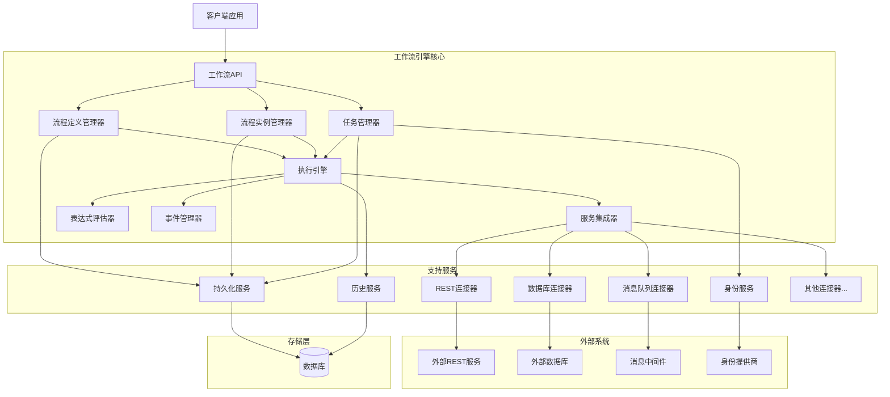
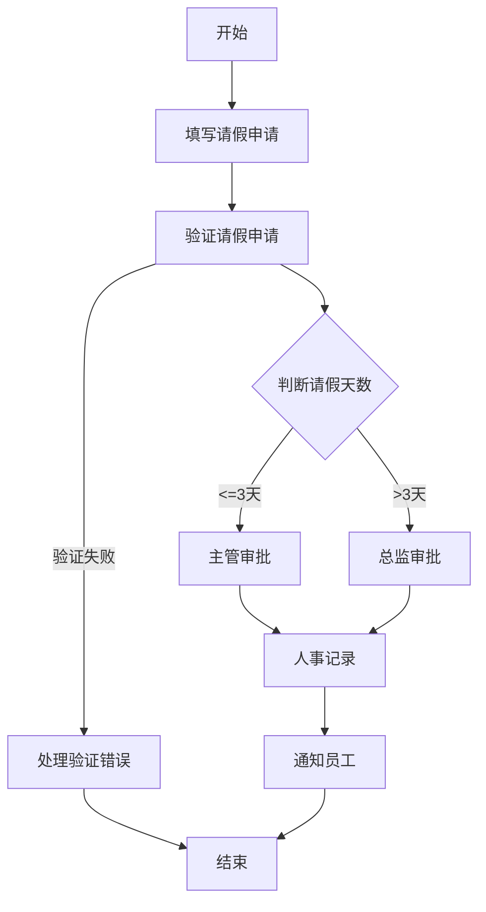

基于 JSON 的工作流系统全面设计与实现

## 1. 工作流定义与分类

### 1.1 工作流的基本概念

工作流(Workflow)是对业务过程的部分或整体在计算机上的自动化。目标是在正确的时间，把正确的信息，传递给正确的人，由他们完成正确的任务。

工作流系统根据一组规则自动执行业务流程。它定义、创建和管理工作流的执行，与参与者交互，在需要时调用外部工具和应用程序。

### 1.2 工作流的分类

根据不同的标准，工作流可以分为以下几类：

#### 1.2.1 按照流程结构分类

顺序工作流(Sequential Workflow)：

- 活动按照预定义的顺序一个接一个地执行
- 简单直观，适合固定流程的业务场景
- 例如：简单的文档审批流程

状态机工作流(State Machine Workflow)：

- 基于状态和转换的工作流模型
- 流程在不同状态间转换，每个状态可以有多个可能的后续状态
- 适合具有复杂状态转换的业务场景
- 例如：订单处理系统、问题跟踪系统

规则驱动工作流(Rule-driven Workflow)：

- 基于业务规则引擎的工作流
- 流程的路径由规则评估结果决定
- 适合决策逻辑频繁变化的业务场景
- 例如：贷款审批、保险理赔

数据驱动工作流(Data-driven Workflow)：

- 流程的执行由数据状态和变化驱动
- 适合以数据处理为中心的业务场景
- 例如：数据ETL流程、数据分析流程

#### 1.2.2 按照业务特性分类

人工工作流(Human Workflow)：

- 主要涉及人工任务和决策
- 强调用户交互和任务分配
- 例如：文档审批、请假流程

系统工作流(System Workflow)：

- 主要由系统自动执行的任务组成
- 很少或没有人工干预
- 例如：系统备份、数据同步

混合工作流(Hybrid Workflow)：

- 结合人工任务和系统任务
- 最常见的工作流类型
- 例如：订单处理、客户服务流程

#### 1.2.3 按照执行模式分类

同步工作流(Synchronous Workflow)：

- 流程步骤按顺序执行，一个步骤完成后才能开始下一个
- 简单直观，易于跟踪
- 例如：简单的表单处理流程

异步工作流(Asynchronous Workflow)：

- 流程步骤可以并行执行，不需要等待前一步骤完成
- 提高效率，但增加复杂性
- 例如：并行审批流程

长时间运行工作流(Long-running Workflow)：

- 执行时间可能很长(小时、天、周或更长)
- 需要处理中断、恢复和持久化
- 例如：贷款申请流程、项目管理流程

### 1.3 JSON工作流的特点

基于JSON的工作流使用JSON格式定义、存储和交换工作流定义。相比BPMN、XPDL等格式，有以下特点：

1. 简洁易读：JSON格式简洁明了，人类可读性强，降低了学习和使用门槛
2. 轻量级：相比XML等格式，JSON更加轻量，解析和传输效率更高
3. 广泛支持：几乎所有编程语言都内置或有第三方库支持JSON解析
4. 与Web技术兼容性好：作为Web API的标准数据交换格式，与现代Web应用无缝集成
5. 灵活性高：可以根据需要自定义结构，适应不同复杂度的工作流需求
6. 易于版本控制：文本格式便于使用Git等工具进行版本控制和差异比较
7. 支持嵌套和复杂结构：JSON的嵌套特性使其能够自然表达工作流的层次结构

## 2. 工作流设计核心原则

### 2.1 分离关注点

工作流设计应当将不同方面的功能分开处理：

流程定义与执行分离：

- 流程定义(什么是流程)应与流程执行(如何执行流程)分离
- 使流程定义可以独立于执行引擎进行设计和修改

业务逻辑与流程逻辑分离：

- 业务规则和决策逻辑应与流程控制流分离
- 便于业务规则的独立变更和重用

数据与流程分离：

- 流程变量和业务数据应与流程结构分离
- 允许同一流程处理不同的数据集

```text
{
  "id": "loan_approval",
  "name": "贷款审批流程",
  "version": "1.0",
  // 流程结构定义
  "nodes": [...],
  "transitions": [...],
  // 分离的数据定义
  "variables": [
    {
      "name": "applicantName",
      "type": "string"
    },
    {
      "name": "loanAmount",
      "type": "number"
    }
  ],
  // 分离的业务规则引用
  "businessRules": {
    "creditCheck": "credit_assessment_rules_v2",
    "riskEvaluation": "risk_rules_v1"
  }
}

```

### 2.2 声明式设计

工作流应采用声明式而非命令式的设计方法：描述做什么，而非怎么做。

描述"做什么"而非"怎么做"：

- 工作流定义应关注业务目标和状态转换
- 实现细节由工作流引擎和执行环境处理

基于状态和转换：

- 明确定义流程状态和状态间的有效转换
- 使流程逻辑更加清晰和可验证

条件和规则表达：

- 使用声明式表达式定义转换条件
- 便于非技术人员理解和验证

```text
{
  "transitions": [
    {
      "id": "t1",
      "sourceNodeId": "creditCheck",
      "targetNodeId": "managerApproval",
      // 声明式条件表达式
      "condition": "${creditScore > 700 && loanAmount < 50000}"
    }
  ]
}

```

### 2.3 可扩展性

工作流设计应考虑可扩展性：

模块化设计：

- 将工作流分解为可重用的组件和子流程
- 支持复杂流程的组合和管理

扩展点：

- 提供明确的扩展机制，如自定义节点类型、表达式函数等
- 允许在不修改核心引擎的情况下扩展功能

版本控制：

- 支持流程定义的版本管理
- 允许流程定义的平滑升级和回滚

```text
{
  "id": "customer_onboarding",
  "version": "2.1",
  // 子流程引用
  "nodes": [
    {
      "id": "identityVerification",
      "type": "subProcess",
      "properties": {
        "processDefinitionId": "identity_verification",
        "processDefinitionVersion": "1.2"
      }
    }
  ],
  // 自定义节点类型
  "customNodeTypes": [
    {
      "type": "fraudCheck",
      "handlerClass": "com.example.workflow.handlers.FraudCheckHandler"
    }
  ]
}

```

### 2.4 可观察性

工作流应设计为可观察的系统：

全面的日志记录：

- 记录流程执行的每个步骤和决策
- 支持不同级别的日志详细程度

状态可视化：

- 提供流程实例当前状态的可视化表示
- 支持流程历史的回放和分析

指标收集：

- 收集流程执行的性能和业务指标
- 支持流程优化和瓶颈识别

```json
{
  "settings": {
    "logging": {
      "level": "detailed",
      "includeVariables": ["applicationId", "status", "amount"],
      "excludeVariables": ["personalData", "creditCardNumber"]
    },
    "metrics": {
      "enabled": true,
      "collectPerformanceMetrics": true,
      "collectBusinessMetrics": true
    },
    "history": {
      "enabled": true,
      "level": "full"
    }
  }
}

```

### 2.5 容错性

工作流设计应考虑错误处理和恢复机制：

异常处理：

- 定义明确的错误处理策略
- 支持错误捕获、重试和补偿逻辑

事务管理：

- 确保流程状态的一致性
- 支持长时间运行事务和补偿事务

恢复机制：

- 支持从故障中恢复
- 保存检查点和恢复点

```text
{
  "nodes": [
    {
      "id": "paymentProcessing",
      "type": "serviceTask",
      "properties": {
        "service": "paymentService",
        "operation": "processPayment",
        // 错误处理配置
        "errorHandling": {
          "retryStrategy": {
            "maxRetries": 3,
            "retryInterval": "PT30S",
            "backoffMultiplier": 2
          },
          "fallbackNode": "manualPaymentReview"
        }
      }
    }
  ],
  // 补偿处理
  "compensations": [
    {
      "nodeId": "reserveInventory",
      "compensationNodeId": "releaseInventory"
    }
  ]
}

```

### 2.6 安全性

工作流设计应考虑安全性要求：

访问控制：

- 定义流程和任务级别的访问权限
- 支持基于角色和属性的访问控制

数据安全：

- 保护敏感流程数据
- 支持数据加密和脱敏

审计跟踪：

- 记录所有关键操作和决策
- 支持合规性和问责制

```text
{
  "security": {
    "accessControl": {
      "processLevel": {
        "view": ["admin", "manager", "auditor"],
        "manage": ["admin"]
      },
      "nodeLevel": {
        "approvalTask": {
          "execute": ["manager", "director"]
        }
      }
    },
    "dataProtection": {
      "sensitiveVariables": ["ssn", "creditCardNumber"],
      "encryption": {
        "enabled": true,
        "algorithm": "AES256"
      }
    },
    "audit": {
      "enabled": true,
      "includeUserActions": true,
      "includeSystemActions": true
    }
  }
}

```

## 3. 工作流引擎架构设计

### 3.1 工作流引擎核心组件

一个完整的基于JSON的工作流引擎通常包含以下核心组件：

#### 3.1.1 流程定义管理器

管理工作流定义的组件，功能包括解析和验证JSON定义、管理版本、存储和检索。

```text
/**
 * 流程定义管理器接口
 */
public interface ProcessDefinitionManager {
    /**
     * 部署新的流程定义
     * @param jsonDefinition JSON格式的流程定义
     * @return 部署ID
     */
    String deployProcessDefinition(String jsonDefinition);
  
    /**
     * 获取流程定义
     * @param processDefinitionId 流程定义ID
     * @param version 版本号(可选)
     * @return 流程定义对象
     */
    ProcessDefinition getProcessDefinition(String processDefinitionId, String version);
  
    /**
     * 验证流程定义
     * @param jsonDefinition JSON格式的流程定义
     * @return 验证结果
     */
    ValidationResult validateProcessDefinition(String jsonDefinition);
  
    /**
     * 列出所有流程定义
     * @return 流程定义列表
     */
    List<ProcessDefinitionSummary> listProcessDefinitions();
  
    /**
     * 删除流程定义
     * @param processDefinitionId 流程定义ID
     * @param version 版本号(可选)
     */
    void deleteProcessDefinition(String processDefinitionId, String version);
}

```

#### 3.1.2 流程实例管理器

管理工作流实例的组件，功能包括创建和启动实例、跟踪状态、管理流程变量。

```text
/**
 * 流程实例管理器接口
 */
public interface ProcessInstanceManager {
    /**
     * 创建并启动流程实例
     * @param processDefinitionId 流程定义ID
     * @param businessKey 业务键(可选)
     * @param variables 初始变量
     * @return 流程实例对象
     */
    ProcessInstance startProcess(String processDefinitionId, String businessKey, Map<String, Object> variables);
  
    /**
     * 获取流程实例
     * @param processInstanceId 流程实例ID
     * @return 流程实例对象
     */
    ProcessInstance getProcessInstance(String processInstanceId);
  
    /**
     * 暂停流程实例
     * @param processInstanceId 流程实例ID
     */
    void suspendProcess(String processInstanceId);
  
    /**
     * 恢复流程实例
     * @param processInstanceId 流程实例ID
     */
    void resumeProcess(String processInstanceId);
  
    /**
     * 终止流程实例
     * @param processInstanceId 流程实例ID
     * @param reason 终止原因
     */
    void terminateProcess(String processInstanceId, String reason);
  
    /**
     * 更新流程变量
     * @param processInstanceId 流程实例ID
     * @param variables 变量映射
     */
    void updateVariables(String processInstanceId, Map<String, Object> variables);
  
    /**
     * 查询流程实例
     * @param criteria 查询条件
     * @return 流程实例列表
     */
    List<ProcessInstance> queryProcessInstances(ProcessInstanceQuery criteria);
}

```

#### 3.1.3 任务管理器

管理人工任务的组件，功能包括创建和分配任务、管理任务生命周期、提供任务查询。

```text
/**
 * 任务管理器接口
 */
public interface TaskManager {
    /**
     * 创建任务
     * @param processInstanceId 流程实例ID
     * @param taskDefinition 任务定义
     * @return 任务ID
     */
    String createTask(String processInstanceId, TaskDefinition taskDefinition);
  
    /**
     * 分配任务
     * @param taskId 任务ID
     * @param userId 用户ID
     */
    void assignTask(String taskId, String userId);
  
    /**
     * 认领任务
     * @param taskId 任务ID
     * @param userId 用户ID
     */
    void claimTask(String taskId, String userId);
  
    /**
     * 完成任务
     * @param taskId 任务ID
     * @param variables 任务输出变量
     */
    void completeTask(String taskId, Map<String, Object> variables);
  
    /**
     * 获取任务
     * @param taskId 任务ID
     * @return 任务对象
     */
    Task getTask(String taskId);
  
    /**
     * 查询任务
     * @param criteria 查询条件
     * @return 任务列表
     */
    List<Task> queryTasks(TaskQuery criteria);
  
    /**
     * 设置任务到期日
     * @param taskId 任务ID
     * @param dueDate 到期日
     */
    void setTaskDueDate(String taskId, Date dueDate);
  
    /**
     * 添加任务评论
     * @param taskId 任务ID
     * @param userId 用户ID
     * @param comment 评论内容
     */
    void addTaskComment(String taskId, String userId, String comment);
}

```

#### 3.1.4 执行引擎

执行工作流逻辑的核心组件，功能包括执行各类节点、评估条件表达式、处理事件。

```text
/**
 * 执行引擎接口
 */
public interface ExecutionEngine {
    /**
     * 执行当前节点
     * @param execution 执行上下文
     */
    void executeNode(ExecutionContext execution);
  
    /**
     * 评估条件表达式
     * @param expression 表达式
     * @param variables 变量映射
     * @return 评估结果
     */
    Object evaluateExpression(String expression, Map<String, Object> variables);
  
    /**
     * 处理节点转换
     * @param execution 执行上下文
     * @param sourceNodeId 源节点ID
     */
    void handleOutgoingTransitions(ExecutionContext execution, String sourceNodeId);
  
    /**
     * 触发事件
     * @param execution 执行上下文
     * @param eventType 事件类型
     * @param eventData 事件数据
     */
    void fireEvent(ExecutionContext execution, String eventType, Map<String, Object> eventData);
  
    /**
     * 处理异常
     * @param execution 执行上下文
     * @param exception 异常
     */
    void handleException(ExecutionContext execution, Exception exception);
}

```

#### 3.1.5 服务集成器

与外部系统和服务集成的组件，功能包括调用外部服务API、数据格式转换、管理连接器。

```text
/**
 * 服务集成器接口
 */
public interface ServiceIntegrator {
    /**
     * 调用服务
     * @param serviceType 服务类型
     * @param operation 操作名称
     * @param parameters 参数映射
     * @return 服务调用结果
     */
    Object invokeService(String serviceType, String operation, Map<String, Object> parameters);
  
    /**
     * 异步调用服务
     * @param serviceType 服务类型
     * @param operation 操作名称
     * @param parameters 参数映射
     * @param callback 回调处理器
     */
    void invokeServiceAsync(String serviceType, String operation, Map<String, Object> parameters, ServiceCallback callback);
  
    /**
     * 注册服务连接器
     * @param serviceType 服务类型
     * @param connector 连接器实现
     */
    void registerServiceConnector(String serviceType, ServiceConnector connector);
  
    /**
     * 获取已注册的服务类型
     * @return 服务类型列表
     */
    List<String> getRegisteredServiceTypes();
  
    /**
     * 测试服务连接
     * @param serviceType 服务类型
     * @return 连接测试结果
     */
    ConnectionTestResult testServiceConnection(String serviceType);
}

```

#### 3.1.6 历史服务

记录和查询工作流历史数据的组件，功能包括记录流程实例和任务历史、提供历史查询、管理归档。

```text
/**
 * 历史服务接口
 */
public interface HistoryService {
    /**
     * 记录流程实例事件
     * @param processInstance 流程实例
     * @param eventType 事件类型
     * @param details 事件详情
     */
    void recordProcessInstanceEvent(ProcessInstance processInstance, String eventType, Map<String, Object> details);
  
    /**
     * 记录任务事件
     * @param task 任务
     * @param eventType 事件类型
     * @param userId 用户ID
     * @param details 事件详情
     */
    void recordTaskEvent(Task task, String eventType, String userId, Map<String, Object> details);
  
    /**
     * 记录变量变更
     * @param processInstanceId 流程实例ID
     * @param variableName 变量名
     * @param oldValue 旧值
     * @param newValue 新值
     */
    void recordVariableChange(String processInstanceId, String variableName, Object oldValue, Object newValue);
  
    /**
     * 查询流程实例历史
     * @param criteria 查询条件
     * @return 流程实例历史列表
     */
    List<ProcessInstanceHistory> queryProcessHistory(ProcessHistoryQuery criteria);
  
    /**
     * 查询任务历史
     * @param criteria 查询条件
     * @return 任务历史列表
     */
    List<TaskHistory> queryTaskHistory(TaskHistoryQuery criteria);
  
    /**
     * 生成流程统计报告
     * @param reportDefinition 报告定义
     * @return 统计报告
     */
    ProcessStatisticsReport generateStatisticsReport(ReportDefinition reportDefinition);
  
    /**
     * 清理历史数据
     * @param criteria 清理条件
     * @return 清理结果
     */
    CleanupResult cleanupHistory(HistoryCleanupCriteria criteria);
}

```

#### 3.1.7 身份与授权服务

管理用户、组和权限的组件，功能包括用户和组管理、权限检查、与外部身份系统集成。

```text
/**
 * 身份与授权服务接口
 */
public interface IdentityService {
    /**
     * 验证用户
     * @param userId 用户ID
     * @param credentials 凭证
     * @return 验证结果
     */
    boolean authenticateUser(String userId, Object credentials);
  
    /**
     * 获取用户信息
     * @param userId 用户ID
     * @return 用户信息
     */
    User getUser(String userId);
  
    /**
     * 获取用户所属组
     * @param userId 用户ID
     * @return 组列表
     */
    List<Group> getUserGroups(String userId);
  
    /**
     * 获取组成员
     * @param groupId 组ID
     * @return 用户列表
     */
    List<User> getGroupMembers(String groupId);
  
    /**
     * 检查权限
     * @param userId 用户ID
     * @param permission 权限
     * @param resourceId 资源ID
     * @return 是否有权限
     */
    boolean checkPermission(String userId, String permission, String resourceId);
  
    /**
     * 分配任务候选人
     * @param taskDefinition 任务定义
     * @param processVariables 流程变量
     * @return 候选人列表
     */
    List<String> resolveTaskCandidates(TaskDefinition taskDefinition, Map<String, Object> processVariables);
}

```

### 3.2 JSON工作流引擎架构图



### 3.3 JSON工作流定义结构

一个完整的JSON工作流定义通常包含以下核心元素：

#### 3.3.1 基本结构

```text
{
  "id": "loan_approval_process",
  "name": "贷款审批流程",
  "version": "1.0",
  "description": "处理贷款申请的审批流程",
  
  "variables": [
    // 流程变量定义
  ],
  
  "nodes": [
    // 节点定义
  ],
  
  "transitions": [
    // 转换定义
  ],
  
  "settings": {
    // 流程设置
  }
}

```

#### 3.3.2 变量定义

```text
"variables": [
  {
    "name": "applicantName",
    "type": "string",
    "description": "申请人姓名",
    "required": true
  },
  {
    "name": "loanAmount",
    "type": "number",
    "description": "贷款金额",
    "required": true,
    "validation": {
      "min": 1000,
      "max": 1000000
    }
  },
  {
    "name": "creditScore",
    "type": "number",
    "description": "信用评分",
    "defaultValue": 0
  },
  {
    "name": "approved",
    "type": "boolean",
    "description": "是否批准",
    "defaultValue": false
  },
  {
    "name": "applicationDate",
    "type": "date",
    "description": "申请日期",
    "defaultValue": "${now()}"
  }
]

```

#### 3.3.3 节点定义

```text
"nodes": [
  {
    "id": "start",
    "name": "开始",
    "type": "startEvent",
    "properties": {
      "initiator": "${currentUser}"
    }
  },
  {
    "id": "collectApplicationInfo",
    "name": "收集申请信息",
    "type": "userTask",
    "properties": {
      "formKey": "loan_application_form",
      "assignee": "${initiator}",
      "dueDate": "${now() + 'P3D'}",
      "priority": "normal",
      "formProperties": [
        {
          "id": "applicantName",
          "name": "申请人姓名",
          "type": "string",
          "required": true
        },
        {
          "id": "loanAmount",
          "name": "贷款金额",
          "type": "number",
          "required": true
        },
        {
          "id": "loanPurpose",
          "name": "贷款用途",
          "type": "enum",
          "enumValues": [
            {"id": "home", "name": "购房"},
            {"id": "car", "name": "购车"},
            {"id": "education", "name": "教育"},
            {"id": "other", "name": "其他"}
          ]
        }
      ]
    }
  },
  {
    "id": "creditCheck",
    "name": "信用检查",
    "type": "serviceTask",
    "properties": {
      "serviceType": "creditService",
      "operation": "checkCredit",
      "parameterMappings": {
        "applicantId": "applicantId",
        "applicantName": "applicantName"
      },
      "resultVariable": "creditCheckResult",
      "errorHandling": {
        "retryStrategy": {
          "maxRetries": 3,
          "retryInterval": "PT30S",
          "exponentialBackoff": true
        },
        "fallbackNode": "manualCreditCheck"
      }
    }
  },
  {
    "id": "loanAmountCheck",
    "name": "贷款金额检查",
    "type": "exclusiveGateway",
    "properties": {
      "defaultFlow": "t4"
    }
  },
  {
    "id": "managerApproval",
    "name": "经理审批",
    "type": "userTask",
    "properties": {
      "formKey": "manager_approval_form",
      "candidateGroups": ["loan_managers"],
      "dueDate": "${now() + 'P2D'}",
      "priority": "high",
      "formProperties": [
        {
          "id": "approved",
          "name": "是否批准",
          "type": "boolean",
          "required": true
        },
        {
          "id": "comments",
          "name": "审批意见",
          "type": "text"
        }
      ]
    }
  },
  {
    "id": "directorApproval",
    "name": "总监审批",
    "type": "userTask",
    "properties": {
      "formKey": "director_approval_form",
      "candidateGroups": ["loan_directors"],
      "dueDate": "${now() + 'P2D'}",
      "priority": "highest",
      "formProperties": [
        {
          "id": "approved",
          "name": "是否批准",
          "type": "boolean",
          "required": true
        },
        {
          "id": "comments",
          "name": "审批意见",
          "type": "text"
        }
      ]
    }
  },
  {
    "id": "sendApprovalNotification",
    "name": "发送批准通知",
    "type": "serviceTask",
    "properties": {
      "serviceType": "notificationService",
      "operation": "sendEmail",
      "parameterMappings": {
        "to": "applicantEmail",
        "subject": "'贷款申请已批准'",
        "template": "'loan_approval_template'",
        "templateData": {
          "applicantName": "applicantName",
          "loanAmount": "loanAmount",
          "approvalDate": "${now()}"
        }
      }
    }
  },
  {
    "id": "sendRejectionNotification",
    "name": "发送拒绝通知",
    "type": "serviceTask",
    "properties": {
      "serviceType": "notificationService",
      "operation": "sendEmail",
      "parameterMappings": {
        "to": "applicantEmail",
        "subject": "'贷款申请未获批准'",
        "template": "'loan_rejection_template'",
        "templateData": {
          "applicantName": "applicantName",
          "rejectionReason": "comments"
        }
      }
    }
  },
  {
    "id": "end",
    "name": "结束",
    "type": "endEvent",
    "properties": {}
  }
]

```

#### 3.3.4 转换定义

```text
"transitions": [
  {
    "id": "t1",
    "sourceNodeId": "start",
    "targetNodeId": "collectApplicationInfo",
    "condition": null
  },
  {
    "id": "t2",
    "sourceNodeId": "collectApplicationInfo",
    "targetNodeId": "creditCheck",
    "condition": null
  },
  {
    "id": "t3",
    "sourceNodeId": "creditCheck",
    "targetNodeId": "loanAmountCheck",
    "condition": null
  },
  {
    "id": "t4",
    "sourceNodeId": "loanAmountCheck",
    "targetNodeId": "managerApproval",
    "condition": "${loanAmount <= 50000 && creditCheckResult.score >= 600}"
  },
  {
    "id": "t5",
    "sourceNodeId": "loanAmountCheck",
    "targetNodeId": "directorApproval",
    "condition": "${loanAmount > 50000 || creditCheckResult.score < 600}"
  },
  {
    "id": "t6",
    "sourceNodeId": "managerApproval",
    "targetNodeId": "sendApprovalNotification",
    "condition": "${approved == true}"
  },
  {
    "id": "t7",
    "sourceNodeId": "managerApproval",
    "targetNodeId": "sendRejectionNotification",
    "condition": "${approved == false}"
  },
  {
    "id": "t8",
    "sourceNodeId": "directorApproval",
    "targetNodeId": "sendApprovalNotification",
    "condition": "${approved == true}"
  },
  {
    "id": "t9",
    "sourceNodeId": "directorApproval",
    "targetNodeId": "sendRejectionNotification",
    "condition": "${approved == false}"
  },
  {
    "id": "t10",
    "sourceNodeId": "sendApprovalNotification",
    "targetNodeId": "end",
    "condition": null
  },
  {
    "id": "t11",
    "sourceNodeId": "sendRejectionNotification",
    "targetNodeId": "end",
    "condition": null
  }
]

```

#### 3.3.5 流程设置

```text
"settings": {
  "historyLevel": "full",
  "enableNotifications": true,
  "defaultTaskDueTime": "P3D",
  "executionTimeout": "P30D",
  "accessControl": {
    "viewPermission": ["admin", "loan_officers", "loan_managers"],
    "managePermission": ["admin", "loan_managers"]
  },
  "metrics": {
    "collect": true,
    "slaDefinitions": [
      {
        "name": "totalProcessingTime",
        "description": "从开始到结束的总处理时间",
        "threshold": "P5D",
        "severity": "medium"
      },
      {
        "name": "creditCheckResponseTime",
        "description": "信用检查服务响应时间",
        "threshold": "PT30S",
        "severity": "high"
      }
    ]
  }
}

```

### 3.4 工作流引擎实现示例

以下是一个简化的工作流引擎核心实现示例，展示了如何处理JSON工作流定义：

#### 3.4.1 工作流引擎核心

```java
/**
 * JSON工作流引擎实现
 */
public class JsonWorkflowEngine implements WorkflowEngine {
    private ProcessDefinitionManager processDefinitionManager;
    private ProcessInstanceManager processInstanceManager;
    private TaskManager taskManager;
    private ExecutionEngine executionEngine;
    private ServiceIntegrator serviceIntegrator;
    private HistoryService historyService;
    private IdentityService identityService;
  
    // 构造函数注入依赖...
  
    /**
     * 部署工作流定义
     */
    @Override
    public String deployProcessDefinition(String jsonDefinition) {
        // 验证JSON定义
        ValidationResult validationResult = processDefinitionManager.validateProcessDefinition(jsonDefinition);
        if (!validationResult.isValid()) {
            throw new WorkflowDefinitionException("Invalid workflow definition: " + 
                                                 String.join(", ", validationResult.getErrors()));
        }
  
        // 部署流程定义
        return processDefinitionManager.deployProcessDefinition(jsonDefinition);
    }
  
    /**
     * 启动工作流实例
     */
    @Override
    public ProcessInstance startProcess(String processDefinitionId, String businessKey, Map<String, Object> variables) {
        // 获取流程定义
        ProcessDefinition processDefinition = processDefinitionManager.getProcessDefinition(processDefinitionId, null);
        if (processDefinition == null) {
            throw new WorkflowNotFoundException("Process definition not found: " + processDefinitionId);
        }
  
        // 验证必填变量
        validateRequiredVariables(processDefinition, variables);
  
        // 创建流程实例
        ProcessInstance processInstance = processInstanceManager.startProcess(
            processDefinitionId, businessKey, variables);
  
        // 记录历史
        historyService.recordProcessInstanceEvent(
            processInstance, "STARTED", Collections.singletonMap("startedBy", getCurrentUserId()));
  
        // 查找开始节点
        NodeDefinition startNode = findStartNode(processDefinition);
        if (startNode == null) {
            throw new WorkflowDefinitionException("No start node found in process: " + processDefinitionId);
        }
  
        // 创建执行上下文
        ExecutionContext executionContext = createExecutionContext(processInstance, processDefinition);
  
        // 执行开始节点
        executionEngine.executeNode(executionContext);
  
        return processInstance;
    }
  
    /**
     * 完成任务
     */
    @Override
    public void completeTask(String taskId, Map<String, Object> variables) {
        // 获取任务
        Task task = taskManager.getTask(taskId);
        if (task == null) {
            throw new TaskNotFoundException("Task not found: " + taskId);
        }
  
        // 检查任务状态
        if (task.getStatus() != TaskStatus.ASSIGNED && task.getStatus() != TaskStatus.STARTED) {
            throw new InvalidTaskStateException("Task cannot be completed in state: " + task.getStatus());
        }
  
        // 检查权限
        if (!identityService.checkPermission(getCurrentUserId(), "complete", taskId)) {
            throw new UnauthorizedException("User not authorized to complete this task");
        }
  
        // 完成任务
        taskManager.completeTask(taskId, variables);
  
        // 记录历史
        historyService.recordTaskEvent(
            task, "COMPLETED", getCurrentUserId(), Collections.singletonMap("variables", variables));
  
        // 获取流程实例和定义
        ProcessInstance processInstance = processInstanceManager.getProcessInstance(task.getProcessInstanceId());
        ProcessDefinition processDefinition = processDefinitionManager.getProcessDefinition(
            processInstance.getProcessDefinitionId(), processInstance.getProcessDefinitionVersion());
  
        // 更新流程变量
        if (variables != null && !variables.isEmpty()) {
            processInstanceManager.updateVariables(processInstance.getId(), variables);
        }
  
        // 创建执行上下文
        ExecutionContext executionContext = createExecutionContext(processInstance, processDefinition);
  
        // 处理后续流转
        NodeDefinition currentNode = findNodeById(processDefinition, task.getNodeId());
        executionEngine.handleOutgoingTransitions(executionContext, currentNode.getId());
    }
  
    /**
     * 查询任务
     */
    @Override
    public List<Task> queryTasks(TaskQuery query) {
        // 添加权限过滤
        String currentUserId = getCurrentUserId();
        if (!isAdmin(currentUserId)) {
            query.setAssigneeOrCandidate(currentUserId);
        }
  
        return taskManager.queryTasks(query);
    }
  
    /**
     * 获取流程实例
     */
    @Override
    public ProcessInstance getProcessInstance(String processInstanceId) {
        ProcessInstance instance = processInstanceManager.getProcessInstance(processInstanceId);
        if (instance == null) {
            throw new WorkflowNotFoundException("Process instance not found: " + processInstanceId);
        }
  
        // 检查权限
        if (!identityService.checkPermission(getCurrentUserId(), "view", processInstanceId)) {
            throw new UnauthorizedException("User not authorized to view this process instance");
        }
  
        return instance;
    }
  
    // 其他工作流操作方法...
  
    /**
     * 创建执行上下文
     */
    private ExecutionContext createExecutionContext(ProcessInstance processInstance, ProcessDefinition processDefinition) {
        ExecutionContext context = new ExecutionContext();
        context.setProcessInstance(processInstance);
        context.setProcessDefinition(processDefinition);
        context.setVariables(new HashMap<>(processInstance.getVariables()));
        context.setServiceIntegrator(serviceIntegrator);
        context.setTaskManager(taskManager);
        context.setHistoryService(historyService);
        context.setIdentityService(identityService);
        return context;
    }
  
    /**
     * 查找开始节点
     */
    private NodeDefinition findStartNode(ProcessDefinition processDefinition) {
        for (NodeDefinition node : processDefinition.getNodes()) {
            if (node.getType().equals("startEvent")) {
                return node;
            }
        }
        return null;
    }
  
    /**
     * 根据ID查找节点
     */
    private NodeDefinition findNodeById(ProcessDefinition processDefinition, String nodeId) {
        for (NodeDefinition node : processDefinition.getNodes()) {
            if (node.getId().equals(nodeId)) {
                return node;
            }
        }
        return null;
    }
  
    /**
     * 验证必填变量
     */
    private void validateRequiredVariables(ProcessDefinition processDefinition, Map<String, Object> variables) {
        List<String> missingVariables = new ArrayList<>();
  
        for (VariableDefinition varDef : processDefinition.getVariables()) {
            if (Boolean.TRUE.equals(varDef.getRequired()) && 
                !variables.containsKey(varDef.getName()) && 
                varDef.getDefaultValue() == null) {
                missingVariables.add(varDef.getName());
            }
        }
  
        if (!missingVariables.isEmpty()) {
            throw new WorkflowValidationException("Missing required variables: " + 
                                                 String.join(", ", missingVariables));
        }
    }
  
    /**
     * 获取当前用户ID
     */
    private String getCurrentUserId() {
        return SecurityContextHolder.getContext().getAuthentication().getName();
    }
  
    /**
     * 检查是否管理员
     */
    private boolean isAdmin(String userId) {
        return identityService.checkPermission(userId, "admin", "*");
    }
}

```

#### 3.4.2 执行引擎实现

```java
/**
 * 执行引擎实现
 */
public class DefaultExecutionEngine implements ExecutionEngine {
    private Map<String, NodeHandler> nodeHandlers;
    private ExpressionEvaluator expressionEvaluator;
    private EventManager eventManager;
  
    /**
     * 构造函数
     */
    public DefaultExecutionEngine() {
        this.nodeHandlers = new HashMap<>();
        this.expressionEvaluator = new SpelExpressionEvaluator();
        this.eventManager = new DefaultEventManager();
  
        // 注册默认节点处理器
        registerDefaultNodeHandlers();
    }
  
    /**
     * 注册节点处理器
     */
    public void registerNodeHandler(String nodeType, NodeHandler handler) {
        nodeHandlers.put(nodeType, handler);
    }
  
    /**
     * 注册默认节点处理器
     */
    private void registerDefaultNodeHandlers() {
        registerNodeHandler("startEvent", new StartEventHandler());
        registerNodeHandler("endEvent", new EndEventHandler());
        registerNodeHandler("userTask", new UserTaskHandler());
        registerNodeHandler("serviceTask", new ServiceTaskHandler());
        registerNodeHandler("scriptTask", new ScriptTaskHandler());
        registerNodeHandler("exclusiveGateway", new ExclusiveGatewayHandler());
        registerNodeHandler("parallelGateway", new ParallelGatewayHandler());
        registerNodeHandler("inclusiveGateway", new InclusiveGatewayHandler());
        registerNodeHandler("timerEvent", new TimerEventHandler());
        registerNodeHandler("subProcess", new SubProcessHandler());
    }
  
    /**
     * 执行节点
     */
    @Override
    public void executeNode(ExecutionContext execution) {
        ProcessInstance processInstance = execution.getProcessInstance();
        ProcessDefinition processDefinition = execution.getProcessDefinition();
        String currentNodeId = processInstance.getCurrentNodeId();
  
        // 如果没有当前节点ID，使用开始节点
        if (currentNodeId == null) {
            NodeDefinition startNode = findStartNode(processDefinition);
            if (startNode == null) {
                throw new WorkflowExecutionException("No start node found");
            }
            currentNodeId = startNode.getId();
            processInstance.setCurrentNodeId(currentNodeId);
        }
  
        // 查找当前节点定义
        NodeDefinition currentNode = findNodeById(processDefinition, currentNodeId);
        if (currentNode == null) {
            throw new WorkflowExecutionException("Node not found: " + currentNodeId);
        }
  
        try {
            // 触发节点进入事件
            fireEvent(execution, "node.enter", Map.of("nodeId", currentNodeId, "nodeType", currentNode.getType()));
      
            // 获取节点处理器
            NodeHandler handler = nodeHandlers.get(currentNode.getType());
            if (handler == null) {
                throw new WorkflowExecutionException("No handler found for node type: " + currentNode.getType());
            }
      
            // 执行节点
            handler.execute(execution, currentNode);
      
            // 触发节点离开事件
            fireEvent(execution, "node.leave", Map.of("nodeId", currentNodeId, "nodeType", currentNode.getType()));
      
            // 如果是自动节点，处理后续流转
            if (isAutoNode(currentNode.getType())) {
                handleOutgoingTransitions(execution, currentNodeId);
            }
        } catch (Exception e) {
            // 处理异常
            handleException(execution, e);
        }
    }
  
    /**
     * 处理节点的后续转换
     */
    @Override
    public void handleOutgoingTransitions(ExecutionContext execution, String sourceNodeId) {
        ProcessDefinition processDefinition = execution.getProcessDefinition();
        NodeDefinition sourceNode = findNodeById(processDefinition, sourceNodeId);
  
        // 查找所有出口转换
        List<TransitionDefinition> outgoingTransitions = findOutgoingTransitions(processDefinition, sourceNodeId);
  
        // 如果没有出口转换，结束流程
        if (outgoingTransitions.isEmpty()) {
            if (!sourceNode.getType().equals("endEvent")) {
                fireEvent(execution, "process.deadEnd", Map.of("nodeId", sourceNodeId));
            }
            return;
        }
  
        // 根据节点类型处理转换
        switch (sourceNode.getType()) {
            case "exclusiveGateway":
                handleExclusiveGatewayTransitions(execution, sourceNode, outgoingTransitions);
                break;
          
            case "parallelGateway":
                handleParallelGatewayTransitions(execution, sourceNode, outgoingTransitions);
                break;
          
            case "inclusiveGateway":
                handleInclusiveGatewayTransitions(execution, sourceNode, outgoingTransitions);
                break;
          
            default:
                // 普通节点：执行第一个满足条件的转换
                for (TransitionDefinition transition : outgoingTransitions) {
                    if (evaluateCondition(execution, transition)) {
                        executeTransition(execution, transition);
                        return;
                    }
                }
          
                // 如果没有满足条件的转换，记录警告
                fireEvent(execution, "process.noValidTransition", Map.of("nodeId", sourceNodeId));
                break;
        }
    }
  
    /**
     * 处理排他网关转换
     */
    private void handleExclusiveGatewayTransitions(
            ExecutionContext execution, 
            NodeDefinition gateway, 
            List<TransitionDefinition> outgoingTransitions) {
  
        // 获取默认流
        String defaultFlow = (String) gateway.getProperties().getOrDefault("defaultFlow", "");
        TransitionDefinition defaultTransition = null;
  
        // 查找满足条件的转换
        for (TransitionDefinition transition : outgoingTransitions) {
            // 保存默认流转
            if (transition.getId().equals(defaultFlow)) {
                defaultTransition = transition;
                continue;
            }
      
            // 评估条件
            if (evaluateCondition(execution, transition)) {
                executeTransition(execution, transition);
                return;
            }
        }
  
        // 如果没有条件满足且有默认流转，则执行默认流转
        if (defaultTransition != null) {
            executeTransition(execution, defaultTransition);
            return;
        }
  
        // 如果没有可执行的转换，抛出异常
        throw new WorkflowExecutionException("No valid outgoing transition found for exclusive gateway: " + gateway.getId());
    }
  
    /**
     * 处理并行网关转换
     */
    private void handleParallelGatewayTransitions(
            ExecutionContext execution, 
            NodeDefinition gateway, 
            List<TransitionDefinition> outgoingTransitions) {
  
        // 创建并行执行分支
        List<ExecutionContext> parallelExecutions = new ArrayList<>();
  
        // 第一个分支使用当前执行上下文
        parallelExecutions.add(execution);
  
        // 为其他分支创建新的执行上下文
        for (int i = 1; i < outgoingTransitions.size(); i++) {
            ExecutionContext parallelExecution = execution.createParallelExecution();
            parallelExecutions.add(parallelExecution);
        }
  
        // 执行每个分支
        for (int i = 0; i < outgoingTransitions.size(); i++) {
            TransitionDefinition transition = outgoingTransitions.get(i);
            ExecutionContext parallelExecution = parallelExecutions.get(i);
      
            // 执行转换
            executeTransition(parallelExecution, transition);
        }
    }
  
    /**
     * 处理包容网关转换
     */
    private void handleInclusiveGatewayTransitions(
            ExecutionContext execution, 
            NodeDefinition gateway, 
            List<TransitionDefinition> outgoingTransitions) {
  
        // 获取默认流
        String defaultFlow = (String) gateway.getProperties().getOrDefault("defaultFlow", "");
        TransitionDefinition defaultTransition = null;
  
        // 查找所有满足条件的转换
        List<TransitionDefinition> validTransitions = new ArrayList<>();
  
        for (TransitionDefinition transition : outgoingTransitions) {
            // 保存默认流转
            if (transition.getId().equals(defaultFlow)) {
                defaultTransition = transition;
                continue;
            }
      
            // 评估条件
            if (evaluateCondition(execution, transition)) {
                validTransitions.add(transition);
            }
        }
  
        // 如果没有满足条件的转换且有默认流转，则使用默认流转
        if (validTransitions.isEmpty() && defaultTransition != null) {
            validTransitions.add(defaultTransition);
        }
  
        // 如果没有可执行的转换，抛出异常
        if (validTransitions.isEmpty()) {
            throw new WorkflowExecutionException("No valid outgoing transition found for inclusive gateway: " + gateway.getId());
        }
  
        // 创建并行执行分支
        List<ExecutionContext> parallelExecutions = new ArrayList<>();
  
        // 第一个分支使用当前执行上下文
        parallelExecutions.add(execution);
  
        // 为其他分支创建新的执行上下文
        for (int i = 1; i < validTransitions.size(); i++) {
            ExecutionContext parallelExecution = execution.createParallelExecution();
            parallelExecutions.add(parallelExecution);
        }
  
        // 执行每个分支
        for (int i = 0; i < validTransitions.size(); i++) {
            TransitionDefinition transition = validTransitions.get(i);
            ExecutionContext parallelExecution = parallelExecutions.get(i);
      
            // 执行转换
            executeTransition(parallelExecution, transition);
        }
    }
  
    /**
     * 执行转换
     */
    private void executeTransition(ExecutionContext execution, TransitionDefinition transition) {
        ProcessInstance processInstance = execution.getProcessInstance();
  
        // 触发转换事件
        fireEvent(execution, "transition.take", Map.of(
            "transitionId", transition.getId(),
            "sourceNodeId", transition.getSourceNodeId(),
            "targetNodeId", transition.getTargetNodeId()
        ));
  
        // 更新当前节点
        processInstance.setCurrentNodeId(transition.getTargetNodeId());
  
        // 执行目标节点
        executeNode(execution);
    }
  
    /**
     * 评估条件表达式
     */
    @Override
    public Object evaluateExpression(String expression, Map<String, Object> variables) {
        if (expression == null || expression.trim().isEmpty()) {
            return true; // 空条件视为总是满足
        }
  
        try {
            return expressionEvaluator.evaluate(expression, variables);
        } catch (Exception e) {
            throw new ExpressionEvaluationException("Error evaluating expression: " + expression, e);
        }
    }
  
    /**
     * 评估转换条件
     */
    private boolean evaluateCondition(ExecutionContext execution, TransitionDefinition transition) {
        String condition = transition.getCondition();
  
        // 如果没有条件，视为总是满足
        if (condition == null || condition.trim().isEmpty()) {
            return true;
        }
  
        // 评估条件
        Object result = evaluateExpression(condition, execution.getVariables());
  
        // 确保结果是布尔值
        if (result instanceof Boolean) {
            return (Boolean) result;
        } else {
            throw new ExpressionEvaluationException("Condition did not evaluate to a boolean: " + condition);
        }
    }
  
    /**
     * 触发事件
     */
    @Override
    public void fireEvent(ExecutionContext execution, String eventType, Map<String, Object> eventData) {
        Map<String, Object> fullEventData = new HashMap<>(eventData);
        fullEventData.put("processInstanceId", execution.getProcessInstance().getId());
        fullEventData.put("processDefinitionId", execution.getProcessDefinition().getId());
        fullEventData.put("timestamp", new Date());
  
        WorkflowEvent event = new WorkflowEvent(eventType, fullEventData);
        eventManager.fireEvent(event);
  
        // 记录事件到历史服务
        execution.getHistoryService().recordProcessInstanceEvent(
            execution.getProcessInstance(), eventType, fullEventData);
    }
  
    /**
     * 处理异常
     */
    @Override
    public void handleException(ExecutionContext execution, Exception exception) {
        ProcessInstance processInstance = execution.getProcessInstance();
        String currentNodeId = processInstance.getCurrentNodeId();
  
        // 记录异常
        Map<String, Object> exceptionData = new HashMap<>();
        exceptionData.put("nodeId", currentNodeId);
        exceptionData.put("exceptionClass", exception.getClass().getName());
        exceptionData.put("exceptionMessage", exception.getMessage());
        exceptionData.put("stackTrace", getStackTraceAsString(exception));
  
        fireEvent(execution, "process.error", exceptionData);
  
        // 查找节点的错误处理配置
        NodeDefinition currentNode = findNodeById(execution.getProcessDefinition(), currentNodeId);
        if (currentNode != null) {
            @SuppressWarnings("unchecked")
            Map<String, Object> errorHandling = (Map<String, Object>) currentNode.getProperties().get("errorHandling");
      
            if (errorHandling != null) {
                // 处理重试策略
                @SuppressWarnings("unchecked")
                Map<String, Object> retryStrategy = (Map<String, Object>) errorHandling.get("retryStrategy");
                if (retryStrategy != null) {
                    handleRetry(execution, currentNode, retryStrategy, exception);
                    return;
                }
          
                // 处理错误转向
                String errorNodeId = (String) errorHandling.get("errorNodeId");
                if (errorNodeId != null) {
                    // 转向错误处理节点
                    processInstance.setCurrentNodeId(errorNodeId);
                    executeNode(execution);
                    return;
                }
            }
        }
  
        // 如果没有特定的错误处理，将流程标记为失败
        processInstance.setStatus(ProcessStatus.FAILED);
        processInstance.setEndTime(new Date());
        processInstance.setErrorMessage(exception.getMessage());
  
        // 触发流程失败事件
        fireEvent(execution, "process.failed", exceptionData);
  
        // 重新抛出异常
        if (exception instanceof WorkflowException) {
            throw (WorkflowException) exception;
        } else {
            throw new WorkflowExecutionException("Error executing workflow", exception);
        }
    }
  
    /**
     * 处理重试逻辑
     */
    private void handleRetry(
            ExecutionContext execution, 
            NodeDefinition node, 
            Map<String, Object> retryStrategy, 
            Exception exception) {
  
        ProcessInstance processInstance = execution.getProcessInstance();
  
        // 获取重试配置
        int maxRetries = ((Number) retryStrategy.getOrDefault("maxRetries", 0)).intValue();
        String retryIntervalStr = (String) retryStrategy.getOrDefault("retryInterval", "PT10S");
        boolean exponentialBackoff = Boolean.TRUE.equals(retryStrategy.get("exponentialBackoff"));
  
        // 获取当前重试次数
        String retryCountKey = "_retryCount_" + node.getId();
        Integer currentRetries = (Integer) execution.getVariables().getOrDefault(retryCountKey, 0);
  
        if (currentRetries < maxRetries) {
            // 增加重试计数
            currentRetries++;
            execution.getVariables().put(retryCountKey, currentRetries);
      
            // 计算重试延迟
            Duration retryInterval = Duration.parse(retryIntervalStr);
            if (exponentialBackoff && currentRetries > 1) {
                retryInterval = retryInterval.multipliedBy((long) Math.pow(2, currentRetries - 1));
            }
      
            // 记录重试事件
            Map<String, Object> retryData = new HashMap<>();
            retryData.put("nodeId", node.getId());
            retryData.put("retryCount", currentRetries);
            retryData.put("maxRetries", maxRetries);
            retryData.put("retryInterval", retryInterval.toString());
            retryData.put("nextRetryTime", new Date(System.currentTimeMillis() + retryInterval.toMillis()));
      
            fireEvent(execution, "node.retry", retryData);
      
            // 安排重试
            // 注意：实际实现可能需要使用定时任务或消息队列来处理延迟执行
            // 这里简化为直接重试
            try {
                Thread.sleep(retryInterval.toMillis());
                executeNode(execution);
            } catch (InterruptedException e) {
                Thread.currentThread().interrupt();
                throw new WorkflowExecutionException("Retry interrupted", e);
            }
        } else {
            // 重试次数用尽，处理失败
            Map<String, Object> failureData = new HashMap<>();
            failureData.put("nodeId", node.getId());
            failureData.put("retriesExhausted", true);
            failureData.put("retryCount", currentRetries);
      
            fireEvent(execution, "node.retryFailed", failureData);
      
            // 检查是否有失败后转向节点
            String fallbackNodeId = (String) retryStrategy.get("fallbackNode");
            if (fallbackNodeId != null) {
                // 转向失败处理节点
                processInstance.setCurrentNodeId(fallbackNodeId);
                executeNode(execution);
            } else {
                // 将异常传递给通用异常处理
                throw new WorkflowExecutionException("Max retries exceeded for node: " + node.getId(), exception);
            }
        }
    }
  
    /**
     * 判断是否自动节点
     */
    private boolean isAutoNode(String nodeType) {
        return !nodeType.equals("userTask") && !nodeType.equals("manualTask") && !nodeType.equals("receiveTask");
    }
  
    /**
     * 查找开始节点
     */
    private NodeDefinition findStartNode(ProcessDefinition processDefinition) {
        for (NodeDefinition node : processDefinition.getNodes()) {
            if (node.getType().equals("startEvent")) {
                return node;
            }
        }
        return null;
    }
  
    /**
     * 根据ID查找节点
     */
    private NodeDefinition findNodeById(ProcessDefinition processDefinition, String nodeId) {
        for (NodeDefinition node : processDefinition.getNodes()) {
            if (node.getId().equals(nodeId)) {
                return node;
            }
        }
        return null;
    }
  
    /**
     * 查找出口转换
     */
    private List<TransitionDefinition> findOutgoingTransitions(ProcessDefinition processDefinition, String nodeId) {
        List<TransitionDefinition> outgoing = new ArrayList<>();
  
        for (TransitionDefinition transition : processDefinition.getTransitions()) {
            if (transition.getSourceNodeId().equals(nodeId)) {
                outgoing.add(transition);
            }
        }
  
        return outgoing;
    }
  
    /**
     * 获取堆栈跟踪字符串
     */
    private String getStackTraceAsString(Exception exception) {
        StringWriter sw = new StringWriter();
        PrintWriter pw = new PrintWriter(sw);
        exception.printStackTrace(pw);
        return sw.toString();
    }
}

```

#### 3.4.3 用户任务处理器示例

```java
/**
 * 用户任务处理器
 */
public class UserTaskHandler implements NodeHandler {
    @Override
    public void execute(ExecutionContext execution, NodeDefinition node) {
        TaskManager taskManager = execution.getTaskManager();
        IdentityService identityService = execution.getIdentityService();
  
        // 创建任务定义
        TaskDefinition taskDefinition = new TaskDefinition();
        taskDefinition.setNodeId(node.getId());
        taskDefinition.setName(node.getName());
        taskDefinition.setDescription((String) node.getProperties().getOrDefault("description", ""));
  
        // 处理表单配置
        String formKey = (String) node.getProperties().get("formKey");
        if (formKey != null) {
            formKey = resolveExpression(execution, formKey);
            taskDefinition.setFormKey(formKey);
        }
  
        // 处理表单属性
        @SuppressWarnings("unchecked")
        List<Map<String, Object>> formProperties = (List<Map<String, Object>>) node.getProperties().get("formProperties");
        if (formProperties != null) {
            taskDefinition.setFormProperties(formProperties);
        }
  
        // 处理任务分配
        assignTask(execution, node, taskDefinition);
  
        // 处理任务期限
        String dueDateExpr = (String) node.getProperties().get("dueDate");
        if (dueDateExpr != null) {
            Object dueDateObj = execution.getExpressionEvaluator().evaluate(dueDateExpr, execution.getVariables());
            if (dueDateObj instanceof Date) {
                taskDefinition.setDueDate((Date) dueDateObj);
            } else if (dueDateObj instanceof String) {
                // 尝试解析ISO日期时间格式
                try {
                    Date dueDate = Date.from(Instant.parse((String) dueDateObj));
                    taskDefinition.setDueDate(dueDate);
                } catch (Exception e) {
                    // 忽略解析错误
                }
            }
        }
  
        // 处理任务优先级
        String priority = (String) node.getProperties().get("priority");
        if (priority != null) {
            taskDefinition.setPriority(priority);
        }
  
        // 创建任务
        String taskId = taskManager.createTask(execution.getProcessInstance().getId(), taskDefinition);
  
        // 记录任务创建事件
        Map<String, Object> eventData = new HashMap<>();
        eventData.put("taskId", taskId);
        eventData.put("taskName", taskDefinition.getName());
        eventData.put("assignee", taskDefinition.getAssignee());
        eventData.put("candidateUsers", taskDefinition.getCandidateUsers());
        eventData.put("candidateGroups", taskDefinition.getCandidateGroups());
  
        execution.getExecutionEngine().fireEvent(execution, "task.created", eventData);
  
        // 发送任务通知(如果启用)
        Boolean enableNotifications = (Boolean) execution.getProcessDefinition().getSettings()
            .getOrDefault("enableNotifications", Boolean.TRUE);
  
        if (Boolean.TRUE.equals(enableNotifications)) {
            sendTaskNotifications(execution, taskDefinition, taskId);
        }
    }
  
    /**
     * 分配任务
     */
    private void assignTask(ExecutionContext execution, NodeDefinition node, TaskDefinition taskDefinition) {
        // 处理直接指定的处理人
        String assigneeExpr = (String) node.getProperties().get("assignee");
        if (assigneeExpr != null) {
            String assignee = resolveExpression(execution, assigneeExpr);
            if (assignee != null && !assignee.isEmpty()) {
                taskDefinition.setAssignee(assignee);
                return;
            }
        }
  
        // 处理候选用户
        Object candidateUsersObj = node.getProperties().get("candidateUsers");
        if (candidateUsersObj != null) {
            List<String> candidateUsers = resolveCandidates(execution, candidateUsersObj);
            if (!candidateUsers.isEmpty()) {
                taskDefinition.setCandidateUsers(candidateUsers);
            }
        }
  
        // 处理候选组
        Object candidateGroupsObj = node.getProperties().get("candidateGroups");
        if (candidateGroupsObj != null) {
            List<String> candidateGroups = resolveCandidates(execution, candidateGroupsObj);
            if (!candidateGroups.isEmpty()) {
                taskDefinition.setCandidateGroups(candidateGroups);
            }
        }
  
        // 如果没有指定任何分配信息，使用流程发起人
        if (taskDefinition.getAssignee() == null && 
            (taskDefinition.getCandidateUsers() == null || taskDefinition.getCandidateUsers().isEmpty()) &&
            (taskDefinition.getCandidateGroups() == null || taskDefinition.getCandidateGroups().isEmpty())) {
      
            String initiator = (String) execution.getVariables().get("initiator");
            if (initiator != null && !initiator.isEmpty()) {
                taskDefinition.setAssignee(initiator);
            }
        }
    }
  
    /**
     * 解析候选人/组
     */
    private List<String> resolveCandidates(ExecutionContext execution, Object candidatesObj) {
        List<String> candidates = new ArrayList<>();
  
        if (candidatesObj instanceof String) {
            String candidatesExpr = (String) candidatesObj;
            String resolved = resolveExpression(execution, candidatesExpr);
            if (resolved != null && !resolved.isEmpty()) {
                candidates.addAll(Arrays.asList(resolved.split("\\s*,\\s*")));
            }
        } else if (candidatesObj instanceof List) {
            @SuppressWarnings("unchecked")
            List<Object> candidatesList = (List<Object>) candidatesObj;
            for (Object candidate : candidatesList) {
                if (candidate instanceof String) {
                    String resolved = resolveExpression(execution, (String) candidate);
                    if (resolved != null && !resolved.isEmpty()) {
                        candidates.add(resolved);
                    }
                }
            }
        }
  
        return candidates;
    }
  
    /**
     * 解析表达式
     */
    private String resolveExpression(ExecutionContext execution, String expression) {
        if (expression == null) {
            return null;
        }
  
        if (expression.contains("${")) {
            Object result = execution.getExpressionEvaluator().evaluate(expression, execution.getVariables());
            return result != null ? result.toString() : null;
        }
  
        return expression;
    }
  
    /**
     * 发送任务通知
     */
    private void sendTaskNotifications(ExecutionContext execution, TaskDefinition taskDefinition, String taskId) {
        ServiceIntegrator serviceIntegrator = execution.getServiceIntegrator();
  
        // 准备通知数据
        Map<String, Object> notificationData = new HashMap<>();
        notificationData.put("taskId", taskId);
        notificationData.put("taskName", taskDefinition.getName());
        notificationData.put("processInstanceId", execution.getProcessInstance().getId());
        notificationData.put("processDefinitionId", execution.getProcessDefinition().getId());
        notificationData.put("processName", execution.getProcessDefinition().getName());
  
        // 获取通知模板
        String notificationTemplate = (String) execution.getProcessDefinition().getSettings()
            .getOrDefault("taskNotificationTemplate", "default-task-notification");
  
        // 发送通知给受理人
        if (taskDefinition.getAssignee() != null) {
            try {
                serviceIntegrator.invokeService(
                    "notificationService", 
                    "sendNotification", 
                    Map.of(
                        "recipient", taskDefinition.getAssignee(),
                        "template", notificationTemplate,
                        "data", notificationData
                    )
                );
            } catch (Exception e) {
                // 记录通知错误但不中断流程
                execution.getExecutionEngine().fireEvent(
                    execution, 
                    "notification.error", 
                    Map.of("error", e.getMessage(), "recipient", taskDefinition.getAssignee())
                );
            }
        }
  
        // 发送通知给候选用户
        if (taskDefinition.getCandidateUsers() != null) {
            for (String user : taskDefinition.getCandidateUsers()) {
                try {
                    serviceIntegrator.invokeService(
                        "notificationService", 
                        "sendNotification", 
                        Map.of(
                            "recipient", user,
                            "template", notificationTemplate,
                            "data", notificationData
                        )
                    );
                } catch (Exception e) {
                    // 记录通知错误但不中断流程
                    execution.getExecutionEngine().fireEvent(
                        execution, 
                        "notification.error", 
                        Map.of("error", e.getMessage(), "recipient", user)
                    );
                }
            }
        }
    }
}

```

#### 3.4.4 服务任务处理器示例

```java
/**
 * 服务任务处理器
 */
public class ServiceTaskHandler implements NodeHandler {
    @Override
    public void execute(ExecutionContext execution, NodeDefinition node) {
        ServiceIntegrator serviceIntegrator = execution.getServiceIntegrator();
  
        // 获取服务任务配置
        String serviceType = (String) node.getProperties().get("serviceType");
        String operation = (String) node.getProperties().get("operation");
  
        if (serviceType == null || operation == null) {
            throw new WorkflowExecutionException("Service task configuration is incomplete");
        }
  
        // 解析表达式
        serviceType = resolveExpression(execution, serviceType);
        operation = resolveExpression(execution, operation);
  
        try {
            // 准备参数
            Map<String, Object> parameters = prepareParameters(execution, node);
      
            // 记录服务调用开始事件
            execution.getExecutionEngine().fireEvent(
                execution, 
                "service.invoke.start", 
                Map.of(
                    "serviceType", serviceType,
                    "operation", operation,
                    "nodeId", node.getId()
                )
            );
      
            // 调用服务
            Object result = serviceIntegrator.invokeService(serviceType, operation, parameters);
      
            // 记录服务调用成功事件
            execution.getExecutionEngine().fireEvent(
                execution, 
                "service.invoke.success", 
                Map.of(
                    "serviceType", serviceType,
                    "operation", operation,
                    "nodeId", node.getId()
                )
            );
      
            // 处理结果
            if (result != null) {
                String resultVariable = (String) node.getProperties().get("resultVariable");
                if (resultVariable != null && !resultVariable.isEmpty()) {
                    execution.getVariables().put(resultVariable, result);
              
                    // 更新流程实例变量
                    execution.getProcessInstanceManager().updateVariables(
                        execution.getProcessInstance().getId(), 
                        Map.of(resultVariable, result)
                    );
                }
            }
        } catch (Exception e) {
            // 记录服务调用失败事件
            execution.getExecutionEngine().fireEvent(
                execution, 
                "service.invoke.error", 
                Map.of(
                    "serviceType", serviceType,
                    "operation", operation,
                    "nodeId", node.getId(),
                    "error", e.getMessage()
                )
            );
      
            // 将异常传递给执行引擎处理
            throw new ServiceInvocationException("Error invoking service: " + serviceType + "." + operation, e);
        }
    }
  
    /**
     * 准备服务调用参数
     */
    private Map<String, Object> prepareParameters(ExecutionContext execution, NodeDefinition node) {
        Map<String, Object> parameters = new HashMap<>();
  
        // 获取参数映射配置
        @SuppressWarnings("unchecked")
        Map<String, Object> parameterMappings = (Map<String, Object>) node.getProperties().get("parameterMappings");
  
        if (parameterMappings != null) {
            for (Map.Entry<String, Object> entry : parameterMappings.entrySet()) {
                String paramName = entry.getKey();
                Object paramValueExpr = entry.getValue();
          
                if (paramValueExpr instanceof String) {
                    String valueExpr = (String) paramValueExpr;
              
                    // 处理字面量字符串(用单引号括起来的字符串)
                    if (valueExpr.startsWith("'") && valueExpr.endsWith("'") && valueExpr.length() > 2) {
                        parameters.put(paramName, valueExpr.substring(1, valueExpr.length() - 1));
                    }
                    // 处理表达式或变量引用
                    else {
                        Object value = resolveParameterValue(execution, valueExpr);
                        parameters.put(paramName, value);
                    }
                }
                // 处理嵌套对象
                else if (paramValueExpr instanceof Map) {
                    @SuppressWarnings("unchecked")
                    Map<String, Object> nestedMap = (Map<String, Object>) paramValueExpr;
                    Map<String, Object> resolvedMap = new HashMap<>();
              
                    for (Map.Entry<String, Object> nestedEntry : nestedMap.entrySet()) {
                        String nestedKey = nestedEntry.getKey();
                        Object nestedValue = nestedEntry.getValue();
                  
                        if (nestedValue instanceof String) {
                            resolvedMap.put(nestedKey, resolveParameterValue(execution, (String) nestedValue));
                        } else {
                            resolvedMap.put(nestedKey, nestedValue);
                        }
                    }
              
                    parameters.put(paramName, resolvedMap);
                }
                // 其他类型直接传递
                else {
                    parameters.put(paramName, paramValueExpr);
                }
            }
        }
  
        return parameters;
    }
  
    /**
     * 解析参数值
     */
    private Object resolveParameterValue(ExecutionContext execution, String valueExpr) {
        // 如果是变量引用(不包含表达式语法)
        if (!valueExpr.contains("${") && !valueExpr.contains("}")) {
            return execution.getVariables().get(valueExpr);
        }
  
        // 否则作为表达式评估
        return execution.getExpressionEvaluator().evaluate(valueExpr, execution.getVariables());
    }
  
    /**
     * 解析表达式
     */
    private String resolveExpression(ExecutionContext execution, String expression) {
        if (expression == null) {
            return null;
        }
  
        if (expression.contains("${")) {
            Object result = execution.getExpressionEvaluator().evaluate(expression, execution.getVariables());
            return result != null ? result.toString() : null;
        }
  
        return expression;
    }
}

```

## 4. 实际应用案例

### 4.1 请假审批流程

#### 4.1.1 JSON工作流定义

```text
{
  "id": "leave_approval_process",
  "name": "请假审批流程",
  "version": "1.0",
  "description": "员工请假审批流程",
  
  "variables": [
    {
      "name": "employeeId",
      "type": "string",
      "description": "员工ID",
      "required": true
    },
    {
      "name": "employeeName",
      "type": "string",
      "description": "员工姓名",
      "required": true
    },
    {
      "name": "leaveType",
      "type": "string",
      "description": "请假类型",
      "required": true
    },
    {
      "name": "startDate",
      "type": "date",
      "description": "开始日期",
      "required": true
    },
    {
      "name": "endDate",
      "type": "date",
      "description": "结束日期",
      "required": true
    },
    {
      "name": "days",
      "type": "number",
      "description": "请假天数",
      "required": true
    },
    {
      "name": "reason",
      "type": "string",
      "description": "请假原因",
      "required": true
    },
    {
      "name": "approved",
      "type": "boolean",
      "description": "是否批准",
      "defaultValue": false
    },
    {
      "name": "comments",
      "type": "string",
      "description": "审批意见"
    }
  ],
  
  "nodes": [
    {
      "id": "start",
      "name": "开始",
      "type": "startEvent",
      "properties": {
        "initiator": "${currentUser}"
      }
    },
    {
      "id": "fillLeaveForm",
      "name": "填写请假申请",
      "type": "userTask",
      "properties": {
        "formKey": "leave_request_form",
        "assignee": "${initiator}",
        "formProperties": [
          {
            "id": "leaveType",
            "name": "请假类型",
            "type": "enum",
            "required": true,
            "enumValues": [
              {"id": "annual", "name": "年假"},
              {"id": "sick", "name": "病假"},
              {"id": "personal", "name": "事假"},
              {"id": "other", "name": "其他"}
            ]
          },
          {
            "id": "startDate",
            "name": "开始日期",
            "type": "date",
            "required": true
          },
          {
            "id": "endDate",
            "name": "结束日期",
            "type": "date",
            "required": true
          },
          {
            "id": "days",
            "name": "请假天数",
            "type": "number",
            "required": true
          },
          {
            "id": "reason",
            "name": "请假原因",
            "type": "text",
            "required": true
          }
        ]
      }
    },
    {
      "id": "validateRequest",
      "name": "验证请假申请",
      "type": "serviceTask",
      "properties": {
        "serviceType": "leaveService",
        "operation": "validateLeaveRequest",
        "parameterMappings": {
          "employeeId": "employeeId",
          "leaveType": "leaveType",
          "days": "days",
          "startDate": "startDate",
          "endDate": "endDate"
        },
        "resultVariable": "validationResult",
        "errorHandling": {
          "errorNodeId": "handleValidationError"
        }
      }
    },
    {
      "id": "handleValidationError",
      "name": "处理验证错误",
      "type": "serviceTask",
      "properties": {
        "serviceType": "notificationService",
        "operation": "sendNotification",
        "parameterMappings": {
          "recipient": "employeeId",
          "template": "'leave_validation_error'",
          "data": {
            "employeeName": "employeeName",
            "errorMessage": "${_lastError}"
          }
        }
      }
    },
    {
      "id": "daysCheck",
      "name": "判断请假天数",
      "type": "exclusiveGateway",
      "properties": {}
    },
    {
      "id": "managerApproval",
      "name": "主管审批",
      "type": "userTask",
      "properties": {
        "formKey": "leave_approval_form",
        "assignee": "${validationResult.managerUserId}",
        "dueDate": "${now() + 'P2D'}",
        "priority": "normal",
        "formProperties": [
          {
            "id": "approved",
            "name": "是否批准",
            "type": "boolean",
            "required": true
          },
          {
            "id": "comments",
            "name": "审批意见",
            "type": "text"
          }
        ]
      }
    },
    {
      "id": "directorApproval",
      "name": "总监审批",
      "type": "userTask",
      "properties": {
        "formKey": "leave_approval_form",
        "assignee": "${validationResult.directorUserId}",
        "dueDate": "${now() + 'P2D'}",
        "priority": "high",
        "formProperties": [
          {
            "id": "approved",
            "name": "是否批准",
            "type": "boolean",
            "required": true
          },
          {
            "id": "comments",
            "name": "审批意见",
            "type": "text"
          }
        ]
      }
    },
    {
      "id": "hrRecord",
      "name": "人事记录",
      "type": "serviceTask",
      "properties": {
        "serviceType": "hrService",
        "operation": "recordLeave",
        "parameterMappings": {
          "employeeId": "employeeId",
          "leaveType": "leaveType",
          "startDate": "startDate",
          "endDate": "endDate",
          "days": "days",
          "approved": "approved",
          "comments": "comments"
        }
      }
    },
    {
      "id": "notifyEmployee",
      "name": "通知员工",
      "type": "serviceTask",
      "properties": {
        "serviceType": "notificationService",
        "operation": "sendNotification",
        "parameterMappings": {
          "recipient": "employeeId",
          "template": "${approved ? 'leave_approved' : 'leave_rejected'}",
          "data": {
            "employeeName": "employeeName",
            "leaveType": "leaveType",
            "startDate": "startDate",
            "endDate": "endDate",
            "days": "days",
            "approved": "approved",
            "comments": "comments"
          }
        }
      }
    },
    {
      "id": "end",
      "name": "结束",
      "type": "endEvent",
      "properties": {}
    }
  ],
  
  "transitions": [
    {
      "id": "t1",
      "sourceNodeId": "start",
      "targetNodeId": "fillLeaveForm",
      "condition": null
    },
    {
      "id": "t2",
      "sourceNodeId": "fillLeaveForm",
      "targetNodeId": "validateRequest",
      "condition": null
    },
    {
      "id": "t3",
      "sourceNodeId": "validateRequest",
      "targetNodeId": "daysCheck",
      "condition": null
    },
    {
      "id": "t4",
      "sourceNodeId": "handleValidationError",
      "targetNodeId": "end",
      "condition": null
    },
    {
      "id": "t5",
      "sourceNodeId": "daysCheck",
      "targetNodeId": "managerApproval",
      "condition": "${days <= 3}"
    },
    {
      "id": "t6",
      "sourceNodeId": "daysCheck",
      "targetNodeId": "directorApproval",
      "condition": "${days > 3}"
    },
    {
      "id": "t7",
      "sourceNodeId": "managerApproval",
      "targetNodeId": "hrRecord",
      "condition": null
    },
    {
      "id": "t8",
      "sourceNodeId": "directorApproval",
      "targetNodeId": "hrRecord",
      "condition": null
    },
    {
      "id": "t9",
      "sourceNodeId": "hrRecord",
      "targetNodeId": "notifyEmployee",
      "condition": null
    },
    {
      "id": "t10",
      "sourceNodeId": "notifyEmployee",
      "targetNodeId": "end",
      "condition": null
    }
  ],
  
  "settings": {
    "historyLevel": "full",
    "enableNotifications": true,
    "defaultTaskDueTime": "P3D",
    "taskNotificationTemplate": "task_assignment",
    "accessControl": {
      "viewPermission": ["HR", "MANAGER", "DIRECTOR"],
      "managePermission": ["HR"]
    }
  }
}

```

#### 4.1.2 流程图示



### 4.2 订单处理流程

#### 4.2.1 JSON工作流定义

```text
{
  "id": "order_processing_workflow",
  "name": "订单处理流程",
  "version": "1.0",
  "description": "处理客户订单从下单到交付的完整流程",
  
  "variables": [
    {
      "name": "orderId",
      "type": "string",
      "description": "订单ID",
      "required": true
    },
    {
      "name": "customerId",
      "type": "string",
      "description": "客户ID",
      "required": true
    },
    {
      "name": "orderItems",
      "type": "array",
      "description": "订单项列表",
      "required": true
    },
    {
      "name": "totalAmount",
      "type": "number",
      "description": "订单总金额",
      "required": true
    },
    {
      "name": "shippingAddress",
      "type": "object",
      "description": "配送地址",
      "required": true
    },
    {
      "name": "paymentMethod",
      "type": "string",
      "description": "支付方式",
      "required": true
    },
    {
      "name": "paymentStatus",
      "type": "string",
      "description": "支付状态",
      "defaultValue": "PENDING"
    },
    {
      "name": "inventoryStatus",
      "type": "string",
      "description": "库存状态",
      "defaultValue": "UNCHECKED"
    },
    {
      "name": "orderStatus",
      "type": "string",
      "description": "订单状态",
      "defaultValue": "CREATED"
    }
  ],
  
  "nodes": [
    {
      "id": "start",
      "name": "订单创建",
      "type": "startEvent",
      "properties": {
        "initiator": "${currentUser}"
      }
    },
    {
      "id": "validateOrder",
      "name": "订单验证",
      "type": "serviceTask",
      "properties": {
        "serviceType": "orderService",
        "operation": "validateOrder",
        "parameterMappings": {
          "orderId": "orderId",
          "orderItems": "orderItems",
          "customerId": "customerId",
          "totalAmount": "totalAmount"
        },
        "resultVariable": "validationResult",
        "errorHandling": {
          "errorNodeId": "handleOrderValidationError"
        }
      }
    },
    {
      "id": "handleOrderValidationError",
      "name": "处理订单验证错误",
      "type": "serviceTask",
      "properties": {
        "serviceType": "notificationService",
        "operation": "sendNotification",
        "parameterMappings": {
          "recipient": "customerId",
          "template": "'order_validation_error'",
          "data": {
            "orderId": "orderId",
            "errorMessage": "${_lastError}"
          }
        }
      }
    },
    {
      "id": "processPayment",
      "name": "处理支付",
      "type": "serviceTask",
      "properties": {
        "serviceType": "paymentService",
        "operation": "processPayment",
        "parameterMappings": {
          "orderId": "orderId",
          "customerId": "customerId",
          "amount": "totalAmount",
          "paymentMethod": "paymentMethod"
        },
        "resultVariable": "paymentResult",
        "errorHandling": {
          "retryStrategy": {
            "maxRetries": 3,
            "retryInterval": "PT1M",
            "exponentialBackoff": true
          },
          "errorNodeId": "handlePaymentError"
        }
      }
    },
    {
      "id": "handlePaymentError",
      "name": "处理支付错误",
      "type": "userTask",
      "properties": {
        "formKey": "payment_error_handling_form",
        "candidateGroups": ["customer_service"],
        "priority": "high",
        "dueDate": "${now() + 'P1D'}",
        "formProperties": [
          {
            "id": "resolution",
            "name": "解决方案",
            "type": "enum",
            "required": true,
            "enumValues": [
              {"id": "retry", "name": "重试支付"},
              {"id": "cancel", "name": "取消订单"},
              {"id": "alternative", "name": "使用替代支付方式"}
            ]
          },
          {
            "id": "alternativePaymentMethod",
            "name": "替代支付方式",
            "type": "string",
            "required": false
          },
          {
            "id": "comments",
            "name": "备注",
            "type": "text"
          }
        ]
      }
    },
    {
      "id": "paymentResolutionGateway",
      "name": "支付解决方案决策",
      "type": "exclusiveGateway",
      "properties": {}
    },
    {
      "id": "updatePaymentMethod",
      "name": "更新支付方式",
      "type": "serviceTask",
      "properties": {
        "serviceType": "orderService",
        "operation": "updatePaymentMethod",
        "parameterMappings": {
          "orderId": "orderId",
          "paymentMethod": "alternativePaymentMethod"
        }
      }
    },
    {
      "id": "cancelOrder",
      "name": "取消订单",
      "type": "serviceTask",
      "properties": {
        "serviceType": "orderService",
        "operation": "cancelOrder",
        "parameterMappings": {
          "orderId": "orderId",
          "reason": "'Payment failed'"
        }
      }
    },
    {
      "id": "checkInventory",
      "name": "检查库存",
      "type": "serviceTask",
      "properties": {
        "serviceType": "inventoryService",
        "operation": "checkInventory",
        "parameterMappings": {
          "orderItems": "orderItems"
        },
        "resultVariable": "inventoryResult"
      }
    },
    {
      "id": "inventoryDecision",
      "name": "库存决策",
      "type": "exclusiveGateway",
      "properties": {}
    },
    {
      "id": "handleBackorder",
      "name": "处理缺货",
      "type": "userTask",
      "properties": {
        "formKey": "backorder_handling_form",
        "candidateGroups": ["inventory_management"],
        "priority": "normal",
        "dueDate": "${now() + 'P2D'}",
        "formProperties": [
          {
            "id": "resolution",
            "name": "解决方案",
            "type": "enum",
            "required": true,
            "enumValues": [
              {"id": "wait", "name": "等待补货"},
              {"id": "partial", "name": "部分发货"},
              {"id": "substitute", "name": "使用替代产品"},
              {"id": "cancel", "name": "取消订单"}
            ]
          },
          {
            "id": "estimatedAvailabilityDate",
            "name": "预计到货日期",
            "type": "date",
            "required": false
          },
          {
            "id": "comments",
            "name": "备注",
            "type": "text"
          }
        ]
      }
    },
    {
      "id": "backorderResolutionGateway",
      "name": "缺货解决方案决策",
      "type": "exclusiveGateway",
      "properties": {}
    },
    {
      "id": "notifyCustomerBackorder",
      "name": "通知客户缺货",
      "type": "serviceTask",
      "properties": {
        "serviceType": "notificationService",
        "operation": "sendNotification",
        "parameterMappings": {
          "recipient": "customerId",
          "template": "'backorder_notification'",
          "data": {
            "orderId": "orderId",
            "estimatedAvailabilityDate": "estimatedAvailabilityDate"
          }
        }
      }
    },
    {
      "id": "updateOrderWithSubstitutes",
      "name": "更新订单替代产品",
      "type": "serviceTask",
      "properties": {
        "serviceType": "orderService",
        "operation": "updateOrderWithSubstitutes",
        "parameterMappings": {
          "orderId": "orderId",
          "substitutions": "substitutions"
        }
      }
    },
    {
      "id": "fulfillOrder",
      "name": "订单履行",
      "type": "serviceTask",
      "properties": {
        "serviceType": "fulfillmentService",
        "operation": "createFulfillmentRequest",
        "parameterMappings": {
          "orderId": "orderId",
          "orderItems": "orderItems",
          "shippingAddress": "shippingAddress"
        },
        "resultVariable": "fulfillmentResult"
      }
    },
    {
      "id": "waitForFulfillment",
      "name": "等待履行完成",
      "type": "receiveTask",
      "properties": {
        "messageRef": "fulfillmentCompleted",
        "correlationKey": "orderId"
      }
    },
    {
      "id": "arrangeShipping",
      "name": "安排配送",
      "type": "serviceTask",
      "properties": {
        "serviceType": "shippingService",
        "operation": "arrangeShipping",
        "parameterMappings": {
          "fulfillmentId": "fulfillmentResult.fulfillmentId",
          "shippingAddress": "shippingAddress",
          "orderItems": "orderItems"
        },
        "resultVariable": "shippingResult"
      }
    },
    {
      "id": "notifyCustomerShipped",
      "name": "通知客户已发货",
      "type": "serviceTask",
      "properties": {
        "serviceType": "notificationService",
        "operation": "sendNotification",
        "parameterMappings": {
          "recipient": "customerId",
          "template": "'order_shipped'",
          "data": {
            "orderId": "orderId",
            "trackingNumber": "shippingResult.trackingNumber",
            "estimatedDeliveryDate": "shippingResult.estimatedDeliveryDate"
          }
        }
      }
    },
    {
      "id": "waitForDeliveryConfirmation",
      "name": "等待送达确认",
      "type": "receiveTask",
      "properties": {
        "messageRef": "deliveryConfirmed",
        "correlationKey": "orderId",
        "timeout": "P14D"
      }
    },
    {
      "id": "completeOrder",
      "name": "完成订单",
      "type": "serviceTask",
      "properties": {
        "serviceType": "orderService",
        "operation": "completeOrder",
        "parameterMappings": {
          "orderId": "orderId"
        }
      }
    },
    {
      "id": "notifyCustomerCompleted",
      "name": "通知客户订单完成",
      "type": "serviceTask",
      "properties": {
        "serviceType": "notificationService",
        "operation": "sendNotification",
        "parameterMappings": {
          "recipient": "customerId",
          "template": "'order_completed'",
          "data": {
            "orderId": "orderId"
          }
        }
      }
    },
    {
      "id": "notifyCustomerCancelled",
      "name": "通知客户订单取消",
      "type": "serviceTask",
      "properties": {
        "serviceType": "notificationService",
        "operation": "sendNotification",
        "parameterMappings": {
          "recipient": "customerId",
          "template": "'order_cancelled'",
          "data": {
            "orderId": "orderId",
            "reason": "cancellationReason"
          }
        }
      }
    },
    {
      "id": "end",
      "name": "结束",
      "type": "endEvent",
      "properties": {}
    }
  ],
  
  "transitions": [
    {
      "id": "t1",
      "sourceNodeId": "start",
      "targetNodeId": "validateOrder",
      "condition": null
    },
    {
      "id": "t2",
      "sourceNodeId": "validateOrder",
      "targetNodeId": "processPayment",
      "condition": null
    },
    {
      "id": "t3",
      "sourceNodeId": "handleOrderValidationError",
      "targetNodeId": "notifyCustomerCancelled",
      "condition": null
    },
    {
      "id": "t4",
      "sourceNodeId": "processPayment",
      "targetNodeId": "checkInventory",
      "condition": "${paymentResult.status == 'SUCCESS'}"
    },
    {
      "id": "t5",
      "sourceNodeId": "processPayment",
      "targetNodeId": "handlePaymentError",
      "condition": "${paymentResult.status != 'SUCCESS'}"
    },
    {
      "id": "t6",
      "sourceNodeId": "handlePaymentError",
      "targetNodeId": "paymentResolutionGateway",
      "condition": null
    },
    {
      "id": "t7",
      "sourceNodeId": "paymentResolutionGateway",
      "targetNodeId": "processPayment",
      "condition": "${resolution == 'retry'}"
    },
    {
      "id": "t8",
      "sourceNodeId": "paymentResolutionGateway",
      "targetNodeId": "updatePaymentMethod",
      "condition": "${resolution == 'alternative'}"
    },
    {
      "id": "t9",
      "sourceNodeId": "paymentResolutionGateway",
      "targetNodeId": "cancelOrder",
      "condition": "${resolution == 'cancel'}"
    },
    {
      "id": "t10",
      "sourceNodeId": "updatePaymentMethod",
      "targetNodeId": "processPayment",
      "condition": null
    },
    {
      "id": "t11",
      "sourceNodeId": "cancelOrder",
      "targetNodeId": "notifyCustomerCancelled",
      "condition": null
    },
    {
      "id": "t12",
      "sourceNodeId": "checkInventory",
      "targetNodeId": "inventoryDecision",
      "condition": null
    },
    {
      "id": "t13",
      "sourceNodeId": "inventoryDecision",
      "targetNodeId": "fulfillOrder",
      "condition": "${inventoryResult.allItemsAvailable == true}"
    },
    {
      "id": "t14",
      "sourceNodeId": "inventoryDecision",
      "targetNodeId": "handleBackorder",
      "condition": "${inventoryResult.allItemsAvailable == false}"
    },
    {
      "id": "t15",
      "sourceNodeId": "handleBackorder",
      "targetNodeId": "backorderResolutionGateway",
      "condition": null
    },
    {
      "id": "t16",
      "sourceNodeId": "backorderResolutionGateway",
      "targetNodeId": "notifyCustomerBackorder",
      "condition": "${resolution == 'wait'}"
    },
    {
      "id": "t17",
      "sourceNodeId": "backorderResolutionGateway",
      "targetNodeId": "updateOrderWithSubstitutes",
      "condition": "${resolution == 'substitute'}"
    },
    {
      "id": "t18",
      "sourceNodeId": "backorderResolutionGateway",
      "targetNodeId": "fulfillOrder",
      "condition": "${resolution == 'partial'}"
    },
    {
      "id": "t19",
      "sourceNodeId": "backorderResolutionGateway",
      "targetNodeId": "cancelOrder",
      "condition": "${resolution == 'cancel'}"
    },
    {
      "id": "t20",
      "sourceNodeId": "notifyCustomerBackorder",
      "targetNodeId": "checkInventory",
      "condition": null
    },
    {
      "id": "t21",
      "sourceNodeId": "updateOrderWithSubstitutes",
      "targetNodeId": "checkInventory",
      "condition": null
    },
    {
      "id": "t22",
      "sourceNodeId": "fulfillOrder",
      "targetNodeId": "waitForFulfillment",
      "condition": null
    },
    {
      "id": "t23",
      "sourceNodeId": "waitForFulfillment",
      "targetNodeId": "arrangeShipping",
      "condition": null
    },
    {
      "id": "t24",
      "sourceNodeId": "arrangeShipping",
      "targetNodeId": "notifyCustomerShipped",
      "condition": null
    },
    {
      "id": "t25",
      "sourceNodeId": "notifyCustomerShipped",
      "targetNodeId": "waitForDeliveryConfirmation",
      "condition": null
    },
    {
      "id": "t26",
      "sourceNodeId": "waitForDeliveryConfirmation",
      "targetNodeId": "completeOrder",
      "condition": null
    },
    {
      "id": "t27",
      "sourceNodeId": "completeOrder",
      "targetNodeId": "notifyCustomerCompleted",
      "condition": null
    },
    {
      "id": "t28",
      "sourceNodeId": "notifyCustomerCompleted",
      "targetNodeId": "end",
      "condition": null
    },
    {
      "id": "t29",
      "sourceNodeId": "notifyCustomerCancelled",
      "targetNodeId": "end",
      "condition": null
    }
  ],
  
  "settings": {
    "historyLevel": "full",
    "enableNotifications": true,
    "defaultTaskDueTime": "P3D",
    "executionTimeout": "P30D",
    "taskNotificationTemplate": "task_assignment",
    "accessControl": {
      "viewPermission": ["SALES", "CUSTOMER_SERVICE", "FULFILLMENT", "SHIPPING"],
      "managePermission": ["CUSTOMER_SERVICE_MANAGER", "OPERATIONS_MANAGER"]
    },
    "metrics": {
      "collect": true,
      "slaDefinitions": [
        {
          "name": "orderFulfillmentTime",
          "description": "从订单创建到发货的时间",
          "threshold": "P2D",
          "severity": "medium"
        },
        {
          "name": "paymentProcessingTime",
          "description": "支付处理时间",
          "threshold": "PT1H",
          "severity": "high"
        }
      ]
    }
  }
}

```

## 5. 总结与展望

### 5.1 JSON工作流的优势

基于JSON的工作流相比传统BPMN、XPDL等格式，门槛更低、解析更快、与Web API兼容性好，文本格式便于Git版本控制。

### 5.2 实施建议

从简单功能入手，定义清晰的JSON模式和验证规则，做好错误处理和恢复机制，提供工作流设计器和调试工具。

### 5.3 未来趋势

未来可能的发展方向包括AI辅助决策、可视化设计工具、更强的事件驱动能力、分布式执行、区块链集成和实时分析。

### 5.4 结论

基于JSON的工作流系统提供了一种灵活的方式来定义和执行业务流程，适合在微服务架构和云原生环境中使用。本文的设计原则、架构模式和实现示例可作为构建此类系统的参考。
