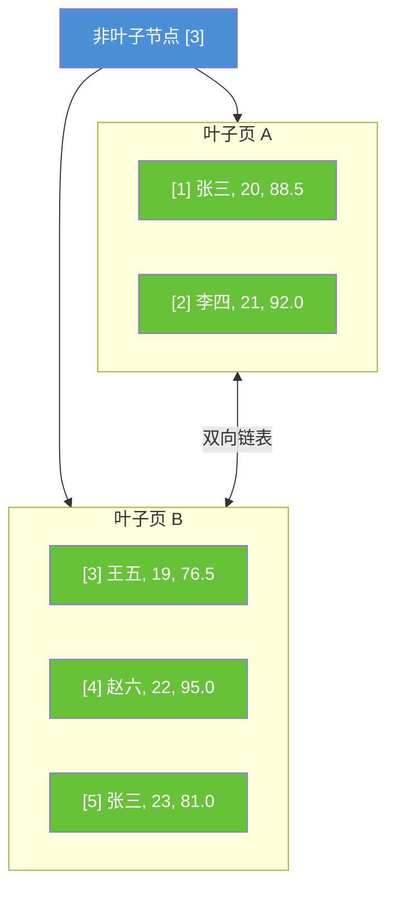
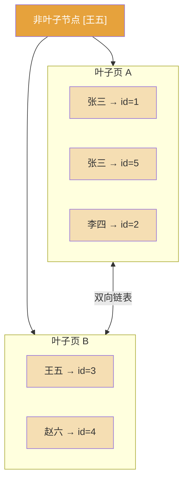
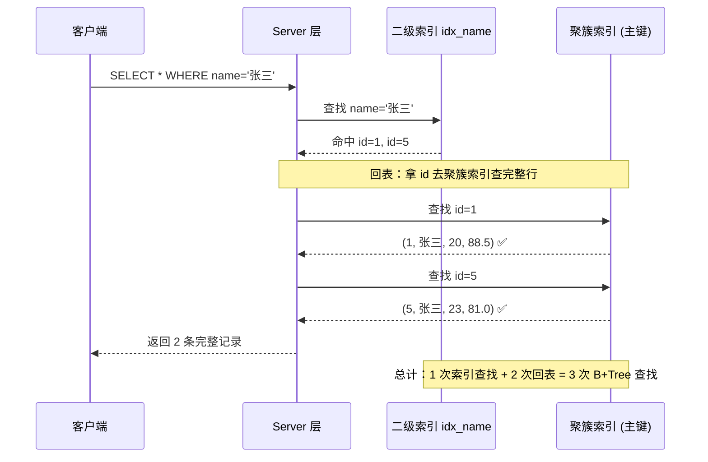
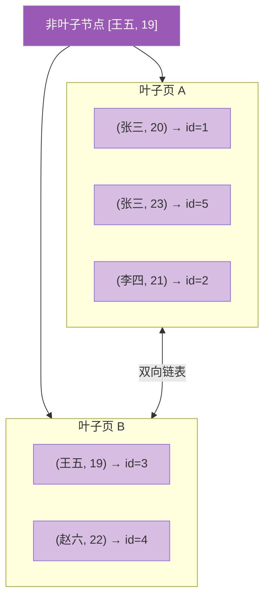
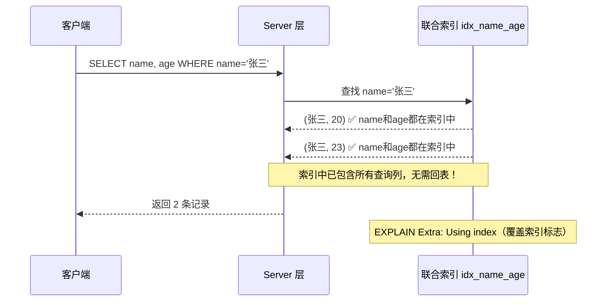
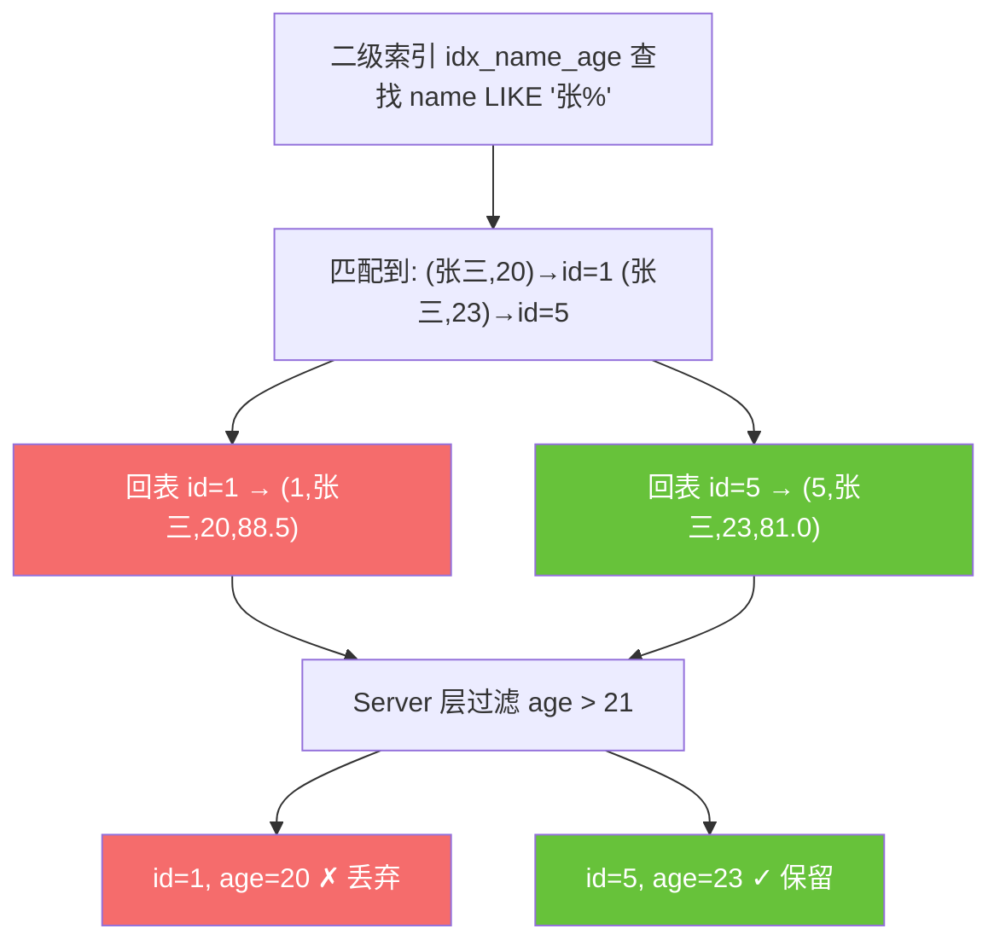
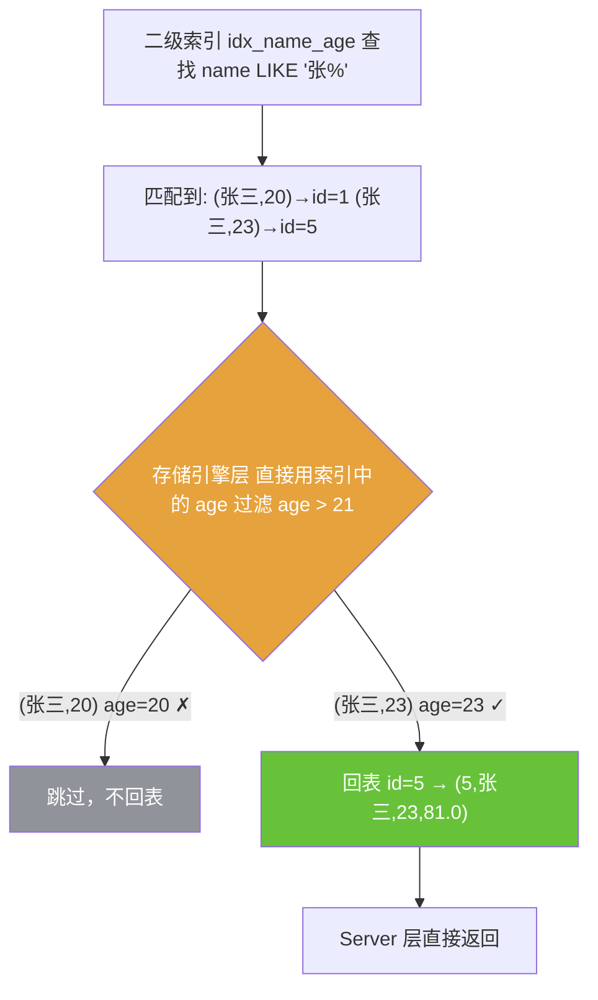
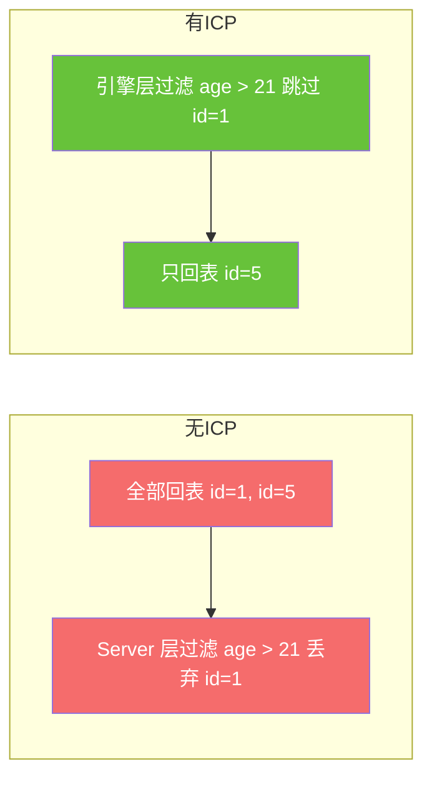
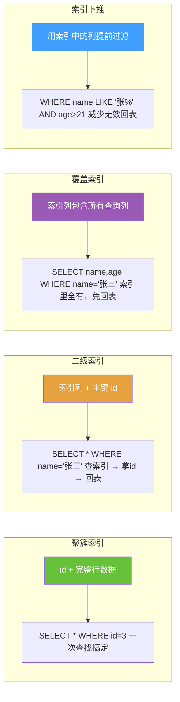

MySQL 聚簇索引和非聚簇索引

## 示例表

```sql
CREATE TABLE student (
    id    INT PRIMARY KEY AUTO_INCREMENT,
    name  VARCHAR(50),
    age   INT,
    score DECIMAL(5,2),
    INDEX idx_name (name),
    INDEX idx_name_age (name, age)
) ENGINE=InnoDB;

```

| id | name | age | score |
| --- | --- | --- | --- |
| 1 | 张三 | 20 | 88.5 |
| 2 | 李四 | 21 | 92.0 |
| 3 | 王五 | 19 | 76.5 |
| 4 | 赵六 | 22 | 95.0 |
| 5 | 张三 | 23 | 81.0 |

---

## 1. 聚簇索引（主键 id）

叶子节点直接存 整行数据，数据按主键物理排序，每表只有 1 个。



- `SELECT * FROM student WHERE id = 4`→ 直接在 B+Tree 定位，一次查找拿到整行

---

## 2. 二级索引（idx_name）

叶子节点只存 索引列 + 主键 id，不含其他列。



- 叶子节点只有`name + id`，没有 age、score
- 按 name 排序，不是按 id 排序

---

## 3. 回表过程

```sql
SELECT * FROM student WHERE name = '张三';

```



---

## 4. 覆盖索引（免回表）

联合索引`idx_name_age`的 B+Tree：



```sql
SELECT name, age FROM student WHERE name = '张三';

```



---

## 5. 索引下推（Index Condition Pushdown, ICP）

MySQL 5.6 引入，核心思想：把原本在 Server 层做的索引列过滤，下推到存储引擎层提前做，减少回表次数。

```sql
-- 联合索引 INDEX idx_name_age (name, age)
SELECT * FROM student WHERE name LIKE '张%' AND age > 21;

```

`name LIKE '张%'`可以用索引最左前缀，但`age > 21`在 LIKE 之后按最左前缀原则用不上索引范围扫描。 而 age 的值其实已经存在索引叶子节点里了，ICP 就是利用这一点提前过滤。

### 无 ICP（MySQL 5.6 之前）



回表 2 次，其中 id=1 是浪费的

### 有 ICP（MySQL 5.6+）



回表 1 次，省掉了 1 次无效回表

### 对比流程



### EXPLAIN 怎么看

```sql
EXPLAIN SELECT * FROM student WHERE name LIKE '张%' AND age > 21;

```

| Extra 列 | 含义 |
| --- | --- |
| `Using index condition` | 使用了索引下推 |
| `Using where` | 没有 ICP，在 Server 层过滤 |

### ICP 生效条件

- InnoDB / MyISAM 引擎
- 联合索引中，最左前缀之后的列仍然能用于过滤
- 不能是覆盖索引（覆盖索引本身就不用回表，没必要下推）
- 子查询条件不支持

---

## 6. 总结对比



核心结论：聚簇索引的叶子是整行数据，二级索引的叶子是主键。查二级索引拿不到的列，就得拿主键 回表 再查一次聚簇索引。覆盖索引和索引下推都是为了 减少回表。
