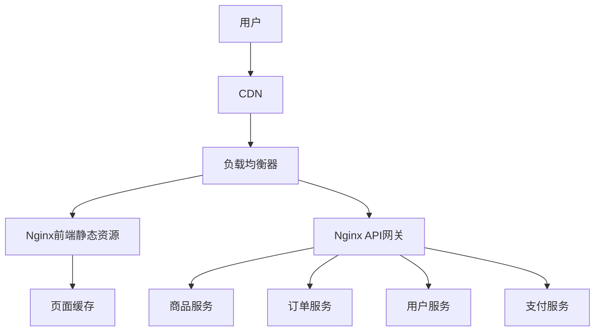
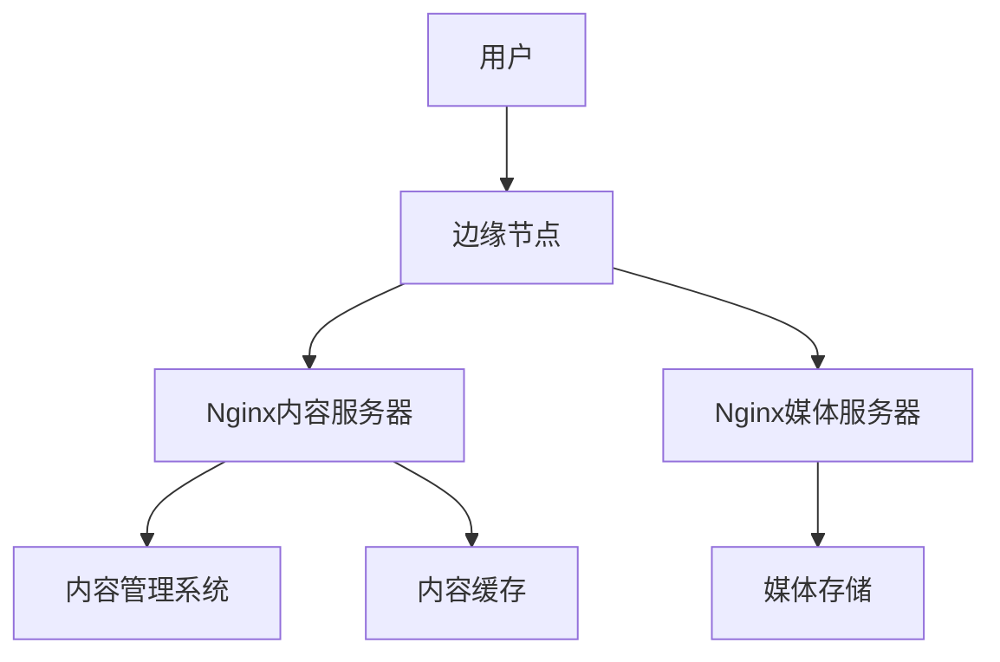
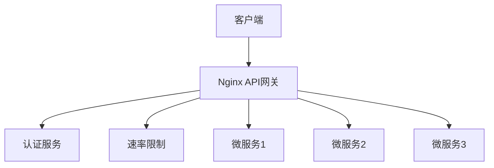
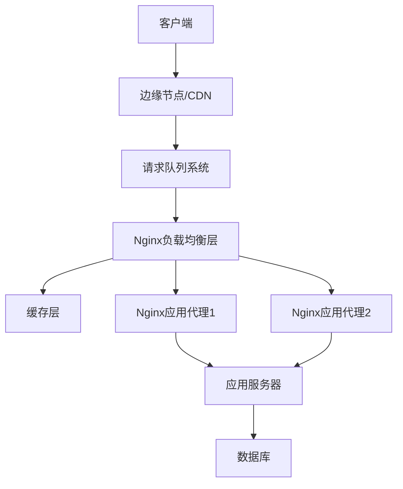
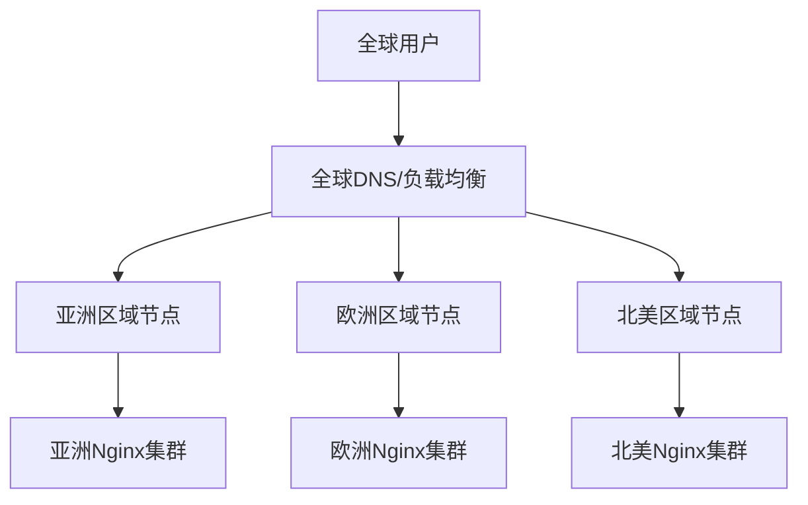

### 目录

1. 电商平台场景
2. 媒体内容网站场景
3. API服务与微服务架构场景
4. 高流量活动与促销场景
5. 全球分布式应用场景

### 1. 电商平台场景

#### 1.1 电商平台的Nginx架构

电商平台通常面临的挑战包括高并发访问、大量静态资源、复杂的后端服务以及对安全与稳定性的高要求：



#### 1.2 商品详情页优化配置

商品详情页是电商平台访问量最大的页面之一，需要针对性优化：

```nginx
# 商品详情页配置示例
server {
    listen 80;
    server_name shop.example.com;

    # 商品图片优化
    location ~* ^/images/products/ {
        root /var/www/shop/static;
        expires 7d;
        add_header Cache-Control "public, no-transform";

        # 图片尺寸处理
        # 使用image_filter模块处理不同尺寸的图片
        # 需要安装nginx-module-image-filter
        image_filter_buffer 10M;

        # 根据查询参数调整图片大小
        # 例如: /images/products/123.jpg?size=thumbnail
        if ($arg_size = 'thumbnail') {
            image_filter resize 200 200;
        }

        # 启用gzip压缩
        gzip on;
        gzip_types image/jpeg image/png image/webp;
    }

    # 商品详情页微缓存
    # 对商品页面进行短时间缓存，减轻数据库压力
    location ~* ^/product/\d+$ {
        proxy_cache product_cache;
        proxy_cache_valid 200 60s;  # 缓存1分钟
        proxy_cache_key "$host$request_uri$cookie_user";  # 基于用户区分缓存
        proxy_cache_bypass $http_pragma $arg_nocache;  # 支持强制刷新
        proxy_cache_use_stale updating error timeout;  # 缓存过期时仍可用
        add_header X-Cache-Status $upstream_cache_status;  # 显示缓存状态

        proxy_pass http://product_service;
        proxy_set_header Host $host;
        proxy_set_header X-Real-IP $remote_addr;
    }

    # 库存查询接口 - 不缓存，直接查询实时数据
    location ~* ^/api/inventory/ {
        proxy_pass http://inventory_service;
        proxy_set_header Host $host;
        proxy_set_header X-Real-IP $remote_addr;

        # 为库存查询设置更短的超时时间
        proxy_connect_timeout 2s;
        proxy_read_timeout 3s;
        proxy_send_timeout 3s;
    }

    # 商品评论加载 - 采用延迟加载策略
    location ~* ^/api/comments/ {
        proxy_pass http://comment_service;

        # 设置较长的读取超时，评论可能较多
        proxy_read_timeout 10s;
    }
}

```

#### 1.3 订单处理与支付安全

订单和支付系统需要特别注重安全性和稳定性：

```nginx
# 订单和支付系统配置
server {
    listen 443 ssl http2;
    server_name pay.example.com;

    # SSL配置
    ssl_certificate /etc/nginx/ssl/pay.example.com.crt;
    ssl_certificate_key /etc/nginx/ssl/pay.example.com.key;
    ssl_protocols TLSv1.2 TLSv1.3;
    ssl_prefer_server_ciphers on;
    ssl_ciphers ECDHE-ECDSA-AES128-GCM-SHA256:ECDHE-RSA-AES128-GCM-SHA256:ECDHE-ECDSA-AES256-GCM-SHA384;

    # HSTS配置
    add_header Strict-Transport-Security "max-age=31536000; includeSubDomains" always;
    add_header X-Content-Type-Options nosniff;
    add_header X-XSS-Protection "1; mode=block";

    # 限制请求频率，防止支付接口被滥用
    limit_req_zone $binary_remote_addr zone=pay_limit:10m rate=5r/m;

    # 订单接口
    location /api/orders {
        # 添加CSRF保护
        if ($http_referer !~ ^https://shop\.example\.com/) {
            return 403;
        }

        proxy_pass http://order_service;
        proxy_set_header Host $host;
        proxy_set_header X-Real-IP $remote_addr;
    }

    # 支付接口
    location /api/payment {
        # 限制请求频率
        limit_req zone=pay_limit burst=3 nodelay;

        # WAF规则检查 (需要ModSecurity等模块)
        # modsecurity on;
        # modsecurity_rules_file /etc/nginx/modsecurity/rules.conf;

        # 隐藏上游服务器版本信息
        proxy_hide_header X-Powered-By;

        proxy_pass http://payment_service;
        proxy_set_header Host $host;
        proxy_set_header X-Real-IP $remote_addr;

        # 支付请求需要较长的超时时间
        proxy_connect_timeout 5s;
        proxy_read_timeout 30s;  # 支付网关可能响应较慢
        proxy_send_timeout 5s;
    }

    # 支付结果回调接口
    location /api/payment/callback {
        # 只允许支付服务提供商的IP访问
        allow 203.0.113.0/24;  # 支付提供商IP范围示例
        deny all;

        proxy_pass http://payment_callback_service;
        proxy_set_header Host $host;
        proxy_set_header X-Real-IP $remote_addr;
    }
}

```

#### 1.4 搜索服务优化

电商搜索功能需要处理高并发和复杂查询：

```nginx
# 搜索服务配置
server {
    listen 80;
    server_name search.example.com;

    # 请求限流
    limit_req_zone $binary_remote_addr zone=search_limit:10m rate=10r/s;

    # 搜索API
    location /api/search {
        limit_req zone=search_limit burst=20 nodelay;

        # 请求超时设置
        proxy_connect_timeout 3s;
        proxy_read_timeout 10s;  # 复杂搜索可能需要更多时间
        proxy_send_timeout 3s;

        # 转发到Elasticsearch或搜索服务
        proxy_pass http://search_service;
        proxy_set_header Host $host;
        proxy_set_header X-Real-IP $remote_addr;

        # 缓存常见搜索结果
        proxy_cache search_cache;
        proxy_cache_valid 200 2m;  # 缓存2分钟
        proxy_cache_key "$host$request_uri";
        proxy_cache_bypass $arg_refresh;  # 支持强制刷新
    }

    # 搜索建议API（自动完成功能）
    location /api/suggest {
        # 自动完成请求通常更频繁
        limit_req zone=search_limit burst=50 nodelay;

        # 较短的超时时间
        proxy_connect_timeout 1s;
        proxy_read_timeout 2s;
        proxy_send_timeout 1s;

        # 更长时间的缓存
        proxy_cache suggest_cache;
        proxy_cache_valid 200 10m;  # 缓存10分钟

        proxy_pass http://suggestion_service;
        proxy_set_header Host $host;
        proxy_set_header X-Real-IP $remote_addr;
    }
}

```

### 2. 媒体内容网站场景

#### 2.1 内容网站架构

媒体内容网站处理大量图片、视频和文章，需要优化内容分发和缓存策略：



#### 2.2 文章页面加载优化

针对大量文章内容的优化：

```nginx
# 文章内容服务配置
server {
    listen 80;
    server_name blog.example.com;

    # 页面缓存配置
    proxy_cache_path /var/cache/nginx/content levels=1:2 keys_zone=content_cache:10m max_size=1g inactive=60m;

    # 缺省页面
    index index.html index.php;

    # 静态资源处理
    location ~* \.(css|js|jpg|jpeg|png|gif|ico|svg|woff|woff2)$ {
        root /var/www/blog/static;
        expires 30d;
        add_header Cache-Control "public, no-transform";

        # 添加Brotli压缩支持（如已安装模块）
        brotli on;
        brotli_types text/css application/javascript application/json image/svg+xml;

        # 常规gzip压缩
        gzip on;
        gzip_vary on;
        gzip_types text/css application/javascript application/json image/svg+xml;
    }

    # 文章页面缓存
    location ~* ^/article/.*$ {
        proxy_cache content_cache;
        proxy_cache_valid 200 30m;  # 缓存30分钟
        proxy_cache_use_stale error timeout updating http_500 http_502 http_503 http_504;
        add_header X-Cache-Status $upstream_cache_status;

        # 实现内容协商
        proxy_set_header Accept-Encoding $http_accept_encoding;

        # 文章页面可能较长，增加超时时间
        proxy_read_timeout 10s;

        proxy_pass http://cms_backend;
        proxy_set_header Host $host;
        proxy_set_header X-Real-IP $remote_addr;
    }

    # RSS/Atom订阅
    location ~* ^/(rss|feed|atom) {
        proxy_cache content_cache;
        proxy_cache_valid 200 15m;  # 缓存15分钟
        proxy_pass http://feed_service;
    }

    # 首页优化
    location = / {
        proxy_cache content_cache;
        proxy_cache_valid 200 5m;  # 首页缓存时间较短
        proxy_cache_bypass $cookie_logged_in;  # 登录用户不使用缓存

        proxy_pass http://cms_backend;
        proxy_set_header Host $host;
        proxy_set_header X-Real-IP $remote_addr;
    }
}

```

#### 2.3 视频流媒体服务

为视频内容提供高效的流媒体服务：

```nginx
# 视频流媒体服务配置
server {
    listen 80;
    server_name video.example.com;

    # 启用sendfile和tcp优化
    sendfile on;
    tcp_nopush on;
    tcp_nodelay on;

    # 定义视频类型和扩展名
    types {
        video/mp4 mp4;
        video/webm webm;
        video/ogg ogv;
        application/dash+xml mpd;  # DASH流
        application/vnd.apple.mpegurl m3u8;  # HLS流
    }

    # 启用CORS，允许跨域请求
    add_header Access-Control-Allow-Origin "*";
    add_header Access-Control-Allow-Methods "GET, OPTIONS";
    add_header Access-Control-Allow-Headers "Range";

    # MP4视频优化
    location ~* \.(mp4|webm)$ {
        root /var/www/videos;

        # 启用MP4模块支持
        mp4;
        mp4_buffer_size 1m;
        mp4_max_buffer_size 5m;

        # 启用断点续传
        add_header Accept-Ranges bytes;

        # 视频缓存设置
        expires 30d;
        add_header Cache-Control "public, no-transform";
    }

    # HLS流媒体
    location ~* \.m3u8$ {
        root /var/www/videos/hls;

        # HLS设置较短的缓存
        expires 5m;
        add_header Cache-Control "public, no-transform";
    }

    # HLS片段
    location ~* \.ts$ {
        root /var/www/videos/hls;

        # 流媒体段缓存较长时间
        expires 7d;
        add_header Cache-Control "public, no-transform";
    }

    # DASH流媒体
    location ~* \.mpd$ {
        root /var/www/videos/dash;

        # DASH清单文件缓存设置
        expires 5m;
        add_header Cache-Control "public, no-transform";
    }

    # DASH片段
    location ~* \.(m4s|mp4v|mp4a)$ {
        root /var/www/videos/dash;

        # 片段缓存较长时间
        expires 7d;
        add_header Cache-Control "public, no-transform";
    }

    # 带宽限制 - 每个连接2MB/s
    limit_rate_after 5m;  # 前5MB不限速
    limit_rate 2048k;     # 之后限速2MB/s
}

```

#### 2.4 图片处理与优化

针对大量图片内容的处理方案：

```nginx
# 图片处理服务配置
server {
    listen 80;
    server_name img.example.com;

    # 图片处理缓存
    proxy_cache_path /var/cache/nginx/images levels=1:2 keys_zone=image_cache:10m max_size=5g inactive=60m;

    # 基本图片服务
    location ~* \.(jpg|jpeg|png|gif|webp|svg)$ {
        root /var/www/images;

        # 启用图片压缩
        gzip on;
        gzip_types image/svg+xml;  # 只对SVG启用gzip

        expires 30d;
        add_header Cache-Control "public, no-transform";

        # 避免小图片也开启gzip
        gzip_min_length 1000;
    }

    # 动态图片处理（使用第三方服务如Thumbor或自建图片处理服务）
    location ~* ^/resize/ {
        # 提取尺寸和图片路径
        # 例如: /resize/300x200/path/to/image.jpg
        rewrite ^/resize/(\d+)x(\d+)/(.+)$ /image?width=$1&height=$2&image=$3 break;

        # 图片处理请求缓存
        proxy_cache image_cache;
        proxy_cache_valid 200 7d;
        proxy_cache_key "$host$request_uri";

        proxy_pass http://image_processor;
        proxy_set_header Host $host;
        proxy_set_header X-Real-IP $remote_addr;
    }

    # WebP格式自动转换
    location ~* ^/webp/ {
        # 通过Content-Type协商提供WebP图片
        proxy_cache image_cache;
        proxy_cache_valid 200 7d;

        proxy_pass http://webp_converter;
        proxy_set_header Host $host;
        proxy_set_header X-Real-IP $remote_addr;
        proxy_set_header Accept $http_accept;
    }

    # 图片上传接口
    location /api/upload {
        client_max_body_size 10m;
        client_body_buffer_size 128k;

        # 限制上传请求率
        limit_req zone=upload_limit burst=5;

        # 仅允许POST方法
        limit_except POST {
            deny all;
        }

        proxy_pass http://upload_service;
    }
}

```

### 3. API服务与微服务架构场景

#### 3.1 API网关架构

微服务架构中 Nginx 作为 API 网关的配置：



#### 3.2 API网关配置

针对微服务架构的API网关配置：

```nginx
# API网关主配置
http {
    # 配置各微服务上游
    upstream auth_service {
        server 10.0.1.10:8000;
        server 10.0.1.11:8000 backup;
    }

    upstream user_service {
        server 10.0.2.10:8001;
        server 10.0.2.11:8001;
        keepalive 32;  # 保持连接池
    }

    upstream order_service {
        server 10.0.3.10:8002;
        server 10.0.3.11:8002;
        keepalive 32;
    }

    upstream product_service {
        server 10.0.4.10:8003;
        server 10.0.4.11:8003;
        keepalive 32;
    }

    # 限流配置 - 基于服务和IP组合
    limit_req_zone $binary_remote_addr$uri zone=api_limit:10m rate=10r/s;

    # 配置JWT验证 - 使用auth_jwt模块（需编译支持）
    # auth_jwt_key_file /etc/nginx/keys/jwt_public.key;

    # 定义API版本路由映射
    map $http_accept $api_version {
        "~*application/vnd\.example\.v1\+json" "v1";
        "~*application/vnd\.example\.v2\+json" "v2";
        default "v1";  # 默认版本
    }

    # API服务器配置
    server {
        listen 443 ssl http2;
        server_name api.example.com;

        # SSL配置
        ssl_certificate /etc/nginx/ssl/api.example.com.crt;
        ssl_certificate_key /etc/nginx/ssl/api.example.com.key;
        ssl_protocols TLSv1.2 TLSv1.3;

        # CORS配置
        add_header 'Access-Control-Allow-Origin' '*' always;
        add_header 'Access-Control-Allow-Methods' 'GET, POST, OPTIONS, PUT, DELETE, PATCH' always;
        add_header 'Access-Control-Allow-Headers' 'DNT,X-CustomHeader,Keep-Alive,User-Agent,X-Requested-With,If-Modified-Since,Cache-Control,Content-Type,Authorization' always;

        # 处理预检请求
        if ($request_method = 'OPTIONS') {
            add_header 'Access-Control-Max-Age' 1728000;
            add_header 'Content-Type' 'text/plain charset=UTF-8';
            add_header 'Content-Length' 0;
            return 204;
        }

        # 认证服务
        location /api/auth {
            # 认证服务不需要验证令牌
            proxy_pass http://auth_service;
            proxy_set_header Host $host;
            proxy_set_header X-Real-IP $remote_addr;

            # 启用HTTP/2后端
            proxy_http_version 1.1;
            proxy_set_header Connection "";

            # 针对登录接口的特殊限流
            location /api/auth/login {
                limit_req zone=login_limit burst=5 nodelay;
                proxy_pass http://auth_service;
            }
        }

        # 用户API - 需要JWT认证
        location /api/users {
            # 限制请求频率
            limit_req zone=api_limit burst=5 nodelay;

            # JWT验证
            # auth_jwt "API";
            # auth_jwt_claim_set $jwt_user sub;  # 从JWT中提取用户ID

            # 根据API版本路由
            location ~ ^/api/users(.*)$ {
                # 将用户ID传递给后端
                proxy_set_header X-User-ID $jwt_user;
                proxy_set_header X-API-Version $api_version;

                # 路由到对应版本的服务
                proxy_pass http://user_service/$api_version/users$1$is_args$args;
                proxy_set_header Host $host;
                proxy_set_header X-Real-IP $remote_addr;

                # 连接复用
                proxy_http_version 1.1;
                proxy_set_header Connection "";
            }
        }

        # 产品API
        location /api/products {
            # 基于客户端类型进行不同的限流
            # 使用map判断是移动端还是PC端
            limit_req zone=api_limit_$client_type burst=10 nodelay;

            # 只读接口可以缓存
            location ~ ^/api/products/[0-9]+$ {
                # GET请求可以缓存
                proxy_cache api_cache;
                proxy_cache_methods GET;
                proxy_cache_valid 200 5m;
                proxy_cache_key "$host$request_uri";
                add_header X-Cache-Status $upstream_cache_status;

                proxy_pass http://product_service;
                proxy_set_header Host $host;
                proxy_set_header X-Real-IP $remote_addr;
            }

            # 默认产品API路由
            proxy_pass http://product_service;
            proxy_set_header Host $host;
            proxy_set_header X-Real-IP $remote_addr;

            # 连接复用
            proxy_http_version 1.1;
            proxy_set_header Connection "";
        }

        # 订单API - 需要JWT认证
        location /api/orders {
            # 限制请求频率
            limit_req zone=api_limit burst=5 nodelay;

            # JWT验证
            # auth_jwt "API";

            # 处理大请求体
            client_max_body_size 1m;
            client_body_buffer_size 128k;

            # 路由到订单服务
            proxy_pass http://order_service;
            proxy_set_header Host $host;
            proxy_set_header X-Real-IP $remote_addr;

            # 连接复用
            proxy_http_version 1.1;
            proxy_set_header Connection "";
        }

        # API文档 - 无需认证
        location /docs {
            alias /var/www/api-docs;
            index index.html;

            # 可以使用try_files确保index.html处理所有请求（对于SPA应用）
            try_files $uri $uri/ /docs/index.html;
        }

        # 健康检查端点
        location /health {
            access_log off;
            add_header Content-Type application/json;
            return 200 '{"status":"UP"}';
        }
    }
}

```

#### 3.3 服务发现集成

与服务发现系统集成的配置：

```nginx
# 引入consul-template生成的配置
include /etc/nginx/conf.d/services/*.conf;

# 示例：由consul-template生成的服务列表
# /etc/nginx/conf.d/services/user_service.conf
upstream user_service {
    # 动态生成的服务器列表
    server 10.0.2.10:8001 max_fails=3 fail_timeout=30s;
    server 10.0.2.11:8001 max_fails=3 fail_timeout=30s;
    keepalive 32;
}

```

#### 3.4 API监控与日志

API网关的监控和日志配置：

```text
# API监控和日志配置
http {
    # 自定义日志格式，包含API指标
    log_format api_json escape=json
        '{'
            '"time":"$time_local",'
            '"remote_addr":"$remote_addr",'
            '"request":"$request",'
            '"status":$status,'
            '"body_bytes_sent":$body_bytes_sent,'
            '"request_time":$request_time,'
            '"service":"$upstream_addr",'
            '"response_time":"$upstream_response_time",'
            '"user_agent":"$http_user_agent",'
            '"x_request_id":"$http_x_request_id"'
        '}';

    # 启用应用日志
    access_log /var/log/nginx/api-access.log api_json buffer=32k flush=5s;

    # 为每个请求生成唯一标识符
    map $remote_addr$time_local$request_id $request_uid {
        default $request_id;
    }

    # Prometheus度量导出（需要安装相应模块）
    server {
        listen 8080;
        # 只允许内部访问
        allow 127.0.0.1;
        allow 10.0.0.0/8;
        deny all;

        location /metrics {
            # 集成prometheus插件
            proxy_pass http://127.0.0.1:9113/metrics;
        }

        location /nginx_status {
            stub_status on;
        }
    }

    # 请求跟踪配置
    server {
        # 为每个请求添加跟踪ID
        add_header X-Request-ID $request_uid;

        # 转发原始请求ID或生成新ID
        proxy_set_header X-Request-ID $http_x_request_id;

        # 其他配置...
    }
}

```

### 4. 高流量活动与促销场景

#### 4.1 流量洪峰架构

电商大促、抢购活动等高流量场景的架构：



#### 4.2 高流量活动配置

针对促销活动的Nginx配置：

```text
# 促销活动专用配置
http {
    # 大促活动扩展连接数
    worker_connections 50000;

    # 请求限流 - 按区域和IP设置不同限制
    geo $limit_rate_key {
        default          "global";
        10.0.0.0/8       "internal";  # 内部用户
        203.0.113.0/24   "special";   # VIP用户
    }

    # 根据用户类型设置不同的限流规则
    map $limit_rate_key $limit_rate_value {
        "global"      5r/s;
        "internal"    100r/s;
        "special"     20r/s;
    }

    # 创建限流区域
    limit_req_zone $binary_remote_addr zone=promotion:20m rate=$limit_rate_value;

    # 缓存设置 - 为促销页面设置专用缓存
    proxy_cache_path /var/cache/nginx/promotion levels=1:2 keys_zone=promotion_cache:20m max_size=10g inactive=10m;
    proxy_cache_key "$host$request_uri$cookie_user_level";

    # 高流量活动服务器配置
    server {
        listen 80;
        server_name promotion.example.com;

        # 促销主页 - 静态内容优先
        location = / {
            proxy_cache promotion_cache;
            proxy_cache_valid 200 30s;  # 短期缓存，保持数据新鲜
            proxy_cache_use_stale updating error timeout;
            add_header X-Cache-Status $upstream_cache_status;

            # 尝试先提供静态文件，找不到再代理
            try_files /promotion/index.html @backend;
        }

        # 静态资源，长缓存
        location ~ ^/static/ {
            root /var/www/promotion;
            expires 1h;
            add_header Cache-Control "public";

            # 启用gzip
            gzip on;
            gzip_types text/css application/javascript image/svg+xml;
        }

        # 抢购页面 - 严格限流
        location /flash-sale/ {
            limit_req zone=promotion burst=5 nodelay;

            # 显示队列页或抢购页
            proxy_cache promotion_cache;
            proxy_cache_valid 200 10s;  # 非常短的缓存，保持库存准确
            proxy_cache_bypass $cookie_nocache $arg_nocache;

            proxy_pass http://flash_sale_backend;
            proxy_set_header Host $host;
            proxy_set_header X-Real-IP $remote_addr;
        }

        # 库存查询接口 - 需要实时数据
        location /api/inventory {
            limit_req zone=promotion burst=10 nodelay;

            # 不缓存库存数据
            proxy_no_cache 1;
            proxy_cache_bypass 1;

            # 设置短超时
            proxy_connect_timeout 2s;
            proxy_read_timeout 3s;
            proxy_send_timeout 2s;

            proxy_pass http://inventory_service;
            proxy_set_header Host $host;
            proxy_set_header X-Real-IP $remote_addr;
        }

        # 订单提交 - 排队处理
        location /api/orders {
            limit_req zone=promotion burst=10 nodelay;

            # 订单提交转发到队列处理系统
            proxy_pass http://order_queue_service;
            proxy_set_header Host $host;
            proxy_set_header X-Real-IP $remote_addr;

            # 延长超时时间，允许排队处理
            proxy_read_timeout 60s;
        }

        # 后端服务处理
        location @backend {
            proxy_pass http://promotion_backend;
            proxy_set_header Host $host;
            proxy_set_header X-Real-IP $remote_addr;
        }

        # 队列等待页面
        location /wait-room {
            # 提供静态等待页面
            root /var/www/promotion;
            try_files $uri /wait-room/index.html;

            # 添加自动刷新头
            add_header Refresh "5; url=/wait-room/check-status";
        }

        # 队列检查接口
        location /wait-room/check-status {
            proxy_pass http://queue_service;
            proxy_set_header Host $host;
            proxy_set_header X-Real-IP $remote_addr;
        }

        # 错误处理
        error_page 502 503 504 /error/overload.html;
        location /error {
            root /var/www/promotion;
            internal;
        }
    }
}

```

#### 4.3 流量控制与限流

高级限流策略配置：

```css
# 高级限流策略
http {
    # 全局速率限制
    limit_req_zone $binary_remote_addr zone=global:20m rate=10r/s;

    # 按IP限速但允许一定突发
    limit_conn_zone $binary_remote_addr zone=perip:10m;

    # 按服务器限制并发
    limit_conn_zone $server_name zone=perserver:10m;

    # 使用用户标识进行区分（使用cookie或令牌）
    map $cookie_user_id $client_id {
        default $binary_remote_addr;
        "~.+" $cookie_user_id;
    }

    # 按用户ID限流，防止单用户使用多IP攻击
    limit_req_zone $client_id zone=user_limit:10m rate=2r/s;

    # 限制高频IP自动进入黑名单
    # 实现需要Lua模块或其他高级方法

    server {
        # 应用多级限流
        location /protected-api {
            # 全局限流
            limit_req zone=global burst=5 nodelay;

            # 用户级限流
            limit_req zone=user_limit burst=2 nodelay;

            # 根据路径进行更细粒度的限制
            location ~ ^/protected-api/critical/ {
                # 关键API更严格的限制
                limit_req zone=critical_limit burst=1 nodelay;

                proxy_pass http://critical_service;
            }

            # 其他API
            proxy_pass http://general_service;
        }

        # 并发连接限制
        location /download {
            # 限制每个IP最多5个并发连接
            limit_conn perip 5;

            # 限制服务器总计100个下载连接
            limit_conn perserver 100;

            # 超出限制时返回503
            limit_conn_status 503;

            # 下载配置...
        }
    }
}

```

#### 4.4 动态扩容配置

针对活动期间可能需要的动态扩容配置：

```nginx
# 动态扩容配置
# 与外部编排系统（如Kubernetes）配合使用

stream {
    # TCP负载均衡
    upstream dynamic_backend {
        # 这部分配置可能由外部系统动态生成
        server 10.0.0.10:8080 max_fails=3 fail_timeout=10s;
        server 10.0.0.11:8080 max_fails=3 fail_timeout=10s;
        # 自动增减节点...

        # 启用区域来存储服务器健康状态
        zone backend_zone 256k;
    }

    server {
        listen 9000;
        proxy_pass dynamic_backend;

        # 启用健康检查
        health_check interval=2s fails=2 passes=5;

        # 负载均衡方法 - 最少连接
        proxy_next_upstream_tries 3;
        proxy_connect_timeout 1s;
    }
}

http {
    # 集群状态监控页面
    server {
        listen 80;
        server_name monitor.example.com;

        # 只允许内部访问
        allow 10.0.0.0/8;
        allow 127.0.0.1;
        deny all;

        location = /status.html {
            root /usr/share/nginx/html;
        }

        # 集群状态API
        location /api/status {
            proxy_pass http://127.0.0.1:8080/status;
        }
    }
}

```

### 5. 全球分布式应用场景

#### 5.1 全球部署架构

跨区域部署的Nginx架构：



#### 5.2 地理位置路由

根据用户地理位置进行智能路由：

```text
# 地理位置路由配置

# 加载GeoIP数据库
geoip_country /usr/share/GeoIP/GeoIP.dat;

# 定义区域映射
map $geoip_country_code $nearest_site {
    default "us";     # 默认使用美国站点
    CN      "asia";   # 中国用户路由到亚洲站点
    JP      "asia";   # 日本用户路由到亚洲站点
    KR      "asia";   # 韩国用户路由到亚洲站点
    SG      "asia";   # 新加坡用户路由到亚洲站点

    DE      "eu";     # 德国用户路由到欧洲站点
    GB      "eu";     # 英国用户路由到欧洲站点
    FR      "eu";     # 法国用户路由到欧洲站点

    US      "us";     # 美国用户路由到美国站点
    CA      "us";     # 加拿大用户路由到美国站点
    MX      "us";     # 墨西哥用户路由到美国站点
}

# 定义区域后端服务器
upstream asia_backend {
    server asia-backend1.example.com:80;
    server asia-backend2.example.com:80 backup;
    keepalive 32;
}

upstream eu_backend {
    server eu-backend1.example.com:80;
    server eu-backend2.example.com:80 backup;
    keepalive 32;
}

upstream us_backend {
    server us-backend1.example.com:80;
    server us-backend2.example.com:80 backup;
    keepalive 32;
}

# 服务器配置
server {
    listen 80;
    server_name www.example.com;

    # 根据区域路由流量
    location / {
        proxy_pass http://$nearest_site_backend;
        proxy_set_header Host $host;
        proxy_set_header X-Real-IP $remote_addr;
        proxy_set_header X-Forwarded-For $proxy_add_x_forwarded_for;

        # 连接复用
        proxy_http_version 1.1;
        proxy_set_header Connection "";
    }

    # 允许用户手动切换区域
    location /switch-region {
        # 设置区域cookie并重定向回首页
        if ($arg_region ~ ^(asia|eu|us)$) {
            add_header Set-Cookie "user_region=$arg_region; path=/; expires=30d";
            return 302 /;
        }
        # 无效区域参数
        return 400;
    }

    # 静态内容可采用客户端侧CDN策略
    location ~* \.(css|js|jpg|jpeg|png|gif|ico|svg|woff|woff2)$ {
        # 使用公共CDN
        proxy_pass https://cdn.example.com$request_uri;
        proxy_set_header Host cdn.example.com;

        expires 30d;
        add_header Cache-Control "public, no-transform";
    }
}

# 全球API配置
server {
    listen 80;
    server_name api.example.com;

    # 全球共享API（无需区域路由）
    location /api/global/ {
        proxy_pass http://global_api;
        proxy_set_header Host $host;
        proxy_set_header X-Real-IP $remote_addr;
    }

    # 区域特定API
    location /api/ {
        proxy_pass http://$nearest_site_backend;
        proxy_set_header Host $host;
        proxy_set_header X-Real-IP $remote_addr;
        proxy_set_header X-Forwarded-For $proxy_add_x_forwarded_for;

        # 根据Cookie覆盖自动区域选择
        if ($cookie_user_region) {
            # 使用用户选择的区域
            set $nearest_site $cookie_user_region;
        }
    }
}

```

#### 5.3 多语言内容与国际化

支持多语言内容的配置：

```text
# 多语言配置

# 基于语言的路由
map $http_accept_language $user_lang {
    default "en";  # 默认英语
    ~*^zh zh;      # 中文
    ~*^ja ja;      # 日语
    ~*^fr fr;      # 法语
    ~*^de de;      # 德语
    ~*^es es;      # 西班牙语
}

server {
    listen 80;
    server_name www.example.com;

    # 首页根据语言重定向
    location = / {
        # 根据浏览器语言自动跳转
        if ($cookie_user_lang) {
            # 使用Cookie中存储的语言偏好
            set $lang_path "/$cookie_user_lang";
        }

        if ($cookie_user_lang = "") {
            # 无Cookie时使用浏览器语言
            set $lang_path "/$user_lang";
        }

        # 仅重定向到存在的语言路径
        if (-d /var/www/website$lang_path) {
            return 302 $scheme://$host$lang_path$is_args$args;
        }

        # 如果检测到的语言不支持，使用默认语言
        return 302 $scheme://$host/en$is_args$args;
    }

    # 语言特定路径
    location ~ ^/(en|zh|ja|fr|de|es)/ {
        # 记录用户语言偏好
        add_header Set-Cookie "user_lang=$1; path=/; max-age=31536000";

        # 静态内容直接提供
        root /var/www/website;
        try_files $uri $uri/ /$1/index.html;
    }

    # 语言切换功能
    location /change-language {
        if ($arg_lang ~ ^(en|zh|ja|fr|de|es)$) {
            add_header Set-Cookie "user_lang=$arg_lang; path=/; max-age=31536000";
            return 302 /$arg_lang/;
        }
        return 400;
    }

    # API内容协商
    location /api/ {
        # 向后端传递语言信息
        proxy_set_header Accept-Language $http_accept_language;
        proxy_set_header X-User-Language $user_lang;

        # 内容协商处理
        proxy_pass http://api_backend;
        proxy_set_header Host $host;
        proxy_set_header X-Real-IP $remote_addr;
    }

    # i18n资源文件
    location /i18n/ {
        root /var/www/assets;
        expires 1d;
        add_header Cache-Control "public, no-transform";
    }
}

```

#### 5.4 全球同步与一致性

处理全球部署的数据同步问题：

```nginx
# 全球数据一致性处理

# 定义区域后端
upstream primary_db_api {
    server primary-db-api.example.com:80;
    keepalive 16;
}

upstream read_replicas {
    # 附近区域的只读副本
    server replica1.example.com:80;
    server replica2.example.com:80;

    # 使用最少连接方法
    least_conn;
    keepalive 32;
}

# API服务器
server {
    listen 80;
    server_name api.global-app.com;

    # 写操作 - 必须发送到主数据库
    location ~* ^/api/v1/(users|orders|products)$ {
        # 判断是否写操作 (POST, PUT, DELETE)
        if ($request_method ~ ^(POST|PUT|DELETE)$) {
            # 写操作路由到主数据库
            proxy_pass http://primary_db_api;
        }

        # 读操作路由到本地副本
        if ($request_method = GET) {
            proxy_pass http://read_replicas;
        }

        # 未匹配的方法
        return 405;
    }

    # 强一致性读 - 客户端请求最新数据时
    location ~* ^/api/v1/.*$ {
        # 检查一致性头
        if ($http_x_consistency_level = "strong") {
            # 强一致性读发送到主数据库
            proxy_pass http://primary_db_api;
        }

        # 默认为最终一致性，使用副本
        proxy_pass http://read_replicas;
        proxy_set_header Host $host;
        proxy_set_header X-Real-IP $remote_addr;
    }

    # 元数据API - 提供副本状态信息
    location /api/meta/sync-status {
        # 返回数据同步状态
        proxy_pass http://sync_status_service;
        add_header Cache-Control "no-cache, no-store, must-revalidate";
    }

    # 全局内容分发控制
    location /api/content-control {
        # 只允许内部访问
        allow 10.0.0.0/8;
        deny all;

        # 全局内容控制API
        proxy_pass http://content_control_service;
        proxy_set_header Host $host;
        proxy_set_header X-Real-IP $remote_addr;
    }
}

# 为内部同步设置单独服务器
server {
    listen 8080;
    server_name internal-sync.global-app.com;

    # 仅允许内部访问
    allow 10.0.0.0/8;
    deny all;

    # 数据同步API
    location /sync {
        # 更长超时，同步可能需要时间
        proxy_connect_timeout 10s;
        proxy_read_timeout 300s;
        proxy_send_timeout 300s;

        # 处理大文件同步
        client_max_body_size 50m;

        proxy_pass http://sync_service;
        proxy_set_header Host $host;
        proxy_set_header X-Real-IP $remote_addr;
    }

    # 缓存清除API
    location /purge {
        # 仅允许内部服务器清除缓存
        allow 10.0.0.0/8;
        deny all;

        # 缓存清除逻辑
        proxy_cache_purge $arg_key;
    }
}

```

以上是不同业务场景的 Nginx 配置示例，你可以根据自身业务特点选择合适的模板进行调整。
